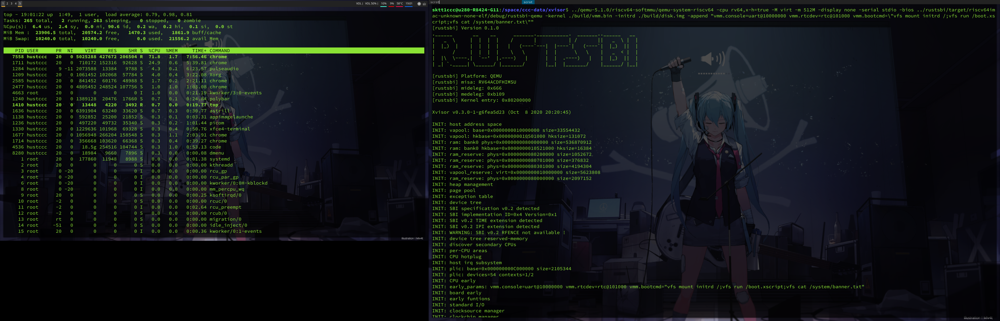

<!-- +# Daily Of CCC (from 2020/08/07) -->

今年暑假我参加了一个很有趣的活动，在这个活动里老师要求我们每天写日志，来记录每天做的事情。我觉得这是一个很有想法而且很有意义的做法，因此在今天晚上，活动的线下实习的最后一晚，我开了另外一个 repo ，在这里每天记录一些东西，比如学习中获得的东西，比如遇到有趣的事情，再比如心情。这个日志独立于我参加实习建立的日志，我希望在这个日志上一直写下去。  

## TOC Day 0~60

* [Day 0](#0)  
* [Day   1](#Day001)   
* [Day   2](#Day002)   
* [Day   3](#Day003)  
* [Day   4](#Day004)  
* [Day   5](#Day005)  
* [Day   6](#Day006)  
* [Day   7](#Day007)  
* [Day   8](#Day008)  
* [Day   9](#Day009)  
* [Day  10](#Day010)  
* [Day  11](#Day011)  
* [Day  12](#Day012)  
* [Day  13](#Day013)  
* [Day  14](#Day014)   
* [Day  15](#Day015)  
* [Day  16](#Day016)  
* [Day  17](#Day017)  
* [Day  18](#Day018)  
* [Day  19](#Day019)  
* [Day  20](#Day020)  
* [Day  21](#Day021)  
* [Day  22](#Day022)  
* [Day  23](#Day023)  
* [Day  24](#Day024)  
* [Day  25](#Day025)
* [Day  26](#Day026)
* [Day  27](#Day027)  
* [Day  28](#Day028)  
* [Day  29](#Day029)  
* [Day  30](#Day030)  
* [Day  31](#Day031) 
* [Day  32](#Day032) 
* [Day  33](#Day033) 
* [Day  34](#Day034) 
* [Day  35](#Day035) 
* [Day  36](#Day036) 
* [Day  37](#Day037)  
* [Day  38](#Day038)  
* [Day  39](#Day039)  
* [Day  40](#Day040)⭐  
* [Day  41](#Day041)  
* [Day  42](#Day042)  
* [Day  43](#Day043)  
* [Day  44](#Day044)  
* [Day  45](#Day045)  
* [Day  46](#Day046)  
* [Day  47](#Day047)  
* [Day  48](#Day048)  
* [Day  49](#Day049)  
* [Day  50](#Day050)  
* [Day  51](#Day051)  
* [Day  52](#Day052)  
* [Day  53](#Day053)  
* [Day  54](#Day054)
* [Day  55](#Day055)
* [Day  56](#Day056)
* [Day  57](#Day057)
* [Day  58](#Day058)⭐
* [Day  59](#Day059)
* [Day  60](#Day060)

<span id="0"></span>

## Day 0 (2020/08/07)
今年 7 月开始到现在我参加了一个实习：  
欢迎在校学生在2020年暑假参加鹏城实验室与清华大学举办的OS Tutorial Summer of Code 2020 活动（7月4日～8月31日），本次活动分为两个阶段rCore Labs Tutorial（7月4日～7月31日）和zCore操作系统实践与研究（8月1日～8月31日） ,主要是对用Rust语言进行OS研发开展学习、交流与探索。  
如有兴趣参加，请发个人简历给 yuchen@tsinghua.edu.cn 并填写调查问卷，获得邀请后，将开始参与如下面所示的rCore Labs Tutorial活动。完成本次活动第一阶段（7月4日～7月31日）的同学如果通过review，将获得鹏城实验室资助到鹏城实验室进行为期一个月的第二阶段（8月1日～8月31日）的OS实习，开展zCore操作系统实践与研究。  
目标：
探索把现代系统语言Rust和灵活开放的系统结构RISC-V带入到操作系统的架构与设计的创新中来，思考未来的操作系统应该是什么样。  
宗旨：
希望本活动的组织，能为操作系统爱好者提供一个活跃的开源社区环境，为对Rust、RISC-V和操作系统感兴趣的人士营造一个平等的学习与交流空间，吸引更多对操作系统感兴趣的人士参与。  
我在上个月通过了 review，在 8 月 2 号来到深圳鹏城实验室进行线下实习，今晚是线下实习的最后一个晚上。  
有那么一群人，尝试使用现代系统语言Rust编写操作系统，探索一个好的操作系统该怎么写，思考未来的操作系统应该是什么样子的。  
这群人的领头羊，就是清华大学教OS课的两个老师和wrj学长，在这些人的带领下，在清华开启了一段用Rust写OS的奇妙之旅。  
他们还尝试将新的架构RISCV结合到编写操作系统上来，并希望他们写的操作系统能在RISCV的真机上跑。  
现在这个想法已经得到了很好的实现，wrj学长起头的rCore操作系统，一个用Rust语言编写的OS已经颇具规模，成长为一个比较健壮，功能较为强大的操作系统。  
而zCore是他们的另一个尝试，这是一个微内核，山寨了Google开发的Zircon微内核，并使用Rust语言编写，充分利用了Rust语言的语法特性，尽管还有许多bug，目前已经能运行在x86架构下了。  
rCore项目已经建立起了一个开发者社区，吸引着许多OS爱好者参与到rCore的开发中来。  
参加这个实习，我很荣幸地加入到这个圈子中来，积极地探索操作系统的奥妙。  
在一周的线下实习过程中，鹏城实验室给我们安排的活动十分丰富，其中最让我感触深刻的是，国科大“一生一芯”团队的5位同学和余子濠博士给我们带来他们完成RISCV处理器的开发过程背后的故事，和去清华伯克利深圳研究所参观，并听了谭章熹博士的关于RISCV的报告(太过前沿，不是很能听懂)。特别是去清华伯克利深圳研究院参观的时候，就像是拜访圣地一样，太激动了  
每天晚上则是wrj等清华研究生学长的关于rCore/zCore的讲座(太强了）  
除此之外，我们还和向勇老师，wrj学长他们进行了一次聚餐，和他们聊天，像做梦一样  
还认识了Rust的疯狂粉丝兼校友luojia同学，太强了  
我参加这次实习受益匪浅，一是Rust语言，二是OS，三是见识。希望我在实习结束的时候能拿出成果来。  
也许许多年后，清华 OS 课的实验就是我们这群人写的hhh。  

<span id="Day001"></span>

## Day 1 (2020/08/08)
今天从深圳做高铁回到广州大哥的家住几天。  
晚上根据 zCore-Tutorial 重现了内核对象的代码，加深了对内核对象的理解。  
下面定义内核对象的 trait ：  
```Rust
/// trait for kernel object
pub trait KernelObject: DowncastSync + Debug {
    /// get id of kernel object
    fn id(&self) -> KoID;
    /// get type of kernel object
    fn type_name(&self) -> &str;
    /// get name of kernel object
    fn name(&self) -> String;
    /// set name of kernel object
    fn set_name(&self, name: &str);
}
```
下面编写一个宏自动为内核对象实现`KernelObject` trait：  
```Rust
#[macro_export]
macro_rules! impl_kobject {
    ($class:ident $( $fn:tt )*) => {
        // implement `KernelObject` trait for object
        impl KernelObject for $class {
            fn id(&self) -> KoID {
                self.base.id
            }
            fn type_name(&self) -> &str {
                stringify!($class)
            }
            fn name(&self) -> alloc::string::String {
                self.base.name()
            }
            fn set_name(&self, name: &str) {
                self.base.set_name(name)
            }
            $( $fn )*
        }
        impl core::fmt::Debug for $class {
            fn fmt(
                &self,
                f: &mut core::fmt::Formatter<'_>,
            ) -> core::result::Result<(),core::fmt::Error> {
                f.debug_tuple(&stringify!($class))
                    .field(&self.id())
                    .field(&self.name())
                    .finish()
            }
        }
    };
}
```
我们还实现了接口到具体类型的向下转换，并为上述逻辑写了单元测试。  

<span id="Day002"></span>

## Day 2 (2020/08/09)
今天看了一下 zCore 的源码，结合之前看的 pql 学长的毕设论文，目前大概清楚了 zCore 的整体结构。  
经过分析，zCore 中与架构相关的模块在 kernel-hal-bare 文件夹中，我要做的工作就是完善这部分模块对于 RISCV 架构的支持。但目前我对于具体怎么做还没有更明确的认识。  
同时，我还需要对 rCore 中的对 RSICV 支持的代码进行分析，目前在 rCore 源码中有一个 Arch 文件夹，里面是架构相关的代码，我需要重点对这部分代码进行分析。  

<span id="Day003"></span>

## Day 3 (2020/08/10)
今天下了一天 zCore 项目，总是失败，最终还是没有下载完成。  
和罗凯莹去新华书店买书，结果没有买到，然后去了七十二佳房客拍摄地点，但是那里没有开门，然后去菜市场买了菜回家煮饭。  
晚饭罗凯莹提出她来做饭，我打下手。最后做出来的晚饭尝起来还不错。  
晚上就在家里休息。  

<span id="Day004"></span>

## Day 4 (2020/08/11)

今天陪罗凯莹去医院，坐了大概一个小时的公交到那个很偏僻的医院，由于医院设备故障导致需要另行预约。  
我们抛去不愉快的心情去了周围的商场购物，但在结帐的时候我大嫂给的100块钱的购物券用不了，然后我就先付了。  
然后和罗凯莹去了广州购书中心一趟，因为她要买一本叫做《乡土中国》的书。书买好后，我们就回家了。  
晚上思考了一下移植 zCore 的工作要怎么开展。目前打算在 qemu 中跑起 zCore 的 hal 抽象层和内核对象，然后再一步步往上构建。  
今天还算比较不错的一天。  

<span id="Day005"></span>

## Day 5 (2020/08/12)
今天在实习任务上有了一点进展，首先我先尝试把 luojia 维护的 riscv-sbi-rt 库用起来，经过一番尝试并和 luojia 本人的交流后觉得这个库的实现有些问题，因此暂时不用这个库。我使用之前 rCore-Tutorial 的框架搭建了一个 zCore-riscv 的开发环境，目前已经在上面跑起了内核对象。  
下午和罗凯莹去看了《大鱼海棠》，第二次看这部国产电影，还是觉得很震撼，我觉得这是目前国产动画电影的天花板了，特别是作画和特效，是其他国产动画电影无法比拟的。  
晚上是我大嫂煮饭，是我爱吃的混沌。  
买了明天晚上回家的票，得赶快回家工作了。  

<span id="Day006"></span>

## Day 6 (2020/08/13)
今天下午带罗凯莹去美术馆玩。  
看起来她比较喜欢画画，看那些艺术品看得很入迷，我倒是一点也看不懂。  
她马上就要进入高中了，即将迎来很艰苦的三年，祝她好运吧。下次见面可能她已经上大学了。  
晚上我们一起坐地铁，我去广州南站，她转广佛线，我先下车转 2 号线。下车之前向她道了别，下车之后感到些许唏嘘。  
做高铁回到茂名已经 9 点 40 了，叫了辆滴滴回家，一路上看着窗外的夜景一边想着离开家这几天的事情，很是感慨。这将会是我人生中重要的一笔。  
回家快乐。  

<span id="Day007"></span>

## Day 7 (2020/08/14)
今天一整天都在研究 zCore 源码和在我的框架上构建代码，目前对 zCore 源码的分析更新如下：  
+ kernel-hal-bare 模块是唯一与硬件相关的代码
+ zCore 的模块化十分清晰，它将各个层次模块作为一个个 crate 进行调用。比如 kernel-hal 和 kernel-hal-bare。
+ kernel-hal 模块不依赖于其他模块，并为其他模块提供支持
+ 各个模块最终作为一个 crate 在 zCore 中被调用来构建一个 OS
+ 在硬件抽象层之下的 kernel-hal-bare 和 之上的各个层次都有架构相关的代码
+ kernel-hal 模块被其他多个模块依赖，而 kernel-hal-bare 只在最终构建 zCore 的时候被调用
+ 在我构建的框架中，原本在 zCore 中的模块在这里将不再作为一个个 crate，而是一个个 mod
+ 目前的大致方向是在我搭建的这个框架上一点点地构建 os，最终目标是使其能在 riscv 下的 qemu 上执行 zCore 的大部分功能。 


目前我在维护的项目地址：[zCore-riscv](https://github.com/SKTT1Ryze/zCore-riscv)  
在这个项目中我选择将原先在 zCore 中作为 crate 的模块作为 mod 处理的原因有：  
+ 按照之前 rCore-Tutorial 的框架进行开发，会比较熟悉，省去了不少学习的时间成本
+ 这样相当于重新搭建起 zCore，在此过程中我将能较快较全面地熟悉 zCore，理解 zCore 自上而下构建操作系统的思路
+ 如果代码在此框架上能跑通，那么在原 zCore 上也肯定没问题，代码迁移的工作量是很小的


目前进度在 github 上可以看到，目前还比较少。  
争取明天能跑起一个内核对象。  
今天 LPL 季后赛 LGD 打 WE，LGD 3：1WE 挺进 6 强。xiye 和小花生是真的猛，恭喜老干爹时隔 1800 多天再次在季后赛获胜，这只老将组成的队伍一眼看去满满的都是青春啊，老玩家泪目。  
看了一集番：《宇崎ちゃんは遊びたい》，这么可爱的学妹请务必给我来一打！（想屁吃）  

<span id="Day008"></span>

## Day 8 (2020/08/15)
今天完成了 zircon-kernel 从 zCore 到 zCore-riscv 的迁移。  
另外添加了对这部分模块的测试代码，大部分测试都能通过，某些测试因为缺少实现而出现 unimplement panic。  
下面是对 kernel-hal 中 #[linkage = "weak"] 标志的函数的理解：  
+ 这些函数在 kernel-hal 中并没有得到实现，而是由 kernel-hal 层往上的模块实现，这种逻辑的支持来自弱链接
+ kernel-hal-bare 则会是调用后面实现的这些函数，比如 hal_frame_alloc()
+ 在 zCore 中不同模块是分别作为一个个 crate，但是在 zCore-riscv 中是作为一个个 mod，这导致在 zCore-riscv 中不能使用弱链接的形式

解决办法：  
+ 方法一：在各个模块的逻辑中将那些使用 kernel-hal 模块的部分直接换为真正的实现部分
+ 方法二：在后续将 kernel-hal 那些没实现的函数实现之后，在 kernel-hal 里的那些函数体里面调用实现的函数
+ 方法三：重新整理代码将各个模块重构成一个个 crate

使用哪种方法将取决于后面的进展。  
不过无论使用哪种方法，最终都还是要回到 zCore 上去，目前我只是需要在一个运行环境中能成功运行和测试。等在 zCore-riscv 上的运行和测试通过后，各种实现逻辑将会再移植到 zCore 里面去。  
在今天下午的交流会议中，刘丰源学长曾经做过到 mips 上的移植，他给我传授了一些经验：先在一个运行环境中在用户态打印出 HelloWorld，然后再一步步完善底层结果，大致上就是将那些 unimplement 的部分给实现来。  
打算到 18 号开始复习期末考试，这几天尽量做多一点。  

今天 LPL 季后赛 SN 3：1 V5, Sofm 是真的猛啊。  
和昨天一样看了一集番：《宇崎ちゃんは遊びたい》。   
还在 qq 上和罗凯莹聊了一会，她也快开学了，25 号军训。  


<span id="Day009"></span>

## Day 9 (2020/08/16)
今天完成了 zircon-syscall 和 zircon-loader 层从 zCore 到 zCore-riscv 的迁移。  
准备在 QEMU 中跑起 userboot 的时候，遇到了一个大障碍：  
+ 原版 zCore 需要用到zircon镜像 prebuilt/zircon/x64/userboot.so，这些镜像文件依赖于 Fuchsia 官方镜像，目前 Fuchsia 官方不支持 riscv，因此我目前无法获得适用于 zCore 的 riscv 上的 Fuchsia 镜像。
+ 我的理解是 zCore 现在可以在裸机或 QEMU 上跑 Fuchsia 原生用户程序，而 Fuchsia 官方目前只支持 x86 和 Arm 两种架构，再有由于 Fuchsia 是商业项目，因此他们可能不打算支持 riscv，这样的话想在 zCore 上跑 Fuchsia 用户程序的话道阻且长。  

通过和学长，老师们交流，目前想到以下解决办法：  
+ 写一个简单 Fuchsia 小程序替代 userboot.so，先看看运行效果
+ 利用 loader 层底下的实现暂时先重写一个简陋的 zircon-loader，先让整个框架能跑在 loader 层以上，能在上层环境输出，以达到验证底层代码正确性的效果
+ 参照 rCore-Tutorial，整个重写 zircon-loader，不执着于跑 Fuchsia 用户程序的思路，而是跑自己用 Rust 写的用户程序

明天再深入研究一下 zircon-loader 代码，并思考一下后续工作如何开展。  

今天 LPL 季后赛 LGD 3：0 IG，惊呆我了。本来觉得 LGD 有可能赢，但没想到是连续碾压三局，一场 BO5 下来只用了一个多小时。  
小花生还是猛啊，LGD 这老年三叉戟太顶了，就好像那句话：我虽然老了，但是你大爷还是你大爷。  
puff 还是菜得可以，ning 也被小花生压制，IG 还是中上是大爹，队友都有点拉跨。  
明天再忙一天实习的任务，后天就要开始复习考试了。  

<span id="Day010"></span>

## Day 10 (2020/08/17)
今天做了一些尝试。  
首先是打算写一个盗版的 run_userboot 函数，让它加载一个 elf 文件然后创建一个主线程去执行它。运行起来后不出意料地出现 unimplement! 或者 panic!。  
通过 rCore-Tutorial 中提供的 riscv64-unknown-elf-gdb 调试器调试加上一次打 log 重新编译运行，跟踪到 unimplement! 或者 panic! 出现的地方，试图排除 bug。但到最后发现很多出 panic 的原因是在 unsafe 代码中，这样一来就很难查出错误出在哪，毕竟 zCore 中加载的是 Fuchsia 官方镜像，而我这里只是随便找一个 elf 文件来加载，肯定问题会很多。  
然后我就再写了一个更简单的 simple_run_userboot 函数，在这个函数中只提取出 elf 文件的入口地点，交给 proc.start 去运行。这样一来 panic 就不再出现了，程序应该是跳到了某个地址中执行，但是没有输出。  
目前带来了一个新的问题就是：zCore 是对接 Fuchsia 用户程序的，如果我们不想对接 Fuchsia 而是 Rust 编译的面向 riscv 平台的程序的话，底下的内核实现需不需要改？要改多少？  
另外就是我目前不清楚 zCore 里面的文件系统是怎么实现的，需要花时间去理解一下代码。  
在上述的尝试过程中，途中遇到了一些 unimplement，我对其中的一些进行了实现或者暂时写了一些粗糙的实现，以让我的代码能跑在用户态。具体整理如下：  
+ 用 kernel-hal 中 unimplement 的函数中加上 kernel-hal-bare 中实现的函数链接，让代码转到 kernel-bare 中执行
+ 重写 memory 模块，实现了页帧分配器（使用现成的），al_frame_alloc，hal_frame_alloc_contiguous，hal_frame_dealloc 这三个在 kernel-hal 中定义但没有实现的函数，目前页帧分配已经可以正确使用
+ 将 print! 和 println! 宏从 console.rs 转到了 logging.rs，更好地对接原 zCore 的实现
+ 之前如果代码使用了 kcounter 相关的功能话，会报链接错误，现在修改了 linker.ld 文件使得代码可以正确链接
+ 在 thread.start 函数中原本没有在 riscv 平台下对 context 的处理，我这里为其加上了一些简单的实现，正确与否还得在后续的开发中观察和修改
+ 为某些实现增加了一些共用的成员函数，以便我可以写测试代码

目前的进展大概就到这，往后要复习考试，可能会停滞一些了，在复习期间可能会抽时间给 zCore 加一点单元测试，争取在月底能在力所能及的范围做尽量多的事。  

今晚打了几局 LOL，玩了一把厄菲流斯，在前期大劣势的情况下后面几波团战输出拉满，最终完成翻盘。这英雄连削了九次，削成这样了还能 c 我是没想到的。还打了几盘大乱斗，大乱斗是真的好玩hhh。  
明天开始复习，今天放松一下。  

pass：luojia 的 RIOS组织报告的会议记录：  
> RIOS组织正在达成一个五年目标，提出了一个称作PicoRio的开放架构。希望能减少开发者的开销，有一款文档详细的单板计算机，功率要和树莓派板子对标。 PicoRio的开发分为三个阶段，第一阶段希望实现异构多核的处理器，要实现还在草稿中的RISC-V的动态语言J扩展，跑Linux，跑Chrome OS的内核。希望在今年秋天发布第一个版本。 第二个阶段希望支持图形处理器，希望支持虚拟机监视器，希望有一个WebAssembly的运行时。第三个阶段希望有更多的工业软件和更好的性能。
> J扩展正在草稿阶段，可能要增加两个功能。还在讨论过程中。 增加一些CSR，增加一些地址保护的模块。非常早期。


<span id="Day015"></span>

## Day 15 (2020/08/22)
今天下午参加会议，与老师和学长们说了目前的进展和遇到的障碍，和正在准备考试的情况。经过讨论，向老师同意我放弃对接 Fuchsia 的观点，并且提出一个看起来可行的建议：往 Linux 方向走。  
因为我之前一直都是往 zCore 跑 zircon 程序这条线上走的，这条路走到用 zircon-loader 加载 Fuchsia 镜像时就走不通了，因为 Fuchsia 不支持 riscv。  
向老师说走 Linux 这条路可能能行，因为在 rCore 上已经得到验证了。这样一来我打算在复习的空余时间继续按这个思路尝试一下。  
另外向老师说可能会邀请我们学校操作系统课的老师来听我们的最终项目报告，我觉得这是好事，可以推动国内高校的操作系统课程教育的发展，而不是永远都是老一套。  
今天晚上开始将 zCore 里面的 linux-object 层移到我搭建的运行环境中，但遇到了一些问题，问题来源于 linux-object 层依赖于 zircon-object 层，而 zircon-object 层相比于我一开始移植的时候已经有较大的变化，因此我需要修改一下 zircon-object 层的实现。  
今天的会议很有意义，让放松了几天的我重新回到工作状态上。明天继续加油。  
今天 TES 3：0 SN，成功晋级 LPL 夏季赛总决赛同时获得了 s10 全球总决赛的门票。这是 knight 第一次 s 赛之旅，希望不留遗憾。卡萨连续第 6 次进入 s 赛，出道到现在从未缺席，有点厉害。水手组合冲！  

<span id="Day016"></span>

## Day 16 (2020/08/23)
今天白天复习考试，晚上继续实习任务。  
今天晚上修复了 zCore-riscv 的代码版本落后于新版本 zCore 的问题，具体来讲是新版 zCore 中有关进程的某些实现改了，因此我大致上是将 zircon-object 层重新移植了一遍。  
同时将 zCore 中的 linux-syscall 层移到了运行环境中，只是目前还没有增加测试来验证代码正确性。  
今天 jdg 3-1 lgd 成功晋级 LPL 夏季总决赛同时也获得了 s10 全球总决赛的门票，也将在决赛中重演“春决之战”。老干爹可惜了，不过还有冒泡赛打，而且有两条命，希望小花生能再次进入 s 赛。  

<span id="Day017"></span>

## Day 17 (2020/08/24)
今天同样是白天复习考试，晚上做实习任务。  
之前修改了 zircon-object 的代码，导致测试模块无法编译。今晚修复了这部分 bug，现在测试模块可以正常进行测试了。但是有一个测试就是 job_test.rs 中的 create 测试无法通过，原因不明。去到原 zCore 中的对应的测试模块进行测试，同样该测试无法通过，因此可能是测试本身有问题，因此把出错的那行 assert 去掉后测试可以正常通过。  
修改了 vmo 相关的测试模块，目前可以成功编译，但和之前一样测试无法通过，原因应该是底下的某些实现没有写对，这个要等考完试之后才能慢慢来修改。  
今天开始了两部番的补番计划：《谜之彼女X》和《成群结伴！西顿学院》。都挺好看的，打算利用空余时间来补这两部番。  


<span id="Day018"></span>

## Day 18 (2020/08/25)
今天也是利用了晚上的一点时间来做实习任务。  
先是将 zCore 中的 linux-loader 层移了过来，并且增加了一些测试。同时大致地浏览了一遍 linux-object 层的代码，发现这些代码在建立在 zircon-object 之上的，很多地方都是在定义一个 trait，然后为 zircon-object 里面的结构实现这个 trait。  
现在的问题是我不太清楚在 zCore 中是怎么在 linux 分支里运行起来的，并且发现我缺少了很重要的一个步骤：阅读 Makefile。我需要阅读 zCore 的 Makefile，理解它是怎么在 QEMU 中运行起来的。  
明天将开始阅读 Makefile。  

<span id="Day019"></span>

## Day 19 (2020/08/26)
按照计划，今晚阅读一下 zCore 的 Makefile。  
经过今晚较短时间的阅读，对 zCore 是怎样在 QEMU 中跑起来的有了大概的认识，但还需要更深一步的阅读和理解。   

<span id="Day022"></span>

## Day 22 (2020/08/29)
今天是华科本科生老生回校的日子，我早上 7 点 22 在广州南站出发，中午 12 点多回到了阔别半年的华科。回到寝室已经 1 点左右了，简单收拾一下然后开始准备下午的会议。  
会议中我第二个发言，我主要讲了我这个月在 zCore 到 riscv 上的进展，然后讲了后续工作的开展方向。讲得不是很好，这个是讲稿的地址：[zcore_practice_report](https://github.com/SKTT1Ryze/zCore-riscv/blob/master/zcore_practice_report.pdf)   
luojia 同学是最后一个发言，这里就有话可说了，luojia 将这个发言机会当成了宣传 Rust 的机会，整个会议顿时就换了一个画风，变成了大型 Rust 传教现场。当然 luojia 同学也不是全都是讲 Rust，他还讲了 riscv，OS 的一些内容。他讲得特别好，被某个来参的其他学校的老师称“想像不到这是一个大二的学生在讲”。也有老师说“学到了很多东西。”  
最后被邀请来参加会议的老师们点评，最主要的一点就是，我们在进行汇报的时候，他们不清楚我们做的东西的背景，导致听得不是很懂。  
这个暑期实习到此就差不多结束了，感谢我自己这两个月的付出和各位同学老师的陪伴。  
终于回到了心心念念的大学校园，感到十分开心，在家总是一个人在学习，看动漫，没有人可以一起分享，我得珍惜现在所剩不多的大学生活了。  

<span id="Day023"></span>

## Day 23 (2020/08/30)
今天白天基本上都是在复习。  
晚上和舍友去吃火锅。  
今晚 LPL 冒泡赛 LGD 3：1 IG，顺利挤掉 IG 进入全球总决赛。  
自此 LPL 的四只征战 s10 的战队分别是 TES，JDG，SN，LGD。  
为 LPL 获得 s 赛冠军的 FPX 和 IG 都无缘本次全球总决赛。  
快乐家族 LGD 时隔 5 年再次杀入全球总决赛，真的不容易。自从伟神当年那一箭，LGD 就一直徘徊在季后赛大门之外。如今五个老将，在今年夏天聚在一起，挑战光阴，最终跌跌撞撞闯入了 s10,真的令人感慨。特别是小花生，是我最喜欢的一位大野选手，他和那支传奇战队 ROX Tiger，一起带给了我电竞的激情。希望他能在 s10 上走得更远。  

<span id="Day024"></span>

## Day 24 (2020/08/31)
今天下午考的是汇编，考得挺简单的，做得挺顺利的。  
和一个很熟的学长一起吃晚饭，他已经在电气学院保研了，现在他很闲，经常在宿舍打游戏。应该在我大四的时候还能在华科看到他，只不过他那时候已经是研究生了。  
下一门是数电，今晚不想复习了，要把握这么珍贵的时间去做一些更有意义的事情。  

<span id="Day025"></span>

## Day 25 (2020/09/01)
今天一天复习数电考试，这门考试不是很难，复习起来还算比较轻松。  

<span id="Day026"></span>

## Day 26 (2020/09/02)
今天下午考完了数电，数电中实验的那部分题出得有点坑，其他还好。自启动这个知识点没复习到，不过影响不大。  
晚上写好了 8 月 zCore 实习的书面报告，并和向勇老师聊了一会。他鼓励我继续做我感兴趣的事情，我觉得向勇老师是不可多得的好老师。  
自己还要加把劲，成为更好的自己。  

<span id="Day027"></span>

## Day 27 (2020/09/03)
今天一天复习模电考试，感觉这门课比较难，得好好复习。  

<span id="Day028"></span>

## Day 28 (2020/09/04)
今天下午考完了模电，这次模电考试考了很多课本里面的内容，但这部分课本内容我记不太清楚了，不过这卷子做起来还行，基本上都会做。  
晚上玩了几把英雄联盟，很久没在宿舍玩 LOL 了，不太习惯，玩得有点拉跨。明天复习最后一门信号与系统，再加把劲。  

<span id="Day029"></span>

## Day 29 (2020/09/05)
今天一天复习信号与系统。这门课之前没有好好学，很多东西都要记，比如常用的单边傅里叶变换，拉普拉斯变换，z 变换。还有各种变换的性质。  
今晚是战斗之夜，赶紧打了一把人机就复习去了。  

<span id="Day030"></span>

## Day 30 (2020/09/06)
今天终于考完试了！起飞！早上的信号试卷有点恶心，不过都过去了不想理会了。  
晚上和舍友加上一个同班同学 5 个人一起去呷普呷普吃火锅，这次聚餐体验很好，和同学聊了很多学术上的东西，菜也好吃。  
晚上回寝室写 Rust 代码，将《Rust 程序设计语言》这本书里面的最后一章的小项目：一个小 web server，重新实现了一遍，主要是将它模块化了。  
打算睡觉前补一下《春物》，我上一次看《春物》还是在 7 月份。  
明天是今年的第一次课，经历许久又将再次回到大学课堂了。晚安。  

<span id="Day031"></span>

## Day 31 (2020/09/07)
今天是新学期的第一天上课，阔别整个大二下学期之后重新回到课堂上，甚是感慨。  
第一节课是计算机网络，感觉这门课的老师讲得不是很好，虽说语速适中，但是老是在扯东扯西，很少讲到核心的学术知识。  
上午第二节课是大数据处理，这门课的老师就讲得比较好了，平易近人，懂得也很多，比如说 docker 这个比较新的技术都了解得挺深刻的，看来选这门课选对了。这门课最后是单人项目的考核方式，我也正是比较喜欢这种形式。  
下午第一节课是操作系统原理课。讲师是一个女老师，叫做谢夏。一开始没有对这个老师抱很大的期望，因为我已经见识了清华大学的向勇和陈渝两位老师。不过这节课听下来，顿时对这个老师的好感上升不少。她讲课很活泼，一些理论讲得也很清楚，关键是她懂比较多操作系统方面的知识。还是很不错的。  
晚上为前几天写的 mini-web-server 添加了一个线程池，实现用管道进行线程间通信。在这个过程中补了一下 Rust 的基础知识：  
+ 错误处理
+ 并发编程
+ 闭包
+ 优雅停机处理

最后将代码整理了一下，这个练手项目就到此结束了。  
除此之外我还尝试了使用 Rust + Gtk 进行了图形界面的开发，具体就是用 Glade 绘制 UI 界面和调用 Rust 的 Gtk 相关 crate，最后成功运行起一个 Gtk 窗口。感觉如果有时间的话可以再深入了解一下然后用 Rust + Gtk 写个游戏。  
打算明天开始一边深入学习 Rust 语言一边继续 zCore 到 riscv 移植的工作。  
看邮箱的时候突然发现金海教授回我了，我是中午才发的邮件，希望到他实验室去进行科研学习。这速度有点快啊，有点开心。  
看了《春物》第三季第四集，看到最后真的好心疼团子。大老师也太难了，要在两个里面选一个，明明两个都是 大切な人。真的不希望她们三个中的任何一个人受伤呜呜呜。  
晚安。  　

<span id="Day032"></span>

## Day 32 (2020/09/08)
今天早上上了这学期的第一节计算机组成原理课，发现这门课和操作系统原理，编译原理，接口技术这三门课都有很大的联系。四门课程知识环环相扣，最终学完这四门课之后会有一个系统综合能力实验。感觉很有趣。在 PPT 上看到这个系统综合能力实践有一个课题是写 RISCV 的 OS 微内核，这就是清华大学的王润基学长他们已经做过的 rCore 了，但是 rCore 不是微内核，要是 zCore 能移植到 riscv 上就应该可以了。下课后跟老师聊了一下，谈了一些关于龙芯杯，计算机体系结构，操作系统的一些话题，并了解到我们学校有个老师正在做 RISCV 上的操作系统相关的事情。我打算这段时间联系一下他，并想和他交流一下想法。  
下午继续 zCore 到 riscv 的移植，很高兴有了一些小小的进展：pmem_test 可以通过了，还修了一些其他地方的东西，虽然进展很小，但是也足够令人高兴。  
晚上自己尝试用 Rust 写一个线程池，当作是 Rust 的训练项目。最后虽然那大致完成了，但是还有一些 bug 要修。我希望通过写一些项目来逐渐提升我的代码能力和工程能力。  
今晚 T1 3：1 AF，CUZZ 和 Teddy 终于被换下去了，没有了指挥权的争夺，顿时像换了一个队。你李哥还是你李哥。明天打 GEN，T1 加油！  
晚安。  

<span id="Day033"></span>

## Day 33 (2020/09/09)
今天早上去找金海教授，和他聊了会出国的意愿和想进行 RISCV 和操作系统方向的科研。他把我推荐给了邵志远老师，邵老师正在做 RISCV 相关的研究，而且他也是卓越工程师班的操作系统老师。和邵老师聊了聊，了解到他正打算开启一个科研项目，关于 RISCV 的虚拟化这样的一个东西。另外还他让我加入了计算机卓越班的操作系统课程群，让我先做一下他们的实验：基于 RISCV 的代理内核的操作系统课程实验与课程设计。我稍微看了一下实验指导书的第一章第二章，发现有点意思，打算下午上完计算机网络的课后回寝室做一下这个实验。  
这个实验是基于 riscv 的代理内核（Proxy Kernel) 来进行的，代理内核可以看成是操作系统的一个极小子集。  
为什么选择用代理内核：  
+ 如果采用完整内核的思路来设计实验，非常容易陷入某个模块比如启动，中断处理，内存管理等设计细节。
+ 完整方案中即使是为了运行一个最简单的 HelloWorld 程序，都需要实现如用户态进程封装，进程调度等以及之前的一系列操作系统模块，这样做反而忽略了操作系统对硬件进行封装以支撑应用运行的本质。
+ 同时完整操作系统内核实验方案往往需要自己写一个简单文件系统，并用它来组织虚拟磁盘，这样就不得不引入大量与应用支撑无关的代码，导致了工程庞大和重点不突出等诸多问题。

代理内核的存在是为了在硬件（模拟器）上支撑应用，而设计的最小化的操作系统内核。它可以根据应用的复杂度的不同，调整自身的复杂度。从学习操作系统知识的角度来看，代理内核的这些特点更有利于站在应用的角度来审视操作系统对硬件的封装和为应用所做的支撑，从而更好地理解从原理课程所学到的知识。  


现代处理器定义不同特权级的根本原因，是为了对操作系统进行保护。例如让操作系统运行在较高的特权级，而用户代码则运行在较低的特权级，以防止用户态代码执行恶意的动作破坏操作系统。有时候用户态代码会在它的生命周期里要求做一些“合法“的特权级行为，例如进行 I/O，这就意味着处理器需要支持特权模式的转换，在 riscv 中实现这种转换的工具就是中断。riscv 处理器可以实现跨特权模式的转换，例如从 U 态进入 M 态，或者从 M 态返回 U 态，取决于机器的状态寄存器的设置。  
特权级寄存器：  
+ mscratch：M 态的栈顶指针
+ mstatus：中断处理程序的入口地址
+ mepc：异常指令的地址
+ mcause：中断的原因
+ mtval：异常的参数值，比如缺页异常时访问的虚拟地址
+ mie：中断开启寄存器
+ mip：中断等待寄存器
+ mideleg：中断代理寄存器
+ medeleg：异常代理寄存器

借鉴参考文献[SiFive Interrupt]的中断分类标准，将系统中发生的能够中断当前执行代码的事件分为 3 种：  
+ Exception：条件不满足，例如除零错误，缺页，权限不够。处理完毕后，系统返回发生 exception 的那条指令重新执行
+ Trap：即系统调用或者软件中断，由当前执行的程序主动发出，比如屏幕输出，磁盘文件读写。在 riscv 中，trap 的产生是由特定指令 ecall 导致的。不同于 exception，trap 在处理完成后返回的是下一条指令
+ Interrupt：一般是由外部设备产生的事件而导致的，比如 timer 事件，I/O 完成等。interrupt 在处理完成后返回的是下一条指令。

RV64G 处理器在发生中断后，会将发生的中断类型，编号自动记录到目标模式的 CSR 中。假设发生中断的目标模式是 M 模式，则中断的这些信息会记录到 mcause 寄存器。  
当发生的中断类型是 interrupt 时，mcause 的高位为 1,而如果发生的中断类型是 exception 或 trap，mcause 的高位则为 0。  
对于 M 态，interrupt 的 code 字段的可能取值和含义为：  
+ 3：Machine software interrupt。软件产生的中断但却不是 exception 或 trap。主要是指在多核（Harts）环境下的处理期间中断。riscv 通过让一个核直接写另外一个核的本地中断控制器来实现这类中断。这个不是软件中断或者 trap。
+ 7：Machine timer interrupt。时钟中断。
+ 11：Machine external interrupt。除了时钟中断之外的其他机器中断，例如键盘和其他外设。
+ >=16：Implementation defined local interrupts。与实现相关的其他中断源。  

非 interrupt：  
+ code = 8：来自 U 态的 trap
+ code = 9：来自 S 态的 trap
+ code = 11：来自 M 态的 trap
+ 其余的情况都是 exception，比如 code = 13 的缺页异常

中断向量表的组织和实现方式：  
+ 直接模式
+ 向量模式

riscv 根据 mtvec 的最低位（mtvec.mode）来判断系统具体采用哪种模式。  

当发生一个中断，假设目标模式是 M 模式，riscv 处理器将会这样做：  
+ 保存 pc 到 mepc
+ 将发生中断前的特权级保存到 mstatus 寄存器的 MPP 字段 
+ 设置 mcause
+ 将 pc 设置为中断例程的入口，如果为直接模式则设置为 mtvec 的值
+ 将 mstatus 的 MIE 字段清零，转入机器模式

中断处理例程伪代码一般这样写：  

```riscv-asm
    .align 6
    .global handler_interrupt
handler_interrupt:
    addi sp, sp, -32*REGBYTES
    STORE x1, 1*REGBYTES(sp)
    STORE x2, 2*REGBYTES(sp)
    ...
    STORE x31, 31*REGBYTES(sp)
    call software_handler
    LOAD x1, 1*REGBYTES(sp)
    LOAD x2, 2*REGBYTES(sp)
    ...
    LOAD x31, 31*REGBYTES(sp)
    addi sp, sp, 32*REGBYTES
    mret
```

执行 mret 指令时：  
+ 将 mstatus 的 MPIE 字段恢复到 MIE 字段
+ CPU 转换到 mstatus 中 MPP 字段所对应的特权模式
+ 将 mepc 中的内容恢复到 pc 中

riscv 的中断代理机制：  
riscv 中可以将系统中的特定中断或者异常，通过设置较高特权级的 CSR 寄存器，“代理给”某个更低的特权级处理。比如可以设置 M 态的 mideleg 以及 medeleg 中的某些位，将系统中的部分中断（对应 mideleg）或异常（对应 medeleg）“代理”给 S 态处理。  

页式虚拟存储管理：  
+ 采用 RV64G 指令集的 riscv 处理器在 S 态提供了三种虚拟内存管理方式：Bare，Sv39 和 Sv48。
+ Sv39 虚存管理方式实际上只用到了 64 位中的 39 位。
+ 39 位逻辑地址划分：VPN[2](9),VPN[1](9),VPN[0](9),page_offset(12)
+ 地址变换是由 riscv 处理器硬件完成的，但是页表的构造却是操作系统的重要任务
+ 对于操作系统中运行的每个进程，都应该有个一页表与其对应，当 CPU 需要执行某个进程的时候，就应该将 satp 指向想要执行的进程。
+ 对于一个进程而言，它可能用不满全部虚拟地址空间，这种情况下它的页表中可能只有非常少的部分的 PDE/PTE 是有效的，而其他 PDE/PTE 并不指向任何物理内存页面
+ 若要将操作系统本身的地址空间部分开放给某用户进程，有了页表的帮助，这种共享必须考虑到权限问题，但是必须考虑到权限问题
+ 为了加快虚拟地址到实地址的转换，今天的 CPU （包括 riscv）一般都内置了 TLB 单元，其速度接近寄存器。在进行地址转换时，将常用的 PDE/PTE 存储在 TLB 中以加速虚实地址的转换速度。有个问题是当发生进程切换时，TLB 中很有可能还保留了上一个进程的地址变换所涉及的 PDE/PTE。这时，我们就需要借助 satp 寄存器中的 ASID 字段来判断是否发生了进程切换，如果发生了，操作系统就需要调用 SFENCE.VMA 指令来将 TLB 中的内容刷新。  
+ 对于 2MB 的兆页，只需要将虚拟地址部分的 VPN[0] 和 VPN[1] 都当作页内偏移即可。  

呜呜呜今晚李哥输了，今年世界赛又看不到李相赫了。李哥继续加油吧，上山的凡人没资格嘲笑下山的神。  

<span id="Day034"></span>

## Day 34 (2020/09/10)
今天做了下学姐给我发的实验，目前做完了实验二。  
实验一就是在 proxy kernel 源码中挖几个空让做实验的人去填，比较简单，即使不会做也可以直接看源码。  
但是在做实验二的过程中遇到一个问题：proxy kernel 中 trapframe 的实现，有个叫做 insn 的成员，我看了好一会源码，还查阅了很多 riscv 相关的文档，还是不太清楚这个 insn 是个什么东西。感觉是这个开源项目 proxy kernel 自己的设计。目前还是一脸懵。  
现在我有个感觉很有趣的想法：用 Rust 语言来重写这个 proxy kernel，使得我们可以得到一个用 Rust 语言写的代理内核，我们可以这样运行我们的 riscv 代码：  
```shell
spike rust-pk hello_world
```
想想就觉得很有趣，感觉这是一个很好的 Rust 项目。但是目前不知道可不可行，改天问下洛佳看看他怎么看。  
另外可以看看 spike 和 pk 是怎么结合运作的，并学习一下代理内核的概念。  
晚上和学姐聊了聊，跟她说了几个实验文档里面的错误，并且跟她约好了周日上午去她实验室交流一下关于这个实验的一些问题。  
这个实验还是可以的，我通过这个实验的确熟悉了一些 riscv 的特权级设计。  
今天邵老师发了一个关于 Arm 虚拟化的 PPT，今天还没时间看，明天找时间看一下。  
晚安。  


<span id="Day035"></span>

## Day 35 (2020/09/11)

Virtualization is the process of running a virtual instance of a computer system in a layer abstracted from the actual hardware. Most commonly, it refers to running multiple operating systems on a computer system simultaneously.  
Hypervisor:  
+ bare metal, run guest virtual machines directly on a system's hardware
+ hosted, behave more like traditional applications

KVM, short for kernel-based virtual machine, is a part of the Linux kernel that can run virtual machines directly, although you can still use a system running KVM virtual machines as a normal computer itself.  

A virtual machine is the emulated equivalent of a computer system that runs on top of another system. Virtual machines may have access to any number of resources: computing power, through hardware-assisted but limited access to the host machine's CPU and memory.  

A container is actually just an isolated process that shared the same Linux kernel as the host operating system, as well as the libraries and other files needed for the execution of the program running inside of the container, often with a network interface such that the container can be exposed to the world in the same way as a virtual machine.  

上面是早上看的一些关于虚拟化和 Hypervisor 和 容器的介绍。  

今天下午睡了会觉，醒来差不多四点了，收拾收拾上课去了。  
晚上本来准备赶快做完焦学姐设计的实验三然后看邵老师早上给我发的关于虚拟化的论文，但没想到一做就是一晚上。原因是一开始我没有看实验指导书后面的基础知识，那里有学姐加上的代码解释，方便我们读懂她写的内存管理模块代码。这导致我靠自己分析学姐的代码然后做这个实验，最后花的时间就比较长。不过还是锻炼了代码能力还是有好处的。  
明天早上再早点起来看一下关于虚拟化的论文吧。  
刚刚填了个 Rust 社区调查表，希望 Rust 越来越好，有种你们 20 年后不用 Rust！  
晚安。  

<span id="Day036"></span>

## Day 36 (2020/09/12)
今天是周六，早上 8 点起床继续做学姐设计的实验。lab-4 是关于如何处理缺页异常的。缺页异常是虚拟内存管理中常见的异常，一般会有下面几个步骤对缺页异常进行处理：  
+ 在外存中查找目标页面
+ 在内存中找一个空闲页面，并将第一步中找到的页面换入
+ 修改页表项，使其映射到第二步中在内存中找到的空闲页面
+ 重新执行指令
+ 如果第二步找不到空闲页面，则根据页面替换算法选择内存中的一个页面进行替换

最后一步还是会有些细节需要注意的，这里不再多说。  
上午做完了缺页异常的实验，下午开始做最后一个关于进程的实验。  
很遗憾，做了一整个下午，最终没能完成。总是会跳出一个 page fault。打算明天去找学姐的时候问一下。  
晚上看了会 TLB 和 MMU 还有 MMIO 的内容。然后就是看关于虚拟化的论文，现在开始要加快进度了。  
打算做完学姐这边的实验之后继续做 zCore 到 riscv 的移植。做完学姐这个基于 riscv 代理内核的实验之后感觉对 riscv 上的 OS 的理解又加深不少。应该会对 zCore 的移植会有帮助。  
组原实验也差不多要开始了，打算组原实验做完后学习 Chisel，其实我对龙芯杯有些想法，但是感觉这比赛没队友是搞不下去的，看情况吧。  
晚安。  

<span id="Day037"></span>

## Day 37 (2020/09/13)
今天早上去和学姐聊了聊关于这个实验的一些东西。因为学姐很好相处，一不小心就畅所欲言，说了好多东西，不知不觉聊到了中午 11 点半，结果和学姐一起去食堂吃中饭。吃饭的时候聊了聊一些学术以外的东西，发现学姐喜欢看日本漫画和日剧，顿时觉得可以聊的东西又多了起来。在交谈的过程中学姐有时透露出对现状和找工作的焦虑，觉得学姐身为研究生也不容易呀。  
下午开始尝试在 Ubuntu 上在编译 riscv gnu 工具链。不使用 github 上编译完整工具链的方法，因为我们实验只用到 riscv64-unknown-elf-gcc 和 riscv64-unknown-elf-newlib 或许会加上 gdb 和 objdump，不需要编译完整的工具链。况且按照 github 上的方法编译完整工具链的话需要时间很长，非常麻烦。因此我们需要一些其他的编译方法。  
经过长时间的尝试，最终在 Ubuntu 20 版本上可以在包管理器里安装 riscv64-unknown-elf-gcc，proxy kernel 和 spike 可以 clone github 上的项目进行编译，这部分没问题。但是 riscv64-unknown-elf-newlib 的问题无法解决， riscv64-unknown-elf-gcc hello.c -o hello 会报错找不到 stdio.h 类似的标准库，而我们的代理内核 proxy kernel 需要用到这些库。我尝试了 clone riscv/riscv-newlib 这个项目下来手动编译 newlib 库，编译时间非常久，编译完之后 make install，但是还是会报错说找不到 stdio.h。可能是我 make install 时路径不对，但是我目前不清楚怎么调整这个路径。后面有时间可以再尝试一下。  
总之，今天的工作以失败告终。  

<span id="Day038"></span>

## Day 38 (2020/09/14)
今天是很累的一天。  
早上是计算机网络和大数据处理两门课。感觉计算机网络老师讲得不是很好，只是在讲一些概念。大数据处理的老师讲得不错，目前讲的是一些分布式数据存储和分布式文件系统之类的内容，不过好像讲得有点泛，听得不是很明白。  
中午很困但是没睡，在帮学姐修改基于 riscv 代理内核的实验指导书。  
下午就比较呛了，先是去上操作系统原理课程，第一节课老师介绍了华为的 OpenEuler 开源操作系统，在深圳鹏城实验室的时候也有华为架构师来给我们介绍这个东西。其实我不是很看好这个操作系统，因为感觉它商业性太浓厚，而且它做的很大一部分工作是对华为自主开发的鲲鹏处理器做的优化，又没人用你的鲲鹏，我觉得这样做意义不大，很像是为了一个歔头。  
上完第一节课我向老师请假，第二节课不上了。我动身去咸鱼买家那里采购一台显示器。当时还下雨，我走回寝室，然后坐地铁去到徐家棚，经过一段努力和友好协商，以 200 块的低价换回了一台上方裂屏的 2k 27 寸显示器。这对我来说无疑是很合算的一笔买卖。最终回到寝室累得不行，食堂已经不开了，只能泡方便面。  
显示器使用的过程中发现亮度太高，眼睛有点不适，然后上 google 找解决办法，最后使用 xrandr 工具调整了显示器的亮度，方法如下：  
```
# 列出已连接的设备
xrandr | grep -v disconnected | grep connected
# 调整亮度值为最大值的 0.8
xrandr --output HDMI-1 --brightness 0.8
```
这样，舒适的工作环境就建成了！  
然后给 PKE 项目（学姐她们设计的基于 riscv 代理内核的 OS 实验）增加用户程序框架。封装了系统调用的函数和建立了我个人觉得比较好的目录结构。最后写了个 Makefile，我们只要在 user 目录下 make build 就可以编译整个项目，make run 就可以运行用户态程序。但是目前这个用户态程序框架还需要改进，看我什么时候可以找个时间再完善一下这个东西。  
我的 zCore-riscv 是得找时间做一下了。  
下面是最近的一些感悟：  
开学第一周就感觉到各种压力从四面八方涌来，每天都过得十分充实。尽管制定了一些计划，但总是被各种障碍和强迫症扰乱。  
已经大三老狗了，不知不觉已经这么老了，看来很快就要成为一名社畜了。  
和大一大二时的迷惘相比，非常幸运我现在有了明确的目标，这都得益于在这个夏天的7，8月，我邂逅了一群有趣的灵魂和进入了一个有趣的世界。  
常常想着现在的努力是为了将来的舒适，但将来的一个社畜有什么舒适的必要呢。  
现在卷，以后可能过的人上人的生活。40岁的人上人，想想就悲催。  
经常问自己什么才是最重要的，现在我还答不上来，但我知道不是那些东西。  
Rust 大法好！  

<span id="Day039"></span>

## Day 39 (2020/09/15)
早上有组原课，课上讲了海明校验和 CRC 校验。海明校验大体能听懂，CRC 校验没听懂。  
从下午 3 点到晚上 9 点完成了第一次的组原实验，总体来说还是比较简单的，做完实验后对海明校验理解更加深刻了。  
然后继续 zCore 到 riscv 的移植。今晚的进展有：  
+ src/kernel_hal_bare/arch/riscv64/timer.rs
+ src/kernel_hal/dummy.rs frame_copy
+ src/kernel_hal/dummy.rs frame_flush
+ src/kernel_hal/dummy.rs timer_now
+ src/kernel_hal/dummy.rs timer_set
+ src/kernel_hal/dummy.rs timer_tick
+ src/kernel_hal_bare/mod.rs init

主要是将 hal 层的一些实现给补上了，参考了 rCore 代码。  
之前我在 proxy kernel 上开的 issure 有人回答了，看了下，大致知道他说这个东西已经不用了，可以忽略它。  
我之前在油管发的视频下面有人评论，他在问我关于 NASM 汇编的问题，我也在评论区回答了他。  
明天有清华大学操作系统专题训练课的会议，得早起。  
晚安。  

<span id="Day040"></span>

## Day 40 (2020/09/16)
今天早上清华大学秋季操作系统专题训练课开课，很荣幸可以作为外校同学进行旁听。老师开了摄像头，我们可以看到清华大学上课的情况。  
今天向勇老师他们主要是介绍这门课的一些情况和注意事项，并没有讲太多技术相关的东西。大多是引导学生怎么对待这门课。  
下午去上计算机网络课，对于这门课我就不再吐槽了。  
下午到晚上看了下 Arm 虚拟化的论文和配置 GEM5 环境。又是配环境。这次我在阿里云上申请了一个服务器，我在这个服务器中配置环境。  
下面是今天的 Rust 学习笔记：  
在类型系统中，一切皆类型。基于类型定义的一系列组合，运算和转换方法，可以看作类型的行为。  
静态类型的语言能在编译期对代码进行静态分析，依靠的就是类型系统。  
Rust 的类型系统可以自动推导，但不如 Haskell 强大，大部分地方还是需要显示制定类型，类型是 Rust 语法的一部分，因此 Rust 属于显式静态类型。  
Rust 中一切皆表达式，表达式皆有值，值皆有类型，因此 Rust 中一切皆类型。  
Rust 中绝大部分类型都是在编译期可确定大小的类型，但也有少量的动态大小的类型，比如 str 类型的字符串字面量。对于这种情况，Rust 提供了引用类型，因为引用类型总会有固定的且在编译期已知的大小。字符串切片 &str 就是一种引用类型，它由指针和长度信息组成。  
像 &str 这种包含了动态大小类型地址信息和携带了长度信息的指针，叫做胖指针（Fat Pointer）。  
泛型只有被声明之后才可以被使用，在为泛型结构体实现具体方法的时候，也需要声明泛型类型。  
什么是 trait？从类型系统的角度来说，trait 是 Rust 对 Ad-hoc 多态的支持。  
trait 是在行为上对类型的约束，这种约束可以让 trait 有如下 4 种用法：  
+ 接口抽象
+ 泛型约束
+ 抽象类型
+ 标签 trait

接口抽象：  
+ 接口中可以定义方法，并支持默认实现
+ 接口中不能实现另一个接口，但是接口之间可以继承
+ 同一个接口可以同时被多个类型实现。但不能被同一个类型实现多次

在语义层面上，使用关联类型也增强了 trait 表示行为的这种语义，因为它表示了和某个行为（trait）相关联的类型。在工程上，也体现出了高內聚的特点。  

孤儿规则：如果要实现某个 trait，那么该 trait 和要实现该 trait 的那个类型至少有一个要在当前 crate 中定义。  
如果没有孤儿规则的限制，标准库中 u32 的类型的加法行为就会破坏性地改写，导致所有使用 u
32 类型的 crate 可能产生难以预料的 bug。  

Rust 不支持传统面向对象的继承，但是支持 trait 继承。子 trait 可以继承父 trait 中定义的或实现的方法。  

使用 trait 对泛型进行约束，叫做 trait bound，格式如下：  
```Rust
fn generic<T: MyTrait + MyOtherTrait + SomeStandardTrait>(t: T) { }
```

Rust 编程的哲学是组合优于继承，Rust 并不提供类型层面上的继承，Rust 中所有的类型都是独立存在的，所以 Rust 中的类型可以看作语言允许的最小集合，不能再包含其他子集。而 trait 限定可以对这些类型集合进行组合，也就是求交集。  

若要为泛型增加比较多的 trait 限定，可以使用 where 关键字对代码进行简化。  
7月4日
trait 可以用作抽象类型，抽象类型属于类型系统的一种，无法直接实例化，它的每个实例都是具体类型的实例。  
对于抽象类型而言，编译器可能无法确定其确切的功能和所占空间的大小，所以 Rust 目前有两种方法来处理抽象类型：trait 对象和 impl trait。  
在泛型中使用 trait 限定，可以将任意类型的范围根据类型的行为限定到更精准可控的范围内，，从这个角度出发，也可以将共同拥有相同行为的类型集合抽象为一个类型，这就是 trait 对象。  
trait 本身也是一种类型，但它的类型大小在编译期是无法确定的，所以 trait 对象必须使用指针。可以利用引用操作符 & 或 Box<T> 来制造一个 trait 对象。  
TraitObject 包含两个指针：data 指针和 vtable 指针。  
在编译期，编译器只知道 TraitObject 包含指针的信息，并且指针的大小也是确定的，并不知道要调用哪个方法。在运行期，当有 trait_object.method() 方法被调用时，TraitObject 会根据虚表指针从虚表中查出正确的指针，然后再进行动态调用。这也是将 trait 对象称为动态分发的原因。  
必须同时满足以下两条规则的 trait 才可以作为 trait 对象使用：  
+ trait 中的 Self 类型参数不能被限定为 Sized
+ trait 中所有的方法都必须是对象安全的

对象安全的方法必须满足以下三点之一：  
+ 方法受 Self：Sized 约束
+ 方法签名必须不包含任何泛型参数，第一个参数必须为 Self 类型或可以解引用为 Self 的类型，并且 Self 不能出现在除第一个参数以外的地方，包括返回值中。可以总结为不含额外 Self 类型参数的非泛型成员方法
+ trait 中不能包含关联常量

标准的对象安全的 trait 如下：  
```Rust
trait Bar {
    fn bax(self, x: u32);
    fn bay(&self);
    fn baz(&mut self);
}
```

Rust 2018 版本引入了可以静态分发的抽象类型 impl trait，如果说 trait 对象是装箱抽象类型的话，那么 impl trait 就是拆箱抽象类型。  
目前 impl trait 只可以在输入的参数和返回值两个位置使用。  

用 impl trait 的方法替换泛型写法可以让代码看上去清爽不少。将 impl trait 语法用于参数位置的时候，等价于使用 trait 限定的泛型。将 impl trait 语法用于返回值位置的时候，实际上等价于给返回类型增加一种 trait 限定范围。此外，impl trait 只能用于为单个参数指定抽象类型。  

Rust 2018 版本中，为了在语义上和 impl trait 语法相对应，专门为动态分发的 trait 对象增加了新的语法 dyn trait，代表动态分发。  
下面是一个例子：  
```Rust
fn dyn_can(s: impl Fly + Debug + 'static) -> Box<dyn Fly> {
    ...
    Box::new(s)
}
```
Box<dyn Fly> 实际上就是返回的 trait 对象。  

Rust 中五个重要的标签 trait：  
+ Sized
+ Unsize
+ Copy
+ Send
+ Sync

Copy trait 的行为是一个隐式的行为，开发者不能重载 Copy 行为，它永远都是一个简单的位复制。Clone trait 的行为是一个显式的行为，任何类型都可以实现 Clone trait，并非所有类型都可以实现 Copy trait。  

实现了 Send 的类型，可以安全地在线程间传递值，也就是说可以线程传递所有权。  
实现了 Sync 的类型，可以跨线程安全地传递共享（不可变）引用。  

溜了溜了。  

<span id="Day041"></span>

## Day 41 (2020/09/17)
今天早上组原课翘了，在寝室看 Arm 虚拟化论文和继续编译 GEM5。  
然后在中午吃完饭回到寝室后，终于成功地编译出了 GEM5.  
我下的是码云上的源码 [gem5source](https://gitee.com/mirrors/gem5source.git)，然后在阿里云服务器上，使用下面的编译命令：  
```
scons build/MIPS/gem5.fast -j 6
```
最终成功编译。  
然后测试：  
```
./build/MIPS/gem5.fast configs/example/se.py -c tests/test-progs/hello/bin/mips/linux/hello
```
输出：  
```
**** REAL SIMULATION ****
info: Entering event queue @ 0.  Starting simulation...
info: Increasing stack size by one page.
Hello World!
Exiting @ tick 3050000 because exiting with last active thread context
```

ccc 大胜利！  
然后后面也成功编译出了 X86 架构的 gem5.fast。  
下午看完了那个 Arm 虚拟化的论文，还看了一个总体介绍 X86 虚拟化的文章。  
晚上看 Learning gem5 学习 gem5 的使用，基本上就是在写一些 python 配置脚本。不是很懂这些 python 代码的含义。还没学完，明天继续。  
今天还看了《Rust 编程之道》的一些内容。  
12 点之后是日语学习时间。  
晚安。  

<span id="Day042"></span>

## Day 42 (2020/09/18)
今天是周五，早上有操作系统原理课程，下午有大数据处理。  
早上起床后继续看 gem5 的文档，目前大概了解了 gem5 是通过 python 和 C++ 协同开发的一个项目，我们可以自定义自己的 SimObject，来做自己的研究。  
操作系统课越上越感觉老师的知识有点过时了，很多时候都是在强调一些老套的概念，简单来说就是非常应试。  
下午写了下 Rust 代码，然后去上大数据处理课程。  
这节课老师讲了一些实验的内容，我们第一个实验是用 docker 搭建一个分布式文件系统，听起来很有趣。老师在课堂上给我们演示了一个成品，我一看老师的操作就知道这位老师是内行，应该有过大数据相关的工作经历。不想其他很多老师，只会纸上谈兵。  
上完大数据处理就迎来了这次的周末。晚上还是看了一会 gem5 的文档，然后就暂时放下了。文档全是英文，看得脑壳疼。  
然后就在网上了解一下 Rust 嵌入式开发的内容，找到了一些文档和教程。  
今天晚上我将之前写的 Rust 线程池项目 rust-pool 完善，添加了注释文档和例子，并封装成 Rust 库，发布到了 github 上面去。因为写得不是很好没有勇气发到 crate.io 上。链接如下：  
[rust-pool](https://github.com/SKTT1Ryze/rust-pool)  
只是我写的第一个 Rust 库，有点开心。  
看了一集《春物》，睡了。  

<span id="Day043"></span>

## Day 43 (2020/09/19)
早上 8 点起来，将昨晚发布的 rust-pool 用 log crate 修改，添加了日志输出功能。  
中午去东边找同学，让他教我 FPGA 怎么用。我目前还不需要用上 FPGA， 但是下学期要用到，因此先熟悉一下。  
下午看了看 Rust 嵌入式开发的内容。  
晚饭去东一和高中同学吃麻辣香锅，吃完回寝室。先是玩了几局 LOL，然后看了几集番，放松一下。  
在网上看到了一个用 Rust 写的游戏引擎框架 Piston，打算开始学习这个东西，尝试用 Rust 写游戏。  
相关文档倒是挺充足的，应该入门会比较快。  
晚安。  

<span id="Day044"></span>

## Day 44 (2020/09/20)
今天码了一天代码。  
早上 8 点起来，根据 piston-tutorial 学习如何使用 Rust 游戏引擎 piston 写游戏。  
比较顺利地看完了 getting-start 部分，这部分比较简单，主要是演示怎么渲染出一个矩形。  
然后到了 sudoku 部分，这部分就比较复杂了，文档里面前几章讲了很多如何选择图形库，如何优化代码，为什么选择使用 piston 写 Rust 游戏等内容。大体上看懂了，细节还需要深入研究，但目前没必要。  
然后在尝试编译 sudoku 的时候编译报错，经过几番排错确定是某些依赖版本的问题。  
在 piston-tutorial github 项目上开了一个新的 issure 提出这个问题，然后提交了一个 pr 去尝试修改这个编译错误。  
issure 链接：[issure](https://github.com/PistonDevelopers/Piston-Tutorials/issues/241)  
pr 链接：[pr](https://github.com/PistonDevelopers/Piston-Tutorials/pull/242)  
但好像 pr 没有通过自动化测试，貌似在某个 Mac 机器上面编译不成功。。难搞。  
然后开始动手写一些 Rust 代码来熟悉这个 piston 框架。  
写 Rust 代码的时候一开始想得比较多，定义很多 trait 和 struct，也尽量使得代码模块化。  
但写着写着还是得不断回过头来修改一些实现，比如说修改 trait 中某个函数签名和去掉或增加某个函数声明，再比如说修改一些结构体里面的成员变量。。   
清华大学 wrj 学长说得很好：没有人可以一开始就知道什么样的设计是最好的。  
写了一天的代码也才几百行，感觉每天的代码强度得保证。  
在写代码的过程中想要抽象` 物体的大小 `这个概念的时候，感受到了 Rust 语言的优越性，我们可以这样定义一个枚举来抽象` 大小 `这个概念：  
```Rust
pub enum SIZE {
    CubeSize(f64, f64),
    sphere(f64),
}
```
我们可以用一个二元组（长，宽）表示一个矩形的面积，而用一个值（半径）来表示一个圆的面积，像上面 Rust 中的这样的枚举就能很优美地对物体的大小进行抽象。  
睡觉前学下日语，然后睡了。  

<span id="Day045"></span>

## Day 45 (2020/09/21)
今天主要是看了一篇论文：《Labelde RISC-V: A New Perspective on Software-Defined Architecture》  
这篇论文的作者之一是我在鹏城实习的时候见过的余子濠博士，这篇论文也带来了一个项目，叫做 Labeled RISC-V，在 github 上开源。  
这篇论文主要是为了解决当多个程序在一台计算机机器上面运行的时候，资源利用率和用户体验之间的矛盾。在一些场景下，若 CPU 利用率从 30% 提升到 70%，用户请求响应时间尾延迟将增长 10 倍。这种情况在 Google 的一些数据中心也时常发生。  
造成这种现象的原因主要是多个程序访问硬件共享资源的时候缺乏有效的管理机制，为了解决这个问题，Intel 提出 Resource Director Technology 和 Arm 提出 Memory Partitioning and Monitoring 策略。  
然后余子濠博士和他们的团队受计算机网络领域的 Software-Defined Network(SDN) 技术启发，将计算机内部结构看成一个网络，组件相当于一个个路由器，基于 Software-Defined Architecture 思想提出了 Labeled von Neumann Architecture(LvNA)。  
LvNA 的核心思想是通过标签化`资源请求`使得计算机硬件“知道”用户需求，从而更好地处理从不同程序发出的不同请求，从而解决资源利用率和用户体验不可兼得的问题。  
他们使用 RISC-V 开源指令集和 RocketChip 开源项目来实现自己提出的 LvNA 结构，最终完成了 Labeled RISC-V 项目，并且在 FPGA 平台上进行试验，同时在模拟器（RocketChip）和 FPGA 上得到了不错的结果。  
同时他们的研究也还有一些没有完善的地方，这里就不多说了。  
他们的通过重构 RocketChip 来实现自己的实验，总共加了 800 多行代码，不超过 1000 行。  
总的来说，他们做的工作还是很厉害的，也让我开了不少眼界，特别是将网络领域的思想结合到计算机体系结构中来，特别具有创新意义。  
打算直接报 N1 了，N2 有点难抢，今晚开始备考 N1 了。语法 + 词汇。  
晚安。  

<span id="Day046"></span>

## Day 46 (2020/09/22)
早上上组原课的时候，老师在讲 ALU 的时候提出一个很有趣的问题。  
X86 CPU 的 ALU 可以实现运算溢出检测功能，Arm 也是依靠一种硬件机制去进行运算溢出检测，但是 MIPS 和 RISC-V 的硬件中是没有运算溢出检测这么一说的。  
换句话说，MIPS 和 RISC-V 不依靠硬件做运算溢出检测。  
课后和老师讨论了一下，老师说在 RISC 架构中一般是在编译器做运算溢出检测的工作。编译器在编译期对会有运算溢出的代码进行处理，具体怎么处理不清楚。  
思考了一下，发现这个的确是好的设计：因为像 X86 和 Arm 那样的处理方法的话，每次运算都要检测是否有运算溢出。而如果在编译期间就进行检测的话，那么在系统运行的时候就不用再进行检测了，这样可以减少一些运行时。  
中午听高中同学在聊原神聊得很欢，下午也想试一下。  
结果就玩了一下午和一晚上。  
第一次尝试这种开放世界加 RPG 风格的游戏，原神虽然有些地方做得不好，但整体上还是挺不错的，一些细节有注意到。  
然后睡觉前记了将近 300 个词。  
晚安。  

<span id="Day047"></span>

## Day 47 (2020/09/23)
今天做的事情不多，感觉又要进入到休眠期了。  
早上没课，在寝室尝试了一下 MIT 6.828 课程，然后搭建了 xv6-labs 平台，做完了 util 实验的 sleep 部分。这个很简单，就加几行代码就行了。其余的留到后面慢慢做。  
我也把实验代码上传到 github 上了，github 传送门：[xv6-labs-2020](https://github.com/SKTT1Ryze/xv6-labs-2020)  
然后下午上计算机网络课的时候看了一下 IPC 中的 pipe 相关的内容，补了一下遗漏的知识。  
上完课回到寝室后玩了下原神。  
晚上基本都在备考 N1,可能往后两个月时间的很大一部分时间都会被分配到备考上来。  
明天是 RISC-V 虚拟化课题组的第一次技术分享会。  
晚安。  

<span id="Day048"></span>

## Day 48 (2020/09/24)
今天早上上组原课，老师讲了运算器的设计，第一节课听得挺入迷的，第二节课到中间就走神了，之后就没怎么听了。  
下午是 RISC-V 虚拟化团队的第一次技术分享会。原本说好是 3 点准时开始分享的，但是 3 点没到他们就开始了，我进去的时候邵老师正在讲话，有点尴尬，不过还好，哈哈。  
坐下发现我右边的就是我组原课老师胡老师，吓一跳。  
邵老师主要先讲了我们课题的目标，但由于我到的时候邵老师已经讲了一半了，因此没太听清楚。而且邵老师提到什么 A 核，U 核之类的东西，不太了解。  
然后就是师姐和师兄们各自的分享，分别是 gem5, Armv8 虚拟化，AMD 虚拟化，Intel 虚拟化。感觉师姐和师兄们的表达能力还要提高呀。  
师姐师兄们讲的途中我时不时提出一些问题，感觉就我一个人在提问题。  
然后师姐讲的途中我提出了一个问题：为什么选择 gem5？这个问题引起了邵老师和胡老师的激烈讨论。  
胡老师说 Spike 模拟器比较准，邵老师说 gem5 可以在上面跑一些 Guest OS，总之我听得也不是很懂。  
会议途中胡老师和邵老师提到一个东西叫做 Rocketchip，说这东西很恐怖。  
最后老师给研究生学姐学长做了分工，学姐继续研究 gem5,另外两个学长试着在板子上跑一下 Armv8 虚拟化的一些 demo，然后一些人去接触一下 Rocketchip，本科生不作要求。  
我思考了一下，也打算去会一会这个 Rocketchip，因为 Rocketchip 是用 Chisel 写的，因此我打算先学一下 Chisel。  
跟博士生学长要了个服务器帐号，以后的开发工作就在这上面进行。  
晚上主要是配置了一下服务器的工作环境和看一些 Chisel 的基本文档，然后再学一下日语。  
看来要忙起来了，晚安。  

<span id="Day049"></span>

## Day 49 (2020/09/25)
今天是周五，早上起得比较晚，匆匆忙忙写完昨天的日志就去上操作系统课了。  
操作系统课上老师说到一点：操作系统的用户接口有两种，一是系统调用，二是命令界面。关于这点我觉得讲得不对。我觉得命令界面不是用户接口，它只是一个用户程序。下课后我去找老师讨论了一下，但是讨论了很久我们谁也没能说服谁。  
但是在讨论过程中我一提出我的观点的时候，她就说：“我该怎么说服你呢？”。她一开始就抱着自己是绝对正确的思想和我进行交流，我说的东西她听不进去也是当然的了。我觉得这种态度不好。  
下午学习了一下 Scala 和 Chisel 相关的内容，发现 Scala 和 Rust 很相似，比如说函数定义，变量定义，模块化，还有 trait 的思想。可能应该说 Rust 和 Scala 很像。  
之前在 github 上的一个开源项目 Piston (一个Rust 游戏开发框架)提交的的 PR 被 Merge了。  
本来自动化测试没有通过觉得没什么盼头了，没想到居然给手动 Merge 了。  
虽然是很小的修复，没什么技术含量，但收到 thanks 一句话的时候还是有点开心。  
也许这就是开源社区的魅力吧。  
晚上等到 8 点看 s10,LGD 输给了一个中途组建的队伍，正在吃的泡面都不香了。  
然后玩了一下原神和 LOL，睡了。  

<span id="Day050"></span>

## Day 50 (2020/09/26)
今天周六，早上起来学了一下 Chisel，然后再看了一下 Rust 教程，早上就这么过去了。  
下午是学日语的时间和帮一个学长修电脑。  
晚上去剪了个头发，回到寝室洗澡，然后看 LGD 比赛。  
没想到又输了。啊这。。。  
然后又继续开始学习日语，然后做了一套 n2 的 17 年的听力，感觉比较简单。  
还在考虑要不要报 n1, 明天打算先做一下真题看看难度。  
睡了。  

<span id="Day054"></span>

## Day 54 (2020/09/30)
隔了几天没写日志，是因为这几天在抢 n2 考位，一直没有心情写。今天还是没有抢到，今年应该是考不了 n2 了，等明年直接考 n1 吧。  
因为特别想要抢到一个考位，因此这几天都没怎么学习，也就做了一下大数据处理的实验，搭建一个 hadoop 分布式文件系统。因为我比较熟悉 Linux，所以做下来没有什么太大的困难。  
但是很多同学就有困难了，有好几个同学私我问这个实验怎么做，有个同学直接拿着电脑来我寝室和我一起搭这个实验。我也在群里回答了很多同学们的问题。  
今晚和高中同学打 LOL 友谊赛，玩得还算比较开心，但是最后输了。  
楼下那个橘猫是真的可爱，完全不怕我，我摸它头，摸它下巴，摸它肚子，它都让我摸，好像还很享受的样子。  
基本上是抢不到考位了，明天重振旗股继续学习。  
晚安。  

<span id="Day055"></span>

## Day 55 (2020/10/01)
今天是中秋节，同时也是国庆节，没有去哪里玩，早上在寝室学习 Chisel，主要看了如何用 Chisel 实现时序逻辑。  
下午和之前专业的同学一起玩 LOL 无限火力，玩得挺开心的。之前的国庆都和他一起去漫展的，今年应该没有机会了。  
晚上和舍友还有一位我们班的同学去吃川川香，我们提前预约了，所以没有等很久，吃得还是挺开心的，而且也不是很贵。  
晚上回到寝室的时候看完了剩下的《春物》第三季，大老师终于和雪乃在一起了，泪目。  
《春物》终究也是完结了，唉。  
得抽时间把小说给看完了，真正去理解这部作品。  
第一次看这部动漫的时候，忘了是在初中还是高中了，到我现在大三的时候才完结，这部动漫真的承载了我青春的许多回忆，虽说我青春的回忆也没有多少啦。  
很喜欢团子，和伪恋一样，我也很喜欢小野寺，也很希望大老师能和团子在一起，但是大老师和雪乃在一起的结局，是最好的结局。  
告白的雪乃真的好可爱～  
不知不觉春物也完结了啊时间过得好快。春物完结了，说明我的青春也差不多到尽头了。今年我大三，很快就要投入到社会去工作了，最终将会成为一名社畜。  
顺其自然吧。除了这点我也做不了什么了。  
祝大家中秋节快乐！  

<span id="Day056"></span>

## Day 56 (2020/10/02)
今天是个好日子。  
早上把操作系统课给翘了，准备在树梅派上搭建 Hadoop 实验环境。  
之前这个环境我已经在我的 Manjaro 系统上差不多搭建好了，但是发现把我机器的空间占得差不多了，就把 4 个容器全都删掉了，打算在其他机器上弄。  
好消息来了，下午 2 点，我终于抢到了 n2 考位，海南大学。这几天的努力终究没有白费。  
这个好消息足够我开心一个月了。  
然后下午帮我们班一个同学装双系统，因为他的机器上装虚拟机有问题，因此他想要装个 Ubuntu 系统来做这次的大数据处理实验。  
但是我装了 3,4 次，都没成功。。。  
因为总是装好了重启的时候，找不到 Ubuntu 的系统启动项，装了好几次都是这样。  
然后我们就打算晚上到实验室的时候再帮他看一下虚拟机什么问题。  
我带上我的树莓派去实验室，打算把树莓派连在实验室的显示器做实验。  
去到实验室，我先是帮那个同学看了下他的虚拟机为什么装不了，排查一番下来后，发现是 BIOS 的问题，我去把他的 BIOS 里面的 Hypervisor 给开了之后，装虚拟机就没有问题了。  
我本以为我可以开始做我的实验了，但是又有另外一个同学的虚拟机装不了，我又去帮他解决这个问题。解决完这个问题后，又有另外一个女生来找我解决一个 ssh 连接不上的问题，这个问题有点诡异，但最终还是解决了，我回到自己的座位上做实验，后面间间断断地有同学找我解决一些实验中的问题，我都一一解决了。  
实验快结束的时候，刚才那个女生说她的 datanode 启动不了，因为我之前还没做到这步，因此我也不是很清楚，但经过我的一番分析和尝试，最终还是解决了（应该吧）。  
发现一晚上下来我的实验还没开始（/捂脸）。不过帮同学解决问题的感觉很好，并没有介意这点。  
和那个女生一起走回寝室，路上聊了一下保研和专业上的一些话题。这个女生其实成绩很好，应该能保研那种，相比之下我的前途就有点堪忧（/捂脸）。彼此彼此加油吧。  
回到寝室，再次尝试了一下在树莓派上搭 docker 环境的问题，发现是 raspberrypi 内存太小，不足以启动 docker 容器。因此放弃了这个念头。明天再考虑一下在哪个机器上做这个实验。  
晚安。  

<span id="Day057"></span>

## Day 57 (2020/10/03)
今天是周六，早上 9 点起床继续搭建 Hadoop 实验环境。首先尝试在我的树莓派 4 上做实验。  
一开始想给我的 rp4 装个 Manjaro-Arm-rp4-i3 系统，但是最终没能成功启动，看来是跑不起来。  
然后就尝试在我之前装的 Archlinux U 盘系统上做实验，但是也由于某些原因失败了。  
最终打算在我的阿里云服务器上做这个实验。  
经过尝试，阿里云服务器有 2G 内存，创建的 docker 镜像有 40G 空间，完全可以完成实验一的任务。有了这个远在深圳的机器之后，我很快就完成了大数据处理的第一次实验：用 docker 搭建 Hadoop 分布式文件系统。  
因为下周就有计算机网络的实验了，因此下午开始计算机网络的知识学习。  
+ 分组交换：端系统彼此交换报文（message），为了从源端系统向目的端系统发送一个报文，源将长报文划分为较小的数据快，称之为分组（packet），在源和目的地之间，每个分组都通过通信链路和分组交换机（路由器和链路层交换机）传送。  
+ 排队时延和分组丢失：对于每条相连的链路，该分组交换机具有一个输出缓存，也称输出队列，它用于存储路由器准备发往那条链路的分组，如果到达的分组需要传输到某条链路，但发现该链路正忙于传输其他分组，该到达分组必须到输出缓存中等待。因此，除了存储转发时延以外，分组还要承受输出缓存的排队时延。因为缓存空间的大小是有限的，一个到达的分组可能发现该缓存已被其他等待传输的分组完全充满了，这种情况下将出现分组丢失（丢包）。  
+ 转发表和路由选择协议：路由器如何选择它应当向哪条链路进行转发呢？因特网中，每个端系统具有一个称为 IP 地址的地址，源在分组的首部包含了目的地的 IP 地址，当一个分组到达网络中的路由器时，路由器检查该分组的目的地址的一部分，并向一台相邻路由器转发该分组。每台路由器具有一个转发表，用于将目的地址映射成为输出链路。当某分组到达一台路由器时，路由器检查该地址，并用这个目的地址搜索其转发表，以发现适当的出链路。  
+ 时延的类型：节点处理时延，排队时延，传输时延，传播时延。  
+ 吞吐量：在任何时间瞬间的瞬时吞吐量是主机接收到该文件的速率。如果一个文件由 F 比特组成，主机接收到所有 F 比特用去 T 秒，则文件传送的平均吞吐量是 F/T bps。  
+ 协议分层：为了给网络协议的设计提供一个结构，网络设计者以分层的方式组织协议以及实现这些协议的网络硬件和软件。每个协议属于这些层次之一。各层的所有协议被称为协议栈，因特网的协议栈由 5 个层次组成：物理层，链路层，网络层，运输层，应用层。  
+ 封装：在发送主机端，一个应用层报文被传送给运输层，在最简单的情况下，运输层收取到报文并附上附加信息，该首部将被接收端的运输层使用。应用层报文和运输层首部信息一道构成了运输层报文段，运输层因此封装了应用层报文。每一层一个分组具有两总类型的字段，首部字段和有效载荷字段，有效载荷字段通常是来自上一层的分组。  

概念太多了，书看不下去了。。。  

晚上学习 Chisel，看到一个叫做 FIR Filter 的东西，中文是有限冲激响应滤波器。这东西的维基百科：[FIR-Filter](https://en.wikipedia.org/wiki/Finite_impulse_response).  
我们可以这样用 Chisel 实现一个 8 位的 FIR Filter：  

```Chisel
class My4ElementFir(b0: Int, b1: Int, b2: Int, b3: Int) extends Module {
    val io =IO(new Bundle {
        val in = Input(UInt(8.W))
        val out = Output(UInt(8.W))
    })
    val x1 = RegNext(io.in, 0.U)
    val x2 = RegNext(x1, 0.U)
    val x3 = RegNext(x2, 0.U)
    io.out := io.in * b0.U(8.W) + x1 * b1.U(8.W) + x2 * b2.U(8.W) + x3 * b3.U(8.W)
}
```
其中 RegNext 是 Chisel 中的一种寄存器，用于将信号延迟一个周期。  
我们还可以这样用 Chisel 来实现一个 FIR Filter Generator：  
```Chisel
class MyFirGenerator(length: Int) extends Module {
    val io = IO(new Bundle {
        val in = Input(UInt(8.W))
        val valid = Input(Bool())
        val consts = Input(Vec(length, UInt(8.W)))
        val out = Output(UInt(8.W))
    })

    val taps = Seq(io.in) ++ Seq.fill(io.consts.length - 1)(RegInit(0.U(8.W)))
    taps.zip(taps.tail).foreach {case (a, b) => when (io.valid) { b := a } }
    io.out := taps.zip(io.consts).map { case (a, b) => a * b }.reduce(_ + _)
}
```
很遗憾我目前还看不懂这段代码。我得先补一下计算机组成原理的知识。  
然后久违地继续 zCore 到 riscv 的移植工作。  
。。看了一下代码，感觉没什么思路（/捂脸）感觉做这工作还是有点吃力。  
然后就继续去写一下我那个 rust-rpg 去了。  
本来我想实现一个这样的逻辑：  
+ 定义一个 Manager trait，为不同 Object 的 Manager 提供接口
+ 同时定义一个 Object trait 来抽象所有物体，同时 Manager trait 里面的某个接口函数设计为泛型形式，这个泛型受到 Object trait 约束
+ Manager trait 里面封装有初始化，获取当前物体，设置当前物体等逻辑
+ 整体使用泛型实现

但是由于某个实现上有点问题，目前没有实现到这种程度。  
今天就先到这里，剩下时间学习日语去了。  
晚安。  

<span id="Day058"></span>

## Day 58 (2020/10/04)
今天早上折腾一番，总算是可以用 tigervnc 或者 x2go 远程登录到邵老师服务器的图形界面上了，这样我就可以在这个服务器上使用 vivado 和 FPGA 资源了。之前之所以无法进行远程桌面登录，一是因为我对这个 tigervnc 还是不是很熟悉，二是貌似服务器管理员那边也需要做一些设置，我联络了李博士，然后他那边做了一些配置，问题就解决了。现在我既可以使用 vncviewer 也可以使用 x2goclient 来连接那个服务器的图形界面了。  
下午先回顾一下 Rust 的生命周期的知识：  
+ Rust 中生命周期设计避免了悬垂引用
+ 生命周期注解并不改变任何引用的生命周期的长短，当指定了泛型生命周期后函数也能接受任何生命周期的引用
+ 生命周期注解描述了多个引用生命周期相互的关系，而不影响其生命周期
+ 通过在函数签名中指定生命周期参数时，我们没有改变任何传入值或返回值的生命周期，而是指出任何不满足这个约束条件的值都将被借用检查器拒绝
+ 当在函数中使用生命周期注解时，这些注解出现在函数签名中，而不存在于函数体中的任何代码中
+ 结构体里面的引用定义需要生命周期注解
+ 生命周期省略规则是一系列特定的场景，此时编译器会考虑，如果代码符合这些场景，就无需明确指定生命周期
+ 第一条规则是每一个引用的参数都有它自己的生命周期参数，换句话说就是有一个引用参数的函数有一个生命周期参数，有两个引用参数的函数有两个不同的生命周期参数，以此类推
+ 第二条规则是如果只有一个输入生命周期参数，那么它被赋予所有输出生命周期参数
+ 第三条规则是如果方法有多个输入生命周期参数并且其中一个参数是 `&self` 或 `&mut self`，说明是个对象的方法，那么所有输出生命周期参数被赋予 `&self` 的生命周期
+ 结构体字段的生命周期必须总是在 `impl` 关键字之后声明并在结构体名称之后被使用，因为这些生命周期是结构体类型的一部分
+ `'static` 生命周期能够存活于整个程序期间

然后下午和晚上继续写我之前的那个 rust-rpg。  
今天的进展如下：  
+ 定义一个 `Manager` 的 trait 来实现对物体管理器的抽象，目前我定义了一个 `CubesManager` 的结构体并为其实现了 `Manager` trait
+ 实现了通过 `CubesManager` 对场景中的物体进行管理，具体上是通过数字键选择当前物体，然后通过方向键使选中的物体移动
+ 为 `CubesManager` 实现 `EventHandler` trait，使其可以响应键盘事件
+ 定义了一个 `MouseDeletor`，为其实现 `EventHandler` trait，使其可以捕获鼠标输入。不过可能没什么用，因为我打算将这个游戏打造成全键盘操作
+ 为 `CubePlayer` 实现 `fmt::Debug` trait

下一步估计就是尝试实现物体碰撞检测和场景切换。  
今天把这个项目发布到 github 上了，github 传送门：[rust-rpg](https://github.com/SKTT1Ryze/rust-rpg)  
可以尝试一下这个 crate：[ncollide2d](https://crates.io/crates/ncollide2d)  
之前听一个 Rust 群友说这个是用于碰撞检测的 crate。  
最后学下日语，然后就打算睡了。  

<span id="Day059"></span>

## Day 59 (2020/10/05)
今天早上是计算机网络和大数据处理课程。  
下午把操作系统课给翘了，在寝室写 socket 编程。  
经过下午和晚上的摸索，我已经可以实现以下功能了：  
+ 服务端监听某个地址和端口，客户端发出连接请求，可以成功连接并且互传数据
+ 在监听地址的机器上打开特定的网址，服务端可以受到来自监听地址的 http 请求，并且创建一个 http 回应报文发给客户端
+ 创建的 http 报文是在一个 html 文件里面加上 http 首部形成的，发送之后该 html 文件可以正确地在客户端的网页上渲染出来
+ 如果想要发送媒体文件，比如图片之类的文件，可以通过在 html 文件中添加相应的内容来实现

现在要完成计网实验一需要的大部分实现基础我都已经掌握了，明天开始写实验，打算通过 C++ 类将 socket 概念包装起来，并且模块化代码，从文件中读取服务端配置，增加线程池可以回应多个网页请求，尽量把这个东西写成一个好的项目。  
感觉在 Linux 上进行 socket 编程还是很有趣的，感觉可以写很多东西。  
溜了溜了。  

<span id="Day060"></span>

## Day 60 (2020/10/06)
今天早上有我这学期最喜欢的组原课，老师这节课讲了存储系统的概述，包括存储系统的层级结构，SRAM 的基本设计等。  
下午到晚上一直在写计网的第一次实验，最终得到的成果还不错。  
我先封装了一个 Socket 类：  
```cpp
class Socket
{
private:
    std::vector<int> sockfds;
    std::vector<sockaddr_in> socket_addrs;
public:
    int sockfd_num;
    Socket();
    ~Socket();
    int new_socket(int domain, int type, int protocol);
    ErrorType set_addr(int index, sa_family_t family, in_addr_t addr, int port); 
    ErrorType sbind(int index);
    ErrorType slisten(int index, int queue_num);
    ErrorType sconnect(int index);
    ErrorType saccept(int index, int * new_sockfd);
    ErrorType sread(int index, void * buf, size_t bytes);
    ErrorType swrite(int index, const void * buf, size_t bytes);
    ErrorType sclose(int index);
};
```
这样我就可以通过一个 Socket 对象来实现一系列 socket 编程的操作，比如创建套接字，监听，连接到服务端等等。  
同时我还定义了一个 Error 类来实现错误处理：  
```cpp
class Error
{
private:
    std::vector<ErrorType> error_types;
public:
    Error();
    ~Error();
    void check(ErrorType etype);
    int handle_error(ErrorType etype);
};
```
但是目前对这个类的实现还很粗糙，对于一些错误只是将它打印出来而已。后面可能会完善这部分的实现。  

整个项目目录结构清晰分明，源码在 src 目录，需要渲染的 html 文件在 html 目录，编译出来的目标文件在 target 目录。  
我自己编写了一个 Makefile，在项目目录下只需要运行 `make run` 就可以编译并且运行服务端程序。  
该项目有两种模式，一个是在终端运行服务端和客户端，两者可以成功连接并且互传数据，二是在终端运行服务端，在浏览器输入对应 url，就可以访问服务端，具体来说是浏览器向服务端发送连接请求，然后我们可以接受请求并且向对方发送数据。  
这里我实现了对某几个特定目录的请求，服务端将会分别发送不同的 http 报文给客户端，即浏览器，这些报文由 http 头部和 html 文件组成，报文成功发送过去后将会在浏览器上渲染出我们发送的 html 文件。对于 IP 地址正确，端口正确，但是访问目录不正确的请求，服务端会发送一个包含 404 html 的 http 回应报文，浏览器将会渲染出找不到相关页面的 html 页面。  
该项目目前已经发布到 github 上开源，github 传送门：[CWebServer](https://github.com/SKTT1Ryze/CWebServer/tree/master).  
该项目还有很多可以改进的地方，比如像前面说的，完善错误处理模块，如果报文发送失败，我们可以重新发送，等等。  
另外一个就是添加线程池，使得我们的服务端可以同时处理多个请求，实现并发处理。  
这个已经有一点想法了，我可以研究一下这个项目：[ThreadPool](https://github.com/progschj/ThreadPool).  
打算明天实验课研究一下。  
晚安。  

<span id="Day061"></span>

## Day 61 (2020/10/07)
今天早上是计算机网络实验课，我的实验基本上已经写完了，所以到实验室的时候就打算叫老师来看看我写的代码。惊喜地发现计网实验课其中一位老师是我大数据处理课程的老师，这个老师很有趣，我和他很聊得来。  
于是我就喊他来看看我写的 CWebServer，给他演示一下项目效果，介绍一下项目的结构和说一下我代码的设计。经过一阵愉快的讨论之后，我打算今天早上为我的 Server 实现多线程，具体做法是创建一个线程池来运行多个线程。  
经过一阵子代码编写，踩坑和排错的过程后，我成功运行起来了一个多线程 Server 的 demo，在这期间遇到的报错老师给了很大帮助，主要的错误是由于我在多线程资源访问的时候共享资源没有上锁，后面我把那个共享资源变成了线程对象进行处理，这样一来 demo 就可以跑通了。  
在和石老师进行交谈的过程中，我深深感受到了他身上的那股工程师的味道，那是和其他老师完全不同的一种感觉。和教我们班计网的理论课老师只会一些老掉牙的知识和纸上谈兵不一样，石老师一看就是做过正儿八经项目的人，具备着工程师的素质，懂得很多行业内的东西。这也是为什么我们很聊得来的原因之一。  
实验课结束之后，我和石老师边走边聊。在聊天中我了解到石老师不仅工作过，他还做过很多项目，还有自己的公司。。。是在下肤浅了。  
我们还聊了一下其他东西，关于工程能力，关于行业内的一些东西，总之今天早上是一个愉快的早上。  
下午尝试了一下用 wireshark 抓包，这个软件可以在我机器上通过命令行运行了，但是这个抓到的包的数据怎么看，我还不是很清楚。后面了解到 chrome 有开发者工具，可以看到浏览器收发的数据，我跑了一下我写的 demo，确实能收到我发送的 http 报文。感觉还行。  
下午剩下的时间就一直在摸鱼。  

晚上看一下 Rust 嵌入式开发的相关文档，打算开始 Rust 嵌入式开发的学习。  

What's a microcontroller？  
A mircrocontroller is a system on a chip. Whereas your computer is made up of several discrete components: a processor, RAM sticks, a hard drive, an ethernet port, etc.; a microcontroller has all those components built into a single "chip" or package. This makes it possible to build systems with minimal part count.  

What can I do with a microcontroller?  
The main trait of these systems is that they operate without user intervention even if they expose a user interface like a washing machine does; most of their operation is done on their own.  
The other common trait of these systems is that they control a process. And for that these systems usually have one or more sensors and one or more actuators. For example, an HVAC system has several sensors, thermometers and humidity sensors spread across some area, and several actuators as well, heating elements and fans connected to ducts.  

Why use Rust and not C?
Hopefully, I don't need to convince you here as you are probably familiar with the language differences between Rust and C. One point I do want to bring up is package management. C lacks an official, widely accepted package management solution whereas Rust has Cargo. This makes development much easier. And, IMO, easy package management encourages code reuse because libraries can be easily integrated into an application which is also a good thing as libraries get more "battle testing".  

You might be surprised to hear that while "Arm-based" chips are quite popular, the company behind the "Arm" trademark (Arm Holdings) doesn't actually manufacture chips for purchase. Instead, their primary business model is to just design parts of chips. They will then license those designs to manufacturers, who will in turn implement the designs (perhaps with some of their own tweaks) in the form of physical hardware that can then be sold. Arm's strategy here is different from companies like Intel, which both designs and manufactures their chips.  

今晚看了一些相关教程，对 Rust 嵌入式开发有了大概的了解，包括开发工具和开发环境等东西。同时对一些基本概念也都熟悉了一下，至少我知道我做嵌入式开发大概是要做什么了。  
摸鱼。。。  
买了一个 stm32f103 板子和 gd32vf103 板子，大概周 6 之前可以到，这周周末打算尝试一下这个 Rust 嵌入式了。期待期待。  
今天晚上还帮同学解决了一些大数据处理实验相关的问题。  
今天发生的事情还是比较多的，这里记录就这些吧，提前晚安。  

<span id="Day062"></span>

## Day 62 (2020/10/08)
今天早上有组原课，老师讲了存储系统的一些东西，其中讲到存储系统的优化和创新的时候，基本上都是物理知识。  
于是老师说存储领域真正做原创性的研究的人都是学物理的。  
懂了，这就去重修物理。  
下午去参加组会，这次组会老师们没来，但是有李博士坐镇，会议还是很顺利地进行，并且有很多值得讨论的内容。  
第一个是 xvisor 这个开源项目：  
> Xvisor is an open-source type-1 hypervisor, which aims at providing a monolithic, light-weight, portable, and flexible virtualization solution.  

其中一个学长提到了这东西，并向我们演示了一下这个项目怎么跑起来。但是好像有一些 bug 学长还没解决。我打算晚上回寝室试一下这个项目，看能不能把这个东西成功运行起来。  

第二个学长介绍了 RT-Thread 这个项目，这是个国产的开源项目，在国内很出名，出名到我即使不了解物联网的一些生态，也听说过很多遍 RTOS 这个名词，它是 RT-Thread 的缩写。  

RT-Thread was born in 2006, it is an open source, neutral, and community-based real-time operating system (RTOS).  
RT-Thread is mainly written in C language, easy to understand and easy to port(can be quickly port to a wide range of mainstream MCUs and module chips). It applies object-oriented programming methods to real-time system design, making the code elegant, structured, modular, and very tailorable.  
RT-Thread has Standard version and Nano version. For resource-constrained microcontroller (MCU) systems, the NANO kernel version that requires only 3KB Flash and 1.2KB RAM memory resources can be tailored with easy-to-use tools; And for resource-rich IoT devices, RT-Thread can use the on-line software package management tool, together with system configuration tools, to achieve intuitive and rapid modular cutting, seamlessly import rich software packages, thus achieving complex functions like Android's graphical interface and touch sliding effects, smart voice interaction effects, and so on.  

另外大家还讨论了一些其他方面的东西，最终我们决定近期要上板子，在板子上跑这个 xvisor。  
会议期间李博士提到邵志远老师最近会带研究生学长们去一家嵌入式公司去了解一些东西，如果我有兴趣的话也可以跟着一起去。我自然是非常乐意，于是吃完晚饭后我联系了邵志远老师，但他说他车只能坐 5 个人，没位置了。（/捂脸）然后他说问一下研究生学长们有谁不想去的，就让我顶上。就这样吧。  
晚上吃完饭回来后立即开始尝试 xvisor 这个项目，在老师服务器进行配置。一晚上下来，最终成果是将项目给成功配置好了，每一步的操作原理都懂，只是最终在 qemu 中跑的时候，卡在了 OpenSBI 运行之后的界面。意思是 OpenSBI 已经成功运行了，但是没有进入到 xvisor 编译出的目标文件里面去。换句话说，就是 xvisor 编译出来的东西 qemu 跑不起来。  
就这？就这？  
每一步都是按照官方文档来的，步骤肯定没有出错，linux-5.4， qemu， busybox， opensbi 的编译应该都是正确的，但是却跑不起来，那么原因大概率是下面几种了：  
+ xvisor 不支持 linux-5.4， 至少不支持在 riscv 架构下的 linux-5.4，好像听学长说他能跑 x86 的，但也是有 bug
+ xvisor 和当前版本的 qemu 不兼容，至少在 riscv 架构下不兼容
+ opensbi 有问题，但是由于 opensbi 一直以来维护得都不错，这个可能性比较小
+ linux 版本问题，可能其他版本就好了

用一句话来概括：xvisor 有 bug。  

明天打算先试下用 xvisor 跑下我之前鹏城实习写的 rcore-tutorial 的最小化内核，如果这个可以的话，那就是 linux 内核的问题了。  
再尝试在 qemu 里面跑 linux 内核，如果不行的话那就是当前 qemu 版本或者 opensbi 版本之间不兼容。  
然后尝试下用 luojia 写的 rustsbi 替换 opensbi 来做下尝试，如果可以的话那基本上就是 opensbi 的问题了。  
我觉得最大的可能性是这个项目本身实现就有问题2333.  

事实上今晚配置这个项目的环境还是遇到了比较多的坑，但是由于我的 linux 知识较为丰富和配环境的能力实在是强，一些坑都被我成功化解掉了。  
晚安。  

<span id="Day063"></span>

## Day 63 (2020/10/09)
今天的事情有点多。  
首先是 xvisor，我把早上的操作系统课给翘了来继续研究这个东西。  
首先我在服务器上配置 rust 环境，打算在 xvisor 上跑我暑假用 rust 语言写的最小化内核。  
但是我把镜像文件复制到 xvisor 中的对应目录后，用 qemu 启动的时候，还是会卡在 opensbi 启动界面。  
我又从 xvisor 官网上下载了最新版的 xvisor-3.0 来试验，重新配置，但还是一样的结果。  
因为是会卡在 opensbi 启动界面之后，于是我想是不是 sbi 的问题，没有正确加载 xvisor。  
于是我就编译了 luojia 用 rust 语言写的 rustsbi，替换掉了 opensbi 进行尝试。  
奇怪的事情发生了：  
rustsbi 竟然成功加载出了 xvisor 的 init 界面：！  
结果如图所示：  
  

神奇的知识增加了.jpg  
看来问题是出在了 opensbi 上，可能是版本不对，我后面再去尝试多个版本。  
据 luojia 说，opensbi 有两块，他写的 rustsbi 两块都支持了，但不知道 opensbi 有没有。  
我觉得这项目之前跑的 demo 就是用的 opensbi，应该用 opensbi 是可以的，所以我打算后面尝试一下旧一点版本的 opensbi。  
其实我更希望看到 rustsbi 能兼容这个项目，然后我们就可以抛弃 opensbi 这个屑了（滑稽）。  

然后邵老师说他成功拉到了胡老师，他也开车去，于是我就有位子了，因此我周四就可以和他们一起去工业园参观了。有点开心。  

晚上是大数据实验，这就比较少东西可以讲的了。主要就是 namenode 多次格式化之后会有一些问题，于是我把所有 slave 的 /home/hadoop/ 下面的东西都删掉了再重新格式化，这样解决了一些问题。但同时还有其他的问题没能解决。  
回寝室后重装了一下 docker，但由于网络有点慢，就配置到一半先不管了。  

我的 stm32f103 板子到了，同时还有 DAPLink 调试器。  
研究了一下，已经可以使用 openocd 连接到了板子，并且可以用 arm-none-eabi-gdb 调试了。开发环境应该差不多了，明天就可以开心地玩耍了。  
再玩一会 stm32，查阅一些东西，看下 rust 游戏开发领域有什么进展。  
[RustGameDev](https://rust-gamedev.github.io/posts/newsletter-014/)  
这里说到了很多支持 rust 的游戏引擎，或者用 rust 写的游戏引擎，我之前只知道 Piston 这个库而已，用这东西写游戏真的太锻炼编程能力了。  
还看到一个轻量的 rust 多线程 Web 框架。这又联想到了计网，我那天计网实验一早上就写了个多线程 WebServer。  
不过我主要方向不是网络，这东西就了解一下就好了，毕竟人的精力是有限的。  
晚安吧。。  

<span id="Day064"></span>

## Day 64 (2020/10/10)
今天是周六，我在寝室进行 Rust 嵌入式的学习。  
昨晚已经大概知道怎么用 openocd 和 gdb 烧写板子和调试程序了。只不过有一些 bug，就是每次 load 之后，程序总是运行到一个加 HardFault_ 的函数里面去，并且嵌入这个函数里面的循环体里面出不来。  
由于我是第一次玩 Rust 嵌入式，根本不知道这是什么原因。我去 google 上搜，也很少相关的资料。  
弄了很久都不知道什么原因，难顶。  
最后我找到了一篇 Stackflow 的提问，问题描述和我的情况一模一样，有个评论是说我的 memory layout 不对。后面经过一番查阅资料和研究，加上询问 luojia 最终发现，cortex-m-rt 这个 crate 需要我们指定特定板子的 memory layout，在 memory.x 文件里面，比如像这样：  
```
MEMORY
{
  /* NOTE 1 K = 1 KiBi = 1024 bytes */
  /* TODO Adjust these memory regions to match your device memory layout */
  /* These values correspond to the LM3S6965, one of the few devices QEMU can emulate */
  FLASH : ORIGIN = 0x08000000, LENGTH = 64K
  RAM : ORIGIN = 0x20000000, LENGTH = 20K
}
```
每个板子的 memory layout 都不一样，我的板子是 stm32f103c8t6，看了它的用户手册之后我可以很容易的知道这个板子的 memory layout，于是就写了上面的 memory.x，然后编译为 --release 版本的编译目标，最终成功在我的板子上跑起来并可以调试了。  
收获挺大的。这次 debug 让我知道了嵌入式开发需要根据每个板子的不同来调整自己的代码或者编译方式，还有每个板子有自己的设计比如 memory layout，和我们需要结合板子用户手册来进行开发。  
RTRM: Reading The Reference Manual.  
后面我就直接不看 rust-embedded discory book 了，直接看 embedded book，下面是一些学习笔记：  

#![no_std] is a crate-level attribute that indicates that the crate will link to the core-crate instead of the std-crate. The libcore crate in turn is a platform-agnostic subset of the std crate which makes no assumptions about the system the program will run on. As such, it provides APIs for language primitives like floats, strings and slices, as well as APIs that expose processor features like atomic operations and SIMD instructions. However it lacks APIs for anything that involves platform integration. Because of these properties no_std and libcore code can be used for any kind of bootstrapping (stage 0) code like bootloaders, firmware or kernels.  

Embedded systems can only get so far by executing normal Rust code and moving data around in RAM. If we want to get any information into or out of our system (be that blinking an LED, detecting a button press or communicating with an off-chip peripheral on some sort of bus) we're going to have to dip into the world of Peripherals and their 'memory mapped registers'.  

然后我和洛佳买了 23 号去长沙的票了，参加 1024 程序员节，希望一切顺利，学校方面不会给太多障碍吧。  
我的 gd32 板子也到了，打算明天试一下 riscv 生态的嵌入式开发，看看有什么不同。我现在发现目前嵌入式领域还是 arm 一家独大，所以我后面要学一下 arm 相关的知识了。  
晚安。  

<span id="Day065"></span>

## Day 65 (2020/10/11)
今天是周日，又是可以写一天代码的日子。今天继续 Rust 嵌入式的学习。  
今天主要是在看那个 Rust embedded book，下面是今天的学习笔记：  

Semihosting is a mechanism that lets embedded devices do I/O on the host and is mainly used to log messages to the host console. Semihosting requires a debug session and pretty much nothing else (no extra wires!) so it's super convenient to use. The downside is that it's super slow: each write operation can take several milliseconds depending on the hardware debugger (e.g. ST-Link) you use.  

Do not use debug::exit on hardware; this function can corrupt your OpenOCD session and you will not be able to debug more programs until you restart it.  

若一个程序或子程序可以「在任意时刻被中断然后操作系统调度执行另外一段代码，这段代码又调用了该子程序不会出错」，则称其为可重入（reentrant或re-entrant）的。即当该子程序正在运行时，执行线程可以再次进入并执行它，仍然获得符合設計時預期的结果。与多线程并发执行的线程安全不同，可重入强调对单个线程执行时重新进入同一个子程序仍然是安全的。

可重入概念是在单线程操作系统的时代提出的。一个子程序的重入，可能由于自身原因，如执行了jmp或者call，类似于子程序的递归调用；或者由于操作系统的中断响应。UNIX系统的signal的处理，即子程序被中断处理程序或者signal处理程序调用。所以，可重入也可称作“异步信号安全”。这里的异步是指信号中断可发生在任意时刻。 重入的子程序，按照后进先出线性序依次执行。  

Safe Rust must never result in undefined behavior so non-reentrant functions must be marked as unsafe. Yet I just told that exception handlers can safely use static mut variables. How is this possible? This is possible because exception handlers can not be called by software thus reentrancy is not possible.  

The HardFault exception is a bit special. This exception is fired when the program enters an invalid state so its handler can not return as that could result in undefined behavior. Also, the runtime crate does a bit of work before the user defined HardFault handler is invoked to improve debuggability.  

Interrupts differ from exceptions in a variety of ways but their operation and use is largely similar and they are also handled by the same interrupt controller. Whereas exceptions are defined by the Cortex-M architecture, interrupts are always vendor (and often even chip) specific implementations, both in naming and functionality.  

+ Interrupts have programmable priorities which determine their handlers' execution order
+ Interrupts can nest and preempt, i.e. execution of an interrupt handler might be interrupted by another higher-priority interrupt
+ In general the reason causing the interrupt to trigger needs to be cleared to prevent re-entering the interrupt handler endlessly

The general initialization steps at runtime are always the same:  
+ Setup the peripheral(s) to generate interrupts requests at the desired occasions
+ Set the desired priority of the interrupt handler in the interrupt controller
+ Enable the interrupt handler in the interrupt controller

Peripherals are useful because they allow a developer to offload processing to them, avoiding having to handle everything in software. Similar to how a desktop developer would offload graphics processing to a video card, embedded developers can offload some tasks to peripherals allowing the CPU to spend its time doing something else important, or doing nothing in order to save power.  

The RAM chip, ROM chip and I/O controller (the peripheral in this system) would be joined to the processor through a series of parallel traces known as a 'bus'. This bus carries address information, which selects which device on the bus the processor wishes to communicate with, and a data bus which carries the actual data. In our embedded microcontrollers, the same principles apply - it's just that everything is packed on to a single piece of silicon.  

Interaction with these peripherals is simple at a first glance - write the right data to the correct address. For example, sending a 32 bit word over a serial port could be as direct as writing that 32 bit word to a certain memory address. The Serial Port Peripheral would then take over and send out the data automatically.  

How can we reliably interact with these peripherals?  
+ Always use volatile methods to read or write to peripheral memory, as it can change at any time
+ In software, we should be able to share any number of read-only accesses to these peripherals
+ If some software should have read-write access to a peripheral, it should hold the only reference to that peripheral

Imagine if we could pass around ownership of these peripherals, or offer immutable or mutable references to them?  
Well, we can, but for the Borrow Checker, we need to have exactly one instance of each peripheral, so Rust can handle this correctly. Well, luckliy in the hardware, there is only one instance of any given peripheral, but how can we expose that in the structure of our code?  

下面这个有关 Rust 里面单例模式的实现：  
[Rust-singleton](https://www.zhihu.com/question/391694703)  

休息时间内我看了一部旧番叫做《神薙》，看了之后还真的觉得有点好看。神奇的番剧增加了。  

感觉 Rust 嵌入式开发挺深奥的，也挺有趣的，虽然我现在只接触到了嵌入式领域的冰山一角，但我感觉我挺喜欢这个领域的，软件和硬件交融。周四去嵌入式公司的时候要多了解一些东西。  
本来想在这个周末在我的 stm32 板子上跑 RT-Thread 的，但还是没能腾出时间。  
我的 gd32 板子没焊排线，因此今天没能尝试一下 riscv 生态的嵌入式开发。  
今天看了一下 Rust Gamedev 领域的 news [rust-gamedev](https://rust-gamedev.github.io/posts/newsletter-014/)  
感觉 rust 游戏开发的生态比我想象中要成熟不少，游戏引擎方面有 rd3,godot-rust, 优秀游戏作品有[veloren](https://veloren.net/)，一个开放世界的像素风格 RPG，图形渲染方面也有相关的研究和项目。  
我现在主要精力还是会先放到嵌入式领域，游戏开发后面有时间的话会陆续去涉及，我以后也有去参加游戏开发的可能。  
12 点之后学一下日语，12 月就要考 n2 了，这必须一次过，但目前来看问题不大。  
晚安。  

<span id="Day066"></span>

## Day 66 (2020/10/12)
今天有件大事发生。  
早上是计算机网络课程和大数据处理课程，计网课我睡了一节课，精神多了，第二节课在摸鱼。  
大数据处理课我写了一些 Shell 脚本用于实验中监测试验结果的变化，刚写完电脑就没电了。  
下午把 OS 课翘了，在寝室做大数据处理实验，做得过程中发现实验要求观察的目录下的数据都没怎么变化，也想不通所以然，没办法只能记录下数据然后溜了。  
本来下午还想继续研究怎么跑通那个 xvisor 的，好像没时间了。  
看下手机，邵老师发了个重磅消息：  
```
11月底会有一个OS的比赛（性质类似龙芯杯），要求在RV的板子上做OS，板子已经从清华寄过来了，过两天到。你们几个本科生必须参赛啊！@车春池 。。。
板子很挫，只有8MB的SRAM。我们这边的前期准备是把PKE移植上去，应该会写些支撑代码（SBI之类的），以及一些部署脚本。这事到时候就交给@车春池 负责了啊。我看了下5位本科生，可以组1-2个队
比赛的内容是设计一大堆SYSCALL，支撑一组测试程序在RV的平台上的运行。  
我们参加这个比赛的关键是吸引更多参赛队用PKE来参加比赛，争取做到编码的时候可以用SPIKE调试（类似PKE的实验），调试好后用我们提供的脚本部署到RV的实际板子。部署的时候要选择SBI，不能用HTIF
所以要提前准备，赶在赛题公布之前把可以部署的branch做出来，放到gitee的课程repo上去
赛题在公布的时候，会一起公布国内课程建设相关的可用资源，包括清华的UCORE，我们的PKE，可能还有其他学校的一些东西。我感觉如果能支持上实际板子，PKE的设计思路，秒杀UCORE[Commando] 但文件系统可能是个麻烦事，板子听说是用SD卡启动的，文件系统要先单独做出来。等拿到了，就给一块给你们，或者两块都分给你们。
```
我。。天降大锅。。不好，兴奋起来了。  
后面我应该是要把这事情当成第一要务来做了，其他事情统统靠边。  
要忙起来了。加油！  

首先要做的事情是把 PKE 移植到板子上跑，今晚先研究一下 PKE。  
研究个屁！晚上利索地写了个 riscv 最小化内核，这个最小化内核调用了 opensbi 接口，我封装了一个输出字符的函数，并在 c_main 函数中调用。最终结果是这个最小化内核可以成功编译，并且可以在 qemu-system-riscv 中打印出字符。  

有点开心。。不，简直太兴奋了。跑到宿舍外逛了几圈才跑回来。  
最终成果如下：  

花了点时间把这东西构建成一个小项目，发到 github 上：[cCore](https://github.com/SKTT1Ryze/cCore)  
这个东西我称之为 cCore。  
写这东西主要是为了测试如何用 c 调用 opensbi 接口，后面有时间的话会把它写成一个完善的玩具操作系统（可能用于 OS 课设）。  
我还尝试了将 rustsbi 替换 opensbi，不出意料能行。毕竟 rustsbi > opensbi。  
明天板子到了可能尝试玩一下那个板子，看有什么办法将这个 cCore 放到板子上跑一下。  
晚安。  

<span id="Day067"></span>

## Day 67 (2020/10/13)
今天基本上是波澜不惊。  
早上起床后补下昨天的日志，看下文档，就去上组原课了。今天组原课讲了存储系统的最后一些部分和指令系统的开头部分。  
我的 gd32vf103 板子到了，下午就尝试着玩一下这个板子。  
这个板子上有 jtag 接口，我只需要将这个 jtag 接口连到 DAPLink 上，再将 DAPLink 通过 USB 连到电脑就行了。  
问题是 openocd，我 google 搜了很久都没找到 openocd 连接 gd32vf103 的配置文件。  
到最后在 github 上的一个 repo 里面看到，貌似 openocd 用于调试 riscv 的板子是有一个独立出来的项目的，我在包管理器里面下的 openocd 是不支持调试 riscv 的。  
正打算尝试一下这个项目的时候，邵老师发消息跟我说板子到了，果然是 k210（/捂脸）。  
于是我就去东五楼拿板子，并且和学姐聊了一下 OS 比赛有关的事情。  
邵老师叫我先搭一下这个 k210 板子，我之前实习的时候玩过这个板子，我们有实习的同学配合清华的一个研究生学长把 rCore-Tutorial 移植到 k210 板子上跑了。我可以借鉴一下他们的成果。  
我打算周三下午研究一下这个 k210 板子，先跑几个 demo，然后尝试把我昨天写的最小化内核放到 k210 上跑起来。看一个下午加一个晚上能不能成。  
然后晚上做了一部分组原的运算器实验，还没做完就断网了。。  
搜一下 wyf 学长把 rCore-Tutorial 在 k210 上跑的 repo。  
看一下他们是怎么用 opensbi 在 k210 板子上把内核给跑起来的。目前看来好像是用 dd 命令将内核代码写到 opensbi 的目标文件后面。  
晚安。  

<span id="Day068"></span>

## Day 68 (2020/10/14)
今天发生的事情也很多，待我一一道来。  
首先是上午的计算机网络实验课，我完善了我之前写的多线程 server，这个小项目最终的效果是可以从配置文件里面读取监听 ip 地址和多个监听端口。配置文件长这样子：  
```
[IP_Address]
127.0.0.1

[Ports]
7000
8000
9000
```

我们为每个监听端口开个线程去处理请求，处理完后循环继续监听下一个请求。  
另外我们可以通过在 html 文件里加上视频链接，并且能在请求页面渲染出视频了。我写了一个 html 文件可以渲染出我在 youtube 上传的视频，效果还不错。  
具体可以看下 github 上项目[cWebServer](https://github.com/SKTT1Ryze/CWebServer)  

然后下午我研究了一下 k210 板子，最终的成果还算比较好：  
+ 尝试了在 k210 上跑 rCore-Tutorial，另外还跑了一个烧在 sd 卡上的贪吃蛇用户程序
+ 在修改了 linker.lds 和 entry.s 还有 Makefile 后，可以将我之前用 c 写的最小化内核跑在 k210 上了，具体可以看下这里[cCore](https://github.com/SKTT1Ryze/cCore)  

然后晚上邵老师召集参加比赛的各位同学到东五楼开个小会。  
首先邵老师简单地说了一下这个比赛的情况，然后他说希望我们分成两个队，一个是 1 队，另外一个是 2 队。1 队是冲着特等奖去的，2 队是一边学习一边参与到这个比赛中去。我和 luojia 被清华的 cy 老师指定要参赛，于是我们俩就
被邵老师分在了 1 队。剩下的同学我们打算让他们先学习一周时间，然后再决定 1 队 2 队人选。  
然后我们再回到了比赛的事情上进行讨论。  
邵老师希望我们可以有一个软件的调试环境，比如 spike，我们希望可以能在软件环境中开发，调试，开发完了之后用脚本部署到板子上。如果能实现这种开发模式，那无疑是非常好的。  
很遗憾，目前看来我们很难做到。因为毕竟模拟器和真实硬件会有一些区别，我们不能保证我们在模拟器中跑通的内核，放到板子上也能正常运行。  
再加上 k210 的 riscv 标准是比较旧的，是两年前的标准，现在的模拟器已经很少支持那个版本的标准的模拟器了。  
因此如果我们要做这个东西，我们可能就要自己去改一下这个 spike，让它能模拟 k210 这个板子。  
但是这里也有问题，就是这个工作的工作量不小，肯定会把我们开发内核的精力分散出去;另外模拟器的开发需要经过一轮形式验证的过程，我们需要去验证我们开发的模拟器是不是真的和 k210 板子提供的硬件环境一样。  
我回头想了想，确实如果我们能作出一个模拟器，能准确模拟硬件资源，确实会是一个很大的亮点。这东西甚至可以放到工业场所（指在 k210 上开发的场所）。  
然后我们再聊了聊用 C 和 Rust 写 OS 的一些区别和优略势。老师不看好 Rust，luojia 看好 Rust，各有各的观点。  
ruojia 提到 riscv 的标准有一个叫做二进制兼容的协议，因此只要接口二进制兼容，无论是什么语言都是可以行得通的。  
比如我用 C 写的 cCore，可以使用 rustsbi。  
会议内容差不多了。  
回寝室后做了操作系统课的作业，浏览了一下 github 和看了一些文档，睡了。  

<span id="Day069"></span>

## Day 69 (2020/10/15)
今天早上组原课，老师讲了指令系统的一些东西，主要是 MIPS 指令系统的内容。  
下午跟老师去卡比特，这是个嵌入式公司，一开始是我们华科计算机学院的几个学长创建的，现在在做一些汽车仪器和一些手机与设备互连的一些软件。  
我们下午在会议室聊了很多东西。  
首先是龙老板跟我们介绍了一些他们公司的一些产品，一些嵌入式产品，其中一个是车载仪，可以导航，另外一个上面跑了一个安卓系统，还有一个没什么印象。  
然后龙波老板跟我们说了当前他们或者说嵌入式领域在开发过程中遇到的一些困难。就是安全性和可靠性问题。他们的嵌入式设备要面临不同应用场景的考验，并且容错性非常低。
比如一个车载仪，如果开着车突然崩了，那就问题大了。嵌入式领域有很高的安全性和实时性要求，嵌入式设备需要在不同条件的应用场景下工作而不出 bug。这是嵌入式领域一直以来有的难题之一。  
可能我们会想到在开发的过程中把产品开发得更安全更可靠一些，那么安全性可能就有一定的保障。但如果我们这样做，我们的开发成本会提高，这是一个取舍的问题。  
然后两位老师和李博士还有龙波老板就想着可不可以通过虚拟化来解决这个问题。比如我们有两个应用跑在一个 Hypervisor 上，这两个应用通过虚拟化有很好的隔离，然后其中一个应用在做高性能的工作比如说放高清电影，然后另外一个应用在做一些低能耗但是很重要的工作，比如说电源管理，如果其中第一个在看电影的应用崩了，但是第二个应用没有受到影响，它依然能正常地处理着电源管理的工作。  
以上是我在他们的谈话中提取出来的信息，他们在聊的内容远比这些要丰富。但是有些内容我不是很懂，我只能猜测他们要达成的目标大概是：通过虚拟化做到两个同构的板子的很好的性能隔离。  
如果这个虚拟化项目能够成功的话，那么就能给嵌入式领域带来很大的收益。想象一下：我们在一块 A 核的板子上虚拟出一个 A 核和一个 M 核，A 核跑高性能但风险高的应用，M 核跑低能耗并且可靠性需求高的应用，如果这个虚拟化能做到很好的性能隔离，那么如果我的 A 核上的应用崩了，但这不会影响到我们的 M 核。也就是说，我的这个嵌入式设备的一些能耗要求高的应用崩了，但它基本的系统应用还能正常运行，那么这就很解决很大一部分应用场景的安全性可靠性问题。比如我的一个车载仪同时在跑导航和图形界面，如果遇到突发情况导致这个仪器的导航系统崩了，但是这不会导致我的嵌入式设备黑屏，我就可以进行一些修复操作。虽然可能举的例子不太准确，但是应该基本上是这个意思。  
另外他们还提到了形式化验证的问题和其他的一些东西。我也在会议期间提出过几个问题，老师和龙老板们都作出了各自的回答。  
我们随后聊到 RISC-V 的版权问题，胡老师说 RISC-V 其实并不是完全开源的，因为美国方面一直没有在公开场合发表过任何商业开源的说法。在将来 RISC-V 在科研和教学开源应该是没问题，但是在商业上，美国完全有可能也会卡这块。也就是说，关于 RISC-V 的版权问题美国方面一直没有说在商业方面开源还是不开源，有可能是因为想要看着你中国因为开源二字而疯狂在 RISC-V 领域做研究，当到你国内 RISC-V 的产业链成熟了，各种 RISC-V 芯片或者各种基于 RISC-V 芯片的上游产品都进入市场了，就跳出来说一句商业不开源，那这样中国的 RISC-V 芯片就会收到出口限制，就和现在的 Arm 一样，国产的 RISC-V 芯片只能在国内卖。  
就像是把猪养肥了再宰。  
当然，这还是很久之后的话题了。近几年这种情况发生的可能性不大。  
我们聊到 4 点半就告辞了，在回来的路上邵老师跟学姐聊她找工作的事情，我听了觉得如果要进入社会的话，需要承担的压力真的很重。  
晚上做完组原的运算器实验和存储器的第一个实验。  
再说到 OS 比赛的事情，下午在车上跟邵老师聊了一下，最终达成的共识是我们完全可以用 spike 进行调试，因为我们可以封装一个 HAL 层，也就是硬件抽象层，HAL 层上面跑我们的 OS 内核代码。如果我们用 spike 进行调试，那么我们的 HAL 层就是调用 spike 提供的硬件接口，如果我们想要在 k210 上或者其他板子上跑，那么我们的 HAL 层就是调用的 SBI 接口，依照这个设计模式的话我们就可以在软件上进行内核开发和调试，开发完了之后可以通过脚本直接部署到板子上直接运行。我打算这几天就开始尝试封装一下这样的 HAL 层。  
然后我中午的时候突然想起了一个叫 sel4 的东西，我觉得这个东西可以是我们参赛的筹码之一。我去看了一下它的官方文档，这是一个经过形式化验证的微内核，是目前最好的 L4 家族的微内核，并且支持 RISC-V，可以在 spike ，Rocketchip 还有真实硬件上跑。woc，这也太牛逼了。形式化验证这东西，不是盖的。而且 sel4 是微内核结构，这意味着我们可以复用它的一些模块，如果我们要重新写或者完善我们的 OS 内核的话，可以参考 sel4 微内核的一些组件或者进行代码迁移。目前的思路是先尝试看能不能把 pke 放在 k210 上跑通，如果可以的话就尝试下 sel4,如果这两个都可以了，那么我们就开始考虑我们的内核部分该怎么发展了。  
比赛官方发来消息说比赛时间是在明年的 3 月开始到 8 月，因此我们有充足的时间准备了。我们可以做得好一点,比如采用微内核结构，比如形式化验证，等等。因为时间不紧迫的话，我们就不必拘泥于 pke 了，我们甚至可以考虑重新搭建我们的内核。当然这个工作量还是很大，用于比赛的话没必要。  
对了，还有 k210 的调试方面，因为 k210 有 jtag 接口，因此我会尝试一下如何使用 DAPLink + openocd 去调试 k210 板子。  
今天就这么多吧，晚安，  

<span id="Day070"></span>

## Day 70 (2020/10/16)
不知不觉我的这个日志已经写了 70 天了，时间过得真快。  
今天过得还算比较平淡。  
早上做完了组原的存储器实验，有些问题调了挺久，但好在成功了。  
下午一直在看哈工大的计网慕课补一下可靠传输协议的内容。  
晚上就有点忙了，就是一直在研究怎么使用 jtag 接口调试 k210 这个板子，虽然最终没弄成功，但调试环境怎么搭建是大概弄清楚了，没成功的原因主要是我手上没有 jlink 或者官方的 rv-debugger 调试器。  
我已经在淘宝上买了 rv_debugger 调试器，洛佳说他有很多 jlink，于是我打算下周去长沙的那段时间再和洛佳研究一下怎么调试 k210 这个板子。到时候会把调试细节写在日志里面。    
对了，下午我已经和洛佳买好回来的票和订好酒店了，现在就是坐等下周了。  
然后和洛佳聊了一下，洛佳在给 RISC-V 组织写了封邮件，希望 rustsbi 能写到标准里。  
然后就是洛佳说到 SBI 是一个标准，这个标准的实现有 BBL，OpenSBI，Xvisor 和 KVM 等等。他希望 RustSBI 能加入到这个实现列表里面。  
然后我关注到的一点就是既然 BBL 和 OpenSBI 都是遵循的 SBI 标准，那么它们向操作系统提供的接口应该是一样的，那么如果一些 RV 的 OS 开源项目是用 BBL 作为 SBI 层协议的话，我们将它移植到 k210 板子上的话就只需要用 OpenSBI 或者
RustSBI 接口替换 BBL 接口就行了。sel4 在板子上跑就是用的 bbl。看来有必要研究一下怎么用 bbl 在 k210 上跑我写的最小化内核了。  

<span id="Day071"></span>

## Day 71 (2020/10/17)

<span id="Day072"></span>

## Day 72 (2020/10/18)
这两天周末一直在研究往 k210 板子上移植 OS 的方案，下面把我这两天的思考整理一下。  
首先是 riscv-pk 往 k210 板子上移植的可能性，经过一番思考，最终得出的结论是不可行，理由如下：  
riscv-pk 中很多实现都是依赖于 host OS 来完成的，比如下面这个函数的实现：  
```C
static uintptr_t mcall_console_putchar(uint8_t ch)
{
  if (uart) {
    uart_putchar(ch);
  } else if (uart16550) {
    uart16550_putchar(ch);
  } else if (htif) {
    htif_console_putchar(ch);
  }
  return 0;
}
```
其中的`htif_console_putchar`函数最终会跳转到这样一个函数里面：`__set_tohost`。  
从名字就可以看出来了，这是将输出字符的请求传到 host OS 中去处理。  
再比如在 pk 代码中的系统调用，很大一部分是间接调用了这个函数：`frontend_syscall`，继续往下就是`htif_syscall`函数，再往下就是`do_tohost_fromhost`了。
很明显，这也是要到 hostos 里面去实现了。  
因此，pk 代码里面的很大一部分实现，都是通过 htif 机制转到 host OS 里面去实现。如果我们要在裸机上跑 pk 内核的话，我们没有 host OS 给 pk 提供服务。  
理论上我们可以封装一个“层”，用这个“层”的接口去替换 htif 接口，但是仔细想想这样的逻辑有点可笑：如果这个“层”可以做到提供 pk 代码需要的接口，那么实现这个“层”基本上已经等于实现一个 OS 内核了。  
事实上，riscv-pk 这个开源项目的设计思想就是为了可以在 host OS 上跑 riscv 程序，它将这个 riscv 程序的中断请求，系统调用都以一种机制转到 host OS 里面实现。这也是它为什么被称为“代理内核”的原因。  
结论：将 riscv-pk 移植到 k210 上基本没戏。  

然后我就着手去寻找一些适合往 k210 上移植的 OS，考虑过 seL4, RT-Thread 等等一些比较大的开源 OS，最终基于一些考虑选择了 xv6 这个 MIT 开发的教学 OS，理由如下：  
+ xv6 已经有了 riscv 版本，并且它可以在 qemu-system-riscv64 上稳定运行。
+ xv6 代码简洁，整体架构简单，移植过程可能比较顺利
+ xv6 代码注释齐全，有相关文档，我们可以比较容易地理解其中的实现
+ xv6 有个文件系统，虽然目前还不清楚这个文件系统是不是一个完整的文件系统

于是我就马上着手开始 xv6 往 k210 上移植的工作，经过一天多的努力，成果还算不错。  
首先讲一下将 xv6 往 k210 上移植的一些要点：  
+ xv6 在 qemu 上跑是没有用到 OpenSBI 的，它是在`start.c`里面实现了 bootloader 的功能。这个和早期 linux 版本有点像。在 xv6 里面，SBI 层和 OS 的界限有点模糊。
+ 我希望在将 xv6 移植到 k210 上的过程中用上 SBI 实现，将 M 态的 SBI 层和 S 态的 OS 层比较好地分隔。并且用 SBI 实现作为我们的 bootloader。
+ 这里简单说一下 SBI 的概念，SBI 其实是一 RISC-V 的标准，它运行在 M 态，向 OS 提供接口，SBI 有很多实现，目前国际 RISC-V 标准的实现列表里面有 OpenSBI,BBL,xvisor 等等，luojia 正在申请把他写的 RustSBI 加到这个列表里面。
+ 因此我们要用我们的 SBI 实现的 bootloader 功能替换 xv6 里面本身带有的 bootloader 实现，这个步骤听起来很简单，但是实际实现起来还是让我吃尽了苦头。

下面是我这几天移植 xv6 到 k210 过程在遇到的一些问题和踩的一些坑：  
+ xv6 的编译使用 riscv64-unknown-elf-gcc，如果你看过它的 Makefile，你会发现它的编译参数很多，它的链接参数也很多，这就导致我在工程搭建的过程中经常遇到不知道原因的报错
+ 在启动内核过程中我们非常关注 entry.S 和链接脚本这两个文件，它们直接影响到我们内核的启动，由于 xv6 原来是在 qemu 中运行的，再加上我们希望使用 SBI 实现来启动我们的内核，因此这两文件需要我们自己编写，而且在编写的过程中，我遇到的坑不少。经过几个小时的探索和参考 rCore-Tutorial 的启动过程，最终我写出了一个比较合适的版本，成功启动了 k210 的 两个核，并为每个核都分配了 4096 bytes 大小的启动栈。
+ 由于我们使用了 SBI 来启动我们的内核，而我们的 SBI 实现需要占据一定的内存空间，再考虑 k210 板子的实际情况，我们在 k210 上跑的内核的内存布局将会和原来的 xv6 内存布局不同。我们的内核被烧录到 k210 内存空间的物理地址是 0x80020000，可用的内存空间最大到 0x80600000。而 SBI 实现被烧录到 0x80000000 处。
+ 我非常推荐使用 RustSBI 而不是 OpenSBI，因为 RustSBI 遇到非法指令的时候，会报错并且指出非法指令地址，这样我们就可以通过将编译出来的内核镜像反汇编，然后跟踪到非法指令地址处进行 debug。OpenSBI 做不到这点
+ 理解内存布局对于移植 kalloc 模块和 vm 模块非常重要，我们需要在正确指定我们的内核结束地址和可用内存结束地址
+ 刷新 TLB。在 xv6 中，刷新 TLB 是用的`sfence.vma`指令，但是 k210 里面没有这个指令，正常情况下 RustSBI 会将这个指令翻译为 k210 旧版本的指令，但是好像没有奏效，内核会卡死。于是我就换成了`sfence.vm`这个旧版本指令，内核可以正常工作了，但是 TLB 有没有被正常刷新目前不确定，应该是正常刷新了吧。

下面总结一下目前的移植进展：  
+ 可以在 k210 板子上使用 RustSBI 进行多核启动了
+ 基于 RustSBI 提供的接口实现了 printf 等裸机上格式化输出函数
+ 实现了内存分配
+ 基本上实现了虚拟内存管理

以上实现还没有经过严格的测试验证，后续会添加测试模块来完善。  

下面补充几点:  
+ xv6 是个比较简单的 OS，我们最后可能不满足于仅仅把它移植到 k210 上去，正因为它简单，我们完善起来比较方便
+ xv6 是 MIT 的教学 OS，我觉得照搬别人的东西不是一个很好的选择，我希望能在移植工作完成后，对代码进行重构，模块化，使这个项目成为我们自己的东西。如果可能的话，它会成为我们学校的教学 OS。
+ 文件系统可能是个麻烦的问题，这部分会等到我们的内核移植得差不多了再来思考如何添加文件系统
+ 目前移植 xv6，不代表我们参赛就是用 xv6，这取决于我们后面的开发进展。只是目前移植 xv6 到 k210 上是我能想到的比较好的方案。
+ 关于软件调试环境的问题，我们可以封装一个hal层，这样我们就可以很方便地在各个软硬件平台上移植我们的内核代码。

写操作系统是个非常曲折和充满挑战性的过程，写出一个好的 OS 的秘诀，唯有坚持。  
