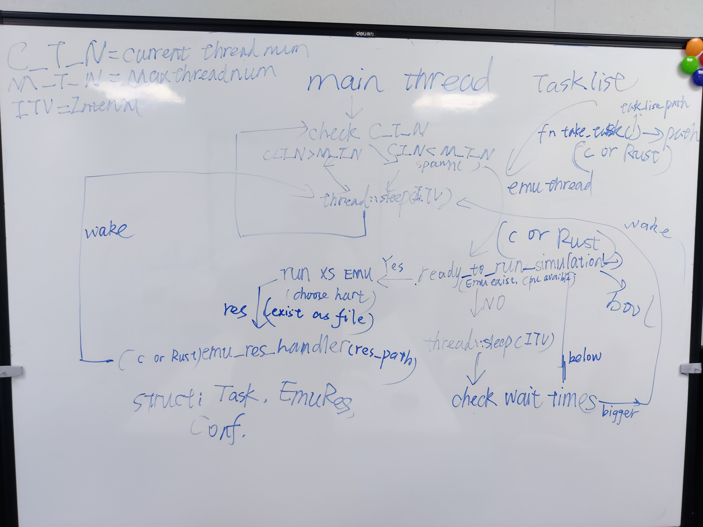

<!-- +# Daily Of CCC (from 2020/08/07) -->

今年暑假我参加了一个很有趣的活动，在这个活动里老师要求我们每天写日志，来记录每天做的事情。我觉得这是一个很有想法而且很有意义的做法，因此在今天晚上，活动的线下实习的最后一晚，我开了另外一个 repo ，在这里每天记录一些东西，比如学习中获得的东西，比如遇到有趣的事情，再比如心情。这个日志独立于我参加实习建立的日志，我希望在这个日志上一直写下去。  

## TOC Day 0~60

* [Day 0](#0)  
* [Day   1](#Day001)   
* [Day   2](#Day002)   
* [Day   3](#Day003)  
* [Day   4](#Day004)  
* [Day   5](#Day005)  
* [Day   6](#Day006)  
* [Day   7](#Day007)  
* [Day   8](#Day008)  
* [Day   9](#Day009)  
* [Day  10](#Day010)  
* [Day  11](#Day011)  
* [Day  12](#Day012)  
* [Day  13](#Day013)  
* [Day  14](#Day014)   
* [Day  15](#Day015)  
* [Day  16](#Day016)  
* [Day  17](#Day017)  
* [Day  18](#Day018)  
* [Day  19](#Day019)  
* [Day  20](#Day020)  
* [Day  21](#Day021)  
* [Day  22](#Day022)  
* [Day  23](#Day023)  
* [Day  24](#Day024)  
* [Day  25](#Day025)
* [Day  26](#Day026)
* [Day  27](#Day027)  
* [Day  28](#Day028)  
* [Day  29](#Day029)  
* [Day  30](#Day030)  
* [Day  31](#Day031) 
* [Day  32](#Day032) 
* [Day  33](#Day033) 
* [Day  34](#Day034) 
* [Day  35](#Day035) 
* [Day  36](#Day036) 
* [Day  37](#Day037)  
* [Day  38](#Day038)  
* [Day  39](#Day039)  
* [Day  40](#Day040)⭐  
* [Day  41](#Day041)  
* [Day  42](#Day042)  
* [Day  43](#Day043)  
* [Day  44](#Day044)  
* [Day  45](#Day045)  
* [Day  46](#Day046)  
* [Day  47](#Day047)  
* [Day  48](#Day048)  
* [Day  49](#Day049)  
* [Day  50](#Day050)  
* [Day  51](#Day051)  
* [Day  52](#Day052)  
* [Day  53](#Day053)  
* [Day  54](#Day054)
* [Day  55](#Day055)
* [Day  56](#Day056)
* [Day  57](#Day057)
* [Day  58](#Day058)⭐
* [Day  59](#Day059)
* [Day  60](#Day060)
* [Day  61](#Day061)  
* [Day  62](#Day062)  
* [Day  63](#Day063)  
* [Day  64](#Day064)
* [Day  65](#Day065)
* [Day  66](#Day066)
* [Day  67](#Day067)
* [Day  68](#Day068)⭐
* [Day  69](#Day069)
* [Day  70](#Day070)
* [Day  71](#Day071)  
* [Day  72](#Day072)  
* [Day  73](#Day073)  
* [Day  74](#Day074)
* [Day  75](#Day075)
* [Day  76](#Day076)
* [Day  77](#Day077)
* [Day  78](#Day078)⭐
* [Day  79](#Day079)
* [Day  80](#Day080)
* [Day  81](#Day081)  
* [Day  82](#Day082)  
* [Day  83](#Day083)  
* [Day  84](#Day084)
* [Day  85](#Day085)
* [Day  86](#Day086)
* [Day  87](#Day087)
* [Day  88](#Day088)⭐
* [Day  89](#Day089)
* [Day  90](#Day090)
* [Day  91](#Day091)  
* [Day  92](#Day092)  
* [Day  93](#Day093)  
* [Day  94](#Day094)
* [Day  95](#Day095)
* [Day  96](#Day096)
* [Day  97](#Day097)
* [Day  98](#Day098)⭐
* [Day  99](#Day099)
* [Day  100](#Day100)
* [Day  101](#Day101)  
* [Day  102](#Day102)  
* [Day  103](#Day103)  
* [Day  104](#Day104)
* [Day  105](#Day105)
* [Day  106](#Day106)
* [Day  107](#Day107)
* [Day  108](#Day108)⭐
* [Day  109](#Day109)
* [Day  110](#Day110)
* [Day  111](#Day111)  
* [Day  112](#Day112)  
* [Day  113](#Day113)  
* [Day  114](#Day114)
* [Day  115](#Day115)
* [Day  116](#Day116)
* [Day  117](#Day117)
* [Day  118](#Day118)⭐
* [Day  119](#Day119)
* [Day  120](#Day120)

<span id="0"></span>

## Day 0 (2020/08/07)
今年 7 月开始到现在我参加了一个实习：  
欢迎在校学生在2020年暑假参加鹏城实验室与清华大学举办的OS Tutorial Summer of Code 2020 活动（7月4日～8月31日），本次活动分为两个阶段rCore Labs Tutorial（7月4日～7月31日）和zCore操作系统实践与研究（8月1日～8月31日） ,主要是对用Rust语言进行OS研发开展学习、交流与探索。  
如有兴趣参加，请发个人简历给 yuchen@tsinghua.edu.cn 并填写调查问卷，获得邀请后，将开始参与如下面所示的rCore Labs Tutorial活动。完成本次活动第一阶段（7月4日～7月31日）的同学如果通过review，将获得鹏城实验室资助到鹏城实验室进行为期一个月的第二阶段（8月1日～8月31日）的OS实习，开展zCore操作系统实践与研究。  
目标：
探索把现代系统语言Rust和灵活开放的系统结构RISC-V带入到操作系统的架构与设计的创新中来，思考未来的操作系统应该是什么样。  
宗旨：
希望本活动的组织，能为操作系统爱好者提供一个活跃的开源社区环境，为对Rust、RISC-V和操作系统感兴趣的人士营造一个平等的学习与交流空间，吸引更多对操作系统感兴趣的人士参与。  
我在上个月通过了 review，在 8 月 2 号来到深圳鹏城实验室进行线下实习，今晚是线下实习的最后一个晚上。  
有那么一群人，尝试使用现代系统语言Rust编写操作系统，探索一个好的操作系统该怎么写，思考未来的操作系统应该是什么样子的。  
这群人的领头羊，就是清华大学教OS课的两个老师和wrj学长，在这些人的带领下，在清华开启了一段用Rust写OS的奇妙之旅。  
他们还尝试将新的架构RISCV结合到编写操作系统上来，并希望他们写的操作系统能在RISCV的真机上跑。  
现在这个想法已经得到了很好的实现，wrj学长起头的rCore操作系统，一个用Rust语言编写的OS已经颇具规模，成长为一个比较健壮，功能较为强大的操作系统。  
而zCore是他们的另一个尝试，这是一个微内核，山寨了Google开发的Zircon微内核，并使用Rust语言编写，充分利用了Rust语言的语法特性，尽管还有许多bug，目前已经能运行在x86架构下了。  
rCore项目已经建立起了一个开发者社区，吸引着许多OS爱好者参与到rCore的开发中来。  
参加这个实习，我很荣幸地加入到这个圈子中来，积极地探索操作系统的奥妙。  
在一周的线下实习过程中，鹏城实验室给我们安排的活动十分丰富，其中最让我感触深刻的是，国科大“一生一芯”团队的5位同学和余子濠博士给我们带来他们完成RISCV处理器的开发过程背后的故事，和去清华伯克利深圳研究所参观，并听了谭章熹博士的关于RISCV的报告(太过前沿，不是很能听懂)。特别是去清华伯克利深圳研究院参观的时候，就像是拜访圣地一样，太激动了  
每天晚上则是wrj等清华研究生学长的关于rCore/zCore的讲座(太强了）  
除此之外，我们还和向勇老师，wrj学长他们进行了一次聚餐，和他们聊天，像做梦一样  
还认识了Rust的疯狂粉丝兼校友luojia同学，太强了  
我参加这次实习受益匪浅，一是Rust语言，二是OS，三是见识。希望我在实习结束的时候能拿出成果来。  
也许许多年后，清华 OS 课的实验就是我们这群人写的hhh。  

<span id="Day001"></span>

## Day 1 (2020/08/08)
今天从深圳做高铁回到广州大哥的家住几天。  
晚上根据 zCore-Tutorial 重现了内核对象的代码，加深了对内核对象的理解。  
下面定义内核对象的 trait ：  
```Rust
/// trait for kernel object
pub trait KernelObject: DowncastSync + Debug {
    /// get id of kernel object
    fn id(&self) -> KoID;
    /// get type of kernel object
    fn type_name(&self) -> &str;
    /// get name of kernel object
    fn name(&self) -> String;
    /// set name of kernel object
    fn set_name(&self, name: &str);
}
```
下面编写一个宏自动为内核对象实现`KernelObject` trait：  
```Rust
#[macro_export]
macro_rules! impl_kobject {
    ($class:ident $( $fn:tt )*) => {
        // implement `KernelObject` trait for object
        impl KernelObject for $class {
            fn id(&self) -> KoID {
                self.base.id
            }
            fn type_name(&self) -> &str {
                stringify!($class)
            }
            fn name(&self) -> alloc::string::String {
                self.base.name()
            }
            fn set_name(&self, name: &str) {
                self.base.set_name(name)
            }
            $( $fn )*
        }
        impl core::fmt::Debug for $class {
            fn fmt(
                &self,
                f: &mut core::fmt::Formatter<'_>,
            ) -> core::result::Result<(),core::fmt::Error> {
                f.debug_tuple(&stringify!($class))
                    .field(&self.id())
                    .field(&self.name())
                    .finish()
            }
        }
    };
}
```
我们还实现了接口到具体类型的向下转换，并为上述逻辑写了单元测试。  

<span id="Day002"></span>

## Day 2 (2020/08/09)
今天看了一下 zCore 的源码，结合之前看的 pql 学长的毕设论文，目前大概清楚了 zCore 的整体结构。  
经过分析，zCore 中与架构相关的模块在 kernel-hal-bare 文件夹中，我要做的工作就是完善这部分模块对于 RISCV 架构的支持。但目前我对于具体怎么做还没有更明确的认识。  
同时，我还需要对 rCore 中的对 RSICV 支持的代码进行分析，目前在 rCore 源码中有一个 Arch 文件夹，里面是架构相关的代码，我需要重点对这部分代码进行分析。  

<span id="Day003"></span>

## Day 3 (2020/08/10)
今天下了一天 zCore 项目，总是失败，最终还是没有下载完成。  
和罗凯莹去新华书店买书，结果没有买到，然后去了七十二佳房客拍摄地点，但是那里没有开门，然后去菜市场买了菜回家煮饭。  
晚饭罗凯莹提出她来做饭，我打下手。最后做出来的晚饭尝起来还不错。  
晚上就在家里休息。  

<span id="Day004"></span>

## Day 4 (2020/08/11)

今天陪罗凯莹去医院，坐了大概一个小时的公交到那个很偏僻的医院，由于医院设备故障导致需要另行预约。  
我们抛去不愉快的心情去了周围的商场购物，但在结帐的时候我大嫂给的100块钱的购物券用不了，然后我就先付了。  
然后和罗凯莹去了广州购书中心一趟，因为她要买一本叫做《乡土中国》的书。书买好后，我们就回家了。  
晚上思考了一下移植 zCore 的工作要怎么开展。目前打算在 qemu 中跑起 zCore 的 hal 抽象层和内核对象，然后再一步步往上构建。  
今天还算比较不错的一天。  

<span id="Day005"></span>

## Day 5 (2020/08/12)
今天在实习任务上有了一点进展，首先我先尝试把 luojia 维护的 riscv-sbi-rt 库用起来，经过一番尝试并和 luojia 本人的交流后觉得这个库的实现有些问题，因此暂时不用这个库。我使用之前 rCore-Tutorial 的框架搭建了一个 zCore-riscv 的开发环境，目前已经在上面跑起了内核对象。  
下午和罗凯莹去看了《大鱼海棠》，第二次看这部国产电影，还是觉得很震撼，我觉得这是目前国产动画电影的天花板了，特别是作画和特效，是其他国产动画电影无法比拟的。  
晚上是我大嫂煮饭，是我爱吃的混沌。  
买了明天晚上回家的票，得赶快回家工作了。  

<span id="Day006"></span>

## Day 6 (2020/08/13)
今天下午带罗凯莹去美术馆玩。  
看起来她比较喜欢画画，看那些艺术品看得很入迷，我倒是一点也看不懂。  
她马上就要进入高中了，即将迎来很艰苦的三年，祝她好运吧。下次见面可能她已经上大学了。  
晚上我们一起坐地铁，我去广州南站，她转广佛线，我先下车转 2 号线。下车之前向她道了别，下车之后感到些许唏嘘。  
做高铁回到茂名已经 9 点 40 了，叫了辆滴滴回家，一路上看着窗外的夜景一边想着离开家这几天的事情，很是感慨。这将会是我人生中重要的一笔。  
回家快乐。  

<span id="Day007"></span>

## Day 7 (2020/08/14)
今天一整天都在研究 zCore 源码和在我的框架上构建代码，目前对 zCore 源码的分析更新如下：  
+ kernel-hal-bare 模块是唯一与硬件相关的代码
+ zCore 的模块化十分清晰，它将各个层次模块作为一个个 crate 进行调用。比如 kernel-hal 和 kernel-hal-bare。
+ kernel-hal 模块不依赖于其他模块，并为其他模块提供支持
+ 各个模块最终作为一个 crate 在 zCore 中被调用来构建一个 OS
+ 在硬件抽象层之下的 kernel-hal-bare 和 之上的各个层次都有架构相关的代码
+ kernel-hal 模块被其他多个模块依赖，而 kernel-hal-bare 只在最终构建 zCore 的时候被调用
+ 在我构建的框架中，原本在 zCore 中的模块在这里将不再作为一个个 crate，而是一个个 mod
+ 目前的大致方向是在我搭建的这个框架上一点点地构建 os，最终目标是使其能在 riscv 下的 qemu 上执行 zCore 的大部分功能。 


目前我在维护的项目地址：[zCore-riscv](https://github.com/SKTT1Ryze/zCore-riscv)  
在这个项目中我选择将原先在 zCore 中作为 crate 的模块作为 mod 处理的原因有：  
+ 按照之前 rCore-Tutorial 的框架进行开发，会比较熟悉，省去了不少学习的时间成本
+ 这样相当于重新搭建起 zCore，在此过程中我将能较快较全面地熟悉 zCore，理解 zCore 自上而下构建操作系统的思路
+ 如果代码在此框架上能跑通，那么在原 zCore 上也肯定没问题，代码迁移的工作量是很小的


目前进度在 github 上可以看到，目前还比较少。  
争取明天能跑起一个内核对象。  
今天 LPL 季后赛 LGD 打 WE，LGD 3：1WE 挺进 6 强。xiye 和小花生是真的猛，恭喜老干爹时隔 1800 多天再次在季后赛获胜，这只老将组成的队伍一眼看去满满的都是青春啊，老玩家泪目。  
看了一集番：《宇崎ちゃんは遊びたい》，这么可爱的学妹请务必给我来一打！（想屁吃）  

<span id="Day008"></span>

## Day 8 (2020/08/15)
今天完成了 zircon-kernel 从 zCore 到 zCore-riscv 的迁移。  
另外添加了对这部分模块的测试代码，大部分测试都能通过，某些测试因为缺少实现而出现 unimplement panic。  
下面是对 kernel-hal 中 #[linkage = "weak"] 标志的函数的理解：  
+ 这些函数在 kernel-hal 中并没有得到实现，而是由 kernel-hal 层往上的模块实现，这种逻辑的支持来自弱链接
+ kernel-hal-bare 则会是调用后面实现的这些函数，比如 hal_frame_alloc()
+ 在 zCore 中不同模块是分别作为一个个 crate，但是在 zCore-riscv 中是作为一个个 mod，这导致在 zCore-riscv 中不能使用弱链接的形式

解决办法：  
+ 方法一：在各个模块的逻辑中将那些使用 kernel-hal 模块的部分直接换为真正的实现部分
+ 方法二：在后续将 kernel-hal 那些没实现的函数实现之后，在 kernel-hal 里的那些函数体里面调用实现的函数
+ 方法三：重新整理代码将各个模块重构成一个个 crate

使用哪种方法将取决于后面的进展。  
不过无论使用哪种方法，最终都还是要回到 zCore 上去，目前我只是需要在一个运行环境中能成功运行和测试。等在 zCore-riscv 上的运行和测试通过后，各种实现逻辑将会再移植到 zCore 里面去。  
在今天下午的交流会议中，刘丰源学长曾经做过到 mips 上的移植，他给我传授了一些经验：先在一个运行环境中在用户态打印出 HelloWorld，然后再一步步完善底层结果，大致上就是将那些 unimplement 的部分给实现来。  
打算到 18 号开始复习期末考试，这几天尽量做多一点。  

今天 LPL 季后赛 SN 3：1 V5, Sofm 是真的猛啊。  
和昨天一样看了一集番：《宇崎ちゃんは遊びたい》。   
还在 qq 上和罗凯莹聊了一会，她也快开学了，25 号军训。  


<span id="Day009"></span>

## Day 9 (2020/08/16)
今天完成了 zircon-syscall 和 zircon-loader 层从 zCore 到 zCore-riscv 的迁移。  
准备在 QEMU 中跑起 userboot 的时候，遇到了一个大障碍：  
+ 原版 zCore 需要用到zircon镜像 prebuilt/zircon/x64/userboot.so，这些镜像文件依赖于 Fuchsia 官方镜像，目前 Fuchsia 官方不支持 riscv，因此我目前无法获得适用于 zCore 的 riscv 上的 Fuchsia 镜像。
+ 我的理解是 zCore 现在可以在裸机或 QEMU 上跑 Fuchsia 原生用户程序，而 Fuchsia 官方目前只支持 x86 和 Arm 两种架构，再有由于 Fuchsia 是商业项目，因此他们可能不打算支持 riscv，这样的话想在 zCore 上跑 Fuchsia 用户程序的话道阻且长。  

通过和学长，老师们交流，目前想到以下解决办法：  
+ 写一个简单 Fuchsia 小程序替代 userboot.so，先看看运行效果
+ 利用 loader 层底下的实现暂时先重写一个简陋的 zircon-loader，先让整个框架能跑在 loader 层以上，能在上层环境输出，以达到验证底层代码正确性的效果
+ 参照 rCore-Tutorial，整个重写 zircon-loader，不执着于跑 Fuchsia 用户程序的思路，而是跑自己用 Rust 写的用户程序

明天再深入研究一下 zircon-loader 代码，并思考一下后续工作如何开展。  

今天 LPL 季后赛 LGD 3：0 IG，惊呆我了。本来觉得 LGD 有可能赢，但没想到是连续碾压三局，一场 BO5 下来只用了一个多小时。  
小花生还是猛啊，LGD 这老年三叉戟太顶了，就好像那句话：我虽然老了，但是你大爷还是你大爷。  
puff 还是菜得可以，ning 也被小花生压制，IG 还是中上是大爹，队友都有点拉跨。  
明天再忙一天实习的任务，后天就要开始复习考试了。  

<span id="Day010"></span>

## Day 10 (2020/08/17)
今天做了一些尝试。  
首先是打算写一个盗版的 run_userboot 函数，让它加载一个 elf 文件然后创建一个主线程去执行它。运行起来后不出意料地出现 unimplement! 或者 panic!。  
通过 rCore-Tutorial 中提供的 riscv64-unknown-elf-gdb 调试器调试加上一次打 log 重新编译运行，跟踪到 unimplement! 或者 panic! 出现的地方，试图排除 bug。但到最后发现很多出 panic 的原因是在 unsafe 代码中，这样一来就很难查出错误出在哪，毕竟 zCore 中加载的是 Fuchsia 官方镜像，而我这里只是随便找一个 elf 文件来加载，肯定问题会很多。  
然后我就再写了一个更简单的 simple_run_userboot 函数，在这个函数中只提取出 elf 文件的入口地点，交给 proc.start 去运行。这样一来 panic 就不再出现了，程序应该是跳到了某个地址中执行，但是没有输出。  
目前带来了一个新的问题就是：zCore 是对接 Fuchsia 用户程序的，如果我们不想对接 Fuchsia 而是 Rust 编译的面向 riscv 平台的程序的话，底下的内核实现需不需要改？要改多少？  
另外就是我目前不清楚 zCore 里面的文件系统是怎么实现的，需要花时间去理解一下代码。  
在上述的尝试过程中，途中遇到了一些 unimplement，我对其中的一些进行了实现或者暂时写了一些粗糙的实现，以让我的代码能跑在用户态。具体整理如下：  
+ 用 kernel-hal 中 unimplement 的函数中加上 kernel-hal-bare 中实现的函数链接，让代码转到 kernel-bare 中执行
+ 重写 memory 模块，实现了页帧分配器（使用现成的），al_frame_alloc，hal_frame_alloc_contiguous，hal_frame_dealloc 这三个在 kernel-hal 中定义但没有实现的函数，目前页帧分配已经可以正确使用
+ 将 print! 和 println! 宏从 console.rs 转到了 logging.rs，更好地对接原 zCore 的实现
+ 之前如果代码使用了 kcounter 相关的功能话，会报链接错误，现在修改了 linker.ld 文件使得代码可以正确链接
+ 在 thread.start 函数中原本没有在 riscv 平台下对 context 的处理，我这里为其加上了一些简单的实现，正确与否还得在后续的开发中观察和修改
+ 为某些实现增加了一些共用的成员函数，以便我可以写测试代码

目前的进展大概就到这，往后要复习考试，可能会停滞一些了，在复习期间可能会抽时间给 zCore 加一点单元测试，争取在月底能在力所能及的范围做尽量多的事。  

今晚打了几局 LOL，玩了一把厄菲流斯，在前期大劣势的情况下后面几波团战输出拉满，最终完成翻盘。这英雄连削了九次，削成这样了还能 c 我是没想到的。还打了几盘大乱斗，大乱斗是真的好玩hhh。  
明天开始复习，今天放松一下。  

pass：luojia 的 RIOS组织报告的会议记录：  
> RIOS组织正在达成一个五年目标，提出了一个称作PicoRio的开放架构。希望能减少开发者的开销，有一款文档详细的单板计算机，功率要和树莓派板子对标。 PicoRio的开发分为三个阶段，第一阶段希望实现异构多核的处理器，要实现还在草稿中的RISC-V的动态语言J扩展，跑Linux，跑Chrome OS的内核。希望在今年秋天发布第一个版本。 第二个阶段希望支持图形处理器，希望支持虚拟机监视器，希望有一个WebAssembly的运行时。第三个阶段希望有更多的工业软件和更好的性能。
> J扩展正在草稿阶段，可能要增加两个功能。还在讨论过程中。 增加一些CSR，增加一些地址保护的模块。非常早期。


<span id="Day015"></span>

## Day 15 (2020/08/22)
今天下午参加会议，与老师和学长们说了目前的进展和遇到的障碍，和正在准备考试的情况。经过讨论，向老师同意我放弃对接 Fuchsia 的观点，并且提出一个看起来可行的建议：往 Linux 方向走。  
因为我之前一直都是往 zCore 跑 zircon 程序这条线上走的，这条路走到用 zircon-loader 加载 Fuchsia 镜像时就走不通了，因为 Fuchsia 不支持 riscv。  
向老师说走 Linux 这条路可能能行，因为在 rCore 上已经得到验证了。这样一来我打算在复习的空余时间继续按这个思路尝试一下。  
另外向老师说可能会邀请我们学校操作系统课的老师来听我们的最终项目报告，我觉得这是好事，可以推动国内高校的操作系统课程教育的发展，而不是永远都是老一套。  
今天晚上开始将 zCore 里面的 linux-object 层移到我搭建的运行环境中，但遇到了一些问题，问题来源于 linux-object 层依赖于 zircon-object 层，而 zircon-object 层相比于我一开始移植的时候已经有较大的变化，因此我需要修改一下 zircon-object 层的实现。  
今天的会议很有意义，让放松了几天的我重新回到工作状态上。明天继续加油。  
今天 TES 3：0 SN，成功晋级 LPL 夏季赛总决赛同时获得了 s10 全球总决赛的门票。这是 knight 第一次 s 赛之旅，希望不留遗憾。卡萨连续第 6 次进入 s 赛，出道到现在从未缺席，有点厉害。水手组合冲！  

<span id="Day016"></span>

## Day 16 (2020/08/23)
今天白天复习考试，晚上继续实习任务。  
今天晚上修复了 zCore-riscv 的代码版本落后于新版本 zCore 的问题，具体来讲是新版 zCore 中有关进程的某些实现改了，因此我大致上是将 zircon-object 层重新移植了一遍。  
同时将 zCore 中的 linux-syscall 层移到了运行环境中，只是目前还没有增加测试来验证代码正确性。  
今天 jdg 3-1 lgd 成功晋级 LPL 夏季总决赛同时也获得了 s10 全球总决赛的门票，也将在决赛中重演“春决之战”。老干爹可惜了，不过还有冒泡赛打，而且有两条命，希望小花生能再次进入 s 赛。  

<span id="Day017"></span>

## Day 17 (2020/08/24)
今天同样是白天复习考试，晚上做实习任务。  
之前修改了 zircon-object 的代码，导致测试模块无法编译。今晚修复了这部分 bug，现在测试模块可以正常进行测试了。但是有一个测试就是 job_test.rs 中的 create 测试无法通过，原因不明。去到原 zCore 中的对应的测试模块进行测试，同样该测试无法通过，因此可能是测试本身有问题，因此把出错的那行 assert 去掉后测试可以正常通过。  
修改了 vmo 相关的测试模块，目前可以成功编译，但和之前一样测试无法通过，原因应该是底下的某些实现没有写对，这个要等考完试之后才能慢慢来修改。  
今天开始了两部番的补番计划：《谜之彼女X》和《成群结伴！西顿学院》。都挺好看的，打算利用空余时间来补这两部番。  


<span id="Day018"></span>

## Day 18 (2020/08/25)
今天也是利用了晚上的一点时间来做实习任务。  
先是将 zCore 中的 linux-loader 层移了过来，并且增加了一些测试。同时大致地浏览了一遍 linux-object 层的代码，发现这些代码在建立在 zircon-object 之上的，很多地方都是在定义一个 trait，然后为 zircon-object 里面的结构实现这个 trait。  
现在的问题是我不太清楚在 zCore 中是怎么在 linux 分支里运行起来的，并且发现我缺少了很重要的一个步骤：阅读 Makefile。我需要阅读 zCore 的 Makefile，理解它是怎么在 QEMU 中运行起来的。  
明天将开始阅读 Makefile。  

<span id="Day019"></span>

## Day 19 (2020/08/26)
按照计划，今晚阅读一下 zCore 的 Makefile。  
经过今晚较短时间的阅读，对 zCore 是怎样在 QEMU 中跑起来的有了大概的认识，但还需要更深一步的阅读和理解。   

<span id="Day022"></span>

## Day 22 (2020/08/29)
今天是华科本科生老生回校的日子，我早上 7 点 22 在广州南站出发，中午 12 点多回到了阔别半年的华科。回到寝室已经 1 点左右了，简单收拾一下然后开始准备下午的会议。  
会议中我第二个发言，我主要讲了我这个月在 zCore 到 riscv 上的进展，然后讲了后续工作的开展方向。讲得不是很好，这个是讲稿的地址：[zcore_practice_report](https://github.com/SKTT1Ryze/zCore-riscv/blob/master/zcore_practice_report.pdf)   
luojia 同学是最后一个发言，这里就有话可说了，luojia 将这个发言机会当成了宣传 Rust 的机会，整个会议顿时就换了一个画风，变成了大型 Rust 传教现场。当然 luojia 同学也不是全都是讲 Rust，他还讲了 riscv，OS 的一些内容。他讲得特别好，被某个来参的其他学校的老师称“想像不到这是一个大二的学生在讲”。也有老师说“学到了很多东西。”  
最后被邀请来参加会议的老师们点评，最主要的一点就是，我们在进行汇报的时候，他们不清楚我们做的东西的背景，导致听得不是很懂。  
这个暑期实习到此就差不多结束了，感谢我自己这两个月的付出和各位同学老师的陪伴。  
终于回到了心心念念的大学校园，感到十分开心，在家总是一个人在学习，看动漫，没有人可以一起分享，我得珍惜现在所剩不多的大学生活了。  

<span id="Day023"></span>

## Day 23 (2020/08/30)
今天白天基本上都是在复习。  
晚上和舍友去吃火锅。  
今晚 LPL 冒泡赛 LGD 3：1 IG，顺利挤掉 IG 进入全球总决赛。  
自此 LPL 的四只征战 s10 的战队分别是 TES，JDG，SN，LGD。  
为 LPL 获得 s 赛冠军的 FPX 和 IG 都无缘本次全球总决赛。  
快乐家族 LGD 时隔 5 年再次杀入全球总决赛，真的不容易。自从伟神当年那一箭，LGD 就一直徘徊在季后赛大门之外。如今五个老将，在今年夏天聚在一起，挑战光阴，最终跌跌撞撞闯入了 s10,真的令人感慨。特别是小花生，是我最喜欢的一位大野选手，他和那支传奇战队 ROX Tiger，一起带给了我电竞的激情。希望他能在 s10 上走得更远。  

<span id="Day024"></span>

## Day 24 (2020/08/31)
今天下午考的是汇编，考得挺简单的，做得挺顺利的。  
和一个很熟的学长一起吃晚饭，他已经在电气学院保研了，现在他很闲，经常在宿舍打游戏。应该在我大四的时候还能在华科看到他，只不过他那时候已经是研究生了。  
下一门是数电，今晚不想复习了，要把握这么珍贵的时间去做一些更有意义的事情。  

<span id="Day025"></span>

## Day 25 (2020/09/01)
今天一天复习数电考试，这门考试不是很难，复习起来还算比较轻松。  

<span id="Day026"></span>

## Day 26 (2020/09/02)
今天下午考完了数电，数电中实验的那部分题出得有点坑，其他还好。自启动这个知识点没复习到，不过影响不大。  
晚上写好了 8 月 zCore 实习的书面报告，并和向勇老师聊了一会。他鼓励我继续做我感兴趣的事情，我觉得向勇老师是不可多得的好老师。  
自己还要加把劲，成为更好的自己。  

<span id="Day027"></span>

## Day 27 (2020/09/03)
今天一天复习模电考试，感觉这门课比较难，得好好复习。  

<span id="Day028"></span>

## Day 28 (2020/09/04)
今天下午考完了模电，这次模电考试考了很多课本里面的内容，但这部分课本内容我记不太清楚了，不过这卷子做起来还行，基本上都会做。  
晚上玩了几把英雄联盟，很久没在宿舍玩 LOL 了，不太习惯，玩得有点拉跨。明天复习最后一门信号与系统，再加把劲。  

<span id="Day029"></span>

## Day 29 (2020/09/05)
今天一天复习信号与系统。这门课之前没有好好学，很多东西都要记，比如常用的单边傅里叶变换，拉普拉斯变换，z 变换。还有各种变换的性质。  
今晚是战斗之夜，赶紧打了一把人机就复习去了。  

<span id="Day030"></span>

## Day 30 (2020/09/06)
今天终于考完试了！起飞！早上的信号试卷有点恶心，不过都过去了不想理会了。  
晚上和舍友加上一个同班同学 5 个人一起去呷普呷普吃火锅，这次聚餐体验很好，和同学聊了很多学术上的东西，菜也好吃。  
晚上回寝室写 Rust 代码，将《Rust 程序设计语言》这本书里面的最后一章的小项目：一个小 web server，重新实现了一遍，主要是将它模块化了。  
打算睡觉前补一下《春物》，我上一次看《春物》还是在 7 月份。  
明天是今年的第一次课，经历许久又将再次回到大学课堂了。晚安。  

<span id="Day031"></span>

## Day 31 (2020/09/07)
今天是新学期的第一天上课，阔别整个大二下学期之后重新回到课堂上，甚是感慨。  
第一节课是计算机网络，感觉这门课的老师讲得不是很好，虽说语速适中，但是老是在扯东扯西，很少讲到核心的学术知识。  
上午第二节课是大数据处理，这门课的老师就讲得比较好了，平易近人，懂得也很多，比如说 docker 这个比较新的技术都了解得挺深刻的，看来选这门课选对了。这门课最后是单人项目的考核方式，我也正是比较喜欢这种形式。  
下午第一节课是操作系统原理课。讲师是一个女老师，叫做谢夏。一开始没有对这个老师抱很大的期望，因为我已经见识了清华大学的向勇和陈渝两位老师。不过这节课听下来，顿时对这个老师的好感上升不少。她讲课很活泼，一些理论讲得也很清楚，关键是她懂比较多操作系统方面的知识。还是很不错的。  
晚上为前几天写的 mini-web-server 添加了一个线程池，实现用管道进行线程间通信。在这个过程中补了一下 Rust 的基础知识：  
+ 错误处理
+ 并发编程
+ 闭包
+ 优雅停机处理

最后将代码整理了一下，这个练手项目就到此结束了。  
除此之外我还尝试了使用 Rust + Gtk 进行了图形界面的开发，具体就是用 Glade 绘制 UI 界面和调用 Rust 的 Gtk 相关 crate，最后成功运行起一个 Gtk 窗口。感觉如果有时间的话可以再深入了解一下然后用 Rust + Gtk 写个游戏。  
打算明天开始一边深入学习 Rust 语言一边继续 zCore 到 riscv 移植的工作。  
看邮箱的时候突然发现金海教授回我了，我是中午才发的邮件，希望到他实验室去进行科研学习。这速度有点快啊，有点开心。  
看了《春物》第三季第四集，看到最后真的好心疼团子。大老师也太难了，要在两个里面选一个，明明两个都是 大切な人。真的不希望她们三个中的任何一个人受伤呜呜呜。  
晚安。  　

<span id="Day032"></span>

## Day 32 (2020/09/08)
今天早上上了这学期的第一节计算机组成原理课，发现这门课和操作系统原理，编译原理，接口技术这三门课都有很大的联系。四门课程知识环环相扣，最终学完这四门课之后会有一个系统综合能力实验。感觉很有趣。在 PPT 上看到这个系统综合能力实践有一个课题是写 RISCV 的 OS 微内核，这就是清华大学的王润基学长他们已经做过的 rCore 了，但是 rCore 不是微内核，要是 zCore 能移植到 riscv 上就应该可以了。下课后跟老师聊了一下，谈了一些关于龙芯杯，计算机体系结构，操作系统的一些话题，并了解到我们学校有个老师正在做 RISCV 上的操作系统相关的事情。我打算这段时间联系一下他，并想和他交流一下想法。  
下午继续 zCore 到 riscv 的移植，很高兴有了一些小小的进展：pmem_test 可以通过了，还修了一些其他地方的东西，虽然进展很小，但是也足够令人高兴。  
晚上自己尝试用 Rust 写一个线程池，当作是 Rust 的训练项目。最后虽然那大致完成了，但是还有一些 bug 要修。我希望通过写一些项目来逐渐提升我的代码能力和工程能力。  
今晚 T1 3：1 AF，CUZZ 和 Teddy 终于被换下去了，没有了指挥权的争夺，顿时像换了一个队。你李哥还是你李哥。明天打 GEN，T1 加油！  
晚安。  

<span id="Day033"></span>

## Day 33 (2020/09/09)
今天早上去找金海教授，和他聊了会出国的意愿和想进行 RISCV 和操作系统方向的科研。他把我推荐给了邵志远老师，邵老师正在做 RISCV 相关的研究，而且他也是卓越工程师班的操作系统老师。和邵老师聊了聊，了解到他正打算开启一个科研项目，关于 RISCV 的虚拟化这样的一个东西。另外还他让我加入了计算机卓越班的操作系统课程群，让我先做一下他们的实验：基于 RISCV 的代理内核的操作系统课程实验与课程设计。我稍微看了一下实验指导书的第一章第二章，发现有点意思，打算下午上完计算机网络的课后回寝室做一下这个实验。  
这个实验是基于 riscv 的代理内核（Proxy Kernel) 来进行的，代理内核可以看成是操作系统的一个极小子集。  
为什么选择用代理内核：  
+ 如果采用完整内核的思路来设计实验，非常容易陷入某个模块比如启动，中断处理，内存管理等设计细节。
+ 完整方案中即使是为了运行一个最简单的 HelloWorld 程序，都需要实现如用户态进程封装，进程调度等以及之前的一系列操作系统模块，这样做反而忽略了操作系统对硬件进行封装以支撑应用运行的本质。
+ 同时完整操作系统内核实验方案往往需要自己写一个简单文件系统，并用它来组织虚拟磁盘，这样就不得不引入大量与应用支撑无关的代码，导致了工程庞大和重点不突出等诸多问题。

代理内核的存在是为了在硬件（模拟器）上支撑应用，而设计的最小化的操作系统内核。它可以根据应用的复杂度的不同，调整自身的复杂度。从学习操作系统知识的角度来看，代理内核的这些特点更有利于站在应用的角度来审视操作系统对硬件的封装和为应用所做的支撑，从而更好地理解从原理课程所学到的知识。  


现代处理器定义不同特权级的根本原因，是为了对操作系统进行保护。例如让操作系统运行在较高的特权级，而用户代码则运行在较低的特权级，以防止用户态代码执行恶意的动作破坏操作系统。有时候用户态代码会在它的生命周期里要求做一些“合法“的特权级行为，例如进行 I/O，这就意味着处理器需要支持特权模式的转换，在 riscv 中实现这种转换的工具就是中断。riscv 处理器可以实现跨特权模式的转换，例如从 U 态进入 M 态，或者从 M 态返回 U 态，取决于机器的状态寄存器的设置。  
特权级寄存器：  
+ mscratch：M 态的栈顶指针
+ mstatus：中断处理程序的入口地址
+ mepc：异常指令的地址
+ mcause：中断的原因
+ mtval：异常的参数值，比如缺页异常时访问的虚拟地址
+ mie：中断开启寄存器
+ mip：中断等待寄存器
+ mideleg：中断代理寄存器
+ medeleg：异常代理寄存器

借鉴参考文献[SiFive Interrupt]的中断分类标准，将系统中发生的能够中断当前执行代码的事件分为 3 种：  
+ Exception：条件不满足，例如除零错误，缺页，权限不够。处理完毕后，系统返回发生 exception 的那条指令重新执行
+ Trap：即系统调用或者软件中断，由当前执行的程序主动发出，比如屏幕输出，磁盘文件读写。在 riscv 中，trap 的产生是由特定指令 ecall 导致的。不同于 exception，trap 在处理完成后返回的是下一条指令
+ Interrupt：一般是由外部设备产生的事件而导致的，比如 timer 事件，I/O 完成等。interrupt 在处理完成后返回的是下一条指令。

RV64G 处理器在发生中断后，会将发生的中断类型，编号自动记录到目标模式的 CSR 中。假设发生中断的目标模式是 M 模式，则中断的这些信息会记录到 mcause 寄存器。  
当发生的中断类型是 interrupt 时，mcause 的高位为 1,而如果发生的中断类型是 exception 或 trap，mcause 的高位则为 0。  
对于 M 态，interrupt 的 code 字段的可能取值和含义为：  
+ 3：Machine software interrupt。软件产生的中断但却不是 exception 或 trap。主要是指在多核（Harts）环境下的处理期间中断。riscv 通过让一个核直接写另外一个核的本地中断控制器来实现这类中断。这个不是软件中断或者 trap。
+ 7：Machine timer interrupt。时钟中断。
+ 11：Machine external interrupt。除了时钟中断之外的其他机器中断，例如键盘和其他外设。
+ >=16：Implementation defined local interrupts。与实现相关的其他中断源。  

非 interrupt：  
+ code = 8：来自 U 态的 trap
+ code = 9：来自 S 态的 trap
+ code = 11：来自 M 态的 trap
+ 其余的情况都是 exception，比如 code = 13 的缺页异常

中断向量表的组织和实现方式：  
+ 直接模式
+ 向量模式

riscv 根据 mtvec 的最低位（mtvec.mode）来判断系统具体采用哪种模式。  

当发生一个中断，假设目标模式是 M 模式，riscv 处理器将会这样做：  
+ 保存 pc 到 mepc
+ 将发生中断前的特权级保存到 mstatus 寄存器的 MPP 字段 
+ 设置 mcause
+ 将 pc 设置为中断例程的入口，如果为直接模式则设置为 mtvec 的值
+ 将 mstatus 的 MIE 字段清零，转入机器模式

中断处理例程伪代码一般这样写：  

```riscv-asm
    .align 6
    .global handler_interrupt
handler_interrupt:
    addi sp, sp, -32*REGBYTES
    STORE x1, 1*REGBYTES(sp)
    STORE x2, 2*REGBYTES(sp)
    ...
    STORE x31, 31*REGBYTES(sp)
    call software_handler
    LOAD x1, 1*REGBYTES(sp)
    LOAD x2, 2*REGBYTES(sp)
    ...
    LOAD x31, 31*REGBYTES(sp)
    addi sp, sp, 32*REGBYTES
    mret
```

执行 mret 指令时：  
+ 将 mstatus 的 MPIE 字段恢复到 MIE 字段
+ CPU 转换到 mstatus 中 MPP 字段所对应的特权模式
+ 将 mepc 中的内容恢复到 pc 中

riscv 的中断代理机制：  
riscv 中可以将系统中的特定中断或者异常，通过设置较高特权级的 CSR 寄存器，“代理给”某个更低的特权级处理。比如可以设置 M 态的 mideleg 以及 medeleg 中的某些位，将系统中的部分中断（对应 mideleg）或异常（对应 medeleg）“代理”给 S 态处理。  

页式虚拟存储管理：  
+ 采用 RV64G 指令集的 riscv 处理器在 S 态提供了三种虚拟内存管理方式：Bare，Sv39 和 Sv48。
+ Sv39 虚存管理方式实际上只用到了 64 位中的 39 位。
+ 39 位逻辑地址划分：VPN[2](9),VPN[1](9),VPN[0](9),page_offset(12)
+ 地址变换是由 riscv 处理器硬件完成的，但是页表的构造却是操作系统的重要任务
+ 对于操作系统中运行的每个进程，都应该有个一页表与其对应，当 CPU 需要执行某个进程的时候，就应该将 satp 指向想要执行的进程。
+ 对于一个进程而言，它可能用不满全部虚拟地址空间，这种情况下它的页表中可能只有非常少的部分的 PDE/PTE 是有效的，而其他 PDE/PTE 并不指向任何物理内存页面
+ 若要将操作系统本身的地址空间部分开放给某用户进程，有了页表的帮助，这种共享必须考虑到权限问题，但是必须考虑到权限问题
+ 为了加快虚拟地址到实地址的转换，今天的 CPU （包括 riscv）一般都内置了 TLB 单元，其速度接近寄存器。在进行地址转换时，将常用的 PDE/PTE 存储在 TLB 中以加速虚实地址的转换速度。有个问题是当发生进程切换时，TLB 中很有可能还保留了上一个进程的地址变换所涉及的 PDE/PTE。这时，我们就需要借助 satp 寄存器中的 ASID 字段来判断是否发生了进程切换，如果发生了，操作系统就需要调用 SFENCE.VMA 指令来将 TLB 中的内容刷新。  
+ 对于 2MB 的兆页，只需要将虚拟地址部分的 VPN[0] 和 VPN[1] 都当作页内偏移即可。  

呜呜呜今晚李哥输了，今年世界赛又看不到李相赫了。李哥继续加油吧，上山的凡人没资格嘲笑下山的神。  

<span id="Day034"></span>

## Day 34 (2020/09/10)
今天做了下学姐给我发的实验，目前做完了实验二。  
实验一就是在 proxy kernel 源码中挖几个空让做实验的人去填，比较简单，即使不会做也可以直接看源码。  
但是在做实验二的过程中遇到一个问题：proxy kernel 中 trapframe 的实现，有个叫做 insn 的成员，我看了好一会源码，还查阅了很多 riscv 相关的文档，还是不太清楚这个 insn 是个什么东西。感觉是这个开源项目 proxy kernel 自己的设计。目前还是一脸懵。  
现在我有个感觉很有趣的想法：用 Rust 语言来重写这个 proxy kernel，使得我们可以得到一个用 Rust 语言写的代理内核，我们可以这样运行我们的 riscv 代码：  
```shell
spike rust-pk hello_world
```
想想就觉得很有趣，感觉这是一个很好的 Rust 项目。但是目前不知道可不可行，改天问下洛佳看看他怎么看。  
另外可以看看 spike 和 pk 是怎么结合运作的，并学习一下代理内核的概念。  
晚上和学姐聊了聊，跟她说了几个实验文档里面的错误，并且跟她约好了周日上午去她实验室交流一下关于这个实验的一些问题。  
这个实验还是可以的，我通过这个实验的确熟悉了一些 riscv 的特权级设计。  
今天邵老师发了一个关于 Arm 虚拟化的 PPT，今天还没时间看，明天找时间看一下。  
晚安。  


<span id="Day035"></span>

## Day 35 (2020/09/11)

Virtualization is the process of running a virtual instance of a computer system in a layer abstracted from the actual hardware. Most commonly, it refers to running multiple operating systems on a computer system simultaneously.  
Hypervisor:  
+ bare metal, run guest virtual machines directly on a system's hardware
+ hosted, behave more like traditional applications

KVM, short for kernel-based virtual machine, is a part of the Linux kernel that can run virtual machines directly, although you can still use a system running KVM virtual machines as a normal computer itself.  

A virtual machine is the emulated equivalent of a computer system that runs on top of another system. Virtual machines may have access to any number of resources: computing power, through hardware-assisted but limited access to the host machine's CPU and memory.  

A container is actually just an isolated process that shared the same Linux kernel as the host operating system, as well as the libraries and other files needed for the execution of the program running inside of the container, often with a network interface such that the container can be exposed to the world in the same way as a virtual machine.  

上面是早上看的一些关于虚拟化和 Hypervisor 和 容器的介绍。  

今天下午睡了会觉，醒来差不多四点了，收拾收拾上课去了。  
晚上本来准备赶快做完焦学姐设计的实验三然后看邵老师早上给我发的关于虚拟化的论文，但没想到一做就是一晚上。原因是一开始我没有看实验指导书后面的基础知识，那里有学姐加上的代码解释，方便我们读懂她写的内存管理模块代码。这导致我靠自己分析学姐的代码然后做这个实验，最后花的时间就比较长。不过还是锻炼了代码能力还是有好处的。  
明天早上再早点起来看一下关于虚拟化的论文吧。  
刚刚填了个 Rust 社区调查表，希望 Rust 越来越好，有种你们 20 年后不用 Rust！  
晚安。  

<span id="Day036"></span>

## Day 36 (2020/09/12)
今天是周六，早上 8 点起床继续做学姐设计的实验。lab-4 是关于如何处理缺页异常的。缺页异常是虚拟内存管理中常见的异常，一般会有下面几个步骤对缺页异常进行处理：  
+ 在外存中查找目标页面
+ 在内存中找一个空闲页面，并将第一步中找到的页面换入
+ 修改页表项，使其映射到第二步中在内存中找到的空闲页面
+ 重新执行指令
+ 如果第二步找不到空闲页面，则根据页面替换算法选择内存中的一个页面进行替换

最后一步还是会有些细节需要注意的，这里不再多说。  
上午做完了缺页异常的实验，下午开始做最后一个关于进程的实验。  
很遗憾，做了一整个下午，最终没能完成。总是会跳出一个 page fault。打算明天去找学姐的时候问一下。  
晚上看了会 TLB 和 MMU 还有 MMIO 的内容。然后就是看关于虚拟化的论文，现在开始要加快进度了。  
打算做完学姐这边的实验之后继续做 zCore 到 riscv 的移植。做完学姐这个基于 riscv 代理内核的实验之后感觉对 riscv 上的 OS 的理解又加深不少。应该会对 zCore 的移植会有帮助。  
组原实验也差不多要开始了，打算组原实验做完后学习 Chisel，其实我对龙芯杯有些想法，但是感觉这比赛没队友是搞不下去的，看情况吧。  
晚安。  

<span id="Day037"></span>

## Day 37 (2020/09/13)
今天早上去和学姐聊了聊关于这个实验的一些东西。因为学姐很好相处，一不小心就畅所欲言，说了好多东西，不知不觉聊到了中午 11 点半，结果和学姐一起去食堂吃中饭。吃饭的时候聊了聊一些学术以外的东西，发现学姐喜欢看日本漫画和日剧，顿时觉得可以聊的东西又多了起来。在交谈的过程中学姐有时透露出对现状和找工作的焦虑，觉得学姐身为研究生也不容易呀。  
下午开始尝试在 Ubuntu 上在编译 riscv gnu 工具链。不使用 github 上编译完整工具链的方法，因为我们实验只用到 riscv64-unknown-elf-gcc 和 riscv64-unknown-elf-newlib 或许会加上 gdb 和 objdump，不需要编译完整的工具链。况且按照 github 上的方法编译完整工具链的话需要时间很长，非常麻烦。因此我们需要一些其他的编译方法。  
经过长时间的尝试，最终在 Ubuntu 20 版本上可以在包管理器里安装 riscv64-unknown-elf-gcc，proxy kernel 和 spike 可以 clone github 上的项目进行编译，这部分没问题。但是 riscv64-unknown-elf-newlib 的问题无法解决， riscv64-unknown-elf-gcc hello.c -o hello 会报错找不到 stdio.h 类似的标准库，而我们的代理内核 proxy kernel 需要用到这些库。我尝试了 clone riscv/riscv-newlib 这个项目下来手动编译 newlib 库，编译时间非常久，编译完之后 make install，但是还是会报错说找不到 stdio.h。可能是我 make install 时路径不对，但是我目前不清楚怎么调整这个路径。后面有时间可以再尝试一下。  
总之，今天的工作以失败告终。  

<span id="Day038"></span>

## Day 38 (2020/09/14)
今天是很累的一天。  
早上是计算机网络和大数据处理两门课。感觉计算机网络老师讲得不是很好，只是在讲一些概念。大数据处理的老师讲得不错，目前讲的是一些分布式数据存储和分布式文件系统之类的内容，不过好像讲得有点泛，听得不是很明白。  
中午很困但是没睡，在帮学姐修改基于 riscv 代理内核的实验指导书。  
下午就比较呛了，先是去上操作系统原理课程，第一节课老师介绍了华为的 OpenEuler 开源操作系统，在深圳鹏城实验室的时候也有华为架构师来给我们介绍这个东西。其实我不是很看好这个操作系统，因为感觉它商业性太浓厚，而且它做的很大一部分工作是对华为自主开发的鲲鹏处理器做的优化，又没人用你的鲲鹏，我觉得这样做意义不大，很像是为了一个歔头。  
上完第一节课我向老师请假，第二节课不上了。我动身去咸鱼买家那里采购一台显示器。当时还下雨，我走回寝室，然后坐地铁去到徐家棚，经过一段努力和友好协商，以 200 块的低价换回了一台上方裂屏的 2k 27 寸显示器。这对我来说无疑是很合算的一笔买卖。最终回到寝室累得不行，食堂已经不开了，只能泡方便面。  
显示器使用的过程中发现亮度太高，眼睛有点不适，然后上 google 找解决办法，最后使用 xrandr 工具调整了显示器的亮度，方法如下：  
```
# 列出已连接的设备
xrandr | grep -v disconnected | grep connected
# 调整亮度值为最大值的 0.8
xrandr --output HDMI-1 --brightness 0.8
```
这样，舒适的工作环境就建成了！  
然后给 PKE 项目（学姐她们设计的基于 riscv 代理内核的 OS 实验）增加用户程序框架。封装了系统调用的函数和建立了我个人觉得比较好的目录结构。最后写了个 Makefile，我们只要在 user 目录下 make build 就可以编译整个项目，make run 就可以运行用户态程序。但是目前这个用户态程序框架还需要改进，看我什么时候可以找个时间再完善一下这个东西。  
我的 zCore-riscv 是得找时间做一下了。  
下面是最近的一些感悟：  
开学第一周就感觉到各种压力从四面八方涌来，每天都过得十分充实。尽管制定了一些计划，但总是被各种障碍和强迫症扰乱。  
已经大三老狗了，不知不觉已经这么老了，看来很快就要成为一名社畜了。  
和大一大二时的迷惘相比，非常幸运我现在有了明确的目标，这都得益于在这个夏天的7，8月，我邂逅了一群有趣的灵魂和进入了一个有趣的世界。  
常常想着现在的努力是为了将来的舒适，但将来的一个社畜有什么舒适的必要呢。  
现在卷，以后可能过的人上人的生活。40岁的人上人，想想就悲催。  
经常问自己什么才是最重要的，现在我还答不上来，但我知道不是那些东西。  
Rust 大法好！  

<span id="Day039"></span>

## Day 39 (2020/09/15)
早上有组原课，课上讲了海明校验和 CRC 校验。海明校验大体能听懂，CRC 校验没听懂。  
从下午 3 点到晚上 9 点完成了第一次的组原实验，总体来说还是比较简单的，做完实验后对海明校验理解更加深刻了。  
然后继续 zCore 到 riscv 的移植。今晚的进展有：  
+ src/kernel_hal_bare/arch/riscv64/timer.rs
+ src/kernel_hal/dummy.rs frame_copy
+ src/kernel_hal/dummy.rs frame_flush
+ src/kernel_hal/dummy.rs timer_now
+ src/kernel_hal/dummy.rs timer_set
+ src/kernel_hal/dummy.rs timer_tick
+ src/kernel_hal_bare/mod.rs init

主要是将 hal 层的一些实现给补上了，参考了 rCore 代码。  
之前我在 proxy kernel 上开的 issure 有人回答了，看了下，大致知道他说这个东西已经不用了，可以忽略它。  
我之前在油管发的视频下面有人评论，他在问我关于 NASM 汇编的问题，我也在评论区回答了他。  
明天有清华大学操作系统专题训练课的会议，得早起。  
晚安。  

<span id="Day040"></span>

## Day 40 (2020/09/16)
今天早上清华大学秋季操作系统专题训练课开课，很荣幸可以作为外校同学进行旁听。老师开了摄像头，我们可以看到清华大学上课的情况。  
今天向勇老师他们主要是介绍这门课的一些情况和注意事项，并没有讲太多技术相关的东西。大多是引导学生怎么对待这门课。  
下午去上计算机网络课，对于这门课我就不再吐槽了。  
下午到晚上看了下 Arm 虚拟化的论文和配置 GEM5 环境。又是配环境。这次我在阿里云上申请了一个服务器，我在这个服务器中配置环境。  
下面是今天的 Rust 学习笔记：  
在类型系统中，一切皆类型。基于类型定义的一系列组合，运算和转换方法，可以看作类型的行为。  
静态类型的语言能在编译期对代码进行静态分析，依靠的就是类型系统。  
Rust 的类型系统可以自动推导，但不如 Haskell 强大，大部分地方还是需要显示制定类型，类型是 Rust 语法的一部分，因此 Rust 属于显式静态类型。  
Rust 中一切皆表达式，表达式皆有值，值皆有类型，因此 Rust 中一切皆类型。  
Rust 中绝大部分类型都是在编译期可确定大小的类型，但也有少量的动态大小的类型，比如 str 类型的字符串字面量。对于这种情况，Rust 提供了引用类型，因为引用类型总会有固定的且在编译期已知的大小。字符串切片 &str 就是一种引用类型，它由指针和长度信息组成。  
像 &str 这种包含了动态大小类型地址信息和携带了长度信息的指针，叫做胖指针（Fat Pointer）。  
泛型只有被声明之后才可以被使用，在为泛型结构体实现具体方法的时候，也需要声明泛型类型。  
什么是 trait？从类型系统的角度来说，trait 是 Rust 对 Ad-hoc 多态的支持。  
trait 是在行为上对类型的约束，这种约束可以让 trait 有如下 4 种用法：  
+ 接口抽象
+ 泛型约束
+ 抽象类型
+ 标签 trait

接口抽象：  
+ 接口中可以定义方法，并支持默认实现
+ 接口中不能实现另一个接口，但是接口之间可以继承
+ 同一个接口可以同时被多个类型实现。但不能被同一个类型实现多次

在语义层面上，使用关联类型也增强了 trait 表示行为的这种语义，因为它表示了和某个行为（trait）相关联的类型。在工程上，也体现出了高內聚的特点。  

孤儿规则：如果要实现某个 trait，那么该 trait 和要实现该 trait 的那个类型至少有一个要在当前 crate 中定义。  
如果没有孤儿规则的限制，标准库中 u32 的类型的加法行为就会破坏性地改写，导致所有使用 u
32 类型的 crate 可能产生难以预料的 bug。  

Rust 不支持传统面向对象的继承，但是支持 trait 继承。子 trait 可以继承父 trait 中定义的或实现的方法。  

使用 trait 对泛型进行约束，叫做 trait bound，格式如下：  
```Rust
fn generic<T: MyTrait + MyOtherTrait + SomeStandardTrait>(t: T) { }
```

Rust 编程的哲学是组合优于继承，Rust 并不提供类型层面上的继承，Rust 中所有的类型都是独立存在的，所以 Rust 中的类型可以看作语言允许的最小集合，不能再包含其他子集。而 trait 限定可以对这些类型集合进行组合，也就是求交集。  

若要为泛型增加比较多的 trait 限定，可以使用 where 关键字对代码进行简化。  
7月4日
trait 可以用作抽象类型，抽象类型属于类型系统的一种，无法直接实例化，它的每个实例都是具体类型的实例。  
对于抽象类型而言，编译器可能无法确定其确切的功能和所占空间的大小，所以 Rust 目前有两种方法来处理抽象类型：trait 对象和 impl trait。  
在泛型中使用 trait 限定，可以将任意类型的范围根据类型的行为限定到更精准可控的范围内，，从这个角度出发，也可以将共同拥有相同行为的类型集合抽象为一个类型，这就是 trait 对象。  
trait 本身也是一种类型，但它的类型大小在编译期是无法确定的，所以 trait 对象必须使用指针。可以利用引用操作符 & 或 Box<T> 来制造一个 trait 对象。  
TraitObject 包含两个指针：data 指针和 vtable 指针。  
在编译期，编译器只知道 TraitObject 包含指针的信息，并且指针的大小也是确定的，并不知道要调用哪个方法。在运行期，当有 trait_object.method() 方法被调用时，TraitObject 会根据虚表指针从虚表中查出正确的指针，然后再进行动态调用。这也是将 trait 对象称为动态分发的原因。  
必须同时满足以下两条规则的 trait 才可以作为 trait 对象使用：  
+ trait 中的 Self 类型参数不能被限定为 Sized
+ trait 中所有的方法都必须是对象安全的

对象安全的方法必须满足以下三点之一：  
+ 方法受 Self：Sized 约束
+ 方法签名必须不包含任何泛型参数，第一个参数必须为 Self 类型或可以解引用为 Self 的类型，并且 Self 不能出现在除第一个参数以外的地方，包括返回值中。可以总结为不含额外 Self 类型参数的非泛型成员方法
+ trait 中不能包含关联常量

标准的对象安全的 trait 如下：  
```Rust
trait Bar {
    fn bax(self, x: u32);
    fn bay(&self);
    fn baz(&mut self);
}
```

Rust 2018 版本引入了可以静态分发的抽象类型 impl trait，如果说 trait 对象是装箱抽象类型的话，那么 impl trait 就是拆箱抽象类型。  
目前 impl trait 只可以在输入的参数和返回值两个位置使用。  

用 impl trait 的方法替换泛型写法可以让代码看上去清爽不少。将 impl trait 语法用于参数位置的时候，等价于使用 trait 限定的泛型。将 impl trait 语法用于返回值位置的时候，实际上等价于给返回类型增加一种 trait 限定范围。此外，impl trait 只能用于为单个参数指定抽象类型。  

Rust 2018 版本中，为了在语义上和 impl trait 语法相对应，专门为动态分发的 trait 对象增加了新的语法 dyn trait，代表动态分发。  
下面是一个例子：  
```Rust
fn dyn_can(s: impl Fly + Debug + 'static) -> Box<dyn Fly> {
    ...
    Box::new(s)
}
```
Box<dyn Fly> 实际上就是返回的 trait 对象。  

Rust 中五个重要的标签 trait：  
+ Sized
+ Unsize
+ Copy
+ Send
+ Sync

Copy trait 的行为是一个隐式的行为，开发者不能重载 Copy 行为，它永远都是一个简单的位复制。Clone trait 的行为是一个显式的行为，任何类型都可以实现 Clone trait，并非所有类型都可以实现 Copy trait。  

实现了 Send 的类型，可以安全地在线程间传递值，也就是说可以线程传递所有权。  
实现了 Sync 的类型，可以跨线程安全地传递共享（不可变）引用。  

溜了溜了。  

<span id="Day041"></span>

## Day 41 (2020/09/17)
今天早上组原课翘了，在寝室看 Arm 虚拟化论文和继续编译 GEM5。  
然后在中午吃完饭回到寝室后，终于成功地编译出了 GEM5.  
我下的是码云上的源码 [gem5source](https://gitee.com/mirrors/gem5source.git)，然后在阿里云服务器上，使用下面的编译命令：  
```
scons build/MIPS/gem5.fast -j 6
```
最终成功编译。  
然后测试：  
```
./build/MIPS/gem5.fast configs/example/se.py -c tests/test-progs/hello/bin/mips/linux/hello
```
输出：  
```
**** REAL SIMULATION ****
info: Entering event queue @ 0.  Starting simulation...
info: Increasing stack size by one page.
Hello World!
Exiting @ tick 3050000 because exiting with last active thread context
```

ccc 大胜利！  
然后后面也成功编译出了 X86 架构的 gem5.fast。  
下午看完了那个 Arm 虚拟化的论文，还看了一个总体介绍 X86 虚拟化的文章。  
晚上看 Learning gem5 学习 gem5 的使用，基本上就是在写一些 python 配置脚本。不是很懂这些 python 代码的含义。还没学完，明天继续。  
今天还看了《Rust 编程之道》的一些内容。  
12 点之后是日语学习时间。  
晚安。  

<span id="Day042"></span>

## Day 42 (2020/09/18)
今天是周五，早上有操作系统原理课程，下午有大数据处理。  
早上起床后继续看 gem5 的文档，目前大概了解了 gem5 是通过 python 和 C++ 协同开发的一个项目，我们可以自定义自己的 SimObject，来做自己的研究。  
操作系统课越上越感觉老师的知识有点过时了，很多时候都是在强调一些老套的概念，简单来说就是非常应试。  
下午写了下 Rust 代码，然后去上大数据处理课程。  
这节课老师讲了一些实验的内容，我们第一个实验是用 docker 搭建一个分布式文件系统，听起来很有趣。老师在课堂上给我们演示了一个成品，我一看老师的操作就知道这位老师是内行，应该有过大数据相关的工作经历。不想其他很多老师，只会纸上谈兵。  
上完大数据处理就迎来了这次的周末。晚上还是看了一会 gem5 的文档，然后就暂时放下了。文档全是英文，看得脑壳疼。  
然后就在网上了解一下 Rust 嵌入式开发的内容，找到了一些文档和教程。  
今天晚上我将之前写的 Rust 线程池项目 rust-pool 完善，添加了注释文档和例子，并封装成 Rust 库，发布到了 github 上面去。因为写得不是很好没有勇气发到 crate.io 上。链接如下：  
[rust-pool](https://github.com/SKTT1Ryze/rust-pool)  
只是我写的第一个 Rust 库，有点开心。  
看了一集《春物》，睡了。  

<span id="Day043"></span>

## Day 43 (2020/09/19)
早上 8 点起来，将昨晚发布的 rust-pool 用 log crate 修改，添加了日志输出功能。  
中午去东边找同学，让他教我 FPGA 怎么用。我目前还不需要用上 FPGA， 但是下学期要用到，因此先熟悉一下。  
下午看了看 Rust 嵌入式开发的内容。  
晚饭去东一和高中同学吃麻辣香锅，吃完回寝室。先是玩了几局 LOL，然后看了几集番，放松一下。  
在网上看到了一个用 Rust 写的游戏引擎框架 Piston，打算开始学习这个东西，尝试用 Rust 写游戏。  
相关文档倒是挺充足的，应该入门会比较快。  
晚安。  

<span id="Day044"></span>

## Day 44 (2020/09/20)
今天码了一天代码。  
早上 8 点起来，根据 piston-tutorial 学习如何使用 Rust 游戏引擎 piston 写游戏。  
比较顺利地看完了 getting-start 部分，这部分比较简单，主要是演示怎么渲染出一个矩形。  
然后到了 sudoku 部分，这部分就比较复杂了，文档里面前几章讲了很多如何选择图形库，如何优化代码，为什么选择使用 piston 写 Rust 游戏等内容。大体上看懂了，细节还需要深入研究，但目前没必要。  
然后在尝试编译 sudoku 的时候编译报错，经过几番排错确定是某些依赖版本的问题。  
在 piston-tutorial github 项目上开了一个新的 issure 提出这个问题，然后提交了一个 pr 去尝试修改这个编译错误。  
issure 链接：[issure](https://github.com/PistonDevelopers/Piston-Tutorials/issues/241)  
pr 链接：[pr](https://github.com/PistonDevelopers/Piston-Tutorials/pull/242)  
但好像 pr 没有通过自动化测试，貌似在某个 Mac 机器上面编译不成功。。难搞。  
然后开始动手写一些 Rust 代码来熟悉这个 piston 框架。  
写 Rust 代码的时候一开始想得比较多，定义很多 trait 和 struct，也尽量使得代码模块化。  
但写着写着还是得不断回过头来修改一些实现，比如说修改 trait 中某个函数签名和去掉或增加某个函数声明，再比如说修改一些结构体里面的成员变量。。   
清华大学 wrj 学长说得很好：没有人可以一开始就知道什么样的设计是最好的。  
写了一天的代码也才几百行，感觉每天的代码强度得保证。  
在写代码的过程中想要抽象` 物体的大小 `这个概念的时候，感受到了 Rust 语言的优越性，我们可以这样定义一个枚举来抽象` 大小 `这个概念：  
```Rust
pub enum SIZE {
    CubeSize(f64, f64),
    sphere(f64),
}
```
我们可以用一个二元组（长，宽）表示一个矩形的面积，而用一个值（半径）来表示一个圆的面积，像上面 Rust 中的这样的枚举就能很优美地对物体的大小进行抽象。  
睡觉前学下日语，然后睡了。  

<span id="Day045"></span>

## Day 45 (2020/09/21)
今天主要是看了一篇论文：《Labelde RISC-V: A New Perspective on Software-Defined Architecture》  
这篇论文的作者之一是我在鹏城实习的时候见过的余子濠博士，这篇论文也带来了一个项目，叫做 Labeled RISC-V，在 github 上开源。  
这篇论文主要是为了解决当多个程序在一台计算机机器上面运行的时候，资源利用率和用户体验之间的矛盾。在一些场景下，若 CPU 利用率从 30% 提升到 70%，用户请求响应时间尾延迟将增长 10 倍。这种情况在 Google 的一些数据中心也时常发生。  
造成这种现象的原因主要是多个程序访问硬件共享资源的时候缺乏有效的管理机制，为了解决这个问题，Intel 提出 Resource Director Technology 和 Arm 提出 Memory Partitioning and Monitoring 策略。  
然后余子濠博士和他们的团队受计算机网络领域的 Software-Defined Network(SDN) 技术启发，将计算机内部结构看成一个网络，组件相当于一个个路由器，基于 Software-Defined Architecture 思想提出了 Labeled von Neumann Architecture(LvNA)。  
LvNA 的核心思想是通过标签化`资源请求`使得计算机硬件“知道”用户需求，从而更好地处理从不同程序发出的不同请求，从而解决资源利用率和用户体验不可兼得的问题。  
他们使用 RISC-V 开源指令集和 RocketChip 开源项目来实现自己提出的 LvNA 结构，最终完成了 Labeled RISC-V 项目，并且在 FPGA 平台上进行试验，同时在模拟器（RocketChip）和 FPGA 上得到了不错的结果。  
同时他们的研究也还有一些没有完善的地方，这里就不多说了。  
他们的通过重构 RocketChip 来实现自己的实验，总共加了 800 多行代码，不超过 1000 行。  
总的来说，他们做的工作还是很厉害的，也让我开了不少眼界，特别是将网络领域的思想结合到计算机体系结构中来，特别具有创新意义。  
打算直接报 N1 了，N2 有点难抢，今晚开始备考 N1 了。语法 + 词汇。  
晚安。  

<span id="Day046"></span>

## Day 46 (2020/09/22)
早上上组原课的时候，老师在讲 ALU 的时候提出一个很有趣的问题。  
X86 CPU 的 ALU 可以实现运算溢出检测功能，Arm 也是依靠一种硬件机制去进行运算溢出检测，但是 MIPS 和 RISC-V 的硬件中是没有运算溢出检测这么一说的。  
换句话说，MIPS 和 RISC-V 不依靠硬件做运算溢出检测。  
课后和老师讨论了一下，老师说在 RISC 架构中一般是在编译器做运算溢出检测的工作。编译器在编译期对会有运算溢出的代码进行处理，具体怎么处理不清楚。  
思考了一下，发现这个的确是好的设计：因为像 X86 和 Arm 那样的处理方法的话，每次运算都要检测是否有运算溢出。而如果在编译期间就进行检测的话，那么在系统运行的时候就不用再进行检测了，这样可以减少一些运行时。  
中午听高中同学在聊原神聊得很欢，下午也想试一下。  
结果就玩了一下午和一晚上。  
第一次尝试这种开放世界加 RPG 风格的游戏，原神虽然有些地方做得不好，但整体上还是挺不错的，一些细节有注意到。  
然后睡觉前记了将近 300 个词。  
晚安。  

<span id="Day047"></span>

## Day 47 (2020/09/23)
今天做的事情不多，感觉又要进入到休眠期了。  
早上没课，在寝室尝试了一下 MIT 6.828 课程，然后搭建了 xv6-labs 平台，做完了 util 实验的 sleep 部分。这个很简单，就加几行代码就行了。其余的留到后面慢慢做。  
我也把实验代码上传到 github 上了，github 传送门：[xv6-labs-2020](https://github.com/SKTT1Ryze/xv6-labs-2020)  
然后下午上计算机网络课的时候看了一下 IPC 中的 pipe 相关的内容，补了一下遗漏的知识。  
上完课回到寝室后玩了下原神。  
晚上基本都在备考 N1,可能往后两个月时间的很大一部分时间都会被分配到备考上来。  
明天是 RISC-V 虚拟化课题组的第一次技术分享会。  
晚安。  

<span id="Day048"></span>

## Day 48 (2020/09/24)
今天早上上组原课，老师讲了运算器的设计，第一节课听得挺入迷的，第二节课到中间就走神了，之后就没怎么听了。  
下午是 RISC-V 虚拟化团队的第一次技术分享会。原本说好是 3 点准时开始分享的，但是 3 点没到他们就开始了，我进去的时候邵老师正在讲话，有点尴尬，不过还好，哈哈。  
坐下发现我右边的就是我组原课老师胡老师，吓一跳。  
邵老师主要先讲了我们课题的目标，但由于我到的时候邵老师已经讲了一半了，因此没太听清楚。而且邵老师提到什么 A 核，U 核之类的东西，不太了解。  
然后就是师姐和师兄们各自的分享，分别是 gem5, Armv8 虚拟化，AMD 虚拟化，Intel 虚拟化。感觉师姐和师兄们的表达能力还要提高呀。  
师姐师兄们讲的途中我时不时提出一些问题，感觉就我一个人在提问题。  
然后师姐讲的途中我提出了一个问题：为什么选择 gem5？这个问题引起了邵老师和胡老师的激烈讨论。  
胡老师说 Spike 模拟器比较准，邵老师说 gem5 可以在上面跑一些 Guest OS，总之我听得也不是很懂。  
会议途中胡老师和邵老师提到一个东西叫做 Rocketchip，说这东西很恐怖。  
最后老师给研究生学姐学长做了分工，学姐继续研究 gem5,另外两个学长试着在板子上跑一下 Armv8 虚拟化的一些 demo，然后一些人去接触一下 Rocketchip，本科生不作要求。  
我思考了一下，也打算去会一会这个 Rocketchip，因为 Rocketchip 是用 Chisel 写的，因此我打算先学一下 Chisel。  
跟博士生学长要了个服务器帐号，以后的开发工作就在这上面进行。  
晚上主要是配置了一下服务器的工作环境和看一些 Chisel 的基本文档，然后再学一下日语。  
看来要忙起来了，晚安。  

<span id="Day049"></span>

## Day 49 (2020/09/25)
今天是周五，早上起得比较晚，匆匆忙忙写完昨天的日志就去上操作系统课了。  
操作系统课上老师说到一点：操作系统的用户接口有两种，一是系统调用，二是命令界面。关于这点我觉得讲得不对。我觉得命令界面不是用户接口，它只是一个用户程序。下课后我去找老师讨论了一下，但是讨论了很久我们谁也没能说服谁。  
但是在讨论过程中我一提出我的观点的时候，她就说：“我该怎么说服你呢？”。她一开始就抱着自己是绝对正确的思想和我进行交流，我说的东西她听不进去也是当然的了。我觉得这种态度不好。  
下午学习了一下 Scala 和 Chisel 相关的内容，发现 Scala 和 Rust 很相似，比如说函数定义，变量定义，模块化，还有 trait 的思想。可能应该说 Rust 和 Scala 很像。  
之前在 github 上的一个开源项目 Piston (一个Rust 游戏开发框架)提交的的 PR 被 Merge了。  
本来自动化测试没有通过觉得没什么盼头了，没想到居然给手动 Merge 了。  
虽然是很小的修复，没什么技术含量，但收到 thanks 一句话的时候还是有点开心。  
也许这就是开源社区的魅力吧。  
晚上等到 8 点看 s10,LGD 输给了一个中途组建的队伍，正在吃的泡面都不香了。  
然后玩了一下原神和 LOL，睡了。  

<span id="Day050"></span>

## Day 50 (2020/09/26)
今天周六，早上起来学了一下 Chisel，然后再看了一下 Rust 教程，早上就这么过去了。  
下午是学日语的时间和帮一个学长修电脑。  
晚上去剪了个头发，回到寝室洗澡，然后看 LGD 比赛。  
没想到又输了。啊这。。。  
然后又继续开始学习日语，然后做了一套 n2 的 17 年的听力，感觉比较简单。  
还在考虑要不要报 n1, 明天打算先做一下真题看看难度。  
睡了。  

<span id="Day054"></span>

## Day 54 (2020/09/30)
隔了几天没写日志，是因为这几天在抢 n2 考位，一直没有心情写。今天还是没有抢到，今年应该是考不了 n2 了，等明年直接考 n1 吧。  
因为特别想要抢到一个考位，因此这几天都没怎么学习，也就做了一下大数据处理的实验，搭建一个 hadoop 分布式文件系统。因为我比较熟悉 Linux，所以做下来没有什么太大的困难。  
但是很多同学就有困难了，有好几个同学私我问这个实验怎么做，有个同学直接拿着电脑来我寝室和我一起搭这个实验。我也在群里回答了很多同学们的问题。  
今晚和高中同学打 LOL 友谊赛，玩得还算比较开心，但是最后输了。  
楼下那个橘猫是真的可爱，完全不怕我，我摸它头，摸它下巴，摸它肚子，它都让我摸，好像还很享受的样子。  
基本上是抢不到考位了，明天重振旗股继续学习。  
晚安。  

<span id="Day055"></span>

## Day 55 (2020/10/01)
今天是中秋节，同时也是国庆节，没有去哪里玩，早上在寝室学习 Chisel，主要看了如何用 Chisel 实现时序逻辑。  
下午和之前专业的同学一起玩 LOL 无限火力，玩得挺开心的。之前的国庆都和他一起去漫展的，今年应该没有机会了。  
晚上和舍友还有一位我们班的同学去吃川川香，我们提前预约了，所以没有等很久，吃得还是挺开心的，而且也不是很贵。  
晚上回到寝室的时候看完了剩下的《春物》第三季，大老师终于和雪乃在一起了，泪目。  
《春物》终究也是完结了，唉。  
得抽时间把小说给看完了，真正去理解这部作品。  
第一次看这部动漫的时候，忘了是在初中还是高中了，到我现在大三的时候才完结，这部动漫真的承载了我青春的许多回忆，虽说我青春的回忆也没有多少啦。  
很喜欢团子，和伪恋一样，我也很喜欢小野寺，也很希望大老师能和团子在一起，但是大老师和雪乃在一起的结局，是最好的结局。  
告白的雪乃真的好可爱～  
不知不觉春物也完结了啊时间过得好快。春物完结了，说明我的青春也差不多到尽头了。今年我大三，很快就要投入到社会去工作了，最终将会成为一名社畜。  
顺其自然吧。除了这点我也做不了什么了。  
祝大家中秋节快乐！  

<span id="Day056"></span>

## Day 56 (2020/10/02)
今天是个好日子。  
早上把操作系统课给翘了，准备在树梅派上搭建 Hadoop 实验环境。  
之前这个环境我已经在我的 Manjaro 系统上差不多搭建好了，但是发现把我机器的空间占得差不多了，就把 4 个容器全都删掉了，打算在其他机器上弄。  
好消息来了，下午 2 点，我终于抢到了 n2 考位，海南大学。这几天的努力终究没有白费。  
这个好消息足够我开心一个月了。  
然后下午帮我们班一个同学装双系统，因为他的机器上装虚拟机有问题，因此他想要装个 Ubuntu 系统来做这次的大数据处理实验。  
但是我装了 3,4 次，都没成功。。。  
因为总是装好了重启的时候，找不到 Ubuntu 的系统启动项，装了好几次都是这样。  
然后我们就打算晚上到实验室的时候再帮他看一下虚拟机什么问题。  
我带上我的树莓派去实验室，打算把树莓派连在实验室的显示器做实验。  
去到实验室，我先是帮那个同学看了下他的虚拟机为什么装不了，排查一番下来后，发现是 BIOS 的问题，我去把他的 BIOS 里面的 Hypervisor 给开了之后，装虚拟机就没有问题了。  
我本以为我可以开始做我的实验了，但是又有另外一个同学的虚拟机装不了，我又去帮他解决这个问题。解决完这个问题后，又有另外一个女生来找我解决一个 ssh 连接不上的问题，这个问题有点诡异，但最终还是解决了，我回到自己的座位上做实验，后面间间断断地有同学找我解决一些实验中的问题，我都一一解决了。  
实验快结束的时候，刚才那个女生说她的 datanode 启动不了，因为我之前还没做到这步，因此我也不是很清楚，但经过我的一番分析和尝试，最终还是解决了（应该吧）。  
发现一晚上下来我的实验还没开始（/捂脸）。不过帮同学解决问题的感觉很好，并没有介意这点。  
和那个女生一起走回寝室，路上聊了一下保研和专业上的一些话题。这个女生其实成绩很好，应该能保研那种，相比之下我的前途就有点堪忧（/捂脸）。彼此彼此加油吧。  
回到寝室，再次尝试了一下在树莓派上搭 docker 环境的问题，发现是 raspberrypi 内存太小，不足以启动 docker 容器。因此放弃了这个念头。明天再考虑一下在哪个机器上做这个实验。  
晚安。  

<span id="Day057"></span>

## Day 57 (2020/10/03)
今天是周六，早上 9 点起床继续搭建 Hadoop 实验环境。首先尝试在我的树莓派 4 上做实验。  
一开始想给我的 rp4 装个 Manjaro-Arm-rp4-i3 系统，但是最终没能成功启动，看来是跑不起来。  
然后就尝试在我之前装的 Archlinux U 盘系统上做实验，但是也由于某些原因失败了。  
最终打算在我的阿里云服务器上做这个实验。  
经过尝试，阿里云服务器有 2G 内存，创建的 docker 镜像有 40G 空间，完全可以完成实验一的任务。有了这个远在深圳的机器之后，我很快就完成了大数据处理的第一次实验：用 docker 搭建 Hadoop 分布式文件系统。  
因为下周就有计算机网络的实验了，因此下午开始计算机网络的知识学习。  
+ 分组交换：端系统彼此交换报文（message），为了从源端系统向目的端系统发送一个报文，源将长报文划分为较小的数据快，称之为分组（packet），在源和目的地之间，每个分组都通过通信链路和分组交换机（路由器和链路层交换机）传送。  
+ 排队时延和分组丢失：对于每条相连的链路，该分组交换机具有一个输出缓存，也称输出队列，它用于存储路由器准备发往那条链路的分组，如果到达的分组需要传输到某条链路，但发现该链路正忙于传输其他分组，该到达分组必须到输出缓存中等待。因此，除了存储转发时延以外，分组还要承受输出缓存的排队时延。因为缓存空间的大小是有限的，一个到达的分组可能发现该缓存已被其他等待传输的分组完全充满了，这种情况下将出现分组丢失（丢包）。  
+ 转发表和路由选择协议：路由器如何选择它应当向哪条链路进行转发呢？因特网中，每个端系统具有一个称为 IP 地址的地址，源在分组的首部包含了目的地的 IP 地址，当一个分组到达网络中的路由器时，路由器检查该分组的目的地址的一部分，并向一台相邻路由器转发该分组。每台路由器具有一个转发表，用于将目的地址映射成为输出链路。当某分组到达一台路由器时，路由器检查该地址，并用这个目的地址搜索其转发表，以发现适当的出链路。  
+ 时延的类型：节点处理时延，排队时延，传输时延，传播时延。  
+ 吞吐量：在任何时间瞬间的瞬时吞吐量是主机接收到该文件的速率。如果一个文件由 F 比特组成，主机接收到所有 F 比特用去 T 秒，则文件传送的平均吞吐量是 F/T bps。  
+ 协议分层：为了给网络协议的设计提供一个结构，网络设计者以分层的方式组织协议以及实现这些协议的网络硬件和软件。每个协议属于这些层次之一。各层的所有协议被称为协议栈，因特网的协议栈由 5 个层次组成：物理层，链路层，网络层，运输层，应用层。  
+ 封装：在发送主机端，一个应用层报文被传送给运输层，在最简单的情况下，运输层收取到报文并附上附加信息，该首部将被接收端的运输层使用。应用层报文和运输层首部信息一道构成了运输层报文段，运输层因此封装了应用层报文。每一层一个分组具有两总类型的字段，首部字段和有效载荷字段，有效载荷字段通常是来自上一层的分组。  

概念太多了，书看不下去了。。。  

晚上学习 Chisel，看到一个叫做 FIR Filter 的东西，中文是有限冲激响应滤波器。这东西的维基百科：[FIR-Filter](https://en.wikipedia.org/wiki/Finite_impulse_response).  
我们可以这样用 Chisel 实现一个 8 位的 FIR Filter：  

```Chisel
class My4ElementFir(b0: Int, b1: Int, b2: Int, b3: Int) extends Module {
    val io =IO(new Bundle {
        val in = Input(UInt(8.W))
        val out = Output(UInt(8.W))
    })
    val x1 = RegNext(io.in, 0.U)
    val x2 = RegNext(x1, 0.U)
    val x3 = RegNext(x2, 0.U)
    io.out := io.in * b0.U(8.W) + x1 * b1.U(8.W) + x2 * b2.U(8.W) + x3 * b3.U(8.W)
}
```
其中 RegNext 是 Chisel 中的一种寄存器，用于将信号延迟一个周期。  
我们还可以这样用 Chisel 来实现一个 FIR Filter Generator：  
```Chisel
class MyFirGenerator(length: Int) extends Module {
    val io = IO(new Bundle {
        val in = Input(UInt(8.W))
        val valid = Input(Bool())
        val consts = Input(Vec(length, UInt(8.W)))
        val out = Output(UInt(8.W))
    })

    val taps = Seq(io.in) ++ Seq.fill(io.consts.length - 1)(RegInit(0.U(8.W)))
    taps.zip(taps.tail).foreach {case (a, b) => when (io.valid) { b := a } }
    io.out := taps.zip(io.consts).map { case (a, b) => a * b }.reduce(_ + _)
}
```
很遗憾我目前还看不懂这段代码。我得先补一下计算机组成原理的知识。  
然后久违地继续 zCore 到 riscv 的移植工作。  
。。看了一下代码，感觉没什么思路（/捂脸）感觉做这工作还是有点吃力。  
然后就继续去写一下我那个 rust-rpg 去了。  
本来我想实现一个这样的逻辑：  
+ 定义一个 Manager trait，为不同 Object 的 Manager 提供接口
+ 同时定义一个 Object trait 来抽象所有物体，同时 Manager trait 里面的某个接口函数设计为泛型形式，这个泛型受到 Object trait 约束
+ Manager trait 里面封装有初始化，获取当前物体，设置当前物体等逻辑
+ 整体使用泛型实现

但是由于某个实现上有点问题，目前没有实现到这种程度。  
今天就先到这里，剩下时间学习日语去了。  
晚安。  

<span id="Day058"></span>

## Day 58 (2020/10/04)
今天早上折腾一番，总算是可以用 tigervnc 或者 x2go 远程登录到邵老师服务器的图形界面上了，这样我就可以在这个服务器上使用 vivado 和 FPGA 资源了。之前之所以无法进行远程桌面登录，一是因为我对这个 tigervnc 还是不是很熟悉，二是貌似服务器管理员那边也需要做一些设置，我联络了李博士，然后他那边做了一些配置，问题就解决了。现在我既可以使用 vncviewer 也可以使用 x2goclient 来连接那个服务器的图形界面了。  
下午先回顾一下 Rust 的生命周期的知识：  
+ Rust 中生命周期设计避免了悬垂引用
+ 生命周期注解并不改变任何引用的生命周期的长短，当指定了泛型生命周期后函数也能接受任何生命周期的引用
+ 生命周期注解描述了多个引用生命周期相互的关系，而不影响其生命周期
+ 通过在函数签名中指定生命周期参数时，我们没有改变任何传入值或返回值的生命周期，而是指出任何不满足这个约束条件的值都将被借用检查器拒绝
+ 当在函数中使用生命周期注解时，这些注解出现在函数签名中，而不存在于函数体中的任何代码中
+ 结构体里面的引用定义需要生命周期注解
+ 生命周期省略规则是一系列特定的场景，此时编译器会考虑，如果代码符合这些场景，就无需明确指定生命周期
+ 第一条规则是每一个引用的参数都有它自己的生命周期参数，换句话说就是有一个引用参数的函数有一个生命周期参数，有两个引用参数的函数有两个不同的生命周期参数，以此类推
+ 第二条规则是如果只有一个输入生命周期参数，那么它被赋予所有输出生命周期参数
+ 第三条规则是如果方法有多个输入生命周期参数并且其中一个参数是 `&self` 或 `&mut self`，说明是个对象的方法，那么所有输出生命周期参数被赋予 `&self` 的生命周期
+ 结构体字段的生命周期必须总是在 `impl` 关键字之后声明并在结构体名称之后被使用，因为这些生命周期是结构体类型的一部分
+ `'static` 生命周期能够存活于整个程序期间

然后下午和晚上继续写我之前的那个 rust-rpg。  
今天的进展如下：  
+ 定义一个 `Manager` 的 trait 来实现对物体管理器的抽象，目前我定义了一个 `CubesManager` 的结构体并为其实现了 `Manager` trait
+ 实现了通过 `CubesManager` 对场景中的物体进行管理，具体上是通过数字键选择当前物体，然后通过方向键使选中的物体移动
+ 为 `CubesManager` 实现 `EventHandler` trait，使其可以响应键盘事件
+ 定义了一个 `MouseDeletor`，为其实现 `EventHandler` trait，使其可以捕获鼠标输入。不过可能没什么用，因为我打算将这个游戏打造成全键盘操作
+ 为 `CubePlayer` 实现 `fmt::Debug` trait

下一步估计就是尝试实现物体碰撞检测和场景切换。  
今天把这个项目发布到 github 上了，github 传送门：[rust-rpg](https://github.com/SKTT1Ryze/rust-rpg)  
可以尝试一下这个 crate：[ncollide2d](https://crates.io/crates/ncollide2d)  
之前听一个 Rust 群友说这个是用于碰撞检测的 crate。  
最后学下日语，然后就打算睡了。  

<span id="Day059"></span>

## Day 59 (2020/10/05)
今天早上是计算机网络和大数据处理课程。  
下午把操作系统课给翘了，在寝室写 socket 编程。  
经过下午和晚上的摸索，我已经可以实现以下功能了：  
+ 服务端监听某个地址和端口，客户端发出连接请求，可以成功连接并且互传数据
+ 在监听地址的机器上打开特定的网址，服务端可以受到来自监听地址的 http 请求，并且创建一个 http 回应报文发给客户端
+ 创建的 http 报文是在一个 html 文件里面加上 http 首部形成的，发送之后该 html 文件可以正确地在客户端的网页上渲染出来
+ 如果想要发送媒体文件，比如图片之类的文件，可以通过在 html 文件中添加相应的内容来实现

现在要完成计网实验一需要的大部分实现基础我都已经掌握了，明天开始写实验，打算通过 C++ 类将 socket 概念包装起来，并且模块化代码，从文件中读取服务端配置，增加线程池可以回应多个网页请求，尽量把这个东西写成一个好的项目。  
感觉在 Linux 上进行 socket 编程还是很有趣的，感觉可以写很多东西。  
溜了溜了。  

<span id="Day060"></span>

## Day 60 (2020/10/06)
今天早上有我这学期最喜欢的组原课，老师这节课讲了存储系统的概述，包括存储系统的层级结构，SRAM 的基本设计等。  
下午到晚上一直在写计网的第一次实验，最终得到的成果还不错。  
我先封装了一个 Socket 类：  
```cpp
class Socket
{
private:
    std::vector<int> sockfds;
    std::vector<sockaddr_in> socket_addrs;
public:
    int sockfd_num;
    Socket();
    ~Socket();
    int new_socket(int domain, int type, int protocol);
    ErrorType set_addr(int index, sa_family_t family, in_addr_t addr, int port); 
    ErrorType sbind(int index);
    ErrorType slisten(int index, int queue_num);
    ErrorType sconnect(int index);
    ErrorType saccept(int index, int * new_sockfd);
    ErrorType sread(int index, void * buf, size_t bytes);
    ErrorType swrite(int index, const void * buf, size_t bytes);
    ErrorType sclose(int index);
};
```
这样我就可以通过一个 Socket 对象来实现一系列 socket 编程的操作，比如创建套接字，监听，连接到服务端等等。  
同时我还定义了一个 Error 类来实现错误处理：  
```cpp
class Error
{
private:
    std::vector<ErrorType> error_types;
public:
    Error();
    ~Error();
    void check(ErrorType etype);
    int handle_error(ErrorType etype);
};
```
但是目前对这个类的实现还很粗糙，对于一些错误只是将它打印出来而已。后面可能会完善这部分的实现。  

整个项目目录结构清晰分明，源码在 src 目录，需要渲染的 html 文件在 html 目录，编译出来的目标文件在 target 目录。  
我自己编写了一个 Makefile，在项目目录下只需要运行 `make run` 就可以编译并且运行服务端程序。  
该项目有两种模式，一个是在终端运行服务端和客户端，两者可以成功连接并且互传数据，二是在终端运行服务端，在浏览器输入对应 url，就可以访问服务端，具体来说是浏览器向服务端发送连接请求，然后我们可以接受请求并且向对方发送数据。  
这里我实现了对某几个特定目录的请求，服务端将会分别发送不同的 http 报文给客户端，即浏览器，这些报文由 http 头部和 html 文件组成，报文成功发送过去后将会在浏览器上渲染出我们发送的 html 文件。对于 IP 地址正确，端口正确，但是访问目录不正确的请求，服务端会发送一个包含 404 html 的 http 回应报文，浏览器将会渲染出找不到相关页面的 html 页面。  
该项目目前已经发布到 github 上开源，github 传送门：[CWebServer](https://github.com/SKTT1Ryze/CWebServer/tree/master).  
该项目还有很多可以改进的地方，比如像前面说的，完善错误处理模块，如果报文发送失败，我们可以重新发送，等等。  
另外一个就是添加线程池，使得我们的服务端可以同时处理多个请求，实现并发处理。  
这个已经有一点想法了，我可以研究一下这个项目：[ThreadPool](https://github.com/progschj/ThreadPool).  
打算明天实验课研究一下。  
晚安。  

<span id="Day061"></span>

## Day 61 (2020/10/07)
今天早上是计算机网络实验课，我的实验基本上已经写完了，所以到实验室的时候就打算叫老师来看看我写的代码。惊喜地发现计网实验课其中一位老师是我大数据处理课程的老师，这个老师很有趣，我和他很聊得来。  
于是我就喊他来看看我写的 CWebServer，给他演示一下项目效果，介绍一下项目的结构和说一下我代码的设计。经过一阵愉快的讨论之后，我打算今天早上为我的 Server 实现多线程，具体做法是创建一个线程池来运行多个线程。  
经过一阵子代码编写，踩坑和排错的过程后，我成功运行起来了一个多线程 Server 的 demo，在这期间遇到的报错老师给了很大帮助，主要的错误是由于我在多线程资源访问的时候共享资源没有上锁，后面我把那个共享资源变成了线程对象进行处理，这样一来 demo 就可以跑通了。  
在和石老师进行交谈的过程中，我深深感受到了他身上的那股工程师的味道，那是和其他老师完全不同的一种感觉。和教我们班计网的理论课老师只会一些老掉牙的知识和纸上谈兵不一样，石老师一看就是做过正儿八经项目的人，具备着工程师的素质，懂得很多行业内的东西。这也是为什么我们很聊得来的原因之一。  
实验课结束之后，我和石老师边走边聊。在聊天中我了解到石老师不仅工作过，他还做过很多项目，还有自己的公司。。。是在下肤浅了。  
我们还聊了一下其他东西，关于工程能力，关于行业内的一些东西，总之今天早上是一个愉快的早上。  
下午尝试了一下用 wireshark 抓包，这个软件可以在我机器上通过命令行运行了，但是这个抓到的包的数据怎么看，我还不是很清楚。后面了解到 chrome 有开发者工具，可以看到浏览器收发的数据，我跑了一下我写的 demo，确实能收到我发送的 http 报文。感觉还行。  
下午剩下的时间就一直在摸鱼。  

晚上看一下 Rust 嵌入式开发的相关文档，打算开始 Rust 嵌入式开发的学习。  

What's a microcontroller？  
A mircrocontroller is a system on a chip. Whereas your computer is made up of several discrete components: a processor, RAM sticks, a hard drive, an ethernet port, etc.; a microcontroller has all those components built into a single "chip" or package. This makes it possible to build systems with minimal part count.  

What can I do with a microcontroller?  
The main trait of these systems is that they operate without user intervention even if they expose a user interface like a washing machine does; most of their operation is done on their own.  
The other common trait of these systems is that they control a process. And for that these systems usually have one or more sensors and one or more actuators. For example, an HVAC system has several sensors, thermometers and humidity sensors spread across some area, and several actuators as well, heating elements and fans connected to ducts.  

Why use Rust and not C?
Hopefully, I don't need to convince you here as you are probably familiar with the language differences between Rust and C. One point I do want to bring up is package management. C lacks an official, widely accepted package management solution whereas Rust has Cargo. This makes development much easier. And, IMO, easy package management encourages code reuse because libraries can be easily integrated into an application which is also a good thing as libraries get more "battle testing".  

You might be surprised to hear that while "Arm-based" chips are quite popular, the company behind the "Arm" trademark (Arm Holdings) doesn't actually manufacture chips for purchase. Instead, their primary business model is to just design parts of chips. They will then license those designs to manufacturers, who will in turn implement the designs (perhaps with some of their own tweaks) in the form of physical hardware that can then be sold. Arm's strategy here is different from companies like Intel, which both designs and manufactures their chips.  

今晚看了一些相关教程，对 Rust 嵌入式开发有了大概的了解，包括开发工具和开发环境等东西。同时对一些基本概念也都熟悉了一下，至少我知道我做嵌入式开发大概是要做什么了。  
摸鱼。。。  
买了一个 stm32f103 板子和 gd32vf103 板子，大概周 6 之前可以到，这周周末打算尝试一下这个 Rust 嵌入式了。期待期待。  
今天晚上还帮同学解决了一些大数据处理实验相关的问题。  
今天发生的事情还是比较多的，这里记录就这些吧，提前晚安。  

<span id="Day062"></span>

## Day 62 (2020/10/08)
今天早上有组原课，老师讲了存储系统的一些东西，其中讲到存储系统的优化和创新的时候，基本上都是物理知识。  
于是老师说存储领域真正做原创性的研究的人都是学物理的。  
懂了，这就去重修物理。  
下午去参加组会，这次组会老师们没来，但是有李博士坐镇，会议还是很顺利地进行，并且有很多值得讨论的内容。  
第一个是 xvisor 这个开源项目：  
> Xvisor is an open-source type-1 hypervisor, which aims at providing a monolithic, light-weight, portable, and flexible virtualization solution.  

其中一个学长提到了这东西，并向我们演示了一下这个项目怎么跑起来。但是好像有一些 bug 学长还没解决。我打算晚上回寝室试一下这个项目，看能不能把这个东西成功运行起来。  

第二个学长介绍了 RT-Thread 这个项目，这是个国产的开源项目，在国内很出名，出名到我即使不了解物联网的一些生态，也听说过很多遍 RTOS 这个名词，它是 RT-Thread 的缩写。  

RT-Thread was born in 2006, it is an open source, neutral, and community-based real-time operating system (RTOS).  
RT-Thread is mainly written in C language, easy to understand and easy to port(can be quickly port to a wide range of mainstream MCUs and module chips). It applies object-oriented programming methods to real-time system design, making the code elegant, structured, modular, and very tailorable.  
RT-Thread has Standard version and Nano version. For resource-constrained microcontroller (MCU) systems, the NANO kernel version that requires only 3KB Flash and 1.2KB RAM memory resources can be tailored with easy-to-use tools; And for resource-rich IoT devices, RT-Thread can use the on-line software package management tool, together with system configuration tools, to achieve intuitive and rapid modular cutting, seamlessly import rich software packages, thus achieving complex functions like Android's graphical interface and touch sliding effects, smart voice interaction effects, and so on.  

另外大家还讨论了一些其他方面的东西，最终我们决定近期要上板子，在板子上跑这个 xvisor。  
会议期间李博士提到邵志远老师最近会带研究生学长们去一家嵌入式公司去了解一些东西，如果我有兴趣的话也可以跟着一起去。我自然是非常乐意，于是吃完晚饭后我联系了邵志远老师，但他说他车只能坐 5 个人，没位置了。（/捂脸）然后他说问一下研究生学长们有谁不想去的，就让我顶上。就这样吧。  
晚上吃完饭回来后立即开始尝试 xvisor 这个项目，在老师服务器进行配置。一晚上下来，最终成果是将项目给成功配置好了，每一步的操作原理都懂，只是最终在 qemu 中跑的时候，卡在了 OpenSBI 运行之后的界面。意思是 OpenSBI 已经成功运行了，但是没有进入到 xvisor 编译出的目标文件里面去。换句话说，就是 xvisor 编译出来的东西 qemu 跑不起来。  
就这？就这？  
每一步都是按照官方文档来的，步骤肯定没有出错，linux-5.4， qemu， busybox， opensbi 的编译应该都是正确的，但是却跑不起来，那么原因大概率是下面几种了：  
+ xvisor 不支持 linux-5.4， 至少不支持在 riscv 架构下的 linux-5.4，好像听学长说他能跑 x86 的，但也是有 bug
+ xvisor 和当前版本的 qemu 不兼容，至少在 riscv 架构下不兼容
+ opensbi 有问题，但是由于 opensbi 一直以来维护得都不错，这个可能性比较小
+ linux 版本问题，可能其他版本就好了

用一句话来概括：xvisor 有 bug。  

明天打算先试下用 xvisor 跑下我之前鹏城实习写的 rcore-tutorial 的最小化内核，如果这个可以的话，那就是 linux 内核的问题了。  
再尝试在 qemu 里面跑 linux 内核，如果不行的话那就是当前 qemu 版本或者 opensbi 版本之间不兼容。  
然后尝试下用 luojia 写的 rustsbi 替换 opensbi 来做下尝试，如果可以的话那基本上就是 opensbi 的问题了。  
我觉得最大的可能性是这个项目本身实现就有问题2333.  

事实上今晚配置这个项目的环境还是遇到了比较多的坑，但是由于我的 linux 知识较为丰富和配环境的能力实在是强，一些坑都被我成功化解掉了。  
晚安。  

<span id="Day063"></span>

## Day 63 (2020/10/09)
今天的事情有点多。  
首先是 xvisor，我把早上的操作系统课给翘了来继续研究这个东西。  
首先我在服务器上配置 rust 环境，打算在 xvisor 上跑我暑假用 rust 语言写的最小化内核。  
但是我把镜像文件复制到 xvisor 中的对应目录后，用 qemu 启动的时候，还是会卡在 opensbi 启动界面。  
我又从 xvisor 官网上下载了最新版的 xvisor-3.0 来试验，重新配置，但还是一样的结果。  
因为是会卡在 opensbi 启动界面之后，于是我想是不是 sbi 的问题，没有正确加载 xvisor。  
于是我就编译了 luojia 用 rust 语言写的 rustsbi，替换掉了 opensbi 进行尝试。  
奇怪的事情发生了：  
rustsbi 竟然成功加载出了 xvisor 的 init 界面：！  
结果如图所示：  
  

神奇的知识增加了.jpg  
看来问题是出在了 opensbi 上，可能是版本不对，我后面再去尝试多个版本。  
据 luojia 说，opensbi 有两块，他写的 rustsbi 两块都支持了，但不知道 opensbi 有没有。  
我觉得这项目之前跑的 demo 就是用的 opensbi，应该用 opensbi 是可以的，所以我打算后面尝试一下旧一点版本的 opensbi。  
其实我更希望看到 rustsbi 能兼容这个项目，然后我们就可以抛弃 opensbi 这个屑了（滑稽）。  

然后邵老师说他成功拉到了胡老师，他也开车去，于是我就有位子了，因此我周四就可以和他们一起去工业园参观了。有点开心。  

晚上是大数据实验，这就比较少东西可以讲的了。主要就是 namenode 多次格式化之后会有一些问题，于是我把所有 slave 的 /home/hadoop/ 下面的东西都删掉了再重新格式化，这样解决了一些问题。但同时还有其他的问题没能解决。  
回寝室后重装了一下 docker，但由于网络有点慢，就配置到一半先不管了。  

我的 stm32f103 板子到了，同时还有 DAPLink 调试器。  
研究了一下，已经可以使用 openocd 连接到了板子，并且可以用 arm-none-eabi-gdb 调试了。开发环境应该差不多了，明天就可以开心地玩耍了。  
再玩一会 stm32，查阅一些东西，看下 rust 游戏开发领域有什么进展。  
[RustGameDev](https://rust-gamedev.github.io/posts/newsletter-014/)  
这里说到了很多支持 rust 的游戏引擎，或者用 rust 写的游戏引擎，我之前只知道 Piston 这个库而已，用这东西写游戏真的太锻炼编程能力了。  
还看到一个轻量的 rust 多线程 Web 框架。这又联想到了计网，我那天计网实验一早上就写了个多线程 WebServer。  
不过我主要方向不是网络，这东西就了解一下就好了，毕竟人的精力是有限的。  
晚安吧。。  

<span id="Day064"></span>

## Day 64 (2020/10/10)
今天是周六，我在寝室进行 Rust 嵌入式的学习。  
昨晚已经大概知道怎么用 openocd 和 gdb 烧写板子和调试程序了。只不过有一些 bug，就是每次 load 之后，程序总是运行到一个加 HardFault_ 的函数里面去，并且嵌入这个函数里面的循环体里面出不来。  
由于我是第一次玩 Rust 嵌入式，根本不知道这是什么原因。我去 google 上搜，也很少相关的资料。  
弄了很久都不知道什么原因，难顶。  
最后我找到了一篇 Stackflow 的提问，问题描述和我的情况一模一样，有个评论是说我的 memory layout 不对。后面经过一番查阅资料和研究，加上询问 luojia 最终发现，cortex-m-rt 这个 crate 需要我们指定特定板子的 memory layout，在 memory.x 文件里面，比如像这样：  
```
MEMORY
{
  /* NOTE 1 K = 1 KiBi = 1024 bytes */
  /* TODO Adjust these memory regions to match your device memory layout */
  /* These values correspond to the LM3S6965, one of the few devices QEMU can emulate */
  FLASH : ORIGIN = 0x08000000, LENGTH = 64K
  RAM : ORIGIN = 0x20000000, LENGTH = 20K
}
```
每个板子的 memory layout 都不一样，我的板子是 stm32f103c8t6，看了它的用户手册之后我可以很容易的知道这个板子的 memory layout，于是就写了上面的 memory.x，然后编译为 --release 版本的编译目标，最终成功在我的板子上跑起来并可以调试了。  
收获挺大的。这次 debug 让我知道了嵌入式开发需要根据每个板子的不同来调整自己的代码或者编译方式，还有每个板子有自己的设计比如 memory layout，和我们需要结合板子用户手册来进行开发。  
RTRM: Reading The Reference Manual.  
后面我就直接不看 rust-embedded discory book 了，直接看 embedded book，下面是一些学习笔记：  

#![no_std] is a crate-level attribute that indicates that the crate will link to the core-crate instead of the std-crate. The libcore crate in turn is a platform-agnostic subset of the std crate which makes no assumptions about the system the program will run on. As such, it provides APIs for language primitives like floats, strings and slices, as well as APIs that expose processor features like atomic operations and SIMD instructions. However it lacks APIs for anything that involves platform integration. Because of these properties no_std and libcore code can be used for any kind of bootstrapping (stage 0) code like bootloaders, firmware or kernels.  

Embedded systems can only get so far by executing normal Rust code and moving data around in RAM. If we want to get any information into or out of our system (be that blinking an LED, detecting a button press or communicating with an off-chip peripheral on some sort of bus) we're going to have to dip into the world of Peripherals and their 'memory mapped registers'.  

然后我和洛佳买了 23 号去长沙的票了，参加 1024 程序员节，希望一切顺利，学校方面不会给太多障碍吧。  
我的 gd32 板子也到了，打算明天试一下 riscv 生态的嵌入式开发，看看有什么不同。我现在发现目前嵌入式领域还是 arm 一家独大，所以我后面要学一下 arm 相关的知识了。  
晚安。  

<span id="Day065"></span>

## Day 65 (2020/10/11)
今天是周日，又是可以写一天代码的日子。今天继续 Rust 嵌入式的学习。  
今天主要是在看那个 Rust embedded book，下面是今天的学习笔记：  

Semihosting is a mechanism that lets embedded devices do I/O on the host and is mainly used to log messages to the host console. Semihosting requires a debug session and pretty much nothing else (no extra wires!) so it's super convenient to use. The downside is that it's super slow: each write operation can take several milliseconds depending on the hardware debugger (e.g. ST-Link) you use.  

Do not use debug::exit on hardware; this function can corrupt your OpenOCD session and you will not be able to debug more programs until you restart it.  

若一个程序或子程序可以「在任意时刻被中断然后操作系统调度执行另外一段代码，这段代码又调用了该子程序不会出错」，则称其为可重入（reentrant或re-entrant）的。即当该子程序正在运行时，执行线程可以再次进入并执行它，仍然获得符合設計時預期的结果。与多线程并发执行的线程安全不同，可重入强调对单个线程执行时重新进入同一个子程序仍然是安全的。

可重入概念是在单线程操作系统的时代提出的。一个子程序的重入，可能由于自身原因，如执行了jmp或者call，类似于子程序的递归调用；或者由于操作系统的中断响应。UNIX系统的signal的处理，即子程序被中断处理程序或者signal处理程序调用。所以，可重入也可称作“异步信号安全”。这里的异步是指信号中断可发生在任意时刻。 重入的子程序，按照后进先出线性序依次执行。  

Safe Rust must never result in undefined behavior so non-reentrant functions must be marked as unsafe. Yet I just told that exception handlers can safely use static mut variables. How is this possible? This is possible because exception handlers can not be called by software thus reentrancy is not possible.  

The HardFault exception is a bit special. This exception is fired when the program enters an invalid state so its handler can not return as that could result in undefined behavior. Also, the runtime crate does a bit of work before the user defined HardFault handler is invoked to improve debuggability.  

Interrupts differ from exceptions in a variety of ways but their operation and use is largely similar and they are also handled by the same interrupt controller. Whereas exceptions are defined by the Cortex-M architecture, interrupts are always vendor (and often even chip) specific implementations, both in naming and functionality.  

+ Interrupts have programmable priorities which determine their handlers' execution order
+ Interrupts can nest and preempt, i.e. execution of an interrupt handler might be interrupted by another higher-priority interrupt
+ In general the reason causing the interrupt to trigger needs to be cleared to prevent re-entering the interrupt handler endlessly

The general initialization steps at runtime are always the same:  
+ Setup the peripheral(s) to generate interrupts requests at the desired occasions
+ Set the desired priority of the interrupt handler in the interrupt controller
+ Enable the interrupt handler in the interrupt controller

Peripherals are useful because they allow a developer to offload processing to them, avoiding having to handle everything in software. Similar to how a desktop developer would offload graphics processing to a video card, embedded developers can offload some tasks to peripherals allowing the CPU to spend its time doing something else important, or doing nothing in order to save power.  

The RAM chip, ROM chip and I/O controller (the peripheral in this system) would be joined to the processor through a series of parallel traces known as a 'bus'. This bus carries address information, which selects which device on the bus the processor wishes to communicate with, and a data bus which carries the actual data. In our embedded microcontrollers, the same principles apply - it's just that everything is packed on to a single piece of silicon.  

Interaction with these peripherals is simple at a first glance - write the right data to the correct address. For example, sending a 32 bit word over a serial port could be as direct as writing that 32 bit word to a certain memory address. The Serial Port Peripheral would then take over and send out the data automatically.  

How can we reliably interact with these peripherals?  
+ Always use volatile methods to read or write to peripheral memory, as it can change at any time
+ In software, we should be able to share any number of read-only accesses to these peripherals
+ If some software should have read-write access to a peripheral, it should hold the only reference to that peripheral

Imagine if we could pass around ownership of these peripherals, or offer immutable or mutable references to them?  
Well, we can, but for the Borrow Checker, we need to have exactly one instance of each peripheral, so Rust can handle this correctly. Well, luckliy in the hardware, there is only one instance of any given peripheral, but how can we expose that in the structure of our code?  

下面这个有关 Rust 里面单例模式的实现：  
[Rust-singleton](https://www.zhihu.com/question/391694703)  

休息时间内我看了一部旧番叫做《神薙》，看了之后还真的觉得有点好看。神奇的番剧增加了。  

感觉 Rust 嵌入式开发挺深奥的，也挺有趣的，虽然我现在只接触到了嵌入式领域的冰山一角，但我感觉我挺喜欢这个领域的，软件和硬件交融。周四去嵌入式公司的时候要多了解一些东西。  
本来想在这个周末在我的 stm32 板子上跑 RT-Thread 的，但还是没能腾出时间。  
我的 gd32 板子没焊排线，因此今天没能尝试一下 riscv 生态的嵌入式开发。  
今天看了一下 Rust Gamedev 领域的 news [rust-gamedev](https://rust-gamedev.github.io/posts/newsletter-014/)  
感觉 rust 游戏开发的生态比我想象中要成熟不少，游戏引擎方面有 rd3,godot-rust, 优秀游戏作品有[veloren](https://veloren.net/)，一个开放世界的像素风格 RPG，图形渲染方面也有相关的研究和项目。  
我现在主要精力还是会先放到嵌入式领域，游戏开发后面有时间的话会陆续去涉及，我以后也有去参加游戏开发的可能。  
12 点之后学一下日语，12 月就要考 n2 了，这必须一次过，但目前来看问题不大。  
晚安。  

<span id="Day066"></span>

## Day 66 (2020/10/12)
今天有件大事发生。  
早上是计算机网络课程和大数据处理课程，计网课我睡了一节课，精神多了，第二节课在摸鱼。  
大数据处理课我写了一些 Shell 脚本用于实验中监测试验结果的变化，刚写完电脑就没电了。  
下午把 OS 课翘了，在寝室做大数据处理实验，做得过程中发现实验要求观察的目录下的数据都没怎么变化，也想不通所以然，没办法只能记录下数据然后溜了。  
本来下午还想继续研究怎么跑通那个 xvisor 的，好像没时间了。  
看下手机，邵老师发了个重磅消息：  
```
11月底会有一个OS的比赛（性质类似龙芯杯），要求在RV的板子上做OS，板子已经从清华寄过来了，过两天到。你们几个本科生必须参赛啊！@车春池 。。。
板子很挫，只有8MB的SRAM。我们这边的前期准备是把PKE移植上去，应该会写些支撑代码（SBI之类的），以及一些部署脚本。这事到时候就交给@车春池 负责了啊。我看了下5位本科生，可以组1-2个队
比赛的内容是设计一大堆SYSCALL，支撑一组测试程序在RV的平台上的运行。  
我们参加这个比赛的关键是吸引更多参赛队用PKE来参加比赛，争取做到编码的时候可以用SPIKE调试（类似PKE的实验），调试好后用我们提供的脚本部署到RV的实际板子。部署的时候要选择SBI，不能用HTIF
所以要提前准备，赶在赛题公布之前把可以部署的branch做出来，放到gitee的课程repo上去
赛题在公布的时候，会一起公布国内课程建设相关的可用资源，包括清华的UCORE，我们的PKE，可能还有其他学校的一些东西。我感觉如果能支持上实际板子，PKE的设计思路，秒杀UCORE[Commando] 但文件系统可能是个麻烦事，板子听说是用SD卡启动的，文件系统要先单独做出来。等拿到了，就给一块给你们，或者两块都分给你们。
```
我。。天降大锅。。不好，兴奋起来了。  
后面我应该是要把这事情当成第一要务来做了，其他事情统统靠边。  
要忙起来了。加油！  

首先要做的事情是把 PKE 移植到板子上跑，今晚先研究一下 PKE。  
研究个屁！晚上利索地写了个 riscv 最小化内核，这个最小化内核调用了 opensbi 接口，我封装了一个输出字符的函数，并在 c_main 函数中调用。最终结果是这个最小化内核可以成功编译，并且可以在 qemu-system-riscv 中打印出字符。  

有点开心。。不，简直太兴奋了。跑到宿舍外逛了几圈才跑回来。  
最终成果如下：  

花了点时间把这东西构建成一个小项目，发到 github 上：[cCore](https://github.com/SKTT1Ryze/cCore)  
这个东西我称之为 cCore。  
写这东西主要是为了测试如何用 c 调用 opensbi 接口，后面有时间的话会把它写成一个完善的玩具操作系统（可能用于 OS 课设）。  
我还尝试了将 rustsbi 替换 opensbi，不出意料能行。毕竟 rustsbi > opensbi。  
明天板子到了可能尝试玩一下那个板子，看有什么办法将这个 cCore 放到板子上跑一下。  
晚安。  

<span id="Day067"></span>

## Day 67 (2020/10/13)
今天基本上是波澜不惊。  
早上起床后补下昨天的日志，看下文档，就去上组原课了。今天组原课讲了存储系统的最后一些部分和指令系统的开头部分。  
我的 gd32vf103 板子到了，下午就尝试着玩一下这个板子。  
这个板子上有 jtag 接口，我只需要将这个 jtag 接口连到 DAPLink 上，再将 DAPLink 通过 USB 连到电脑就行了。  
问题是 openocd，我 google 搜了很久都没找到 openocd 连接 gd32vf103 的配置文件。  
到最后在 github 上的一个 repo 里面看到，貌似 openocd 用于调试 riscv 的板子是有一个独立出来的项目的，我在包管理器里面下的 openocd 是不支持调试 riscv 的。  
正打算尝试一下这个项目的时候，邵老师发消息跟我说板子到了，果然是 k210（/捂脸）。  
于是我就去东五楼拿板子，并且和学姐聊了一下 OS 比赛有关的事情。  
邵老师叫我先搭一下这个 k210 板子，我之前实习的时候玩过这个板子，我们有实习的同学配合清华的一个研究生学长把 rCore-Tutorial 移植到 k210 板子上跑了。我可以借鉴一下他们的成果。  
我打算周三下午研究一下这个 k210 板子，先跑几个 demo，然后尝试把我昨天写的最小化内核放到 k210 上跑起来。看一个下午加一个晚上能不能成。  
然后晚上做了一部分组原的运算器实验，还没做完就断网了。。  
搜一下 wyf 学长把 rCore-Tutorial 在 k210 上跑的 repo。  
看一下他们是怎么用 opensbi 在 k210 板子上把内核给跑起来的。目前看来好像是用 dd 命令将内核代码写到 opensbi 的目标文件后面。  
晚安。  

<span id="Day068"></span>

## Day 68 (2020/10/14)
今天发生的事情也很多，待我一一道来。  
首先是上午的计算机网络实验课，我完善了我之前写的多线程 server，这个小项目最终的效果是可以从配置文件里面读取监听 ip 地址和多个监听端口。配置文件长这样子：  
```
[IP_Address]
127.0.0.1

[Ports]
7000
8000
9000
```

我们为每个监听端口开个线程去处理请求，处理完后循环继续监听下一个请求。  
另外我们可以通过在 html 文件里加上视频链接，并且能在请求页面渲染出视频了。我写了一个 html 文件可以渲染出我在 youtube 上传的视频，效果还不错。  
具体可以看下 github 上项目[cWebServer](https://github.com/SKTT1Ryze/CWebServer)  

然后下午我研究了一下 k210 板子，最终的成果还算比较好：  
+ 尝试了在 k210 上跑 rCore-Tutorial，另外还跑了一个烧在 sd 卡上的贪吃蛇用户程序
+ 在修改了 linker.lds 和 entry.s 还有 Makefile 后，可以将我之前用 c 写的最小化内核跑在 k210 上了，具体可以看下这里[cCore](https://github.com/SKTT1Ryze/cCore)  

然后晚上邵老师召集参加比赛的各位同学到东五楼开个小会。  
首先邵老师简单地说了一下这个比赛的情况，然后他说希望我们分成两个队，一个是 1 队，另外一个是 2 队。1 队是冲着特等奖去的，2 队是一边学习一边参与到这个比赛中去。我和 luojia 被清华的 cy 老师指定要参赛，于是我们俩就
被邵老师分在了 1 队。剩下的同学我们打算让他们先学习一周时间，然后再决定 1 队 2 队人选。  
然后我们再回到了比赛的事情上进行讨论。  
邵老师希望我们可以有一个软件的调试环境，比如 spike，我们希望可以能在软件环境中开发，调试，开发完了之后用脚本部署到板子上。如果能实现这种开发模式，那无疑是非常好的。  
很遗憾，目前看来我们很难做到。因为毕竟模拟器和真实硬件会有一些区别，我们不能保证我们在模拟器中跑通的内核，放到板子上也能正常运行。  
再加上 k210 的 riscv 标准是比较旧的，是两年前的标准，现在的模拟器已经很少支持那个版本的标准的模拟器了。  
因此如果我们要做这个东西，我们可能就要自己去改一下这个 spike，让它能模拟 k210 这个板子。  
但是这里也有问题，就是这个工作的工作量不小，肯定会把我们开发内核的精力分散出去;另外模拟器的开发需要经过一轮形式验证的过程，我们需要去验证我们开发的模拟器是不是真的和 k210 板子提供的硬件环境一样。  
我回头想了想，确实如果我们能作出一个模拟器，能准确模拟硬件资源，确实会是一个很大的亮点。这东西甚至可以放到工业场所（指在 k210 上开发的场所）。  
然后我们再聊了聊用 C 和 Rust 写 OS 的一些区别和优略势。老师不看好 Rust，luojia 看好 Rust，各有各的观点。  
ruojia 提到 riscv 的标准有一个叫做二进制兼容的协议，因此只要接口二进制兼容，无论是什么语言都是可以行得通的。  
比如我用 C 写的 cCore，可以使用 rustsbi。  
会议内容差不多了。  
回寝室后做了操作系统课的作业，浏览了一下 github 和看了一些文档，睡了。  

<span id="Day069"></span>

## Day 69 (2020/10/15)
今天早上组原课，老师讲了指令系统的一些东西，主要是 MIPS 指令系统的内容。  
下午跟老师去卡比特，这是个嵌入式公司，一开始是我们华科计算机学院的几个学长创建的，现在在做一些汽车仪器和一些手机与设备互连的一些软件。  
我们下午在会议室聊了很多东西。  
首先是龙老板跟我们介绍了一些他们公司的一些产品，一些嵌入式产品，其中一个是车载仪，可以导航，另外一个上面跑了一个安卓系统，还有一个没什么印象。  
然后龙波老板跟我们说了当前他们或者说嵌入式领域在开发过程中遇到的一些困难。就是安全性和可靠性问题。他们的嵌入式设备要面临不同应用场景的考验，并且容错性非常低。
比如一个车载仪，如果开着车突然崩了，那就问题大了。嵌入式领域有很高的安全性和实时性要求，嵌入式设备需要在不同条件的应用场景下工作而不出 bug。这是嵌入式领域一直以来有的难题之一。  
可能我们会想到在开发的过程中把产品开发得更安全更可靠一些，那么安全性可能就有一定的保障。但如果我们这样做，我们的开发成本会提高，这是一个取舍的问题。  
然后两位老师和李博士还有龙波老板就想着可不可以通过虚拟化来解决这个问题。比如我们有两个应用跑在一个 Hypervisor 上，这两个应用通过虚拟化有很好的隔离，然后其中一个应用在做高性能的工作比如说放高清电影，然后另外一个应用在做一些低能耗但是很重要的工作，比如说电源管理，如果其中第一个在看电影的应用崩了，但是第二个应用没有受到影响，它依然能正常地处理着电源管理的工作。  
以上是我在他们的谈话中提取出来的信息，他们在聊的内容远比这些要丰富。但是有些内容我不是很懂，我只能猜测他们要达成的目标大概是：通过虚拟化做到两个同构的板子的很好的性能隔离。  
如果这个虚拟化项目能够成功的话，那么就能给嵌入式领域带来很大的收益。想象一下：我们在一块 A 核的板子上虚拟出一个 A 核和一个 M 核，A 核跑高性能但风险高的应用，M 核跑低能耗并且可靠性需求高的应用，如果这个虚拟化能做到很好的性能隔离，那么如果我的 A 核上的应用崩了，但这不会影响到我们的 M 核。也就是说，我的这个嵌入式设备的一些能耗要求高的应用崩了，但它基本的系统应用还能正常运行，那么这就很解决很大一部分应用场景的安全性可靠性问题。比如我的一个车载仪同时在跑导航和图形界面，如果遇到突发情况导致这个仪器的导航系统崩了，但是这不会导致我的嵌入式设备黑屏，我就可以进行一些修复操作。虽然可能举的例子不太准确，但是应该基本上是这个意思。  
另外他们还提到了形式化验证的问题和其他的一些东西。我也在会议期间提出过几个问题，老师和龙老板们都作出了各自的回答。  
我们随后聊到 RISC-V 的版权问题，胡老师说 RISC-V 其实并不是完全开源的，因为美国方面一直没有在公开场合发表过任何商业开源的说法。在将来 RISC-V 在科研和教学开源应该是没问题，但是在商业上，美国完全有可能也会卡这块。也就是说，关于 RISC-V 的版权问题美国方面一直没有说在商业方面开源还是不开源，有可能是因为想要看着你中国因为开源二字而疯狂在 RISC-V 领域做研究，当到你国内 RISC-V 的产业链成熟了，各种 RISC-V 芯片或者各种基于 RISC-V 芯片的上游产品都进入市场了，就跳出来说一句商业不开源，那这样中国的 RISC-V 芯片就会收到出口限制，就和现在的 Arm 一样，国产的 RISC-V 芯片只能在国内卖。  
就像是把猪养肥了再宰。  
当然，这还是很久之后的话题了。近几年这种情况发生的可能性不大。  
我们聊到 4 点半就告辞了，在回来的路上邵老师跟学姐聊她找工作的事情，我听了觉得如果要进入社会的话，需要承担的压力真的很重。  
晚上做完组原的运算器实验和存储器的第一个实验。  
再说到 OS 比赛的事情，下午在车上跟邵老师聊了一下，最终达成的共识是我们完全可以用 spike 进行调试，因为我们可以封装一个 HAL 层，也就是硬件抽象层，HAL 层上面跑我们的 OS 内核代码。如果我们用 spike 进行调试，那么我们的 HAL 层就是调用 spike 提供的硬件接口，如果我们想要在 k210 上或者其他板子上跑，那么我们的 HAL 层就是调用的 SBI 接口，依照这个设计模式的话我们就可以在软件上进行内核开发和调试，开发完了之后可以通过脚本直接部署到板子上直接运行。我打算这几天就开始尝试封装一下这样的 HAL 层。  
然后我中午的时候突然想起了一个叫 sel4 的东西，我觉得这个东西可以是我们参赛的筹码之一。我去看了一下它的官方文档，这是一个经过形式化验证的微内核，是目前最好的 L4 家族的微内核，并且支持 RISC-V，可以在 spike ，Rocketchip 还有真实硬件上跑。woc，这也太牛逼了。形式化验证这东西，不是盖的。而且 sel4 是微内核结构，这意味着我们可以复用它的一些模块，如果我们要重新写或者完善我们的 OS 内核的话，可以参考 sel4 微内核的一些组件或者进行代码迁移。目前的思路是先尝试看能不能把 pke 放在 k210 上跑通，如果可以的话就尝试下 sel4,如果这两个都可以了，那么我们就开始考虑我们的内核部分该怎么发展了。  
比赛官方发来消息说比赛时间是在明年的 3 月开始到 8 月，因此我们有充足的时间准备了。我们可以做得好一点,比如采用微内核结构，比如形式化验证，等等。因为时间不紧迫的话，我们就不必拘泥于 pke 了，我们甚至可以考虑重新搭建我们的内核。当然这个工作量还是很大，用于比赛的话没必要。  
对了，还有 k210 的调试方面，因为 k210 有 jtag 接口，因此我会尝试一下如何使用 DAPLink + openocd 去调试 k210 板子。  
今天就这么多吧，晚安，  

<span id="Day070"></span>

## Day 70 (2020/10/16)
不知不觉我的这个日志已经写了 70 天了，时间过得真快。  
今天过得还算比较平淡。  
早上做完了组原的存储器实验，有些问题调了挺久，但好在成功了。  
下午一直在看哈工大的计网慕课补一下可靠传输协议的内容。  
晚上就有点忙了，就是一直在研究怎么使用 jtag 接口调试 k210 这个板子，虽然最终没弄成功，但调试环境怎么搭建是大概弄清楚了，没成功的原因主要是我手上没有 jlink 或者官方的 rv-debugger 调试器。  
我已经在淘宝上买了 rv_debugger 调试器，洛佳说他有很多 jlink，于是我打算下周去长沙的那段时间再和洛佳研究一下怎么调试 k210 这个板子。到时候会把调试细节写在日志里面。    
对了，下午我已经和洛佳买好回来的票和订好酒店了，现在就是坐等下周了。  
然后和洛佳聊了一下，洛佳在给 RISC-V 组织写了封邮件，希望 rustsbi 能写到标准里。  
然后就是洛佳说到 SBI 是一个标准，这个标准的实现有 BBL，OpenSBI，Xvisor 和 KVM 等等。他希望 RustSBI 能加入到这个实现列表里面。  
然后我关注到的一点就是既然 BBL 和 OpenSBI 都是遵循的 SBI 标准，那么它们向操作系统提供的接口应该是一样的，那么如果一些 RV 的 OS 开源项目是用 BBL 作为 SBI 层协议的话，我们将它移植到 k210 板子上的话就只需要用 OpenSBI 或者
RustSBI 接口替换 BBL 接口就行了。sel4 在板子上跑就是用的 bbl。看来有必要研究一下怎么用 bbl 在 k210 上跑我写的最小化内核了。  

<span id="Day071"></span>

## Day 71 (2020/10/17)

<span id="Day072"></span>

## Day 72 (2020/10/18)
这两天周末一直在研究往 k210 板子上移植 OS 的方案，下面把我这两天的思考整理一下。  
首先是 riscv-pk 往 k210 板子上移植的可能性，经过一番思考，最终得出的结论是不可行，理由如下：  
riscv-pk 中很多实现都是依赖于 host OS 来完成的，比如下面这个函数的实现：  
```C
static uintptr_t mcall_console_putchar(uint8_t ch)
{
  if (uart) {
    uart_putchar(ch);
  } else if (uart16550) {
    uart16550_putchar(ch);
  } else if (htif) {
    htif_console_putchar(ch);
  }
  return 0;
}
```
其中的`htif_console_putchar`函数最终会跳转到这样一个函数里面：`__set_tohost`。  
从名字就可以看出来了，这是将输出字符的请求传到 host OS 中去处理。  
再比如在 pk 代码中的系统调用，很大一部分是间接调用了这个函数：`frontend_syscall`，继续往下就是`htif_syscall`函数，再往下就是`do_tohost_fromhost`了。
很明显，这也是要到 hostos 里面去实现了。  
因此，pk 代码里面的很大一部分实现，都是通过 htif 机制转到 host OS 里面去实现。如果我们要在裸机上跑 pk 内核的话，我们没有 host OS 给 pk 提供服务。  
理论上我们可以封装一个“层”，用这个“层”的接口去替换 htif 接口，但是仔细想想这样的逻辑有点可笑：如果这个“层”可以做到提供 pk 代码需要的接口，那么实现这个“层”基本上已经等于实现一个 OS 内核了。  
事实上，riscv-pk 这个开源项目的设计思想就是为了可以在 host OS 上跑 riscv 程序，它将这个 riscv 程序的中断请求，系统调用都以一种机制转到 host OS 里面实现。这也是它为什么被称为“代理内核”的原因。  
结论：将 riscv-pk 移植到 k210 上基本没戏。  

然后我就着手去寻找一些适合往 k210 上移植的 OS，考虑过 seL4, RT-Thread 等等一些比较大的开源 OS，最终基于一些考虑选择了 xv6 这个 MIT 开发的教学 OS，理由如下：  
+ xv6 已经有了 riscv 版本，并且它可以在 qemu-system-riscv64 上稳定运行。
+ xv6 代码简洁，整体架构简单，移植过程可能比较顺利
+ xv6 代码注释齐全，有相关文档，我们可以比较容易地理解其中的实现
+ xv6 有个文件系统，虽然目前还不清楚这个文件系统是不是一个完整的文件系统

于是我就马上着手开始 xv6 往 k210 上移植的工作，经过一天多的努力，成果还算不错。  
首先讲一下将 xv6 往 k210 上移植的一些要点：  
+ xv6 在 qemu 上跑是没有用到 OpenSBI 的，它是在`start.c`里面实现了 bootloader 的功能。这个和早期 linux 版本有点像。在 xv6 里面，SBI 层和 OS 的界限有点模糊。
+ 我希望在将 xv6 移植到 k210 上的过程中用上 SBI 实现，将 M 态的 SBI 层和 S 态的 OS 层比较好地分隔。并且用 SBI 实现作为我们的 bootloader。
+ 这里简单说一下 SBI 的概念，SBI 其实是一 RISC-V 的标准，它运行在 M 态，向 OS 提供接口，SBI 有很多实现，目前国际 RISC-V 标准的实现列表里面有 OpenSBI,BBL,xvisor 等等，luojia 正在申请把他写的 RustSBI 加到这个列表里面。
+ 因此我们要用我们的 SBI 实现的 bootloader 功能替换 xv6 里面本身带有的 bootloader 实现，这个步骤听起来很简单，但是实际实现起来还是让我吃尽了苦头。

下面是我这几天移植 xv6 到 k210 过程在遇到的一些问题和踩的一些坑：  
+ xv6 的编译使用 riscv64-unknown-elf-gcc，如果你看过它的 Makefile，你会发现它的编译参数很多，它的链接参数也很多，这就导致我在工程搭建的过程中经常遇到不知道原因的报错
+ 在启动内核过程中我们非常关注 entry.S 和链接脚本这两个文件，它们直接影响到我们内核的启动，由于 xv6 原来是在 qemu 中运行的，再加上我们希望使用 SBI 实现来启动我们的内核，因此这两文件需要我们自己编写，而且在编写的过程中，我遇到的坑不少。经过几个小时的探索和参考 rCore-Tutorial 的启动过程，最终我写出了一个比较合适的版本，成功启动了 k210 的 两个核，并为每个核都分配了 4096 bytes 大小的启动栈。
+ 由于我们使用了 SBI 来启动我们的内核，而我们的 SBI 实现需要占据一定的内存空间，再考虑 k210 板子的实际情况，我们在 k210 上跑的内核的内存布局将会和原来的 xv6 内存布局不同。我们的内核被烧录到 k210 内存空间的物理地址是 0x80020000，可用的内存空间最大到 0x80600000。而 SBI 实现被烧录到 0x80000000 处。
+ 我非常推荐使用 RustSBI 而不是 OpenSBI，因为 RustSBI 遇到非法指令的时候，会报错并且指出非法指令地址，这样我们就可以通过将编译出来的内核镜像反汇编，然后跟踪到非法指令地址处进行 debug。OpenSBI 做不到这点
+ 理解内存布局对于移植 kalloc 模块和 vm 模块非常重要，我们需要在正确指定我们的内核结束地址和可用内存结束地址
+ 刷新 TLB。在 xv6 中，刷新 TLB 是用的`sfence.vma`指令，但是 k210 里面没有这个指令，正常情况下 RustSBI 会将这个指令翻译为 k210 旧版本的指令，但是好像没有奏效，内核会卡死。于是我就换成了`sfence.vm`这个旧版本指令，内核可以正常工作了，但是 TLB 有没有被正常刷新目前不确定，应该是正常刷新了吧。

下面总结一下目前的移植进展：  
+ 可以在 k210 板子上使用 RustSBI 进行多核启动了
+ 基于 RustSBI 提供的接口实现了 printf 等裸机上格式化输出函数
+ 实现了内存分配
+ 基本上实现了虚拟内存管理

以上实现还没有经过严格的测试验证，后续会添加测试模块来完善。  

下面补充几点:  
+ xv6 是个比较简单的 OS，我们最后可能不满足于仅仅把它移植到 k210 上去，正因为它简单，我们完善起来比较方便
+ xv6 是 MIT 的教学 OS，我觉得照搬别人的东西不是一个很好的选择，我希望能在移植工作完成后，对代码进行重构，模块化，使这个项目成为我们自己的东西。如果可能的话，它会成为我们学校的教学 OS。
+ 文件系统可能是个麻烦的问题，这部分会等到我们的内核移植得差不多了再来思考如何添加文件系统
+ 目前移植 xv6，不代表我们参赛就是用 xv6，这取决于我们后面的开发进展。只是目前移植 xv6 到 k210 上是我能想到的比较好的方案。
+ 关于软件调试环境的问题，我们可以封装一个hal层，这样我们就可以很方便地在各个软硬件平台上移植我们的内核代码。

写操作系统是个非常曲折和充满挑战性的过程，写出一个好的 OS 的秘诀，唯有坚持。  

<span id="Day073"></span>

## Day 73 (2020/10/19)
今天是周一，相对来说比较平淡。  
早上上计网，基本上都在看看 twitter 和刷下国外关于 RISC-V 的一些帖子。下午操作系统课换了一个老师，虽然这个老师比之前那个好一点，但是讲课的时候也是都在讲一些老套的概念，让人提不起精神。  
晚上看计网慕课和做计网实验，目前只实现了 GBN，而且还有 bug。头非常昏，先睡了。  
晚安。  

<span id="Day074"></span>

## Day 74 (2020/10/20)
今天早上组原课，老师讲完了指令系统的最后一些内容，主要是讲 MIPS 指令系统和 RISC 与 CISC 之间的区别。  
下午是软件工程的第一节课，这节课主要介绍了 git 分布式版本管理系统和软件工程的一些概论。  
回到寝室之后继续开始移植 xv6 到 k210 上的工作。直到 6 点，我已经把 xv6 kernel 的所有代码移到了 xv6 上并且能成功编译和运行到 userinit()。  
当然有 bug。  
后面就是慢慢修改 xv6 代码中的实现，并添加测试代码，使得 xv6 内核能够在 k210 上正确地运行起来。  
然后文件系统这方面我打算让 luojia 来研究一下。这方面我不是很懂。  
然后看了一下 xv6 的代码，确实十分简单，我们肯定不能满足于目前的 xv6 内核代码的完整性。我们需要在 xv6 内核移植完成后继续进行完善。  
然后晚上一直在看 xv6 的文档，这个文档很好，不仅有对操作系统的教学内容，还解释了一些模块在 xv6 里面是怎么实现的。这个文档是我们移植工作的一大助力。  
然后学下日语，睡了。  
晚安。  

<span id="Day075"></span>

## Day 75 (2020/10/21)

<span id="Day076"></span>

## Day 76 (2020/10/22)
这两天的日志也放在一起吧。  
下面是看 xv6 文档的一些笔记：  
Once the CPU has switched to supervisor mode, the kernel
can then validate the arguments of the system call, decide whether the application is allowed to
perform the requested operation, and then deny it or execute it. It is important that the kernel control
the entry point for transitions to supervisor mode; if the application could decide the kernel entry
point, a malicious application could, for example, enter the kernel at a point where the validation
of arguments is skipped.  
Each process has a thread of execution (or thread for short) that executes the process’s instructions. A thread can be suspended and later resumed. To switch transparently between processes,
the kernel suspends the currently running thread and resumes another process’s thread. Much of
the state of a thread (local variables, function call return addresses) is stored on the thread’s stacks.
Each process has two stacks: a user stack and a kernel stack (p->kstack). When the process is
executing user instructions, only its user stack is in use, and its kernel stack is empty. When the
process enters the kernel (for a system call or interrupt), the kernel code executes on the process’s
kernel stack; while a process is in the kernel, its user stack still contains saved data, but isn’t actively used. A process’s thread alternates between actively using its user stack and its kernel stack.
The kernel stack is separate (and protected from user code) so that the kernel can execute even if a
process has wrecked its user stack.  

然后这两天完成了 xv6 往 k210 移植工作的时钟中断的部分。  
移植记录：[timer.md](https://github.com/SKTT1Ryze/xv6-k210/tree/main/doc/timer.md)  
坑是真的多（\苦笑）。  
然后多核启动的移植记录也在写：[boot.md](https://github.com/SKTT1Ryze/xv6-k210/tree/main/doc/boot.md)  

<span id="Day077"></span>

## Day 77 (2020/10/23)

<span id="Day078"></span>

## Day 78 (2020/10/24)

<span id="Day078"></span>

## Day 78 (2020/10/25)
23 ~ 25 这三天和 luojia 去长沙参加 1024 程序员节活动，今晚才回到寝室，因此把这三天的日志放在一起写。  
首先 23 号和 luojia 坐高铁去长沙，路上和他聊了一下 k210 上移植 OS 的事情，他和我说了一点就是 k210 没有 S 态外部中断，于是他在他写的 RustSBI 里面开了一个“洞”，使得我们可以在 S 态处理 k210 的外部中断。这个我还没尝试过，先不详细展开。  
24 号我们去了马栏山文化产业园参会，听了很多讲座，包括华为鸿蒙系统和 Linux 内核开发者大会等等，见到了很多操作系统行业的大神。此外，我们还得知清华大学的陈渝老师也到了现场，可惜没能和陈老师见面。我们在听会之余还领取了许多小礼物，包括华为鸿蒙开源社区的一件文化衫。我们在华为鸿蒙系统的摊位看到了一块 RISC-V 核的板子，我们非常感兴趣，对那块板子观摩了一会。这个板子有 jtag 接口，在上面跑了一个鸿蒙系统作为展示，感觉挺好的。我们参加这个活动主要不是想要来学习一下那些硬核的知识，因为对我来说那些层面的东西还都是比较高深的。我们希望通过这个活动更加深入了解一下中国目前在操作系统和嵌入式领域的一些生态，看一下行业的大牛们都在研究什么东西，了解一下趋势。  
然后那天晚上我们去了橘子洲头玩了一下，和当初我和舍友去武汉长江大桥的体验差不多，江边的景色都很漂亮，江风吹得很舒服。可以我们不能下到岸边去近距离感受江面的波动。  
然后 25 号早上休息一下，下午就会武汉了。在长沙期间，我利用空余时间写了一下 xv6-k210 的 vm 部分的测试，测试结果表明页表基本上是可以正常工作的。  
然后 25 号晚上研究在 k210 上的外部中断问题，主要是先在看一下清华的吴一凡学长之前整理的关于 k210 移植的一些笔记：[wyf-osnotes](https://github.com/wyfcyx/osnotes/tree/master/book)  
下面是整理的一些点：  
首先是中断代理：  
+ RISC-V 存在 M 态中断代理寄存器`mideleg`，还有 M 态异常代理寄存器`medeleg`
+ 所有的中断/异常默认均在 M 态处理，除非设置`mideleg/medeleg`寄存器
+ 中断与异常不同的地方在于各类中断均分成 M/S/U Mode，而异常与特权级无关
+ 通过设置`mideleg`可以将 S/U Mode 中断处理代理到 S Mode 处理
+ 通过设置`sideleg`可以将 U Mode 中断处理代理到 U Mode 处理
+ 一个 X Mode 中断不会被代理到特权级低于 X 的 Mode 上处理

结合中断和特权级，中断处理的完整过程如下：  
+ 假设在处于 X Mode 的 hart 上接收到 Y Mode 中断，首先决定是否处理。若 Y 优先级高于 X，则发生抢占，必定处理;若 Y 优先级低于 X，则此中断被屏蔽，不进行处理;若 Y 优先级与 X 相同，需要`xstatus, xie`相关使能打开，才进行处理。  
+ 如果要进行处理，则依次查看中断代理寄存器`mideleg/sideleg`，决定到哪个特权级处理该中断。  

软件代理和硬件代理：  
+ 刚才提到的通过设置`mideleg/sideleg`，在中断到来时硬件自动将中断代理到相应的特权级处理，称为硬件代理
+ 与之对应，在中断到来时，不经过硬件代理，而在中断处理函数中以软件的手段将中断转发到其他特权级处理，则可称为软件代理
+ OpenSBI 的时钟中断处理是一个比较典型的例子，详细的在这里不做介绍。  

串口中断：  
+ 串口中断属于外部中断
+ k210 上 S 态外部中断不存在
+ S 态软中断可以受到，只需要设置 SSIP 标志位

一些后续可能用得上的资料：  
+ [sysctl](https://github.com/kendryte/kendryte-standalone-sdk/blob/develop/lib/drivers/sysctl.c)
+ [PLIC驱动](https://github.com/kendryte/kendryte-standalone-sdk/blob/develop/lib/drivers/plic.c)
+ [CLINT驱动](https://github.com/kendryte/kendryte-standalone-sdk/blob/develop/lib/drivers/clint.c)
+ [高速串口UARTHS驱动](https://github.com/kendryte/kendryte-standalone-sdk/blob/develop/lib/drivers/uarths.c)
+ [串行外设总线SPI驱动](https://github.com/kendryte/kendryte-standalone-sdk/blob/develop/lib/drivers/spi.c)
+ [SD卡驱动](https://github.com/kendryte/kendryte-standalone-demo/blob/develop/sd_card/sdcard.c)
+ kendryte 的一些文档：[kendryte-doc](https://dl.sipeed.com/MAIX/SDK/Document)
+ kendryte 官方的 SDK demo 程序：[kendryte-sdk-demo](https://github.com/kendryte/kendryte-standalone-demo)


驱动程序开发：  
+ 设备寄存器分成状态数据寄存器，以 MMIO 的形式访问
+ 外部中断：PLIC 的中断分发机制
+ 嵌入式系统外设
+ 驱动程序框架

嵌入式系统常用外设：  
+ 串口：通用异步收发器 UART
+ 外存设备：Flash/SDCard
+ 总线设备：SPI/APB/USB
+ GPIO/PLL


现在我主要是想要解决 xv6 uart 这部分往 k210 上移植的问题，或者说我想要在我的内核中实现与 k210 外设的通信，这涉及到很多陌生的知识，比如说 CLINT，PLIC，驱动等等。而 wyf 学长之前的笔记里面有很多相关的内容，还有他在 k210 上的一些研究成果，现在好像他已经可以彻底解决 k210 外部中断的问题了。我后面会先去补充一下我比较陌生的一些知识，然后仔细分析一下 wyf 学长做的工作，应该可以完成 xv6 这些非常偏硬件的部分的移植。这部分移植要是成功了，后面的工作应该难度就不会太大了。  

<span id="Day079"></span>

## Day 79 (2020/10/26)
今天是周一，早上没课，在寝室继续尝试移植 xv6。经过一早上的努力，得到了不错的成果：  
+ 可以收到 k210 的外部中断并在 S 态进行处理了
+ 成功从 k210 的 UARTHS 外设的 MMIO 中读取到键盘输入的字符数据，并用 SBI 调用输出

这多亏了 luojia 写的 RustSBI 提供的强大功能，按他的话说是在 RustSBI 里面开了一个“洞”，使用了一些黒科技才使得我们可以在 S 态处理 k210 的外部中断。  
等后面完善了串口通信和其他一些硬件模块后写个相关文档，到时候把这个 S 态外部中断的移植过程也写进去。  
然后下午是操作系统原理课，无聊。。  
晚上先找时间写大数据处理的实验报告，因为这周五就是最后一次大数据处理实验了。结果写了一晚上，中途时不时会偷懒看下视频。  
学下日语就睡觉吧。  

<span id="Day080"></span>

## Day 80 (2020/10/27)

<span id="Day081"></span>

## Day 81 (2020/10/28)
27 号实在是太忙了，没空写日志，因此把这两天的日志放在一起写。  
首先是 27 号，早上研究了一下 k210 的 MMIO，大致弄懂了如何和 k210 的外设进行通信了，其实这方面是嵌入式领域的知识，嵌入式设备的一些外设会有一些寄存器，开发者通过读写这些寄存器来对外设进行控制。
而这些寄存器会映射到内存的某个区域，一般是低地址，这样的话我们读写这些地址的内存就是在读写外设的寄存器了。这就是内存映射。  
然后修改了一下 xv6-k210 的代码，确实是我想的这样子。  
然后我在 github 找到了 kendryte 的 sdk 代码：[kendryte-standalone-sdk](https://github.com/kendryte/kendryte-standalone-sdk)，我们后面写驱动或者研究怎么读取 sd 卡的数据的时候，可以参考这里的代码。  
然后去上组原课了，这节组原课主要讲了 CPU 的控制器部分。  
下午和晚上就是一直在研究 xv6 的进程管理部分，经过看代码和读文档，大致知道了 xv6 是怎么进行运行第一个用户进程的，是怎么进行上下文切换的，还有是怎么在时间片到来的时候切换进程的。  
于是我就想能不能先跑点简单的用户代码，比如说就是一个简单的 sbi_console_putchar，几汇编代码，让它输出一个字符，看看是不是成功地切换到了用户态去运行。或者说让内核跑一些内核进程，像 rCore-Tutorial 那样，验证一下多进程运行的正确性。这个我打算让我的队友们帮我去做。  
晚上睡前学了一下日语，然后 27 号差不多就这样了。  
28 号是比较休闲的一天。  
可能是因为 27 号太累的原因，28 号早上起来后头有点昏，到了计网实验室也是这样子。  
上计网实验的时候我没写计网实验，即使我的第二次计网实验还没写完。我还在调试 xv6-k210 进程管理部分的代码。但是因为头昏，也没调出什么结果出来，整个上午基本上什么也没干成。11 点的时候申请早退去吃饭，然后回寝室睡觉休息一下。  
下午去找我的队友聊了一下，然后又回到寝室。下午的剩下时间和晚上基本上都在休息，没做什么事情。  

<span id="Day082"></span>

## Day 82 (2020/10/29)
今天是周4,早上有组原课。  
早上的组原课讲完了 CPU，我听到一半实在是听不下去了，老师讲得挺好，只是我当时走了神，然后后面就云里雾里了。  
中午写完了大数据处理第一次实验的实验报告。  
下午组会，老师们没来，我们学生在一起讨论，听起来好像学姐已经把 Gem5 的内存弄懂了大概，几个学长已经将 xvsior 成功跑在 FPGA 上了，然后李博士给我们介绍了一篇论文，MiBench，这是个系统测试 Bench，我们打算使用这个来做一些测试实验。最后的时候我给他们分享了一下 xv6-k210，其中重点讲了一下 SBI 这个东西，李博士说 SBI 这个东西可以做到 M 态和 S 态的隔离，十分适合做嵌入式安全方面的研究。  
晚上在写计网实验，写了一晚上才写好了个 sr-rdt-protocol，真的是菜得抠脚。  
这几天我想着把一些落下的实验补完，然后周末研究 xv6 的文件系统和 k210 的 sd 卡驱动。  
学下日语，睡了。  

<span id="Day083"></span>

## Day 83 (2020/10/30)
今天是周五，早上有操作系统原理课，但我没去，我在寝室开始写大数据处理的第三次实验。  
大数据处理的第三次实验是要求我们实现一个 Merkle Tree，并且用来分析分布式系统的文件一致性。我先看了一下 Merkle 树的原理，然后尝试用 Rust 来进行代码实现。  
一早上加半个下午再加一个晚上，590 行 Rust 代码，实验三完成了。  
我是先用 Rust 写一个 Merkle 树的 crate，然后在其他的项目里面调用我写的库，另外做一点文件读取的操作。这样做使得我的代码十分简洁。  
我在 crate.io 里面找了一个 WalkDir 的库，结合 std::fs 我仅仅用了几行代码就能把指定目录下的文件内容读取到 Vec 里面去。crate 之间调用方便是 Rust 语言的一大优点。  
然后实验要求我们打印出 merkle 树的根节点，中间节点，叶子节点的哈希值，如果是 C 或 C++ 的话实现打印功能就需要费一番力气，但是在 Rust 语言里面我们只需要为 Node 结构体实现 std::fmt::Debug trait 就行了。  
`println!("{:#?}, merkle-tree)` 就会为我们将 merkle 树完整打印出来。  
最后一次大数据处理实验也结束了，感谢莫老师一直以来的陪伴。今天最后一次实验结束的时候我和另外一位同学留得比较晚，我们和老师一起走到南一楼外面，这时候外面下着大雨，莫老师就开车载我们回宿舍。路上我们很愉快地聊了聊，然后就此别过。  
明天继续移植 xv6 了，准备研究一下怎么从 sd 卡读数据。  
晚安。  

<span id="Day084"></span>

## Day 84 (2020/10/31)

<span id="Day085"></span>

## Day 85 (2020/11/01)
这周末两天都在做一件事情：研究如何在 k210 上读取 sd 卡数据。  
首先研究了一下 xv6 的文件系统：  
+ xv6 有自己的文件系统，它用 mkfs.c 编译出来的可执行文件将用户程序打包成为一个 fs.img，然后在内核中读取文件数据。  
+ qemu 和 xv6 之间有一个 virtio 协议，xv6 文件系统通过这个协议读取 qemu 的虚拟硬盘中的数据，virtio 涉及虚拟化领域
+ 我们如果能实现读取 sd 卡数据，那么我们就可以直接替换 xv6 内核中读取 qemu 虚拟硬盘中数据的接口，理论上这一步应该是很顺利的

然后我就去寻找在 k210 上读取 sd 卡数据的方法。  
经过一番研究，我把目光放到了 kendryte 的官方 sdk 上：[kendryte-standalone-sdk](https://github.com/kendryte/kendryte-standalone-sdk)  
我用标准 riscv 交叉编译链无法编译这东西，只能使用他们官方的编译链 kendryte-toolchain 来编译，目前已经成功编译了 kendryte 的官方 sdk 了。  
另外我还用 PlatformIO 这个 IDE 编译成功了读取 sdcard 的 demo，并且能够成功从 sdcard 里面读写数据了。  
现在的问题是：我们怎么把这个东西放到我们的 OS 内核里面编译？  
首先，这个 sdk 用的编译链适和我们内核的编译链有点区别，虽然不是很大，但还是有区别。  
其次，这个 sdk 的编译还是挺复杂的，而且里面的模块很多都是相互依赖的，如果要移的话感觉得整个 sdk 全部移到内核里面，这样不仅工作量很大，而且很复杂，不一定能成功。  
然后，这些 sdk 感觉是运行在 m 态的，我们的 OS 是运行在 S 态的，这个可能会造成阻碍。  
对于如何在我们的 OS 内核里面编译这个 sdk，我想到了几个方案：  
+ kendryte 的 sdk 编译会生成一个静态链接库文件，我们可以尝试在链接内核的时候加上这个动态链接库，如果能成功，感觉这个是比较好的方案
+ 直接把 kendryte 的 sdk 的源码放到内核里面编译。这是个比较麻烦的方案，但是最后我们使用这个方案的可能性是最大的。  
+ 把用 IDE 编译好的 .bin 文件烧到内存的某个地址，然后在我们的内核里面写死一个函数指针，读写 sd 卡的时候跳转这个函数指针指向的函数地址中运行。这个感觉是个不太现实的做法。  

对于上面的第二个方案，我看了下 sdk 源码，发现要把 sdk 整个移到 内核里面还是挺麻烦的。然后我也初步尝试了方案一，没成功，但是可以继续尝试。对于方案三，感觉就是比较悬，暂时还不打算使用这种做法。  
总得来说，这是个麻烦事，目前还在寻找着合适的方案。  
周一晚上打算去找 ACM 班的张杰老师聊聊关于嵌入式领域的一些东西，周二打算去找莫老师实验室里面的做 k210 的工程师咨询一下有什么比较好的方案，也打算去跟洛佳聊聊能不能在 SBI 里面实现读取 sdcard 的功能。  
对了，还有一个方案就是使用 Rust 语言来实现这部分的功能。因为 Rust 语言的模块调用十分方便，在 rCore-Tutorial 里面已经可以使用一个库来实现读取 sd 卡的功能了。我在想有什么二进制兼容的方案让读写 sdcard 这部分的工作用 Rust 语言来实现。感觉这个还是很有戏的。  
下面就是要多方咨询了，希望在这周内能够找到一个比较好的方案。  
周日晚上跟大数据处理的莫老师进行了远程实验检查了，我跟老师介绍了我是怎么用 Rust 语言来做实验三的，也跟老师说了一些我利用 Rust 语言的特性就能很轻松地达到的效果，比如打印默克尔树，比如模块间调用，还比如读取文件数据。有趣的是，实验检查完了之后，我和莫老师很愉快地聊了起来了，这个老师真的很有趣。我说了一下我目前在 k210 上移植 OS 的事情，然后老师说他们实验室有人在做 k210 方面的研究，我当时感到十分惊喜，我问老师我能不能去他们实验室咨询一下 k210 方面的工程师，老师说可以，这真是雪中送炭。我现在就是很需要熟悉 k210 的一些工程师的知识来帮我跨过这个读写 sdcard 的难关。我们约好周二或者周四的时候在去南五楼实验室去找他们。  
如果这个问题解决了，后面的移植工作应该就会很顺利了。希望能解决这个难题。  
学下日语睡觉了，晚安。  

<span id="Day086"></span>

## Day 86 (2020/11/02)  
今天有好事情发生！  
今天从早上 8 点，然后整个下午，然后晚上去上卓工班和 ACM 班的 OS 实验课，我一直在弄如何在 k210 上读取 sd 卡的事情。  
包括在中午，我还专门跟 luojia 通话，问他有什么好的解决方案。  
晚上到实验室的时候我还和邵老师，还有 ACM 班的 OS 课老师张杰老师交流了一下，张杰老师的研究方向是嵌入式领域的。张老师人很爽快，感觉我们很聊得来。我把我的问题说了出来：我想在我的内核里面实现一个 SPI 协议，然后用这个协议去读取 SD 卡。张老师说他可能不能帮我解决这个问题，但是他能帮我找到人。然后他给我介绍了姚杰老师。过了一会之后我通过邵老师的手机和姚杰老师通话，说明原委之后，姚老师跟我说了用 SPI 协议读取 SD 卡的一些流程和注意事项还有可行的实现方式，他说最快的方式就是看官方 SDK 的源码，然后跟着代码一步步走，最后肯定会走到用 SPI 协议读取 SD 的代码，然后参考 SDK 代码来在我们的内核里面实现 SD 卡驱动。这其实和我想得差不多。感谢老师之后，我就回到我的座位上，开始移植 SDK。  
终于，功夫不负有心人，我将 kendryte-standalone-sdk 这东西中的某些特定模块移到我的内核里面编译，弄了好一会之后才移植完成，一测试， 
It works.  
我当时高兴得不得了，里面找老师来看我的成果。  
老师当时也有点惊讶，惊讶于我这么快就把这个问题解决了。  
我太兴奋了，开始跟邵老师聊天，一聊就是聊了一个多小时。  
我们从 RISC-V 生态开始聊，聊到图灵机的发展，聊到将来计算机体系结构的发展，聊到自动驾驶，操作系统，AIIOT 等等，最后聊到了 OS 教学方面上来。  
邵老师太有趣了，很有想法。  
然后我想说一下有关中午和 luojia 聊的东西。  
我当时问 luojia 能不能在 RustSBI 里面实现读取 sdcard 的功能。luojia 说这是不行的，SBI 提供设备树，驱动是由 OS 自己实现的。  
luojia 说很多人包括清华的陈渝教授都问过他这个问题，他说这既不符合国际 SBI 的标准，也不符合 SBI 的设计理念。我们不能为了实现眼前的一些东西，而去破坏整个 SBI 的设计架构。  
虽然我不是很懂 luojia 说的每个细节，但是我明白 luojia 的意思，我们写系统软件，需要遵循一些原则，不能随心所欲瞎搞。我同意 luojia 的说法。  
晚安。睡个好觉。  

<span id="Day087"></span>

## Day 87 (2020/11/03)

<span id="Day088"></span>

## Day 88 (2020/11/04)  
因为昨天实在是没什么可写，因此就把这两天的日志放在一起写。  
昨晚去看了《数码宝贝：最后的进化》，被选中的孩子们终于长大了，但也离开了数码宝贝们。  
小时候很喜欢看这部动漫作品，现在也算是做个告别吧，我也长大了，青春正在逐渐离我而去，我需要把握现在。  
今天整个上午和整个下午都在写计网实验，写那个简易 TCP 协议。一直卡在一些奇怪的 bug 上，但好在最终还是写出来了。  
晚上在写 OS 的第一次实验，挺简单的，一晚上就写完了。  
然后试下 k210 的调试吧。  

<span id="Day089"></span>

## Day 89 (2020/11/05)  

<span id="Day090"></span>

## Day 90 (2020/11/06)  
这两天的日志也写在一起吧。  
其实这两天都在写实验，周四和周五上午写组原实验，周五下午写 OS 实验。所以就没什么特别的事情。  
我用 Rust 写 OS 的第二次实验，很快就写完了。  
然后周五晚上继续学了一下 Rust 嵌入式的内容，下面是一些笔记：  

现在已经存在不少访问外设的crate,他们可以大致进行如下分类:  
+ 处理器架构相关Crate (Micro-architecture Crate) - 这种crate比较通用, 可处理CPU相关的通用例程以及一些通用外设。例如，cortex-mcrate为您提供了启用和禁用中断的功能，这些功能对于所有基于Cortex-M的CPU都是相同的。
+ (PAC) 这种crate实际上是对特定CPU型号的内存映射寄存器的一个简单封装。例如，tm4c123x这个crate是对德州仪器(TI)Tiva-C TM4C123系列CPU的封装，stm32f30x这个crate是对ST-Micro STM32F30x系列CPU的封装。
+ HAL crate - 这些crate通过实现embedded-hal中定义的一些常见Trait，来提供更友好的处理器相关API。例如，此crate可能提供一个Serial结构体，该结构体提供一个构造函数来配置一组GPIO引脚和波特率，并提供某种write_byte函数来发送数据。
+ 开发板相关crate - 通过预先配置各种外设和GPIO引脚以适合特定的开发板，例如针对TM32F3DISCOVERY开发板的F3crate，这些crate相比HAL类crate,更易用。

在嵌入式环境中，可移植性是一个非常重要的主题：不同厂商，甚至同一厂商的不同家族的微控制器都提供不同的外围设备和功能，并且与这些外围设备进行交互的方式也会有所不同。  
填平这种差异的常用方法是通过硬件抽象层(HAL)。  
硬件抽象层是一组例程，它们可以模拟某些特定平台的详细信息，从而使程序可以直接访问硬件资源。  
通过提供对硬件的标准操作系统(OS)调用，从而允许程序员编写与设备无关的高性能应用程序。  

**什么是 embedded-hal**  
简而言之，它是一组Trait，它们定义了HAL实现，驱动程序和应用程序(或固件)之间的实现合约。这些合约包括功能(如果为某种类型实现了某种Trait，HAL实现会提供某种能力)和方法(如果某种类型实现了某个Trait,HAL确保这个Trait指定的方法可用)。  
使用embedded-hal的Trait和crate的主要原因是为了控制复杂性。如果某个应用程序自己必须独立实现外设的使用方法,独立编写应用程序以及潜在的硬件驱动程序，那么应该很容易看出其代码可重用性非常有限。如果M是外设HAL实现的数量，而N是驱动程序的数量，那么如果我们要为每个应用重新发明轮子，那么最终将得到M*N种实现. 而使用基于Embedded-hal提供的Trait的API来实现，则只需M+N种实现。当然还有其他好处，例如定义明确且易于使用的API，减少了反复试验。  
更多详细的内容可以查看：[embedded-hal](https://stevenbai.top/rustbook/book/portability/index.html)  

<span id="Day091"></span>

## Day 91 (2020/11/07)  

<span id="Day092"></span>

## Day 92 (2020/11/08)  
周末这两天又进入了混沌期，基本上什么也没做。周六看了一些之前看过的老番 《Angel Beats》，感触颇深。还看了《来自深渊》，觉得这是不可多得的好番。  
周日一整天都在学日语，在混沌期学日语是我一贯的做法。  
这次混沌期的来源是我突然想：我们花这么大力气来移植 xv6 到 k210 上的意义何在。  
从开始移植到现在，我已经充分感受到用 C 语言写 OS 的不便，而且在移植工作的过程中，我很多时候只是将代码复制粘贴而已，并没有学到 xv6 内核的精髓。  
一开始觉得我们在 k210 上移植 C 的 OS 开发平台是为了其他的参赛队，让他们不用去学 Rust 语言。  
但是这个想法是正确的吗，我们怎么知道他们不会利用这几个月的时间去学习 Rust 语言呢，我们怎么知道他们一定会用我们的平台呢。  
再者用 Rust 写 OS 确实比 C 方便，我们不是应该引导其他参赛队去使用 Rust 而不是 C 吗，这次比赛正是宣传 Rust 语言的好机会。  
最后就是我们以想要更多的参赛队伍来使用我们的平台这种目的来做研究，本身就是一个错误。  
以上种种的思考导致我这次混沌期，我利用周末的时间来思考和调整心情。  
最后我想既然做到这里了，还是先把这个东西完善了吧，毕竟老师给的工作。  
我决定后面参赛还是用的 Rust 开发环境，我后面需要多学一下 Rust 语言作为比赛的准备。  
这两天看了不少番，特别是《Angel Beats》，给了我很多感动，让我能够重新振作起来。我特别羡慕动漫里的人物的高中生活，那是多么的多彩缤纷。  
明天继续努力吧，别浪费了所剩不多的青春。  

<span id="Day093"></span>

## Day 93 (2020/11/09)  

<span id="Day094"></span>

## Day 94 (2020/11/10)
这两天主要在做实验和学日语。  
周一晚上写好了 OS 实验的 2,3，用的 Rust 语言写。实验四写了大部分，但需要调 C 的库函数，因此在研究 Rust FFI。  
周二中午弄好了，通过 Rust FFI 调用了 C 的系统库函数，实现了打印文件大小，时间的功能。  
周二下午在 ArchLinux 上配置好了计网实验三的 PacketTracer 实验环境，但是理论知识为零，做不了实验。  
周二晚上去跑步，一开始跑太猛了，加上很久没运动了，导致跑完之后头昏脑胀几乎站不住，回到寝室后洗澡就趟床上休息了。  
看到有同学在 xv6-k210 上提交 pr 了，不错不错。  
晚安。  

<span id="Day095"></span>

## Day 95 (2020/11/11)
今天又是上午下午实验课，其实我比较喜欢周三，因为可以在实验室和同学们交流，十分开心。  
早上是计网课，我本想去找助教检查第二次实验，但莫老师刚好在旁边，他把我叫过去检查我的实验。第一次检查的时候发现我的 SR 协议写得有些问题，就是我的 GBN 协议发送了 200 次左右的报文，但是我的 SR 发送了 400 次左右的报文，这个显然不合理。  
因为 SR 协议是选择重传，按理来说会比 GBN 协议发送得要少，但是我写的却比 GBN 多了一倍多，肯定不正确。  
然后我回座位检查一下写的代码，经过几番调试，发现了问题所在：我写的 SR 接收方收到报文后，发出的 ACK 报文的校验和是错的，因此发送方收到 ACK 后并没有进行窗口移动，等待 ACK 的报文超时后又重发了一次。  
修改之后去找莫老师检查，这次就很快检查完了。然后就和莫老师聊起来了。莫老师问我关于 k210 的问题解决了没有，我说解决了，然后把我的解决方案说了一下。后面老师给我展示了他们实验室在 k210 和其他各种 RV 板子上做的一些成果，都是人脸识别的一些 demo。  
莫老师问我考完试后有什么安排，想不想去他们实验室实习。我很委婉地拒绝了，我说我打算寒假联系鹏城实验室去他们那边做 RISCV 科研，其次我对系统结构比较感兴趣，以后想要向系统结构方向发展。莫老师人很好，很理解我的意思，我们后面又聊了一些很愉快的事情。  
然后回座位上写些文档，跟同学讨论下问题，一早上的实验课就完了。  
下午是操作系统实验课，我四次实验已经写完了，想找老师检查，但找老师检查的人太多了，我就在座位上调试 xv6-k210，然后等老师那边空闲了。  
终于等到老师检查了，因为我 234 次实验是用 Rust 写的，所以我对着代码跟老师解释我的实现方法，比如在 Rust 里面是怎么做到同步互斥，怎么做到线程无畏并发，怎么通过 FFI 调用 C 语言函数的。郑然老师很温和，乐于接收新事物，她很耐心地听我解释，并且很积极地提出自己的疑问。  
其实检查实验只用了很短的时间，大部分实验又在和老师聊天。  
我简单跟郑然老师讲了我从暑假参加清华 OS 实习到现在跟邵老师做科研的经过，除此之外还聊了一下清华举办 OS 比赛，我们在做前期准备的事情，另外我说我对体系结构特别是 RISCV 感兴趣，郑然老师鼓励我本科发表一下论文，然后建议我读研。郑然老师是一个特别热心的老师，和她聊天非常享受。  
下午实验课主要是在调试 xv6-k210,并且有一点进展，就是偶尔会出现这样一种情况：每次时钟中断调用 yeild 函数切换进程，并且可以一直切换下去，不出现 panic。  
这个发现使我确信了 xv6-k210 里面的进程切换机制是正确的，起码每次时钟中断调用 yeild 会正确切换进程。  
然后晚上一直在 debug，希望能稳定运行出这个结果，但可惜没有成功。但是在这个过程中我对 xv6 的进程运行过程理解的更深刻了，我觉得我们还是没有详细地去研究 xv6 的代码，就这样去进行移植工作的话只会不断碰壁。我打算先抽时间仔细阅读一下 xv6 的文档和代码，但可能得往后稍稍了。  
睡觉前我做了一份 18 年的 n2 听力真题，错了 5 道，准确率还得提升呀！  
还做了一些题，然后睡了。晚安。  

<span id="Day096"></span>

## Day 96 (2020/11/12)
今天是周四，组原课结课了，所以早上没课。早上我在写昨天的日志，然后再次试着调试 k210，但最终还是放弃了，在某宝上下单了官方调试器然后就不管了。  
下午去参加组会，这次组会邵老师来参加了，一到就问我 xv6 移植得怎么样了-_-  
学姐先讲了一下 gem5 关于 cache 方面的内容，然后跟邵老师聊 pke 课程设计的事情，看起来学姐在为 pke 添加进程管理模块，而且目前看来 wait 和 kill 的一些系统调用已经可以正常工作了。  
然后就到我演示了一下目前移植工作遇到的一些问题，就是 RustSBI 在遇到了非法指令的时候 panic 了。李博士帮我分析了一下代码，他说这是我的代码跳转到了一个错误的地址，这个地址本来应该有指令，但是里面是零。他给我提了两个建议：  
+ 写个打印寄存器的函数，方便 debug
+ 配置好 k210 的调试环境，单步调试

第二条其实是我一直在尝试的东西。  
然后李博士讲了一下 rocketchip，我努力地听，但是听得不是很懂。  
晚上去做组原实验，说是去做实验，其实前一半时间在写简历，写完了投给鹏城实验室的唐丹老师。后一半时间去找胡老师和谭老师聊天了，哈哈哈，最近老喜欢去找老师聊天。  
和老师聊了好多东西，从龙芯杯到组原课程设计到国内 RISC-V 芯片开发到 CPU 开发的困难性再到课程改革，一直聊到下课，听老师们讲了很多体系结构领域的知识，增长了不少见识。  
听说华科是有自己写的 OS 的，MIPS 架构的，可以直接在板子上跑，好像叫 HOS？今晚去 github 找找，这我还真不知道。  
和老师聊了聊之后更加感到自己该抓紧时间了，得认真学懂组原。实验认真做。  
后面会很忙，还要准备 N2 考试，自己加油吧。  

<span id="Day097"></span>

## Day 97 (2020/11/13)
早上在寝室看组原慕课，做组原实验，下午上软工之前把 CPU 做完了。  
然后去上软工课，上完第一节之后就溜了，去帮同学装主机。  
晚上去找 lym 同学，他们在 xv6-k210 移植工作上有点进展，我去看了一下他们的调试结果，发现他们已经可以从 forkret 到 usertrapret 再到 trampoline.S 里面的 userret，并且最后 sret 到用户态，也就是跳转到 trapframe->epc 去运行了。由于之前设置的 trapframe->epc 是 0x0，所以会跳转到虚拟地址 0x0 去运行，而且在 userret 里面已经将用户进程的页表地址放到 stap 寄存器里面去了，按理说如果分页机制是正确的这个虚拟地址 0x0 应该会被转换为对应的物理地址，然后会取到物理地址中的指令来运行。但是 rustsbi 报错说是虚拟地址 0x0 中的指令是 0x0，也就是里面没有我们想要的指令。  
我们觉得可能是以下几个原因：  
+ 分页没打开，导致我们访问的是物理地址 0x0，里面自然没有指令
+ 地址映射不正确，导致访问的是错误的物理地址

这两个原因我们后面再继续调试。但这个进展已经很不错了，他们做得很好。第一次觉得有队友真好。  
后面回到寝室继续学日语，n2 考试快到了，得抓紧了。  
晚安。  

<span id="Day098"></span>

## Day 98 (2020/11/14)
今天是周六，早上起得比较晚，起床后写完日志就差不多吃中午饭了。  
下午去体测，测 50 米的时候冲线刹不住，直接飞了出去>_<  
晚上回寝室继续调试 xv6-k210 代码，先手动把 lym 同学的 pr 给 merge 了，在这个基础上开始调试。  
另外给 rustsbi 提交了一个 pr 去修复编译错误，luojia 说这个错误和操作系统有关，最终还是 merge 了我的 pr，并且让我去给 cargo 提交一个 issue。  
然后我继续调试 xv6-k210，经过一晚上的调试，发现几个可能的问题，这里主要说其中一个：  
k210 的指令集是 1.9 版本的，如果要启动分页机制，还得启动 mstatus.vm 在最新版本的 riscv 指令集里面 mstatus 中这个位已经没有了。  
我们需要设置 mstatus.vm， 但这个在 OS 里面做不到，因为 OS 在 S 态，不能写 M 态寄存器，因此这个工作是 rustsbi 为我们做的。rustsbi 在每次 sfence.vma 指令都会设置 mstatus.vm。  
问题来了，我们之前尝试在内核用 sfence.vma 指令的时候系统会卡住，原因不明，因此我们目前是用的旧版指令 sfence.vm，这样一来 rustsbi 就不会设置 mstatus.vm 位了。因此我现在想让我们的内核中使用 sfence.vma 指令。  
rCore-Tutorial 是用了 sfence.vma 指令的，明天找时间将两个 OS 的反汇编文件对比一下，看看为什么这条指令在我的内核中跑不了。还有就是明天调试器会到，得先配置好调试环境。  
今晚把蓝宝书剩下的题做完吧，n2 考试快到了。  
晚安。  

<span id="Day099"></span>

## Day 99 (2020/11/15)
今天是周日，早上在写昨天的日志，然后随便上网冲了会浪。  
下午看组原关于 cache 的慕课，看完后写实验，吃完晚饭回来继续写，大概 8 点左右写完了。这样一来这学期的组原实验就全部做完了。  
板子和调试器到了，试着配置 k210 的调试环境，最终成功用 openocd 连上了 k210 并在 gdb 连接到了调试器，但是要调试 OS 还是很麻烦。  
打算明天早上去找 lrs 博士请教这方面的问题。  
练下日语听力，就差不多睡觉了。  
晚安。  

<span id="Day100"></span>

## Day 100 (2020/11/16)
日志第一百天，纪念一下。  
今天是很累的一天。  
早上找到了 xv6-k210 出错的原因。  
下午去上 OS 课，上完课后回寝室，将 rustsbi 放到了 xv6-k210 这个项目里面去，在源代码头部加上 copyright，另外处理了 xv6-riscv 开源协议相关的东西。  
我在努力把这个项目搭建得更规范一点，让它更贴近成熟的开源项目。  
已经知道了 xv6-k210 的问题出在哪，晚上一直在尝试修复这个错误。我去上了计卓 ACM 班的实验，在南一楼实验室和 lym 一起来修这个错误。  
虽然整个晚上还没成功修好这个错误，但是我们做了很多调试，最终我们确定了一个比较可行的修改方案。  
下面说一下这个错误的来源和我们目前处理这个错误的方案：  
首先 k210 的 riscv 指令集是 1.9.1 版本，和现在的 riscv 指令集版本（1.11）会有一定的区别，具体请看 luojia 的 rustsbi 里面的文档：[rustsbi-k210](https://github.com/luojia65/rustsbi/tree/master/platform/k210)  
这里说一下会涉及到的区别：  
+ 1.9.1 版本的清空 TLB 的指令是 sfence.vm，而现在 riscv 指令集用的指令是 sfence.vma
+ 1.9.1 版本的放页表首地址的寄存器是 sptbr，而现在 riscv 指令集用的存放页表首地址的寄存器是 satp
+ 1.9.1 版本的指令集中如果要开启分页机制的话需要设置 mstatus.vm 位，而这个位在当前指令集的 mstatus 中已经没有了

再来梳理一下为什么我们之前分页好像没有打开：我们每次设置页表的时候，我们是将页表的首地址放到 satp 寄存器里面，然后执行 sfence.vm 指令。问题来了，我们没有设置 mstatus.vm 位，这是没有开启分页的理由的可能性很高。我们的内核运行在 S 态，我们不可能在内核里面设置 mstatus.vm 位，那么该怎么办。M 态自然会想到 rustsbi，rustsbi 什么时候设置 mstatus.vm 位？执行 sfence.vma 指令的时候。  
这样一来就很明朗了，因为我们清空 TLB 用的是旧版指令 sfence.vm，因此 rustsbi 不会帮我们设置 mstatus.vm 位，这样一来分页就没有打开。  
那为什么我们不使用 sfence.vma 指令呢，之前我是尝试用过这条指令来清 TLB 的，但是运行这条指令后内核后面就会“卡住”（当然 riscv 中不存在卡住这情况，要么是异常要么是中断要么是陷入死循环），现在看来这个卡住正好证明了执行 sfence.vma 后分页是打开的，为什么呢？因为我们的页表映射是错的，我们把错的页表写入了 satp 寄存器，然后执行 sfence.vma 这条指令，rustsbi 捕捉到这条非法指令（k210 中不存在这条 指令），然后进行一系列的处理工作，其中包括了把页表首地址写入 sptbr 寄存器和设置 mstatus.vm 位，然后返回到 mepc + 4 的地址去，问题在这里，在返回之前分页已经打开了，因此 mepc + 4 是虚拟地址，如果页表是错的，那么我们返回的地址就会映射到一个奇怪的物理地址，我们不应该返回到这里，因此会出现“卡住”这种现象。  
这下找到原因了：我们应该使用 sfence.vma 指令而不是 sfence.vm，并且我们需要一个正确的内核页表。  
我们为何页表映射是错的呢，其实我当时移植 vm 这块的时候并不是很清楚整个内核的内存布局是怎么样的，当时在不清楚想要如何映射内存的情况下瞎搞，觉得能跑就行，没有深入研究，导致现在的地址映射十分糟糕。  
如何修改呢，我考虑了很久，最终觉得下面这个方案比较好：  
首先我们的内核在 k210 中的起始物理地址是 0x80020000，这个必须得清楚。  
然后我决定将 k210.ld 中的 kernel_base 改为 0x80020000，而不是 0xffffffff80020000，之前我尝试改过，但是会有编译错误，现在我想彻底解决这个问题。  
如果编译通过之后，我们将会在 vm.c 和 kalloc.c 文件里面修改相应的地址逻辑，让内核按照我们想要的方式进行内存分配和地址映射，而不是想之前那样瞎搞。  
这个工作可能会花几天时间，我让 lym 同学和我一起去做这个事情。  
虽然现在问题还没解决，但是我们已经对错误有了较为深刻的认识而不是像之前那样模糊，我们也有了一个明确的方向了，感觉还是有进展的。  
今天的日志就到这吧，我得去维护一下我的 github 仓库了。  
晚安。  

<span id="Day101"></span>

## Day 101 (2020/11/17)
今天既有开心的事也有不愉快的事情。  
早上没课，但是不知道为什么睡到了 10 点多>_<，醒来后看 MOOC 的计网慕课，吃完中午饭后回来继续看慕课。  
下午去上软工，和同学发生了一些不愉快的事情，但我们双方都是懂得抱歉的人，互相反省自己的行为，很快达成了谅解。  
然后晚上去找 lym，他已经将 k210.ld 中的 kernel_base 改为了 0x80020000 还有改了 entry-k210.S 并且链接没用出现错误。现在内存映射已经好了，但是他遇到其他的问题，我去和他一起调试。  
经过一个多小时的调试，我们终于调好了，xv6-k210 现在可以跑用户多进程了！  
这可以算是一个阶段性成果了，我把 lym 加到贡献者列表里面去，回寝室把我们的成果放到项目的 main 分支里面，然后跟邵老师还有清华的老师们汇报了这个消息。  
有点小开心。  
后面就和 luojia 聊了一下平头哥即将出的玄铁C906 RISC-V 芯片，他给了我这个芯片的内部文档，我想找时间看看。  
再后面就是备考 N2 了。  
这段时间移植工作的成果我后面会写在文档里面，包括进程管理的移植和 rustsbi。  
睡个好觉。  

<span id="Day102"></span>

## Day 102 (2020/11/18)
昨天跑通用户多进程之后，sdcard 驱动和 S 态外部中断会有问题，我想了想，应该是 MMIO 的那些寄存器的地址没有在 kvminit 中正确映射，因为我们现在已经开启分页了。  
早上计网实验课修好了 sdcard 驱动，但是 S 态外部中断还是会有问题，我打算先把这个放在一边，考完试再来修这个 bug。  
下午操作系统实验课在写进程相关的移植文档，到了晚上 8 点左右写完了。放在了项目 wiki 里面。  
然后就是做一下 N2 的题目，发现我的词汇部分有点欠缺，还剩 10 来天，得补一下。  
晚安。  

<span id="Day103"></span>

## Day 103 (2020/11/19)

<span id="Day104"></span>

## Day 104 (2020/11/20)
这两天基本上没什么大事情，就把日志放在一起写。  
这两天主要是在做计网的基于 CPT 的组网实验，在 packettracer 软件上连一些路由器和交换机还有 PC，然后互相 ping 来测试。  
一开始没什么头绪，但一直坚持做，直到周五晚上终于做完了。这样一来这个学期的计网实验就全部做完了，松了一口气，明天就开始做软工项目了。  
这两天赶紧找时间补一下日语词汇，快要考试了。  
晚安。  

<span id="Day105"></span>

## Day 105 (2020/11/21)

<span id="Day106"></span>

## Day 106 (2020/11/22)
周末两天一直在写软工课设，到周日晚上已经基本完成了音乐播放的功能。  
项目起名“Rust-Piano”，目前全部使用 Rust 语言开发，主要使用 Rust TUI 库`tui-rs`和 Rust 音频处理库`rodio`，`tui-rs`负责 TUI 界面的渲染，`rodio`负责播放器后端的实现。  
目前已经完成的模块有：  
+ 大致的 TUI 界面渲染
+ 音乐列表
+ 音乐播放和暂停
+ 音量的调节
+ 播放进度条
+ Rust Piano Logo

后面会继续写钢琴模块，和完善整个项目，毕竟离软工结课还有较长时间。  
我希望把这个项目写得成熟一点，而不仅仅是一个软共课设，我希望实现对不同格式音频文件的兼容，改善代码（现在写的代码不是很好），优化 TUI 界面，完善文档，最终发布到 github 上开源。  
这两天写软工课设都写上瘾了，但后面就是考试周了，得把主要精力放在复习上了，还有 N2 考试。  
学下日语就睡了，晚安。  

<span id="Day107"></span>

## Day 107 (2020/11/23)

<span id="Day108"></span>

## Day 108 (2020/11/24)
这两天一直在复习 N2 和期末考试，除此之外没做什么事。但还是过来打个卡。  

<span id="Day109"></span>

## Day 109 (2020/11/25)

<span id="Day110"></span>

## Day 110 (2020/11/26)
这两天也一直在复习，打卡。  

<span id="Day111"></span>

## Day 111 (2020/11/27)

<span id="Day112"></span>

## Day 112 (2020/11/28)

<span id="Day113"></span>

## Day 113 (2020/11/29)

<span id="Day114"></span>

## Day 114 (2020/11/30)
今天考完组原，终于有时间写日志了。  
今年的组原试卷做起来比较顺手，基本上都会做，毕竟我对计算机体系的整体结构已经算是比较熟悉了，即使遇到一些比较陌生的题目也能通过推理得出答案。  
还剩下操作系统和 N2 了，操作系统就看看书做做题，N2 不能忽视。  
今晚就放松了一下，去 Google 找了几张好看的壁纸和看了看 Bevy （Rust Based Game Engine）。  
明天去找大萝卜老师。  
晚安。  

<span id="Day115"></span>

## Day 115 (2020/12/01)
今天是 2020 年最后一个月的第一天，日志上必须有这一天的姓名。  
今天看了一部老番，叫做《翠星上的加尔岗蒂亚》。本来是抱着放松心情的想法去看的，没想到一看就出不来了 hhh。  
这部番是乌托邦式的世界观，故事背景是未来的地球上已经没有陆地了，文明倒退到了电气时代，人类把船和船连接起来形成“船团”，在大海上漂泊生活。  
这部番包含着对人性，社会，人类科技发展的思考，非常有深度，后面几集的剧情更是让我深感震撼，不禁感叹作者对历史，未来，人类还有宇宙这些庞大的命题的思考独具一格。  
另外男主和女主的感情线也恰到好处，TV 版的最后他们在加尔岗蒂亚上愉快地一起生活了，这正是我最想看到的结局。  
剧场版还没看，考完操作系统和 N2 再看吧，顺便把 EVA 的剧场版也看了，期待。  
另外今天晚上我还按照 Bevy 的贪吃蛇教程敲了几十行代码，完成了教程进度的一半，感觉 Bevy 这种 ECS 的开发模式体验还是不错的，考完试可以再找时间去摸索摸索。只是编译时间有点长和目标代码体积有点大，2G 多。  
明天开始复习操作系统，晚安。  

<span id="Day116"></span>

## Day 116 (2020/12/07)
我终于回来了！  
4 号考完操作系统考试后，5 号一大早动身去海南考 n2，因为没带电脑去，所以这几天的日志就没写。6 号考完 n2,今天 7 号终于回到武汉了，这样一来我的大三上学期终于是结束了。  
但是并不代表后面就可以轻松了，实习加 xv6-k210 的移植再加上各种其他事情，还是会很忙的。我今天已经买了 16 号去北京的票了，其实还是挺期待在中科院计算所的实习生活的。  
今晚和舍友还有一个同班同学去光谷吃了顿烤鱼，那家烤鱼真的挺不错的，特别是皮蛋瘦肉粥，我喝了很多碗。  
晚上回来后写完了计网实验报告，打算明天把所有实验报告都写完，然后再花几天写完软工实验，再花几天完成 xv6-k210 文件系统的移植，然后就去北京了。  
1 月份的托福考虑要不要推迟。  
晚安。  

<span id="Day117"></span>

## Day 117 (2020/12/08)
今天算是寒假的第一天吧，哈哈哈。  
早上写完了计网和操作系统的实验报告。下午写完了组原的实验报告。  
晚上去邵老师办公室开会，主要是讨论后面的工作如何进行，在经过和老师同学们的商量后，把目前比较要紧的几件任务分配了一下：  
我负责软硬件协同调试这部分工作，lym 和 lst 同学负责 xv6 的文件系统移植，lyk 同学负责 xv6 API 文档的编写。并且 xv6 原理相关的文档也分为了 4 个部分我们 4 个人分别负责一部分。  
回到寝室后，开始继续写软工课设，今晚 11 点之前已经探索出渲染键盘 tui 的方法了，明天很快就可以实现键盘 tui。  
我把托福改期了，改到了 4 月 10 号在武汉考。因为感觉 1 月份考的话完全没时间准备。  
今天剩下的时间再写下文档吧。  

<span id="Day118"></span>

## Day 118 (2020/12/09)

<span id="Day119"></span>

## Day 119 (2020/12/10)
这两天一直在写软工课设，终于在今天差不多写完了。  
软工课设差不多写完了，用 Rust 写的(一个玩具)，不过这垃圾代码还得找时间整理一下(不然根本没法见人)。  
眼下还有很多重要的事情要做，这个东西就暂时先这样吧，后面有时间再回头完(chong)善(xie)一下。  
一开始给这个项目定的目标现在只实现了一半左右，一直想要把代码写得简洁，改来改去，用去了很多的时间。还落下许多收尾的工作。  
虽然写 Rust 还不是很熟练，很多优秀的语言特性都没用上，但是总感觉写 Rust 的时候动力十足，像是在雕刻一个艺术品，每写一行 code 都思考怎么写才比较好(其实也没有这么夸张)。  
总之我意识到了自己的 code 能力还是有所欠缺，以后的学习中还得注意多写多练。  
今天就看看番睡了，晚安。  

<span id="Day120"></span>

## Day 120 (2020/12/11)
今天一直在研究 chisel，成果还算不错。  
知道基本上的环境配置了，一般都是通过 sbt 工具来编译 chisel 代码生成 verilog 代码或者进行测试。  
在去实习之前先把 chisel 的一点基本语法和环境配置搞定，不然到了那边不知道该干什么。  
前几天一直在肝代码，今天就先放松下，明天继续开发 xv6-k210。  

<span id="Day121"></span>

## Day 121 (2020/12/12)
今天继续开始移植 xv6-k210，目标是达成邵老师一直强调的目标：达到软件调试和脚本部署到硬件上无缝衔接。  
其实我明白老师的意思，也知道老师想要的是什么效果，但是我觉得这个东西在某种意义上是无法做到的，即使做到了可能也适用性非常小。  
平台无关性一般是通过层次结构来实现的，通过封装接口来达到上层实现与平台无关，但是你底层接口的实现还是要上板子。  
我猜老师是想要一个能模拟 k210 板子的软件，我们通过软件开发和调试，而不用每次都烧写板子。如果是这样的话那就是封装一个 hal 层（硬件抽象层）就能解决了，这个工作没有难度，只是工作量的问题。  
今天开始尝试做这样的一个东西，目前是通过 makefile + 条件编译使得项目可以兼容 k210 和 qemu 两个平台，做到晚上已经完工了。但是 #ifdef 代码散布整个项目的各个角落，没有统一的整理。  
我打算明天思考并尝试封装一个 hal 层，使得上层代码只使用 hal 层的接口，而与平台无关。  
今天晚上去和在华科的高中同学吃了个饭，回来就拉肚子-_-  
晚安。  

<span id="Day122"></span>

## Day 122 (2020/12/13)
今天做的事情不多，早上在 github 冲了冲浪，改了改 xv6-k210 的代码。  
下午写完了组原报告。  
晚上在做明天软工项目检查的准备工作。  

<span id="Day123"></span>

## Day 123 (2020/12/14)
今天上午去南一楼借了个 FPGA，就是我们下学期做接口实验的那种 FPGA，2100 RMB 一块，有点恐怖。  
下午是软工实验课，要进行项目检查，我们组的项目被老师称赞做得好（那是当然）。  
晚上头有点昏，上床休息了一会，然后开始写软工报告，11 点熄灯之后上床睡觉了。  
大概在明天写好软工项目报告，晚安。  

<span id="Day124"></span>

## Day 124 (2020/12/15)
今天也是划水的一天，早上写好了软工项目报告，下午睡了一觉。  
晚上被邵老师叫去办公室，先是聊了一下 xv6-k210 的进展，然后我跟老师说我想和洛佳一队参赛，去做个具有创新意义的东西出来。  
然后我们就聊到能不能写个 RV 的 hypervisor 出来，就这个话题我们聊了很多，但大多是在吹吹牛皮。其实我很早就有写个 Hypervisor 的想法，但一直以来只是想法而已。  
后面回到寝室后去跟隔壁寝室的同学玩了玩三国杀。  
然后就写写日志就收拾行李明天准备去北京了。  
下学期再见，华科。  

<span id="Day125"></span>

## Day 125 (2020/12/16)
今天早上出发去北京实习。  
下午到北京，办好入住手续，去买了个被子和毛巾。  
晚上去世纪科贸大厦，也就是实习的办公地点去报到。  
进去之后就觉得我好像一个小白兔闯入了狼群。  
感觉这里的氛围和学校的实验室完全不同，这里就像公司一样，和我之前去参观大哥的公司的那种感觉差不多。  
我现在意识到了我是在实习，是在公司工作，这里再也不是学校或者实验室了。  
我找到组里的一个博士，徐易难博士，让他给我安排工作。组里老师和学长学姐们经过讨论，他们决定先让我把他们在做的`香山处理核`项目跑起来，然后让我去了解一下`预取器`这部分的东西，后面可能是做这方面的工作。  
我申请了一个服务器帐号，开始编译香山项目，看下预取器的文档。  
晚上回`中科一招`，去旁边的超市买了洗漱用品，洗了个脚就睡觉了。  
实习第一天就给我来了个惊喜，相信我实习结束的时候一定会收获很多。  

<span id="Day126"></span>

## Day 126 (2020/12/17)
今天早上 7 点半起床想去医院做核酸检测，但需要预约，预约完了之后就回公司上班。  
今天周耀阳学长给我任务做，简单来说就是写个 python 脚本来实现香山的自动化测试。  
有活干了自然很高兴，然后就专心投入干活去了。  
下午出去了一趟做核酸检测。  
晚上跟周耀阳学长交付第一版的任务，然后他跟我讲了一下下一步该干什么，下面是其中的一点记录：  
```
所有 task 加上 -I NUM 参数  
跑挂后，跑挂那个 worker 加 -b 运行错误的周期数减一万 -e -1 --dump-wave 再加上环境变量 export NOOP_HOME=/ 再跑一遍  
再开一个 worker 来跑下一个任务  
```
陈渝老师发来消息操作系统研讨会的会议议程出来了，我在邵老师后面，上午的最后一个。感觉这个会议比较隆重，而我 PPT 还没做好。  
还是把工作重心放在实习上吧。  
回寝室去公共澡堂洗了个澡，长这么大第一次去公共澡堂洗澡。  
上床看了一部番就睡了，晚安。  

<span id="Day127"></span>

## Day 127 (2020/12/18)
python 标准异常：  
BaseException	所有异常的基类  
SystemExit	解释器请求退出  
KeyboardInterrupt	用户中断执行(通常是输入^C)  
Exception	常规错误的基类  
StopIteration	迭代器没有更多的值  
GeneratorExit	生成器(generator)发生异常来通知退出  
StandardError	所有的内建标准异常的基类  
ArithmeticError	所有数值计算错误的基类  
FloatingPointError	浮点计算错误  
OverflowError	数值运算超出最大限制  
ZeroDivisionError	除(或取模)零 (所有数据类型)  
AssertionError	断言语句失败  
AttributeError	对象没有这个属性  
EOFError	没有内建输入,到达EOF 标记  
EnvironmentError	操作系统错误的基类  
IOError	输入/输出操作失败  
OSError	操作系统错误  
WindowsError	系统调用失败  
ImportError	导入模块/对象失败  
LookupError	无效数据查询的基类  
IndexError	序列中没有此索引(index)  
KeyError	映射中没有这个键  
MemoryError	内存溢出错误(对于Python 解释器不是致命的)   
NameError	未声明/初始化对象 (没有属性)  
UnboundLocalError	访问未初始化的本地变量  
ReferenceError	弱引用(Weak reference)试图访问已经垃圾回收了的对象  
RuntimeError	一般的运行时错误  
NotImplementedError	尚未实现的方法  
SyntaxError	Python 语法错误  
IndentationError	缩进错误  
TabError	Tab 和空格混用  
SystemError	一般的解释器系统错误  
TypeError	对类型无效的操作  
ValueError	传入无效的参数  
UnicodeError	Unicode 相关的错误  
UnicodeDecodeError	Unicode 解码时的错误  
UnicodeEncodeError	Unicode 编码时错误  
UnicodeTranslateError	Unicode 转换时错误  
Warning	警告的基类  
DeprecationWarning	关于被弃用的特征的警告  
FutureWarning	关于构造将来语义会有改变的警告  
OverflowWarning	旧的关于自动提升为长整型(long)的警告  
PendingDeprecationWarning	关于特性将会被废弃的警告  
RuntimeWarning	可疑的运行时行为(runtime behavior)的警告  
SyntaxWarning	可疑的语法的警告  
UserWarning	用户代码生成的警告  

今天主要在写自动化测试脚本，已经写得差不多了。  
晚上学长过来跟我说需要改点东西，就是在 100 这台机器上用 `numactl` 命令多线程跑香山的仿真测试。  
因此还得改一版代码，明天继续干吧。  
11 点左右回寝室，刷完牙再看一集番就睡觉了，晚安。  

<span id="Day128"></span>

## Day 128 (2020/12/19)
今天早上去中关村医院去体检报告，取完了之后回公司，直到下午一直和 python 的多线程战斗。  
py 的多线程并发真的不好用，而且 py 这种脚本语言感觉真的太不严谨了，很多安全的抽象都做不到。  
写多了 Rust 之后写 py 有一点不习惯。  
晚上跟唐老师他们去附近的一家馆子吃饭，其实是顺便唐老师刚好在。  
在餐桌上我们聊了很多东西。  
吃完饭回来继续写代码。  
今天就这样差不多了，晚安。  

<span id="Day129"></span>

## Day 129 (2020/12/20)
今天早上到实验室比较晚，9 点多才到。到了之后 xyn 学长就找我安排工作，以下是我整理好的他安排好的工作内容：  
+ 阅读相关书籍了解现代处理器流水线的一些原理和机制
+ 熟悉香山项目，掌握 chisel 语法，了解一般的流水线 debug 流程
+ 到后面可能会进行流水线调试的工作，但是要先准备好理论知识和原理基础

然后学长给了我两本书，一本是胡伟武老师写的计算机体系结构，另一本是超标量处理器设计。  
我目前的目标就是把这两本书里面关于流水线的一些内容：  
+ 寄存器重命名
+ 发射
+ 执行
+ 提交

理解。  
然后看香山代码，要尽快具备调试代码的能力。  
我个人觉得我来这里首先是实习，然后才是学习，我不能只顾着自己的学习，我需要给团队作出一些贡献。  
所以我想尽快达到能帮忙的程度，这需要我先抓紧时间学习基础知识。  

因此今天早上和下午都在看那两本书。  
晚上在北京生活的阿舅请我吃饭，去的附近的一个高级餐厅，我俩和舅妈三人吃了 2000+。。。恐怖。  
吃完饭回公司继续工作，但今晚比较早就回去休息了。  
今天周日休息一小会，明天继续撸起袖子加油干。  
晚安。  

<span id="Day130"></span>

## Day 130 (2020/12/21)
今天早上 7 点起床去洗澡，洗完澡后去公司，大概 8 点左右到。  
今天一天基本上都在看 chisel，在看这个文档：[chisel-wiki](https://www.chisel-lang.org/chisel3/)  
看了一天差不多看完了，但是一些语法细节的话还是得到实际写代码的时候才能知道。  
晚上开组会。我本以为这次只是旁听，没想到包老师突然说：“好像有新同学”。然后我就被要求做报告了。  
没什么准备，只好现场发挥了，后面 zyy 学长跟我说该怎么作报告，哈哈哈。  
今天提交了两个 pr，一个给 zyy 学长的项目，另一个给香山。  
今天就先这样吧，晚安。  

<span id="Day131"></span>

## Day 131 (2020/12/22)
今天早上到公司之后，徐易难学长跟我说：  
尽快学习一下体系结构那本书，把流水线原理搞懂，然后配合香山的实际结构，参考一下文档 PPT 那些东西，争取一月份能实际开始接触香山。  
下面是今天的学习笔记：  
使用 ROB 进行寄存器重命名：  
+ ROB 存储着所有推测状态的结果，ARF 存储所有正确的结果
+ 每条指令结果计算出来之后，会将其写到 ROB 中，但是由于分支预测失败和异常等原因，这些结果未必是正确的
+ 一条指令写到 ROB 的一个表项的时候，这个表项在 ROB 中的编号也就成为了这条指令的目的寄存器对应的物理寄存器，这样映射关系就建立起来了
+ 使用重命名映射表来指示每个逻辑寄存器的值是处于 ROB 还是处于 ARF 中

ROB 缺点：  
+ 很多指令没有目的寄存器，因此不需要对目的寄存器进行重命名，但是每条指令都需要占有 ROB 中的一个表项
+ 需要读端口非常多

将 ARF 扩展进行寄存器重命名
+ 使用一个独立的存储部件，用来存储流水线中所有指令的结果，只有那些存在目的寄存器的指令才会占据这个存储部件当中的存储空间，这个存储部件称为 PRF，可以看作是 ARF 的扩展
+ 指令在进行寄存器重命名的时候，如果它存在目的寄存器，则这条指令会占据 PRF 的一个空间，指令在得到结果之后，会先将这个结果存储在 PRF 中，等这条指令退休的时候，才将它的结果搬移到 ARF 中
+ 需要重命名映射表，记录每个逻辑寄存器的值是处于 PRF 中还是 ARF 中


使用统一的 PRF 进行寄存器重命名：  
+ 将上一种办法的 ARF 和 PRF 进行合并，合并之后的部件称为统一的 PRF，其中存储了所有推测的和正确的寄存器值
+ 在这个 PRF 中，没有和指令产生映射关系的寄存器都是处于空闲状态，使用一个空闲列表来记录这个 PRF 中哪些寄存器处于空闲状态，当一条指令被寄存器重命名，并且它存在目的寄存器的时候，它就会占据 PRF 当中的一个寄存器，这个寄存器就处于被占用的状态
+ 处于占用状态的寄存器会经历值没有被计算出来，值被计算出来但是没有退休，退休三个过程
+ 使用重命名映射表，用来存储每个逻辑寄存器和物理寄存器的关系
+ 一条指令在寄存器重命名的时候，需要对源寄存器和目的寄存器都进行处理，对于源寄存器来说，它会去查找重命名的映射表（RAT），找出它对应的物理寄存器的编号
+ 如果这条指令存在目的寄存器，则需要为这个目的寄存器指定一个空闲状态的物理寄存器，这需要从空闲列表中进行读取
+ 如果此时的物理寄存器已经全部被占用，则流水线重命名阶段及其之前的流水线就要被暂停，直到有指令退休而释放掉物理寄存器为止
+ 指令的目的寄存器会被重命名为空闲列表所提供的物理寄存器，同时这个新的对应关系会更新到 RAT 中
+ 使用另一个 RAT，用来存储所有“退休”状态的指令和物理寄存器的对应关系。指令退休的时候，它对应的映射关系就会写到这个 RAT 中，外界通过查询这个 RAT 找到逻辑寄存器对应的物理寄存器
+ 在 ROB 中，除了记录逻辑寄存器当前对应的物理寄存器之外，还需要存储它之前对应的物理寄存器，以便于在指令退休的时候，将它对应的旧映射关系进行释放

超标量处理器的重命名机制：  
+ RAT 需要三个读端口（使用 Src1,Src2,Dest 作为地址）和一个写端口（使用 Dest 作为地址，空闲列表送出的值作为数据）
+ 4-way 的超标量处理器 RAT 总共需要 12 个读端口和 4 个写端口

解决 RAW 相关性：  
+ 要求处理器中有一种检查机制，对一个周期内进行重命名的所有指令进行 RAW 的相关性检查，它被称为组内相关性检查
+ 在寄存器重命名阶段，指令之间还保持着程序中指定的顺序，因此只需要将每条指令的源寄存器编号和它前面所有指令的目的寄存器编号进行比较，如果存在一个相等的项，那么这个源寄存器对应的物理寄存器就不是来自于 RAT 的输出，而是来自于当前周期从空闲列表输出的对应值，如果存在多个相等的项，那么就使用最新的那条指令所对应的物理寄存器
+ 组内相关性检查电路的访问 RAT 是并行工作的，因此不会对处理器的周期时间产生负面的影响

解决 WAW 相关性
+ 寄存器重命名虽然可以解决指令之间存在的 WAW 相关性，但这种相关性仍然无法被忽视，它影响着对 RAT 和 ROB 的写入过程，因此也需要在重命名阶段对其进行检查，但是对 RAT 和 ROB 这两个部件来说，虽然都是检查 WAW 相关性，但是它们的处理过程是不一样的
+ 对写 RAT 进行检查：如果存在多条指令的目的寄存器都相等的情况，那么只有最新的那条指令的映射关系才允许写入到 RAT 当中
+ 对写 ROB 进行检查：如果在一个周期内进行寄存器重命名的几条指令中，有两条指令的目的寄存器相等，那么比较新的这条指令对应的旧的物理寄存器就直接来自于比较旧的那条指令，而不是来自于 RAT

以上讲述的寄存器重命名过程有一个前提，那就是假设每周期正好可以对四条指令进行重命名，而且每条指令都包含两个源寄存器和一个目的寄存器，而实际上，有些指令并没有目的寄存器，有些指令的源操作数是立即数，并不需要重命名，这些情况需要在指令解码之后加以标记，做法如下：  
+ 根据当前周期中需要重命名的目的寄存器的个数，决定当前周期需要从空闲列表中读取的数值的个数
+ 使用目的寄存器读取 RAT 时，根据标记的信息，目的寄存器不存在的那些指令将不会读取 RAT，也不会写入 RAT
+ 使用源寄存器读取 RAT 时，根据标记的信息，源寄存器不存在的那些指令将不会读取 RAT，或者忽略从 RAT 中读出的结果
+ 在重命名阶段进行 RAW 和 WAW 相关性检查时，如果一条指令的源寄存器或者目的寄存器不存在，那么忽略和它相关的所有比较结果

寄存器重命名过程的恢复：  
由于分支预测失败或者异常等原因，所有处于流水线中的指令都处于推测状态，这些指令在顺利地离开流水线之前都有可能从流水线中被抹掉。如果被抹掉的指令已经经过了寄存器重命名阶段，那么这条指令已经占据了 RAT ，ROB 和发射队列等资源，当指令从流水线中抹掉的时候，被这条指令占用的资源需要进行恢复，这样才能保证后续的指令在一个正确的流水线中开始执行，这个过程就是寄存器重命名的恢复  

使用 Checkpoint 对 RAT 进行恢复：  
checkpoint 是指在某个时间点，将处理器中某些部件的内容原封不动地保存起来，这个操作在保存的时候可以在一个周期内完成，在恢复的时候也可以爱一个周期内完成。  

对于 RAT 来说，当不考虑对它实现 checkpint 功能时，它本质上就是一个多端口的 SRAM，但是对于一个实现了 checkpoint 功能的 RAT 来说，在 SRAM 的每个最小的存储单元周围都加入相同的存储单元（CBC），这些存储单元就实现了 checkpoint 功能

使用 WALK 对 RAT 进行恢复：  
对于每一条指令来说，在 ROB 中都存储了这条指令之前对应的物理寄存器，利用这个信息可以将 RAT 的状态逐步地倒回去，使那些处在错误路径上的指令对 RAT 的修改都进行恢复，通过这种方式，可以把所有更改 RAT 的指令按照相反的顺序，将 RAT 进行恢复。  

使用 Architecture State 对 RAT 进行恢复：  
+ 在基于统一的 PRF 进行寄存器重命名的方法中，在指令集中定义的所有逻辑寄存器都混在处理器内部的物理寄存器当中了。  
+ 当需要在处理器外部访问一个逻辑寄存器时，直接使用寄存器重命名阶段的 RAT 是很难做到的，因为它处在推测状态，因此一般都会在流水线的提交阶段也使用一个 RAT，所有正确离开流水线的指令都会更新这个 RAT，因此这个 RAT 中记录的状态肯定是正确的，称它为 aRAT。
+ 利用这个总是正确的 aRAT 可以对寄存器重命名阶段使用的 RAT 进行修复
+ 当在流水线的执行阶段发现分支预测失败时，并不马上进行 RAT 状态的恢复，而是让处理器继续运行，当这条分支预测失败的分支指令变成流水线中最旧的指令时，此时的 aRAT 即表示了分支指令所对应的正确状态的 RAT。此时可以将 aRAT 的内容复制到重命名阶段的 RAT 中，这样就完成了分支预测失败时对 RAT 的恢复

分发（Diapatch）：  
流水线的分发阶段是顺序执行和乱序执行的分界点，指令经过寄存器重命名之后，就会进入流水线的分发阶段，在这个阶段经过寄存器重命名之后的指令会被写到流水线的很多缓存中，这样就为乱序执行做好了准备，具体来说，可以分为三大类的缓存：  
+ 乱序发射队列
+ 顺序发射队列

总结来说，流水线的分发阶段就是将寄存器重命名之后的指令写到发射队列和重排序缓存的过程，指令到达发射队列之后，就可以按照乱序的方式进行了，通过重排序缓存将这些指令再变回到程序中指定的顺序  

乱序发射：  
指令到了发射队列之中后，就不会再按照程序中指定的顺序在处理器中流动，只要发射队列中的一条指令的操作数都准备好了，且满足了发射的条件，就可以送到相应的 FU 中去执行。  
在超标量处理器的流水线中，发射阶段的硬件比较复杂，一般它的时序都处于处理器当中的关键路径上，直接影响着处理器的周期时间，这个阶段的设计需要一定的折中，才能够在性能和复杂度之间找到一个可以接收的平衡点。  
下面是流水线发射阶段的一些重要的部件，包括以下几个：  
+ 发射队列
+ 分配电路
+ 仲裁电路
+ 唤醒电路

发射队列可以设计成集中式，分布式；可以设计成压缩的方式也可以设计成非压缩的方式；可以设计成数据捕捉的方式，也可以设计成非数据捕捉的方式。这些结构都是正交的，它们之间可以互相组合。  

集中式：所有 FU 共用一个发射队列  
分布式：每一个 FU 都配备一个发射队列  

对于超标量处理器来说，还需要考虑一个重要的事情，就是在流水线的哪个阶段读取寄存器的值，它直接决定了处理器中其他一些部件的设计。  
数据捕捉：在流水线的发射阶段之前读取寄存器。被寄存器重命名之后的指令会首先读取物理寄存器堆，然后将读取到的值随着指令一起写入发射队列中。如果有些寄存器的值还没有被计算出来，则会将寄存器的编号写到发射队列中，以供唤醒过程使用。    
非数据捕捉：在流水线的发射阶段之后读取物理寄存器堆。处理速度较快。  

当使用 ROB 进行寄存器重命名时，一般都会配合使用数据捕捉的反射方式，因为在这种方法中，指令在顺利地离开流水线的时候，需要将它的结果从重排序缓存中搬移到 ARF 中，采用数据捕捉的方式可以不用关心这种指令结果的位置变化，而如果使用非数据捕捉的方式，指令结果的位置变化会带来很麻烦的事情，增加了很大的设计难度。  

压缩的发射队列：  
+ 分配电路简单
+ 选择电路简单
+ 实现起来比较浪费硅片面积
+ 功耗大

非压缩的发射队列：  
+ 不需要每个周期都移动，减少了功耗和多路选择器和布线的面积
+ 要实现 oldest-first 功能的选择电路
+ 分配电路变得比较复杂

今天先到这里，然后去写 26 号演讲的 PPT 去了。  
写到 11 点回寝室，回寝室之后看了几部番然后睡了，明天继续加油。  
晚安。  

<span id="Day132"></span>

## Day 132 (2020/12/23)
今天继续《超标量处理器设计》这本书的学习，预计今天看完。  
执行：  
在执行阶段，接收指令的源操作数，对其进行规定的操作，然后这个执行的结果会对处理器的状态进行更新，例如写到 PRF 中，写到存储器中，或者从指定的地址取指令等，同时这个执行结果可以作为其他指令的源操作数，在处理器中，负责执行的部件称为 FU。  
一般的 RISC 指令集都包括下面的操作类型：  
+ 算术运算
+ 访问存储器的操作
+ 控制程序流的操作，包括分支，跳转，子程序调用，子程序返回
+ 特殊的指令，比如对于支持软件处理 TLB 缺失的架构，需要操作 TLB 的指令

旁路网络：负责将 FU 的运算结果马上送到需要它的地方，例如物理寄存器堆，所有 FU 输入端，Store Buffer 中等。  

在 FU 的输入端，需要从物理寄存器的输出或者所有的旁路网路中进行选择，找到 FU 的真正需要的源操作。  

对于采用了寄存器重命名的处理器来说，一个物理寄存器在它的生命周期内，会有多种状态，它会首先从 FU 中被计算出来，然后被写到 PRF 中，如果不采用统一的 PRF 进行重命名，还需要在指令顺利的离开流水线（退休）的时候将其写到指令集定义的 ARF 中。所有物理寄存器的这些信息可以保存在一个表格中，这个表格就是 ScoreBoard，在这个表格中，记录了一个物理寄存器在它的生命周期内经过的地方。  

每个 FU 在将一条指令的计算结果进行广播，送到旁路网络，物理寄存器堆等部件的同时，也会将这条指令的目的寄存器编号进行广播，这个编号值会用来作为写入到物理寄存器堆的地址，此时就可以利用这个编号值，在每个 FU 输入端的多路选择器旁边加入比较电路，将输入到 FU 的源寄存器编号和 FU 进行广播的目的寄存器编号进行比较，将比较结果作为多路选择器的控制信号。  

随着现代处理器的并行度和流水线级数的不断提高，上面所讲述的传统的超标量设计方法会导致硬件越来越复杂，例如需要更多端口的物理寄存器和存储器，更多的旁路网络等，这些多端口的部件会导致处理器的面积和功耗显著地增大，也严重地制约了处理器频率的提高，因此产生了一种设计理念：CLuster 结构。  

提交：  

每个 ROB 的表项包括的内容如下：  
+ Complete：表示一条指令是否已经执行完毕
+ Areg：指令在原始程序中指定的目的寄存器，它以逻辑寄存器的形式给出
+ Preg：指令的 Areg 经过寄存器重命名之后，对应的物理寄存器的编号
+ OPreg：指令的 Areg 被重命名为新的 Preg 之前，对应的旧的 Preg，当指令发生异常而进行状态恢复时，会使用到这个值
+ PC：指令对应的 PC 值，当一条指令发生中断或者异常时，需要保存这条指令的 PC 值，以便能够重新执行程序
+ Exception：如果指令发生了异常，会将这个异常的类型写到这里，当指令要退休的时候，会对这个异常进行处理
+ Type：指令的类型会被记录到这里，当指令退休的时候，不同类型的指令会有不同的动作

在流水线的分发阶段，指令会按照进入流水线的顺序写到 ROB 中，同时 ROB 中对应的 complete 状态位会被置为 0，表示这些指令没有执行完毕，在以后的某个时间，当某条指令执行结束了，它就变成了 complete 状态，此时会将 ROB 中对应的 complete 状态位置为 1，这条指令的计算结果可以放在 ROB 中，也可以放在 PRF 中，这取决于架构的实现。一条指令在执行的过程中如果发生了异常，也会将异常的类型记录在 ROB 中，异常的处理会统一放在流水线的提交阶段。指令一旦在流水线的分发阶段占据了 ROB 中的一个表项，这个表项的编号会一直随着这条指令在流水线中流动，这样指令在之后的任何时刻，都可以知道如何在 ROB 中找到自己。  


在超标量处理器内部有两个状态，一个是指令集定义的状态，例如通用寄存器的值，PC 值以及存储器的值等，将这些状态称为“Architecture State”；还有一个状态是超标量处理器内部的状态，例如重命名使用的物理寄存器，重排序缓存，发射队列和 Store Buffer 等部件中的值,这些状态是处理器运行的过程中产生的，由于乱序执行的原因，它总是超前于当前指令集定义的状态。  
这些状态也可能有一些是不正确的，但是处理器的硬件会将其内部解决掉，不会让外界看到这些不正确的状态，将处理器内部的这些状态称为“Speculative State”。  

+ 使用 ROB 管理指令集定义的状态
+ 使用物理寄存器管理指令集定义的状态

在 ROB 中按照程序中指定的顺序记录着流水线中所有的指令，为了能够按照正常的顺序处理异常，一条指令的异常要被处理，必须保证在它之前的所有指令的异常都已经被处理完成了。  

《超标量处理器设计》这本书基本上看了一遍，一些关于超标量乱序流水线的知识大概是理解了，但是其中的一些技术细节还是需要到实际代码中才能完全理解。  

接下来看香山处理器设计文档。  
+ 重定向队列：ROQ  
+ 访存队列：LSQ
+ 访存流水线：LSU

快吃晚饭的时候，xyn 学长问我书看得怎么样了，我说看了一遍了，大概了解了超标量乱序处理器流水线的流程。  
然后学长跟我说具体实现可以去看香山源码，然后让 zfw 学长跟我说了下香山的文件结构。zfw 学长很耐心地跟我说了香山的基本结构，还有哪部分是 bug 出得比较多的，让我先重点看那些模块。  
然后晚上就一直在看香山的源码，并了解了几个 scala 语法。  
后面学长又来找我，说让我写一些 benchmark 去测一下 L1 Cache 和 ROB 的参数和性能，重点是 ROB。  
类似于 AM 目录下的那些测试用例，就是用香山项目编译出来的 emu 去运行一些测试程序，然后测试相关的性能。  
感觉这个工作我当前的水平还是可以实现的，这几天就看一些文档和查阅一些网上的资料来完成这个任务。  
今晚剩下的时间就完善 26 的 PPT 去了，画了几张图。  
晚安。  

<span id="Day133"></span>

## Day 133 (2020/12/24)
memory stall cycles = memory accesses per program * miss rate * miss penalty = (instructions / program) * (misses / instruction) * miss penalty  
average memory access time(AMAT) = hit time + miss rate * miss penalty  

香山处理核设计：  
寄存器重命名：  
寄存器重命名共维护四张重命名相关的表或指针。  
维护 32 项的逻辑寄存器到物理寄存器的映射表，记录每一个逻辑寄存器对应的最近分配的物理寄存器号。  
维护 96 项的物理寄存器表，记录物理寄存器的状态，记录是否分配，数据是否写回，通过空闲物理寄存器分配指针记录未被分配的物理寄存器。  
维护一个提交的逻辑寄存器对应物理寄存器的映射表，记录提交状态的逻辑寄存器和物理寄存器的映射关系。  
维护一个提交状态的空闲物理寄存器分配的指针。寄存器重命名技术消除指令之间的寄存器读后写相关（WAR），和写后写相关（WAW），当指令执行发生例外或转移指令猜测错误而取消后面的指令时可以保证现场的精确。  
操作：  
使用逻辑寄存器到物理寄存器的重命名，为源寄存器和目标寄存器根据依赖关系找到相应的物理寄存器号，为目标寄存器映射到一个空闲的物理寄存器，把重命名后的寄存器号写入派遣队列，为目标寄存器映射空闲的物理寄存器，更新物理寄存器的状态。  
派遣阶段，读源操作数对应的物理寄存器，同时侦听结果总线的写回，送入各功能部件的发射队列。  
执行阶段，执行结果根据目标物理寄存器写回到物理寄存器。  
提交阶段，修改重命名表确认目标寄存器的重命名关系，释放老的目标寄存器重命名关系，修复提交状态的逻辑寄存器和物理寄存器映射关系表和空闲物理寄存器分配的指针。  
转移猜错或例外，修改逻辑寄存器到物理寄存器的映射表，确认记录提交状态的映射表为相应逻辑寄存器对应物理寄存器的最新映射，将未分配的物理寄存器的空表指针回退到提交状态的空表指针。  

分派队列：  
重命名后的 6 条指令被分派到定点，浮点或访存部件的分派队列中等待进入各功能部件的发射队列，分派分两个流水级完成，第一个流水级按浮点，定点和访存类别分派，每次分派 6 条指令，同样也送到重排序队列中。处理器核中有定点，浮点和访存 3 个分派队列，各 16 项。  
在处理核中，指令被顺序译码和重命名，乱序发射和执行，但是要有序提交。重定序队列负责指令的有序结束，它从寄存器重命名模块获取程序指令序信息，并有序地保证流水线中所有已经完成寄存器重命名但未提交的指令。指令在功能部件执行完毕并写回后，重定序队列按照程序指令序顺序提交这些指令。  
重定向队列最多可同时容纳 128 条指令，重定序队列每个时钟周期最多可以提交队列顶端的 6 条已经处于写回状态的指令。指令的提交信息会送往寄存器重命名模块，用于修改其维护的提交的重命名表和指针，同时还需要通知访存重定向队列，因为 store 指令需要提交后才能修改存储器的内容。  
处理器核实现了精确例外，当取指令，译码或执行时发生例外，例外信息被送至重定序队列保存下来，只有例外指令成为重定序队列头时，才进行例外报告与处理。硬件进行的例外处理工作包括：将例外原因，例外指令的 PC 值等例外信息记录到有关的控制状态寄存器中，并根据例外类型把例外处理程序的入口地址送到程序计数器中。  
所有操作在重命名后到提交之前一直在重定序队列中，寄存器重命名后有序进入，乱序执行，有序结束。ROQ 还保留部分执行结果。  
操作：  
重命名：每次按需把重命名后的操作送入 ROQ  
写回：根据结果总线的 roqid 修改相应操作的状态，执行过程中的例外写回，浮点操作写回 vzoui  
提交：每次按序提交 6 个已写回操作，例外操作不提交  
形成例外总线，例外操作必须成为 ROQ 第一个操作才能形成例外总线。  
今天效率比较低，原因不明。因此晚上 9 点回中科一招休息去了，看了 5 集《魔法使的新娘》，之前一直就很想看这部番了。  
看下来还真的挺好看的，比较治愈。  
早睡早起吧，晚安。  

<span id="Day134"></span>

## Day 134 (2020/12/25)
今天是圣诞节，虽然还要在公司工作，但还是祝自己圣诞节快乐吧。  
分支指令队列与分支预测的错误恢复：  
分支指令在寄存器重命名后进入重定序队列和派遣队列的同时还会顺序进入分支指令队列。处理器核中的分支指令队列最多可以容纳 24 条分支指令，该队列会记录分支指令进行分支预测时的预测结果。  
分支指令和其他指令一样都需要在功能部件执行，但是其结果总线额外包含分支结果，分支结果会写回分支指令队列。这些结果包括 JALR 指令的目标地址，以及条件转移指令的转移方向，利用这些结果可以判断这些指令的分支预测是否准确。无论预测成功与否，分支指令的执行结果都会反馈到取值部件，用于修正相关的分支预测器，以帮助后续分支指令的预测。  
预测错误的分支指令和在它之后取进来的指令都需要取消。分支指令队列负责发送分支错误取消总线，根据队列中记录的程序指令序，准确地进行分支取消操作，同时将正确的 PC 值送到程序计数器中。  

访存重定序机制：  
访存重定序机制是用于维护乱序发射的访存指令之间执行顺序的机制。访存重定序采取数据传递机制，使用数据传递机制进行访存指令重定序的方法为：当一条指令经过发射路径到达重定序队列时，这条指令需要从所有执行序在它之前的与其相关的 store 指令初获取对应数据；同时，如果这条指令是 store 指令，那么这条指令要将它自己的数据传递给所有已经在重定序队列中，与其相关的，且执行序在它后面的指令。  

<span id="Day135"></span>

## Day 135 (2020/12/26)

<span id="Day136"></span>

## Day 136 (2020/12/27)
这两天发生的事有点多。  
首先是 26 号那天去第一届全国大学生操作系统研讨会上演讲。  
早上去的时候比较赶，心急了，导致不小心踩空扭到了脚。不过好在在会议开始之前赶上了。  
有位北大学长做的报告是他做的一个基于 RISC-V 的全系统，就是从 RISC-V 处理核到 Soc 到编译器再到操作系统，都是他自己做的。有趣的是他定义了一门新的语言再用这个语言来写操作系统，这就很令人惊奇了。听说后端是 LLVM，看来我得找时间去了解一下 LLVM 这个东西了。  
然后后面的报告就没什么太大亮点了，基本上都是线上报告，现场的很少了。  
当然洛佳的 RustSBI 报告那是绝对的亮点，但是好像很多老师和同学们都没能领会到这个报告的精彩之处。  
洛佳同时在深圳的 Rust 中文大会上做关于 Rust 嵌入式和 RustSBI 的演讲，那个大会的规模就大多了，回头得看看回放。还有 27 号王润基学长关于 Rust 操作系统的报告，也很精彩。王润基学长好像还用 Rust 写了一个叫 MadFS 的分布式文件系统，帮助“鹏城云脑”在某项指标上达到了第一名，领先第二名很多很多。这也太强了。  
强的人无论在什么地方，什么领域，都会很耀眼。  
散会后就去处理我的扭伤了T_T。  
晚上回去后脚肿得很厉害，就跟学姐打个招呼说 27 号请假一天，但不要告诉唐老师。  
27 号基本上就是躺尸的一天，看了很多番，还有德碼西亚杯。  
明天得好好工作了，晚安。  

<span id="Day137"></span>

## Day 137 (2020/12/28)
今天是充实的一天。  
早上在思考后面怎么办，该怎么开展学习和工作。顺便写完了组会 PPT。  
下午 huan 老师叫我们开会，我在会上跟 xyn 学长和老师讲了自己这几天的想法跟思考，然后跟他们商量了一下后面应该怎么做。  
我提出一个方案：通过写 benchmark 来加深对香山或者说对硬件的理解，还有一点就是尝试用 Rust 编译环境实现这个 benchmark。  
理由这里我直接给出我写的组会报告：  
```
# **2020-12-28 组会报告**
车春池
## 上周进度
+ 阅读《超标量处理核设计》，大致了解了乱序多发射流水线的基本流程和原理。
+ 阅读香山源码，配合设计文档，尝试通过代码来理解香山流水线的设计细节，但遇到一些困难：
    - 首次接触这种比较复杂的处理核项目，比较陌生
    - 对 chisel 也还不是很熟悉，阅读源码比较吃力（会慢慢改善）
    - 大部分时间都在看，动手比较少，一定程度上降低了工作动力
+ 对香山项目整体已经有了一定的概念
+ 尝试写一些 benchmark，比如测量 Cache 和 ROQ 的大小，来加深对香山的理解。（还未完成）

---
## 本周目标
+ 继续完成 benchmark 的实现，通过这种方式来进行对硬件知识的学习
+ 尝试使用 Rust 编译环境实现 benchmark
    - 当前香山的测试用例都是 C 环境，使用官方 GUN 编译链编译
    - Rust 编译链支持 RISC-V 指令集，并且支持多种后端 
    - 不同的编译链对同样语义的高级语言代码，生成不同的汇编指令
    - 不同的编译细节，比如堆栈展开，运行时环境
    - 带给香山更全面的性能评估
    - Rust + RISC-V 生态
```
滑稽的是晚上包云岗老师太忙了组会没开成，推迟到明晚了。  
后面成功搭起了香山的 Rust 环境测试框架，香山成功运行了一些简单测试。  
还用 Rust 写了一个外卖随机点单小程序，哈哈哈。  
差不多了，晚安。  

<span id="Day138"></span>

## Day 138 (2020/12/29)
今天在写 Rust 环境的香山测试框架，简单的运行时是可以了，但后面肯定还需要一系列的改进。  
晚上开组会，我在会上进行了我的第一次报告，主要还是讲了 PPT 上的内容。  
包老师听了先是说香山处理核这边人手不够，想让我先去处理核开发那边帮忙调 bug，因为很快就要流片了。  
我坦白说我现在硬件知识跟不上他们的节奏，如果让我去调试香山的时序还有一些 bug 什么的，效率不是很高。  
包老师同意我的一些想法，那就是 Rust + RISC-V 是未来值得期待的方向。  
我还说了 26 那天和全志产品经理聊了一些 RISC-V 嵌入式发展的问题，包老师说他也认识那位 xyb 先生。  
然后就是别人的报告，我转台去看洛佳在 Rust 中文社区大会的演讲去了，讲的 Rust 嵌入式开发，讲得是真的好。  
今天就先这样吧，晚安。  

<span id="Day139"></span>

## Day 139 (2020/12/30)
今天做了这样一件事：通过 UART 串口成功实现了香山裸机环境的 print 和 println 宏，以后就可以在这个 Rust 测试环境里面打 log 了。  
为了达成这个目标，我对 UART 的 MMIO 寄存器做了抽象，花了较大的功夫，目前我是这样做的：  
```Rust
register_structs! {
    pub UartLite {
        (0x00 => rx_fifo: ReadOnly<u32>),
        (0x04 => tx_fifo: ReadWrite<u32>),
        (0x08 => stat_reg: ReadOnly<u32, Status::Register>),
        (0x0c => ctrl_reg: ReadWrite<u32, Control::Register>),
        (0x10 => @END),
    }
}

register_bitfields! [
    u32,
    Control [
        RST_FIFO OFFSET(0) NUMBITS(2) []
    ],
    Status [
        RX_VALID OFFSET(1) NUMBITS(1) [],
        TX_FULL OFFSET(8) NUMBITS(1) []
    ]
];

impl UartLite {
    pub fn init(&mut self) {
        self.ctrl_reg.write(Control::RST_FIFO.val(3));
    }

    pub fn putchar(&mut self, ch: char) {
        if ch == '\n' {
            self.putchar('\r');
        }
        while self.stat_reg.is_set(Status::TX_FULL) {}
        self.tx_fifo.set(ch as u32);
    }

    pub fn getchar(&self) -> Result<u8, ()> {
        match self.stat_reg.is_set(Status::RX_VALID) {
            true => Ok(self.rx_fifo.get() as u8),
            false => Err(()),
        } 
    }
}
```
我用了 `tock-register` 这个包来对 MMIO 寄存器进行封装。  
肯定还有更好的办法，后面再改进。  

<span id="Day140"></span>

## Day 140 (2020/12/31)
今天白天先是完善香山的 Rust 测试环境，添加了几个测试，然后开始写一些相关文档。  
到了下午 4 点，大家就开始做晚饭打火锅的准备了：今天是 2020 年的最后一天。  
到了 6 点左右，这时候唐老师也过来了，还有 huan 老师，我们一起围在放映室的桌子边打火锅，同时看着大屏幕上放的新闻联播，习主席正在讲话。  
新闻联播完了之后就转到 b 站的跨年晚会上，前面的节目一个比一个精彩，大家一边吃着美味的火锅一边看着节目，还有有趣的学长整活......  
就像过年一样。  
当时我的第一感觉就是能来这里实习真的太幸运了。我从小到目前为止过得的跨年夜都是冷清的，要不就是在家和父母有代沟，要不就是上了大学在寝室写代码或者打游戏。  
想这种大家聚在一起欢欢乐乐地跨年是从来没有过的。  
真是太幸运了，当时有种热泪盈眶的感觉。  
我们是在玩大富翁的时候跨年的，但是大家都拿起手机发祝福，而我则在享受这一在这里跨年的瞬间。  
回到寝室已经 2 点了，舍友都睡了，我小心翼翼地洗漱完爬到床上，打开手机写空间动态。这是 2021 年的第一个条动态。  

<span id="Day141"></span>

## Day 141 (2021/01/01)
2 点左右，我发了 2021 年第一条空间动态：  
```
match 2020 年 {
1 月 => 处在新冠疫情的中心，在封城前一天逃离武汉，
2-6 月 => 窝在家里，自己探索喜欢的方向，
7-8 月 => 邂逅了 Rust，操作系统，和一群有趣的人，
9-11 月 => 忙碌的一个学期，匆匆地过去，
12 月 => 前往北京，开启新的征程 ，打开了写处理核和 Rust 嵌入式的大门，同时也认识了另一群既专业知识强悍又心灵有趣的学长学姐们，
}
2020 年 7 月之前，我没有目标，不知道该干什么，很是迷惘；2020 年 7 月之后，我找到了方向，从此每天都很充实，每天都在做自己的研究，乐此不疲，每天都在向前迈进。
2020 年对世界来说是艰苦的一年，每天都有许多人因新冠而死亡；2020 年对我来说是机遇的一年，而我抓住了这个机遇，我因此收益。
希望 2021 年有更多的变数，让我去挑战。希望我在 2021 年也不停下脚步，一直往前，向着远方 。
```

早上 10 点到公司，发现门还没开，心想莫非元旦放假？这还是 IT 公司吗。滑稽。  
就先去负一楼吃个饭，发现这里的牛肉汤还挺好吃的。  
吃完饭回到公司已经开门了，因此直接回到座位开始工作。  
今天的成果是重写了一些 AM 里面的 cputest，然后就是整理了一下仓库，把它放到了香山项目也就是 `RISCVERS` 里面去，现在可以在[这里](https://github.com/RISCVERS/rust-xs-evaluation)看到。  
后续我会学习一下 rust 嵌入式的 `embedded-hal` 标准，然后去完善这个项目，这将是我这次实习带给香山团队的一些贡献。  
9 点多回到寝室后，跟舍友聊了很多程序员感兴趣的话题，不知不觉就到了 11 点多了。  
晚安吧，2021 我来了。  

<span id="Day142"></span>

## Day 142 (2021/01/02)
今天主要是在写一个测试 load-store 指令的测试，本想参照 AM 里面的测试来写的，但是发现这样并不能直接测试到 load-store 指令的正确性。  
于是就写了几个内联汇编函数：  
```Rust
#[inline]
unsafe fn lh(paddr: usize) -> u32 {
    let mut res: u32;
    llvm_asm!("
        li      t0, (1 << 17)
        csrrs   t0, mstatus, t0
        lh     $0, 0($1)
        csrw    mstatus, t0
    "
        :"=r"(res) 
        :"r"(paddr)
        :"t0", "t1");
    res
}

#[inline]
unsafe fn lhu(paddr: usize) -> u32 {
    let mut res: u32;
    llvm_asm!("
        li      t0, (1 << 17)
        csrrs   t0, mstatus, t0
        lhu     $0, 0($1)
        csrw    mstatus, t0
    "
        :"=r"(res) 
        :"r"(paddr)
        :"t0", "t1");
    res
}

#[inline]
unsafe fn lwu(paddr: usize) -> u32 {
    let mut res: u32;
    llvm_asm!("
        li      t0, (1 << 17)
        csrrs   t0, mstatus, t0
        lwu     $0, 0($1)
        csrw    mstatus, t0
    "
        :"=r"(res) 
        :"r"(paddr)
        :"t0", "t1");
    res
}
```
这样一来测试就很方便了。llvm_asm 宏真是个好东西，有时间去系统学一下怎么写。  
后面的时间去了解了一下 `embedded-hal` 标准，晚上也和洛佳关于这个东西聊了一下，具体内容就不细说了。  
后面的工作应该是会去了解一下 async/await，nb crate，stm32f30x-hal 这几个东西。要做的东西还挺多的。  
晚安。  

<span id="Day143"></span>

## Day 143 (2021/01/03)
今天有点累，想摸会鱼，因此基本上没做什么东西。  
首先是浏览 Rust 嵌入式的各种东西，包括 nb crate，async/await，embedded-hal 等等。  
下午加了 cachetest，发现之前搭建的运行时环境没有抽出来成为一个单独的模块，这样重新加一个测试框架就要做很多重复的工作。  
后面必找时间写个 `xs-rt`。  
xyn 学长说我可以把那个自动化测试脚本放到香山的 `script` 文件夹里面去。因此我整理了一下代码和文档，提交了一个 pr，现在已经被 merge 到 master 分支了。  
然后又发现之前写的 benchmark crate 有些地方兼容性没做好，需要加泛型抽象，但是今天实在是不想干活了，就先放着。  
晚上的时候被通知组会提前到了明天早上 9:15 开，我又得准备明天讲的 PPT......  
摸鱼？不存在的。  
好吧，把我这几天的想法整理一下写成 PDF，弄好之后快 11 点了。  
回寝室后很早就睡了，明天得早起，晚安。  

<span id="Day144"></span>

## Day 144 (2021/01/04)
今早组会，我讲的途中被包老师打断了，他说他 11 点半还有会，让我别讲那么多。  
然后我就草草结束，老师说下一个。  
开完会之后心情复杂，自己思考了一下，总结如下：  
+ 我做报告的时候讲的东西大多包老师都不感兴趣，而我还讲得挺有兴致
+ 我讲的很多东西包老师其实都比较清楚的，而我可能觉得对方不了解
+ 我很多时候在强调自己工作的必要性，而包老师根本没对我做的工作有所期待
+ 他们主要是在做硬件，在设计处理核，而我的工作比较偏软件，没有对香山项目有实际上的帮助
+ 我讲的东西都太飘渺了，十分勉强
+ 准备不足

另外还对我个人做了反思：  
+ 心理承受能力不足，就这么点屁事，也能心情复杂，我佛
+ 个人意识太强，很多情况下都主观上想要说服对方，而忽视对别人建议的思考
+ 很多情况下没考虑仔细，不分场合，比如在这种组会上讲很多没必要的东西就是不应该的
+ 回头想想包老师做得没啥问题，人家毕竟那么忙，确实没时间听我瞎扯
+ 还是要增强心理承受能力吧。并且各种事情要考虑周全一点，多从别人的角度上思考
+ 我好像太过在意别人对自己的看法了？

不过，要对自己有信心，我相信自己的能力，我有自己的骄傲。  

想把 xs 的运行时环境单独抽出来写成 `xs-rt`，于是去看了看 `riscv-rt` 的实现和 Rust 过程宏的内容，看了一下午，但因为状态不怎么好，没有看完。  
晚上很想看看番轻松一下，于是吃完晚饭直接回科一招了。  
在寝室看完了《只有我不在的街道》，确实不错，不愧是 9.6 的评分，男主最后拯救了所有人，但是付出了自己 15 年的青春。  
不过男主最后有所成就，还遇见了爱梨，也算是圆满结局了吧。  
睡了睡了，晚安。  

<span id="Day145"></span>

## Day 145 (2021/01/05)
今天主要是基本上写好了 `xs-rt` 这个 Crate，算是很不错的成果了。  
现在只需要简单几行代码就可以搭建一个香山的简单的运行时环境了。  
像这样：  
```
#![no_main]
use xs_rt_macros::entry;
#[entry]
fn main() -> ! {
    loop {
        /* .. */
    }
}
```

目前这个 Crate 算是基本完成，但还有需要完善的地方，以后慢慢完善吧。  
有个 bug 卡了比较长的时间，本来想把 `cputest`，`cachetest` 都用这个 `xs-rt` 重新构建一下，但没时间了，只能放到明天了。  
今天下午开会安排接下来的进度，我被分到的任务是性能分析，说不好听的这就是一些无关紧要的工作，只是怕我尴尬随便找个给我干而已。  
老师和学长们都是好心，很感激他们。问题出在我：之前一直在做着和香山不怎么相关的事情，自己的想法又不说出来，就算把你安排到处理核设计的工作，你能干什么呢？  
醒醒吧，你不厉害，你很菜。  
后面继续加油吧。  

<span id="Day146"></span>

## Day 146 (2021/01/06)
今天做的东西还算是比较多的。  
首先是将 `rust-xs-evaluation` 中的 `cputests` 和 `cachetests` 用 `xs-rt` 重构了，这样一来代码简洁了很多。  
然后给 `riscv-rt` 提交了个 `PR`，但是因为不符合某个标准被拒绝了，这个确实是我自己的考虑不周。  
zyy 学长早上跟我说新生成的 checkpoint 做好了，让我更新一下那个自动化测试脚本，每天晚上 pull 最新的 master 代码随机跑这些片段，跑到挂了的就停下来，把出错的发群里，没挂的话第二天早上把仿真停下来。  
于是我将之前的脚本更新了一下，由于当时写的时候比较规范，修改起来也比较容易。  
晚上包老师请我们吃饭，高级是挺高级的，不过我一般不怎么在乎吃的东西，有钱吃这么高级的东西还不如拿来买几个 sifive 板子来玩玩。  
我们 5 点半到餐桌，包老师 7 点多才到，到的时候没说抱歉。  
要说没情绪那是假的，当时确实有点不爽，被浪费了这么多时间，对包老师的好感下降了不少。  
后面包老师过来敬酒，我顺便和他聊了几句，聊起天来还是挺亲切的。  
看得出包老师人格魅力还是有的，周围几个老师都围着他说说笑笑的，除了唐老师。  
怎么说呢，反正我在这的时间不会很长，后面应该也不会有太多机会跟包老师接触的机会，因此也没太在意。  
唐老师人非常好，对我很关照，加上唐老师是在业界做过的，是高级工程师，我对唐老师尊敬有加。  
我这个人只对技术感兴趣，只对那些真正有技术的人抱有尊敬，即使你是国家主席，没实力也是免谈。  
我虽然只是大三，不是很懂硬件，在香山项目上帮不上太大的忙，但我不会因此而把自己放得很低姿态，我有自己的骄傲。  
我可以不懂，但我不是什么都不会。  
晚上回科贸继续工作，话说北京今天是什么离谱天气呀，零下负 20 度，这风大得连人都快吹倒了。  
想不出晚上回科一招的方法。  
正在用自动化测试脚本跑仿真，等结果，今天就先这样吧，溜了溜了。  

<span id="Day147"></span>

## Day 147 (2021/01/07)
chisel 学习：  
ReadVaildIO 的四种操作，一种状态：  
+ 有数据要发：enq()
+ 数据发完（无数据要发）：noenq()
+ 有数据要收：deq()
+ 数据收完（无数据要收）：nodeq()
+ 正在发送状态：fire()

香山学习：  
Decode 单元接收一个 CtrlFlow 和产生一个 CfCtrl。  
把处理核流水线这部分的代码看了一遍，当然没仔细看，只是将整体模块缕了一遍，细节部分跳过。  

早上包老师来科贸给我们上课，我不得不承包老师是一个很有城府的一个人，他见过太多大场面了。他是 RISCV 国际基金会的一员，他参加过很多 RISCV 有关的国际会议。  
抛开他的经历不说，从他的演讲中也能知道这个人不简单。这让我对他的看法改观了一些。  
他的演讲基本围绕着开源硬件这个主题来展开，主旨大概是借鉴开源软件成功经验，通过发展开源硬件使得硬件生产的门槛降低，以带来更加广阔的市场。  
很不错的想法。但实际上能不能走通，那就是另一回事了。我感觉现在很多人都想很轻松很快地就能做一件很复杂并且需要时间沉淀的事情，包括邵老师，和现在的包老师。  
他们想要通过搭建好一些底层设施，并开源出来，让那些普通开发者可以跳过这些底层设施的搭建，直接在上面做应用，这样就能拉低复杂开发的门槛，扩大了市场。  
我个人不是很喜欢这种做法的。因为我觉这样会给业界带来一种浮夸的风气。  
我觉得一门技术，是需要系统的全面的扎实的知识底蕴，和时间的沉淀的。短时间内造出来的生产线，必定不堪一击们，这种只知所以不知所以然的生产方式，必定走不长远。  
我觉得这也是中国快速发展带来的一些弊病，每个人都想快速入门，学一两个月就想去赚钱，很多基础知识都不牢固。这样的行业风气十分糟糕。  
看人家日本，一门手艺一门技术传承了千百年，代代相传，比如寿司之神，整个行业的风气都是很沉稳的。  
还是得加强教育吧，教育的方向错了，整个民族就完了。  
以现在这种卷的教育风气，我觉得要完。  

昨天我的工作出现了失误，子模块没有更新，导致编译出来的代码是错的。被学长指出后，我深刻反省，确实我之前的工作态度有点飘了，以后要严肃起来。  
这点工作都干不好，你能干什么？  
晚上把测试跑完就先回寝室了，明天早上早点来。  
晚安。  

<span id="Day148"></span>

## Day 148 (2021/01/08)
学习 PLIC：https://github.com/riscv/riscv-plic-spec/blob/master/riscv-plic.adoc  

PLIC Memory Map:  
```
base + 0x000000: Reserved (interrupt source 0 does not exist)
base + 0x000004: Interrupt source 1 priority
base + 0x000008: Interrupt source 2 priority
...
base + 0x000FFC: Interrupt source 1023 priority
base + 0x001000: Interrupt Pending bit 0-31
base + 0x00107C: Interrupt Pending bit 992-1023
...
base + 0x002000: Enable bits for sources 0-31 on context 0
base + 0x002004: Enable bits for sources 32-63 on context 0
...
base + 0x00207F: Enable bits for sources 992-1023 on context 0
base + 0x002080: Enable bits for sources 0-31 on context 1
base + 0x002084: Enable bits for sources 32-63 on context 1
...
base + 0x0020FF: Enable bits for sources 992-1023 on context 1
base + 0x002100: Enable bits for sources 0-31 on context 2
base + 0x002104: Enable bits for sources 32-63 on context 2
...
base + 0x00217F: Enable bits for sources 992-1023 on context 2
...
base + 0x1F1F80: Enable bits for sources 0-31 on context 15871
base + 0x1F1F84: Enable bits for sources 32-63 on context 15871
base + 0x1F1FFF: Enable bits for sources 992-1023 on context 15871
...
base + 0x1FFFFC: Reserved
base + 0x200000: Priority threshold for context 0
base + 0x200004: Claim/complete for context 0
base + 0x200008: Reserved
...
base + 0x200FFC: Reserved
base + 0x201000: Priority threshold for context 1
base + 0x201004: Claim/complete for context 1
...
base + 0x3FFE000: Priority threshold for context 15871
base + 0x3FFE004: Claim/complete for context 15871
base + 0x3FFE008: Reserved
...
base + 0x3FFFFFC: Reserved
```

If PLIC supports Interrupt Priorities, then each PLIC interrupt source can be assigned a priority by writing to its 32-bit memory-mapped priority register.  

The current status of the interrupt source pending bits in the PLIC core can be read from the pending array, organized as 32-bit register.  

Address	Description	Note
BASE + 0x0	msip	Machine mode software interrupt (IPI)
BASE + 0x4000	mtimecmp	Machine mode timer compare register for Hart 0
BASE + 0xBFF8	mtime	Timer register  


<span id="Day149"></span>

## Day 149 (2021/01/09)
今天中午跟学长学姐们去外面吃海鲜，回来已经是 2 点了，顾不上睡觉直接开始工作。  
下午的工作效率还是可以的。  
尝试在 rust-xs-evaluation  里面实现中断逻辑，但是出现了很神奇的 bug，就是它在不断进入 main 函数，还没修好就吃饭了。  
晚上打火锅，挺好的，但学长们打火锅的时候放电影看，看完一部了但还没吃完，然后又放了一部，这部是《三傻大闹宝莱坞》，结果一看就停不下来了，看完之后 10 点多了。。。。  
滑稽滑稽。  
今天先这样，睡了。  

<span id="Day150"></span>

## Day 150 (2021/01/10)
今天的工作效率还是挺高的，但是没有很多成果。  
主要是一直都在修一个 bug，但是没有修好，不过还是缩小了问题的范围。  
这个 bug 主要是我想要在 M 态设置时钟中断，并且在 M 态处理它。  
尝试用 `riscv-rt` 重新构建一个香山运行时环境，然后放到香山上尝试，但是还是没跑通。  
不知道是香山的问题还是我程序的问题，后面再看看吧。  
晚上开黑群兄弟分享一首日语歌叫做《骑在银龙背上》，我去听了一下，发现这就是《最初的梦想》原版，挺好听的。  
还知道了一部日剧：《五岛医生诊所》，《骑在银龙背上》是这部日剧的主题歌，讲的是在一个不相信医生的岛上五岛医生骑着自行车到处救人的故事。  
晚安。  
 
<span id="Day151"></span>

## Day 151 (2021/01/11)
今天早上组会，但我没什么可讲，基本上都在做自己的事情。  
前几天的 bug 终于修好了。  
首先 mip， 寄存器的 MTIP 位是只读的，只能通过写某个 MMIO 寄存器清除位，不能认为写。  
其次需要设置 `mstatus` 的相关位，不然会收不到时钟中断。  
最后就是 `start_trap` 出了点问题，导致上下文切换的时候没法正确恢复。  
把这些问题修好后，bug 就消失了，现在可以成功触发并处理时钟中断了。  
然后就是 xyn 学长整理了一个 TODO List，其中有一项：更完整的回归测试环境，能够一直自动化运行的那种。  
和 xyn 交流后，发现他们一直有这样一个需求：一个后台程序，间隔性地更新香山代码，编译，并用它去运行测试程序，结果输出到文件。一直跑不停下来。  
我想了想感觉这东西挺有意思的，于是就有用 Rust 去写一个这样的后台程序的想法。  
今晚调研，觉得可行性挺高的，并且还画了个雏形出来，像这样子：  
  

然后就去找一下 Rust 社区有什么用得上的库，还真找到了几个。  
今天就先这样吧。晚安。  

<span id="Day152"></span>

## Day 152 (2021/01/12)
今天还是做了挺多事的。  
先是昨天说的那个后台测试程序，已经找到了一些可用的库并且已经开始写代码了，只不过一边写一边构思，进度比较缓慢。  
然后就是下午有学长提出一个骚注意：我们不是每天用 py 随机脚本来点外卖吗，有人提出说我们应该用香山去跑这些随机选店程序，
”让香山融入生活”。当时笑死了。  
然后我当天晚上还真整出来了，草。  
不过不是裸机上的随机程序，只是用了一个取巧的办法在宿主机产生随机数然后嵌入到裸机程序代码中。  
神奇的点餐程序增加了。  
晚上突然被通知说明天要选下学期的专选课，算了一下我还差 11 个专选学分就修满了，下学期把它修满然后大四去实习了～  
加了个华科的同学 qq 好友，他在组原群很活跃，是个很阔达的家伙。加了之后聊得很愉快。  
他不打算保研或者考研了，想工作，不过他是打 acm 的，算法能力很强，应该能找到很好的工作吧。  
看会番就睡觉了，晚安。  

<span id="Day153"></span>

## Day 153 (2021/01/13)
今天一直在写 Rust 代码，写了有 400 行左右，删了 100 行左右。  
在写那个后台自动测试程序，期间遇到一些生命周期参数的问题，之前一直对这部分的内容不太熟悉，现在我下定决心要理解克服这个难关了。  
于是回头看了 Rust 官方文档，再重新审视一下生命周期这个问题，最终对这个概念大致理解了。  
以后我写 Rust 代码就可以在结构体里面使用引用，更加自由了。  
解决这个问题的时候有点开心，总算跨过了这个坎。  
今天一直在写代码，因此没太多可以说的，就先这样吧。晚安。  


<span id="Day154"></span>

## Day 154 (2021/01/14)

<span id="Day155"></span>

## Day 155 (2021/01/15)
这两天也一直在搬砖，代码一直写，到了周五晚上感觉比较累了，于是晚上早点回寝室休息了。  
工作期间有时候代码写厌了就去看了看 Rust async 编程的内容，先了解一下，这个是我迟早要学习的内容，只不过要放在实习完之后了。  
下学期的课选完了，选了 7 门，应该会退掉 2 门，下学期的课很多。  
先睡了，晚安。  

<span id="Day156"></span>

## Day 156 (2021/01/16)

<span id="Day157"></span>

## Day 157 (2021/01/17)
周末两天不知道为什么有点头昏，可能是前几天写代码写得太猛了，因此这两天减少点工作量。  
首先是把之前一直在写的那个后台测试程序初步写好了，但还差得很远，代码还需要进一步的改进，这可能还需要一周的时间。  
写到越后面发现之前写的代码真是垃圾到爆，很多代码都是写得既臭还没必要。打算后面重整一下。  
不过还是有好处的，至少我的 Rust 代码写得越来越熟练了。这是最可贵的。  
另外也在继续看 Async Rust 的文档，不过进展比较缓慢，因为是在工作之余的时间看的。  
然后看了一下 `stm32fxx-hal` 这个 crate 的实现，发现我可以尝试为 `xs-hal` 按照 `embedded-hal` 的标准实现 `Serial` trait 了。  
这个挺有意思的，打算回家之前提上工作日程。先把当下这个累活干完。  
然后花时间研究了一下洛佳写的 `rustsbi`， 发现可以考虑让它适配香山平台，然后让香山起 xv6-riscv 操作系统。  
这个可能也会在实习结束之前完成。  
突然发现我来这里已经一个月了，这一个月过得好快呀。相比一开始到这里的陌生，紧张，现在我已经可以比较好地融入这个环境中了。  
我想这才是实习的最重要收获吧，如何与同事交往。  
这里的学长学姐们都很善良，每个人都是能力既强灵魂也很有趣，这将是我求学生涯中很精彩的一个经历。  
今天就先这样吧，头有点昏，先回寝室休息了。  

<span id="Day158"></span>

## Day 158 (2021/01/18)
今天做的事情不是很多，主要还是在写那个后台测试程序，并在香山上进行测试。  
看了会 `rustsbi` 和 `stm32fxx-hal` 的代码，前者基本上能看懂，后者还需要回头复习一下 Rust 代码。  
写明天的组会报告。  
晚上在看 Rust 中文教程，之前很多语法知识点当时看不懂，现在回头温习一下发现很多都能看懂了。很开心能坚持到这一幕的到来。  
另外还在看一些 Rust 异步教程和双核 ipi 方面的知识。  
差不多就是这样，晚安。  

<span id="Day159"></span>

## Day 159 (2021/01/19)

<span id="Day160"></span>

## Day 160 (2021/01/20)
这两天做的事情不多，基本上只有一个：写了个支持香山平台的 `RustSBI`。为了完成这个工作，我完善了之前写的一些 Rust 库：  
+ 为 `xs-hal` 中的 `UART-LITE` 实现了 `embedded-hal` 中的 `serial` trait
+ 修改了一些实现

写完之后经过一段时间的调试，最终 `rustsbi` 是可以在香山仿真环境中跑起来的。  
我还写了个很简单的内核去做测试，最终的确是可以成功进入 S 态中的。  
明天打算再把这个 RustSBI 完善一下，就开源出来。  
还有那个 `xs-test`，这是实习任务，得把它做好。  
先这样吧，晚安。  

<span id="Day161"></span>

## Day 161 (2021/01/21)
今天主要是初步完善了 `rust-xs-test` 这个实习任务，具体请看[这里](https://github.com/RISCVERS/rust-xs-test)  
上线测试了一下，还挺好用的哈哈哈。  
错误处理还没完善，主要是测试需求还不明确，不好做太针对性的设计，如果错误处理完善了，那么这个东西就真的是开发利器。  
整理好文档就 push 上去了，这个活算是初步完成，但是其实还有很多可以做的东西，比如回溯一万周期打印波形，通过 FFI 提供 C/C++ 接口等等。  
但我又一次深刻认识到一点：人的精力是有限的，一个软件是写不完的。  
明天开始搓异步 Rust。  

<span id="Day162"></span>

## Day 162 (2021/01/22)
今天一直在看 Rust 异步相关的东西，总体来说收获还不错。  
本来今天有学长给我的任务，但是香山一直编译不成功，导致没法做。  
看文档看到很晚，很累了，今天就先这样吧，晚安。  

<span id="Day163"></span>

## Day 163 (2021/01/23)

<span id="Day164"></span>

## Day 164 (2021/01/24)
周末两天有点想家了，属实工作动力不是很高。  
还是各种浏览 Rust 异步的内容，还看了一下吴一凡学长和洛佳写的日志。  
另外回顾了 Rust 中文大会的视频，去了解一下 Rust 目前在国内公司内的业务情况。  
除此之外大概就是各种摸鱼了。想快进到 27 号回家打游戏。  
晚安。  

<span id="Day165"></span>

## Day 165 (2021/01/25)
今天代码量还是很少，主要是在看一些东西。  
首先按照[这里](https://rust-lang.github.io/async-book/09_example/00_intro.html)的教程把异步 server 的代码敲了一遍，对 `async-std` 的使用有了一定的了解。  
然后在看这个： [RTIC](https://rtic.rs/0.5/book/en/)。这是一个中断驱动的并发运行时。  
然后晚上是组会时间，这可能是我在北京参加的最后一次组会了，得好好表现。  
今天就这样吧，晚安。  

<span id="Day166"></span>

## Day 166 (2021/01/26)

<span id="Day167"></span>

## Day 167 (2021/01/27)

<span id="Day168"></span>

## Day 168 (2021/01/28)
27 号就回家了。  
26 号去公司，突然被告知有位学长发烧 37.4 度，让我们今天先不去公司，我只好收拾下东西就回寝室了。然后在寝室待一天。  
27 坐飞机回家，本来是 11 点的飞机，结果因为天气原因延误，导致下午 2：30 才飞，晚上 10 点多才回到家。  
28 号在家休息一天，我已经一个多月没玩游戏了，今天要玩一会。然后晚上去和高中同学们踢球。说起来上个学期一整个学期都没有运动，体能下降不少。不过球还是踢得挺尽兴的。  
这几天都没干什么事，后面开始要进入工作状态了，加油吧，要做的事情还有很多。  

<span id="Day169"></span>

## Day 169 (2021/01/29)
今天主要做两件事：  
+ 配置 fcitx5 输入法
    - 将 fcitx 输入法替换为 fcitx5 输入法，同时现在可以中日英三語相互切换了，使得工作环境改善了许多
+ 开始 `rust-learn-japanese` 项目
    - 这个项目的主要目的是帮助日语学习，比如记单词，語法之类的
    - 比较简单的一个项目，打算这两天写完

列举一下后面要做的事情：  
+ 学习日语（这个很重要，因为如果要去日本留学的话日语水平必须要达到和日本人交流的水平）
+ 实习任务（按时完成实习任务）
+ 异步内核（看下洛佳正在写的异步内核，尝试跟上进度）
+ 继续学习 Rust 語法（我还没完全掌握 Rust 語法，这个要继续跟进）
+ 尝试用 Rust 做一下 leetcode（为后面找工作做准备）

今天就先这样，晚安。  

<span id="Day170"></span>

## Day 170 (2021/01/30)
今天还算做了一些事情。  
首先是下午和大哥他们回老家，看望一下爷爷。  
大哥买了一辆车，Module Y，很酷，还可以自动辅助驾驶。  
特别是那个中控台，是特斯拉自研的配套的车载系统，非常地酷炫。我网上查了一下，发现芯片使用的 x86 指令集。垃圾 x86。  
然后其余时间就是在写那个辅助日语学习的项目：[rust-learn-japanese](https://github.com/SKTT1Ryze/rust-learn-japanese)  
今天基本上写完了，后面就是丰富单词库和命令就行了。  
本来想用 Rust 爬虫技术来从网上获取日语单词的，但这样的话我又要去学怎么用 Rust 爬虫，并且需要去了解 Tokio 这些 Rust 异步框架。  
学新的东西固然很好，但眼下我有其他更重要的事情要做，而且我后面肯定会去学习 Rust 异步的东西的，等我熟悉一下 Rust 异步编程之后我再回头学这个还不迟。  
目前我的方向主要还是放在 RISC-V 和嵌入式，希望后面能找一些关于 Rust 嵌入式的实习。  
用蹩脚的日语写了下 README,然后让一个同学看了看有没有错别字，找出了几个，后面再修改。  
今天就先这样，晚安。  

<span id="Day171"></span>

## Day 171 (2021/01/31)
今天做的事情还算是比较多的。  
首先就是把 `rust-learn-japanese` 这个项目部署上线了，现在我在 `Manjaro` 上敲命令的时候如果在前面加上 `rlj` 关键字，就会出现日语单词，再按下回车键就会出现中文解析，日文例句。  
第二个就是学习了很多的 Rust 语法，比如 `trait 对象`，比如 `Pin`， 还有 `lazy_static` 的用法。  
第三个就是看懂了 `executor` 这个 github 上的一个开源的简单异步运行时。比较简单，在我能看懂的范畴。  
第四个就是看了一下 luojia 写的协程内核，他这里的异步运行时是参照 `excutor` 写的，也是一个比较简单的异步运行时。但是我看的是他 4 天前的代码，最新的代码还没 push 上去。  
打算明天自己参照 `excutor` 写一个异步运行时库，可用于嵌入式环境。  

<span id="Day172"></span>

## Day 172 (2021/02/01)
今天自己写了一个简单的异步运行时实现，主要是为了 Rust 异步编程的学习。  
这个异步运行时库叫做 `async-rt`，在 github 上开源：https://github.com/SKTT1Ryze/async-rt  
主要是参考 `executor` 这个开源项目，并在其基础上做了一些改进。  
就是用了两个队列，一个 executor 队列，另一个是 reactor 队列，future 第一次被 Poll 的时候如果未准备好，则会被放到 reactor 队列，唤醒之后就放入到 executor 队列再次被 Poll。  
为了实现这个，我和 Rust 编译器搏斗了很久，最终还是写出来了。  
今天做的主要事情就是这个。明天去和高中一起开黑的同学们聚会。  
晚安。  

<span id="Day173"></span>

## Day 173 (2021/02/02)
今天和高中一起开黑的兄弟们聚会。  
5v5英雄联盟友谊赛+去乡下老家烧烤+放烟花。  
《关于 9 个理科生生火花了一个多小时这件事》  
2-0 轻松拿下，还拿了个 MVP，美滋滋。  
晚上烧烤买的东西多了点，没全部烤完，但还是吃得挺开心的。  
随着年龄的增长，这种机会越来越少了，要珍惜当下。  
今晚 xyn 学长跟我说工作上的事情，我才想起我还在实习阶段。  
有一个很早学长就跟我说的工作，我一直没有完成，我跟学长保证明天一定完成。  
晚安。  

<span id="Day174"></span>

## Day 174 (2021/02/03)
今天被老妈子拉去探望外婆，下午 4 点才回到。  
然后今天主要是在做 ccache 的测试，这个学长之前很早就交给我的任务，今天总算做完了。  
其他的就是看了一下一些嵌入式外设的介绍，和 async-std 的一些简单内容。  
再加上处理器多核的知识，打算后面去写一些香山的双核测试。  
Over  

<span id="Day175"></span>

## Day 175 (2021/02/04)
今天的工作量还算可以？  
因为是放假在家，生活节奏有点问题。早上 10 点起床，中午 11 点多吃午饭。  
中午看会手机然后午睡到 3 点起床工作，工作到 5 点多吃晚饭，晚饭后继续工作。  
感觉工作时间比在北京的时候短很多。  
明天开始要改变这种生活作息规律了。  
不过今天的收获还是有的，首先是改善了 `rust-xs-test` 这个实习期间写的项目，加了一个宏减少了很多重复代码。  
然后就是为 `rust-xs-evaluation` 这个项目添加了异步的测试，但是香山目前 bug 比较多，跑到一半就挂了。  
然后就是尝试了一下 Rust 异步爬虫，感觉对爬虫这方面不是很熟悉，就简单写了个测试代码感受一下就放在一边了。  
接触 Rust 爬虫的主要目的是想为 `rust-learn-japanese` 项目增加新功能：自动从网上爬取日语单词的网页并提取日语单词信息写入到 json 文件。  
虽然爬虫不可行，但是有其他的方法。这个大概明天可以完成。  
看一些番就睡了。  

<span id="Day176"></span>

## Day 176 (2021/02/05)
今天把 `rust-learn-japanese` 这个项目写好了，放在 github 上开源：https://github.com/SKTT1Ryze/rust-learn-japanese  
平时使用 `Linux` 操作系统的时候，会有大量的终端命令输入操作。  
该命令行工具实现的功能是在输入命令的时候，终端里面先会打印一个日语单词。  
再次按回车后，终端会打印日语单词的假名注释和中文注释，甚至还有例句。  
当然会根据你敲的命令进行相应的操作。  
这样子就可以一边在 `Linux` 上工作一边记单词，一举两得。    
比如：  
```bash
cargo run ls ./
```
输出结果：  
```
アニメ

あにめ 动漫
このアニメはすごく面白い
```
日语单词词库收集在 `dict.json` 这个 `Json` 格式的文件中。  
目前还实现了自动将`MOJi辞書`的`每日热词`网页的 `HTML` 文件里面的单词添加到词库中的功能。  
```bash
cargo run rlj /path/to/MOJi辞書-日语实用词典.html
```
还想到一些可以添加的功能：  
+ 将单词分类
+ 更多的帮助日语学习的方式，比如文法方面

今天除了在写这个项目，也在通过各种渠道进行知识的汲取。  
有点想用树莓派结合 Rust 嵌入式做一个日语单词本，这需要知道如何通过 Rust 嵌入式库让树莓派连接显示外设，在上面显示日语文字。  
总之先做下调研吧。  
回顾了一下变形金刚 4,真不错。  
晚安。  

<span id="Day177"></span>

## Day 177 (2021/02/06)
今天想休息一下，因此做的事情不多。  
首先是再深入了解一下 Rust 嵌入式方面的一些知识，比如 `probe-rs`，再比如如何用 Rust 写树莓派的逻辑嵌入式程序。  
然后看了一下清华大学的嵌入式的学堂在线课程，了解了一下 UART, SPI, I2C, ADC 等外设。  
晚上去和华科的同学们聚餐，吃完回来打下 LOL,然后再看《变形金刚5：最后的骑士》。  
摸鱼的一天就这么结束了，晚安。  

<span id="Day178"></span>

## Day 178 (2021/02/07)
今天做的事情很多，虽然代码量不大。  
首先是早上想找个 `Latex` 的简历模板，写张自己的简历发给 PingCap。  
于是就看了一点 `Latex` 的语法，准备写自己的简历。  
但无意中发现 [latex-rs](https://github.com/Michael-F-Bryan/latex-rs) 这个 `crate`，这个可以通过写 Rust 代码生成 `Latex`。  
然后我就有这样一个想法：写个可以自定义生成 Latex 格式简历的 Rust 库。  
后面越想越觉得有趣，如果我在简历上说提一下：“该简历是我通过 Rust 代码生成的”，并且附上我写的库的链接，是多么酷的一件事！  
想到这里就决定了过年前的时间用来写这个东西，过年后用它来生成我的简历并发给 PingCap。  
于是我就去研究 `latex-rs` 这个库，发现是很简单的一个库，我已经可以完全看懂这个库了，并且能看出这个库的局限在哪里。  
于是我就给这个库提交了一个 PR，希望为这个 repo 贡献代码，详见：https://github.com/Michael-F-Bryan/latex-rs/pull/19  
但好像这个库已经没人维护了，因为我看到一个 open 的通过 ci 的 PR 还是去年 10 月的。  
创建了一个新的私有仓库 resume-rs,打算写好之后再公开。  
然后开始构思该怎么写这个 `crate`，我觉得这次要在写之前把架构想好，不然写到后面又臭又长。  
首先要把`简历`这个概念抽象出来：  
简历可以根据工作类型进行分类：  
+ 程序员
+ 非程序员（因为我不太了解其他行业的）

简历一般由以下几个部分组成：  
+ 个人信息（姓名，电话，邮箱，github 帐号等）
+ 教育经历（学历，学校，时间等）
+ 工作经历（公司，职位，简单工作内容，时间等）
+ 项目或者研究（名称，相关领域，简述，地点，时间，语言等）
+ 获奖经历（简述，时间等）
+ 技能清单（语言，工具等等）
+ 其他

这几个部分共有的部分可以用一个 `Trait` 来抽象，每个部分也是一个 `Trait`，所有的部分继承这个 `Trait`，这样一个简历就可以用一个 `Trait` 对象的数组来抽象。  
目前想到的公共部分：  
+ 名称，用来作每个部分的标题
+ 内容，可以定义一个 `Inner` `Trait`，每个部分的内容都需要实现这个 `Inner` `Trait`

对于每个部分，也是可以分为几个更小的部分组成，大致已经在上面列出来。  
这些更小的部分也可以提取出一些共性出来，也可以用 `Trait` 对象数组的方式进行抽象。  

排版方面可以提供一个单独的排版模块，也可以通过修改 `latex-rs` 这个 `crate` 增加一些排版用的命令。  
最后提供一个接口渲染出 `Latex` 文件。  
这个 `crate` 主要是提供一些 `Trait`，方便用户自定义自己的 `resume`。  

<span id="Day179"></span>

## Day 179 (2021/02/08)
今天码了 700+ 行 Rust, 嘛了。  
主要是在写 `resume-rs` 这个项目，还没写完，大概还需要两天可以初步写完。  
这个项目里面我大胆使用一些 Rust 的高级语法，特别是之前刚刚接触的 trait 对象语法。  
写到目前的情况应该是可以编译通过，不必重新回头改架构设计。  
但是晚上临近睡觉的时候发现了一些设计上的失误，这失误说大不大说小不小，需要思考使用什么方式弥补这个失误。  
不过总体来说还是很不错的一次编程体验，现在我对 Rust 的类型系统掌握得更加熟练了。  
晚安，争取明后两天把这个项目初步写完。  

<span id="Day180"></span>

## Day 180 (2021/02/09)
今天代码量依旧爆炸，目前 `resume-rs` 这个项目的代码已经到了 1408 行，也就是两天平均每天 700 行。  
好消息是今天终于把这个项目的雏形基本写好了，可以确定的是这个架构设计是完全可行的。  
换句话说是我在写的过程中尝试的各种 Rust 高级语法，挖的各种坑，我都能给它填好。  
也写好了一个 example,可以生成一个简单的 Latex 简历文件。  
打算明天再把一些组件完善掉，就可以公开了。  
晚安。  

<span id="Day181"></span>

## Day 181 (2021/02/10)
心血来潮的项目，历时三天，2100 多行代码，终于在今天基本上写完了。  
总结一下这次的编程体验：  
+ Rust 的一些高级语法写起来真的爽，细细斟酌一些 Rust 语法，真的像做一个艺术品一样。  
+ 对 Rust 的 trait 对象概念有了更深刻的理解，我们该怎么去使用这个 trait 对象，怎么构思代码。
+ 编程是个体力活，每天 700 多行的代码量对我来说已经算是非常多了，但估计工作了之后这个数量还会更多。
+ 对于我个人来说，很难做到每天除了睡觉和吃饭全部精力都投入到写代码中，人是有惰性的，我应该学会在工作中不断调整，适当休息，这对于将来工作很重要

总的来说，这次项目经历（其实是小打小闹）收益颇丰，在这之前我一直没有接触太多高级的 Rust 语法，在这之后我已经不畏惧任何 Rust 复杂的语法了。  
项目地址：https://github.com/SKTT1Ryze/resume-rs  
这个只能算是基本完成，还是有很多地方可以改善的，年后再说吧。  
明天就是除夕了，祝过个好年，晚安。  

<span id="Day182"></span>

## Day 182 (2021/02/11)
今天是除夕，早上在家贴对联和烧钱拜佛，下午回老家过年。  
今年大哥不回来，只有我和双胞胎哥哥和父母，我们在老家吃团圆饭，晚上在老家烧烤。  
今天基本上是在忙碌，没什么时间干活。但还是在忙碌之余做了以下事情：  
+ 尝试了 `probe-rs` 这个 `crate`，结合 st-link, 成功调试了 stm32f1, stm32h7 这两个系列的 arm 芯片
+ 尝试调试 `gd32vf1` 这个系列的芯片，板子已经连上并且指示灯已经闪烁了，但是沒调试成功
+ 熟悉了很多嵌入式调试的知识

牛年快乐！  

<span id="Day183"></span>

## Day 183 (2021/02/12)
今天是大年初一，早上在老家吃完早饭之后就回高州。  
今天没有去哪里玩，而是和平时一样在家里尝试各种东西。  
主要是尝试个家里各种板子的调试，最终选出了几个能玩的板子出来，打算春节期间用这些板子做些好玩的东西。  
然后是调研一下 `stm32` 驱动墨水屏的实现方案，因为我想用手上的 `stm32h7` 板子做一个日语电子墨水辞典。  
在网上搜了各种资料，得到一个可行的方案：  
+ 首先我打算使用国内参商`微雪电子`做的电子墨水屏
+ 该电子墨水屏使用 `SPI` 协议和 `MCU` 通信
+ 在 githug 上有驱动该墨水屏的例程，我可以照着该例程来写 Rust 语言实现

看了一下微雪官方的例程，发现很简单的，觉得可行度挺高的，于是就下单了一款微雪的2.13寸的电子墨水屏。  
然后就开始继续看各种奇怪的东西。。。在淘宝和咸鱼下单了几块板子。  
就这样，over。  

<span id="Day184"></span>

## Day 184 (2021/02/13)
今天做的事情很少，不过还是开始了前面说的项目。  
只是建了仓库，搭建了 `stm32h7` 系列板子的基础开发环境。  
其余时间在看番，发现了一部很好看的老番《境界触发者》，还有一部比较新的番《羁绊者》。  
打算假期看完这两部。  
明天继续在 `stm32h750` 这个板子上做一些尝试，晚安。  

<span id="Day185"></span>

## Day 185 (2021/02/14)
今天的进度非常不错。  
总算是把 stm32h750 的 Rust 嵌入式环境给搭起来了。  
成功通过 GPIO 接口点亮了 led 灯。  
虽然很低级，但是我是通过 hai 库来操作的，感觉非常良好，让我更加熟悉 hal 库了。  
尝试使用 `cargo-flash` 这个工具，成功用起来了，体验非常好。  
另外还给 `probe-rs` 提交了一个 pr,但是跑 ci 没有通过，明天再看看。  
明天电子墨水屏就到了，可以开始写 SPI 代码了。  
晚安。  

<span id="Day186"></span>

## Day 186 (2021/02/15)
今天有几件比较高兴的事情。  
第一个是我今天对昨天提交的 pr 修改了下，可以通过 ci 测试了，并且在下午 4 点的时候成功被 merge 进 master 分支了。  
现在我是 probe-rs 的贡献者的一员了！  
其次是外婆家的很多亲戚来我老家这边玩，主要是来探望妈妈。其中包括和我很熟的表哥。  
晚上大家一起在老家烧烤，非常热闹，我也玩得很高兴。  
此外在今天的空余时间里，我在房间里写代码，成功地把 stm32h750 板子的按键中断跑起来了，为后面的电子墨水屏项目做了准备。  
明天就可以开始写电子墨水屏的驱动了，晚安。  

<span id="Day187"></span>

## Day 187 (2021/02/16)
今天做的事情很少。  
早上把简历修改下就投到 PingCap 了，反正也没有太多东西可改的，而且我感觉也没必要花太多心思在这上面。  
希望能获得实习机会吧。  
然后下午和晚上看番去了，没干活。  
晚安。  

<span id="Day188"></span>

## Day 188 (2021/02/17)
今天很非常大的进展。  
早上在写昨天的日志和研究我的 stm32 板子和电子墨水屏的接线。  
下午开始写代码，成功得通过 SPI 通信协议发送数据到电子墨水屏上。  
然后晚上逛 github 的时候发现了这两个 crate：`embedded-graphics` 和 `epd-waveshare`。  
前者是 Rust 嵌入式社区里面的关于嵌入式图形的库，它专注于减少内存使用。  
后者是外国友人写的微雪系列 p-paper 的 Rust 支持库，基本上支持所有微雪的电子墨水屏。  
草，我们国家的电子产品，支持库却是国外的朋友写的，无语。  
多亏这两个 crate, 我成功在我的电子墨水屏上打出了 “Hello from Rust” 一行字。  
这表明我的日语电子墨水辞典项目的基本功能都能得到保证了，后面就可以写实现逻辑了。  
然后就开始了我的摸鱼时间。  
找到了一个老番《传颂之物》，op 非常地好听。  
今天就差不多这样，晚安。  

<span id="Day189"></span>

## Day 189 (2021/02/18)

<span id="Day190"></span>

## Day 190 (2021/02/19)
这两天基本上都在摸鱼，没有什么代码贡献。  
不过还是做了一点事情的。  
前几天提到的那个 `embedded-graphics` crate，它不支持打印中文和日文字符，然后我这两天主要是在看这个 crate 的源码，看怎么样为它添加中日文支持。  
目前已经大概知道要怎么做了，我 fork 了`embedded-graphics` 和 `epd-waveshare` 这两个 crate，打算在这两个上面修改。  
但还没改完。  
今天去踢了一场球，大概不知道下次还有没有和高中同学们一起踢球的机会了，因为我暑假大概率要去实习，然后后面可能要出国了。  
有缘再见吧。晚安。  

<span id="Day191"></span>

## Day 191 (2021/02/20)
今天改了 `epd-waveshare` 这个 crate 让它可以在最新的 github 版本的 `embedded-graphics` 的依赖下成功编译，并且通过所有单元测试。  
然后正打算开始改 `embedded-graphics` 却发现让这个 crate 支持中日文不可行，因为汉字字库太大了，嵌入式系统装不下这么大的资源。  
所以就放弃了这些念想。  
其实可以考虑在 sd 卡里面放一些汉字日文字库，然后从 sd 卡里面读，这样的话我需要去尝试写 sd 卡驱动。  
晚上继续研究了一下 `embedded-graphics` 这个 crate，然后摸会鱼就睡觉了。  
晚安。  

<span id="Day192"></span>

## Day 192 (2021/02/21)

<span id="Day193"></span>

## Day 193 (2021/02/22)
摸鱼的两天，今天有一件事情宣告着我的摸鱼时间要结束了。  
PingCap 的 HR 加我微信了，跟我说我的简历已经经过了初次筛选，然后需要走一下招聘流程。  
首先是需要我完成一个小作业，完成之后有 2-4 轮的面试，面试完之后进入 Offer 环节。  
小作业是：  
```
100 GB 的 URL 文件，使用最多 1 GB 内存计算出现次数 Top 100 的 URL 和各自的出现次数。

**要求：**

- 最多使用 1 GB 内存
- 性能越快越好
```
草，之前一直没关注过算法，这种题我不是很在行。  
不过也是时候审视一下自己了，自己一直对算法不上心，这样是很难找到工作的，得开始刷一下算法题了。  
今天赶紧收拾一下心情，明天做题去了。  
晚安。  

<span id="Day194"></span>

## Day 194 (2021/02/23)

<span id="Day195"></span>

## Day 195 (2021/02/24)
这两天大部分时间在做那道題，今天基本上做完了。  
github repo 在这里：https://github.com/SKTT1Ryze/top-k  
小作业的答案在这里：https://github.com/SKTT1Ryze/top-k/tree/main/example  
这次突而其来的编程经历还是比较锻炼代码能力的，其中为了解决一部分的问题我使用了 Rust 的第三方异步运行时 `async-std` `Crate`。  
因此我对 Rust 的异步编程更加熟悉了。  
24 号这天我离开了高州的家来到广州大哥的家住几天，然后就打算上武汉回校去了。  
经过 5 个小时的车程，终于到了大哥的新家，被漂亮的装修惊到，这是个一看就知道住起来很舒服的家。  
安顿下来后，立马就打开电脑开始干活了，终于在晚上 10 点之前把小作业基本做完了。  
大概明天就可以交差然后开始写协程内核了。  
晚安。  

<span id="Day196"></span>

## Day 196 (2021/02/25)
今天早上终于把那道小作业完整做好了。  
github repo 在这里：https://github.com/SKTT1Ryze/top-k  
小作业的答案在这里：https://github.com/SKTT1Ryze/top-k/tree/main/example  
已经完善好整个项目，并且发给 PingCap 的 HR 了。  
希望能顺利通过吧，还有几轮面试，也希望顺利，只不过我没什么面试经验罢了，算法也懂得不是很多，尽力而为吧。  
今天是在大哥家住的第一天，感觉非常舒适，家里有个机器人帮忙打扫，豆浆机打出的豆浆也很好喝，五星好评。  
晚安。  

<span id="Day197"></span>

## Day 197 (2021/02/26)

<span id="Day198"></span>

## Day 198 (2021/02/27)
26 号那天收到消息自己的小作业通过审核了，再经过一阵双方交谈，最终决定在下周一，也就是 3-1, 进行面试环节。  
一二三面都在同一天完成。  
下午 2 点到 3 点是一面，3 点到 4 点是二面，然后晚上 7 点开始三面。  
。。。  
于是这两天就陆陆续续地开始准备面试，说是这样，其实准备的时间不多，大多是有事没事去刷一下知乎看看别人说的面试形式和经验。  
27 号这天中午和大哥他们一起去佛山，和大嫂那边的亲戚有个饭局。  
见到了罗凯莹，就是那次我在广州遇到的大嫂姐姐的女儿。  
她读高一，刚刚放学，我们寒暄了几句，聊聊家常。  
吃完饭后我们去一个农场摘水果，农场里面有个很大的不知什么品种的犬，不怕人也不咬人，我摸了摸它又长又厚的毛发，非常舒服。  
然后我们就回广州了，走之前和罗凯莹打了招呼。  
晚上大哥请街坊们过来聊天，聊到很久，街坊们都是很好的人，至少目前感觉是这样。  
我在一边插不上话，于是就打开了我的电脑下载了 zoom 为后面面试做准备。  
其他的没什么了，明天就要回校了，晚安。  

<span id="Day199"></span>

## Day 199 (2021/02/28)
今天回校，早上 8 点半出发，下午 3 点到寝室。  
路上则抽空准备面试，下面是整理的一些面试问题和回答：  
+ 自我介绍：
    - 面试官您好，我是来自华中科技大学计算机科学与技术学院的车春池，目前本科三年级在读。
    - 曾经参加过清华大学和鹏城实验室举办的基于 Rust 语言和 RISC-V 指令集的操作系统实习活动，并且在中科院计算所参与过高性能 RISC-V 处理核的开发。
    - 我是一个 Rust 语言爱好者，热衷于 Rust 语言开发和贡献开源生态，曾为几个 Rust 社区的开源项目贡献过代码。
    - 我对代码有优雅性追求，热爱技术，非常期望能在贵公司发挥一份我个人的力量，与公司共同进步！
+ 为什么选择 PingCap？
    - 我选择 PingCap 的最大原因是贵公司是国内为数不多将 Rust 语言应用到工程领域并且有巨大成果的公司。我是一名 Rust 语言爱好者，我希望通过这次应聘的机会成为一名真正的 Rust 语言开发者。
    - 其次是因为我通过网络渠道得知贵公司注重技术，我非常希望能在一个技术氛围浓厚的公司工作。
+ 为什么选择录用自己
    - 我对于 Rust 语言不敢说精通，但有自信可以达到熟悉的程度，这个在和我同届的同学之间是比较罕见的。作为贵司产品 TiDB 的存储层 tikv, 是基于 Rust 语言开发的，我可以为 tikv 做优化，进而提高 TiDB 的性能。
    - 我对于计算机底层知识，特别是从处理核到指令集再到操作系统这块，是比较熟悉的。当 tikv 的算法优化达到一定瓶颈的时候，我可以尝试从更加底层的原理出发寻求优化方案。
+ 如何看待学历和能力
    - 我觉得学历是检验一个人基本水平的东西，通过它可以知道一个求职者的下限，但无法知道他的细节。
    - 然后我觉得能力是比学历重要的一个东西，如果一个本科生的能力能满足贵公司对应聘者的需求，您为什么要招聘一个博士生呢？
+ 职业规划
    - 作为一个本科生，我觉得职业生涯剛起步的时候最重要的是提升技术和积累项目经验
    - 然后尽量保持代码能力，防止技术退步
    - 慢慢拓展视野，之后在一个喜欢的行业发光发热
+ 自己的优缺点
    - 优点是做事比较认真，体现在代码上的话就是会考虑一些细节，比如之前做的小作业，我在实现一个 Top K 求解算法的时候，并没有直接写逻辑，而是通过抽象，提供一个 `TopK` trait，通过这个 trait 我们可以通过各种算法实现 Top K 求解。
    - 缺点是有点强迫症，有时候面对自己不喜欢或者不习惯的事情时，过于偏执。这时候我一般会通过各种方法来转移注意力。 
+ 想问面试官什么问题
    - 之前 Rust 中文社区大会的时候，在 TiDB 的广告时间里得知贵司是国内第一家把 Rust 用在核心业务的公司，同时广告里面也提到了一开始招人会有点麻烦
    - 然后我想问一下贵司是出于哪些考虑选择使用 Rust 语言作为 tikv 的实现语言呢？您觉得 Rust 语言的前景如何呢？
+ 二叉树
    - 前中后序遍历：https://hit-alibaba.github.io/interview/basic/algo/Tree.html
    - 深度广度优先遍历：https://blog.csdn.net/mingwanganyu/article/details/72033122
    - 平衡二叉树：https://zhuanlan.zhihu.com/p/56066942
        - LL：右旋
        - RR：左旋
        - LR：左旋 + 右旋
        - RL：右旋 + 左旋
+ 哈希表

<span id="Day200"></span>

## Day 200 (2021/03/1)
今天下午进行两轮面试，很遗憾没能通过二面，现在来总结一下失败经验：  
+ 首先最大的原因是 少㕞 leetcode！最大的败笔是栽在没用 Rust 写出那道很简单很简单的 leetcode 题，导致面试官觉得我 Rust 不熟。面试官出的算法题或者数据结构题真的不难，只是我一直以来都忽略了！
+ 第二个就是害怕回答面试官出的思考问题。其实面试官最看重的能力是解决问题的能力，而我一遇到面试官出的需要思考的题目就乱了阵脚，没有积极去解决问题。
+ 第三个就是一些基础知识不牢固，比如面试官问到一个关于 cache 命中率问题，而我只知道会影响 cache 命中率，但不知道如何影响 cache 命中率。处理问题不够细。

PingCap 是个很不错的公司，面试题也并不是很难，一切都是因为我个人对于算法㕞题疏忽了，才导致现在的结果。  
我得规划一下后面的学习路线了，这学期很忙很忙，应该没有很多时间去㕞 leetcode。此外还有托福，N1,操作系统比赛，和一系列的课程。但我觉得抽一点时间出来刷题应该是没问题的。  
主要是我想投暑期实习，等我㕞题刷的差不多了人家可能都快招完了。  
后面想投谜猿科技看看，这是一家用 Rust 做区块链的公司，很小的公司，已经发邮件咨询实习事宜了。  
这学期主要的任务是学日语和操作系统比赛，其他的只是顺带的，别把顺序搞错了。  
这次应聘经历很遗憾，好好吸取教训，下次应聘加油吧。  
晚安。  

<span id="Day201"></span>

## Day 201 (2021/03/2)
今天是沉浸在昨天的面试失败中，整理心情，然后开始寻找下一家公司。  
于是把简历投给了谜猿科技，一家使用 Rust 和 RISC-V 做区块链的公司。  
在 Rust 中文大会上有该公司的广告时间，在该广告时间内他们的员工有介绍用 Rust 和 RISC-V 做智能合约的事情。  
我感觉如果能找到一个同时兼顾 Rust 和 RISC-V 的实习的话太好不过了。  
于是就给他们投了简历。  
晚上去上操作系统课设实验，去写协程内核，顺便和一个假期不见的同班同学聊聊天。  
晚安。  

<span id="Day202"></span>

## Day 202 (2021/03/3)
今天谜猿科技的 HR 发消息给我了，和我约面试的时间，就在明天下午 2 点。  
第二次面试的机会来了，希望能把握住这次机会。  
于是我立马开始刷 LeetCode 上面的题，从下午刷到晚上，一共刷了 20 道左右吧。  
晚上在 OS 课设实验课的时候也在刷。大概知道了链表和树的一些题目用 Rust 怎么写了。  
尽力而为吧。晚安。  

<span id="Day203"></span>

## Day 203 (2021/03/4)
今天早上为下午的面试作最后的冲刺，在看一些 RISC-V 的文档。  
下午 2 点面试，面试官主要问我的一些问题都是关于我在简历上写的东西。  
很意外没有让我做算法题，也没有让我手撕代码。  
半个小时就面完了。  
希望能顺利通过吧。  
晚上和舍友还有一位同班同学去吃海鲜烤肉自助，吃得挺爽的。  
回来后和洛佳打电话，聊聊他的对于协程内核的实现思路还有我的一些问题。聊了大概一个小时。  
晚安。  

<span id="Day204"></span>

## Day 204 (2021/03/5)
今天有好事情发生。  
下午 2 点正准备去上实验课的时候，谜猿科技的 HR 打电话过来说我通过了面试，并且欢迎我去她们公司进行暑期实习。  
我松了一口气，虽然是小公司，但总算是拿到个 offer 了。  
谜猿的人员说我去那边的话也会是做 Rust + RISC-V 相关的事情，这正是我目前最感兴趣并且研究最深的两个方向，感觉挺好的。  
下午在实验课上做了一些 xv6-k210 的工作，晚上则在写协程内核，把代码提交上去，并且给洛佳提了一份 PR.  
然后晚上给字节的两个 Rust 岗位投了简历，想试试面一下字节。  
晚安。  


<span id="Day205"></span>

## Day 205 (2021/03/6)
今天主要是在写协程内核，写了一个调度算法，该调度算法会优先调度当前地址空间的任务，如果当前地址空间的任务已经全部执行完成，则需要切换地址空间。  
另外还做了一点 xv6-k210 的调试工作。  
晚上在摸鱼。。  
11 点之后开始记一点日语单词。然后看会日文小说，增加词汇量。  
晚安。  

<span id="Day206"></span>

## Day 206 (2021/03/7)
今天上午起的比较晚，起来之后写昨天的日志和浏览一下 github 还有一些网站。  
下午去找 lym 他们去调试 xv6-k210，结果調了一下午，还是没有找到问题。  
晚上也在针对下午的问题调 bug，調了一晚上。无果而终。  
可能这就是程序员的日常吧，和 bug 玩捉迷藏。  
晚安。  

<span id="Day207"></span>

## Day 207 (2021/03/8)
今天早上满课。信息安全导论和金海教授的并行计算。  
去上了信息导论之后我觉得这门课可以退了。对老师态度及其不爽。  
然后去上金海老师的并行计算课，发现金海老师真的名不虚传，谈吐之间学术修养展露无疑。  
他对体系结构的理解真的是没得说，和我老板是一个级别的，是不是从美国回来的都是这样？  
但我尊敬归尊敬，但是并不羡慕，因为我给自己的定位是工程师，我要做代码能力强劲的工程师，而不是只会读 paper，谈理念的学者。  
加油吧。  
下午和洛佳讨论协程内核下一步该怎么做，洛佳跟我说了一下他的想法，我们最终决定洛佳这几天去写时钟中断的兜底机制，而我去尝试写用户态执行器。  
在谈话过程中我问了一些概念，比如地址空间，进程和任务的关系，怎么切换地址空间之类的。  
晚上我去上实验课，大萝卜老师因为我之前帮他们的新教材校正过几处地方，送我一本签名版，上面写着“车春池同学惠存，xxx”。太有心了吧。  
洛佳说他刚刚写了一个 future,但是有 bug,我实验课的时间去修这个 bug,结果到下课了还没修好。  
正常，调 bug 就是要这么长的时间。  
回到寝室已经很累了，晚安。  

<span id="Day208"></span>

## Day 208 (2021/03/9)
协程内核进入用户态的初步想法：  
+ 通过一个任务进入用户态，这个任务不放进共享调度器
+ 直接进入用户态
+ 进入用户态之前需要保存内核态上下文
+ 内核需要告诉用户态共享内存的地址
+ 切换到用户的地址空间

下午晚上在做组原课设的第一关，一直做到第二天 2 点还没做完。  
下午受到了来自谜猿科技的 Offer，还是挺高兴的。  
但同时我也冷静了下来考虑一些问题：这么简单拿到的 offer,真的足够好吗。  
和洛佳聊天的时候，我了解到，工业界很多东西，很多地方，都是有陷阱的，需要十分谨慎。  
我决定慎重考虑这份 offer,因为这是我职业生涯的第一份实习，对我的职业生涯具有一定影响。  
于是我下实验课的时候打电话给大哥，和他商量这份 offer 的事情。  
大哥不建议我去那里实习，原因有两个：  
+ 区块链这块水很深，很多区块链公司都不是做技术的
+ 这个公司很小，骗人的概率比较大
+ 面试只面了一轮，非常不靠谱。如果是比较成熟的公司面试一般有2到5轮，这是面试方对应聘者的一种负责

我觉得非常有道理，大哥比较是混迹互联网行业多年的老兵，这块还是非常熟悉的。  
我觉得我需要多面几家公司，有多几个选择。  
于是回到寝室后我投了 PLCT 实验室的实习生岗位，这是个移植 Rust 到 RISC-V 上的岗位。  
然后继续写组原实验，写到 2 点多就睡了。  
晚安。  

<span id="Day209"></span>

## Day 209 (2021/03/10)
今天早上起来继续调组原实验，一直调到下午 1 点才通过 educoder。组原课设太顶了。  
投给 PLCT 实验室的简历收到回复了，对方在安排上机考试和电话面试的时间。  
下午在看 PLCT 实验室招实习生的信息，并且在做相应的准备。我觉得我应聘成功这个实验室的可能性是比较大的，主要是上机编程考试需要准备一下。  
下午字节的面试邀请也发过来了，是在周日的下午。两轮面试，每轮 45 分钟。  
晚上阿里蚂蚁的面试邀请也来到了。我填好了个人信息，附上简历，并且完成了素质评测。笔试还没做，但是我的推荐人说笔试不会影响后面面试的结果，让我找时间去做就行了。虽然是这样说，但是我觉得还是认真做一下比较好。  
这两天我有点焦虑，我曾一度以为我不会焦虑，也不需要焦虑，我只要一心做技术就行了，但现实并没有这么美好。  
有点乱，不，是非常乱。我需要调整一下自己，这里，我将对一些事情整理一下，下面的文字我将发到 QQ 空间和朋友圈去。  

这两天，我感受到了些许焦虑。我本以为上了大学之后，我应该心态更阔达一点，更沉稳一点，不要和别人去争个高下，不参与内卷，做自己喜欢的事情。  
大部分时候我是这么做了，转专业到计科之后，我不在乎加权（但还是认真上课），课后去挖掘我喜欢的领域。  
我逐渐有了自己喜欢的方向，有了志同道合的伙伴，喜欢上了逛 github,贡献开源项目。  
今年寒假更是有了愉快又珍贵的实习经历（只是对自己的表现有点失望）。  
但这学期回校之后，我面临着极大的压力。压力之下，我开始对自己的未来有点焦虑。  
我觉得我太过贪心了，同时给自己加了太多的任务，人不是处理核，人脑不是操作系统内核，不能一直地处理指令和调度。  
我需要冷静下来，调整一下心情，整理一下要做的事情，把一些太重的包裹丢掉，然后给自己合理分配好时间。  
我已经 21 岁了，很快就要进入社会遭受毒打了，在这之前希望把心智锻炼好，以应付将来的大风大浪。

下面来整理一下需要做的事情，优先级从大到小。  

+ 协程内核
+ 日语学习
+ LeetCode 㕞题
+ 找暑期实习
+ 托福
+ 找感兴趣的日本教授，确认他的研究方向
+ 课程
+ 多打探一些日本留学的消息，考虑是否要去日本留学

每天晚上 11 点之后是学习语言的时间，从今天开始每天晚上至少两篇托福听力，其余时间用于日语学习。  
语言这关必须要过，我目前的情况是简历基本上是能过筛选的，重要的是面试，我必须要有足够的日语水平，才能在面试中流畅地表达我的想法。  
每周起码5道 LeetCode，要想去大厂也是同样的道理，我的简历基本上是不会被筛掉的，主要是面试面试官让我写代码的时候，我需要把东西写出来。  
希望自己能坚持下去，晚安。  

<span id="Day210"></span>

## Day 210 (2021/03/11)
今天非常不幸。  
早上把电脑拿去给修理店清灰和加硅脂，然后就和舍友一起去武大看樱花了。  
心事重重，路上一直在想其他东西。  
下午两点才吃上饭，吃完饭后直接回学校。回到学校后去拿电脑，店家跟我说屏幕有点闪，我觉得可能是连外接显示屏的问题，回去弄一下就好了。  
于是就带着电脑回寝室了，回到寝室后上床休息，醒来已经 6 点了。  
下床打开电脑，发现屏幕确实一直在闪，重启好几次，弄了还一会，还是闪。我想是不是屏幕坏了，于是只好再拿去给另一家电脑店修。  
结果到电脑店的时候屏幕莫名其妙地好了。。。玄学。。。  
回寝室干活了。。  
今晚看了洛佳的代码，收获挺多的，主要是关于中断的时候保存上下文的，我了解了 TrapFrame 的大概用法，在后面开发协程内核的时候可以用到。  
然后开始构思协程内核中用户态应该怎么设计：  
+ 用户和内核公用一个共享调度器，因此用户需要知道共享内存的地址在哪
+ 内核提供给用户的只有系统调用，但是这个系统调用和传统的系统调用不同，我们希望这个系统调用是异步的，相当于系统中的一个 Task。
+ 用户调用这个系统调用的时候需要使用异步思维，否则不能得到期望的结果。
+ 目前还不知道是否应该将所有系统调用都设计成异步，这个需要看项目进展
+ 从内核态切换到用户态需要在虚拟地址空间中有一个共享位置，保存上下文，这个上下文不同于 `TrapFrame`，他还应该包括 `satp` 寄存器，`tp` 寄存器，栈地址 `sp`
+ 由于用户和内核属于不同的地址空间，因此在相同的地址空间需要有一个共享位置，保存用户态陷入内核态时候的初始化函数
+ 上两条的`共享位置`的一个实现方法是在链接脚本里添加一个段，然后内核地址空间和用户地址空间都映射到这个段上面去
+ 感觉共享内存的地址也可以通过上面的方法告诉用户

<span id="Day211"></span>

## Day 211 (2021/03/12)
早上起来和平城一样，写昨天的日志和浏览一下 github，顺便准备一下后面的一些面试。  
中午对写那个协程内核有点思路了，跟洛佳聊了一会，他说思路暂时看起来不错，但是得先写出来。  
于是我下午一直在写这个东西，写的过程中思路也逐渐明朗起来。  
晚上则在做阿里的笔试，做完之后看了一下虚拟化的内容，为后面面试做准备。  
11 点之后是托福和日语的时间。晚安。  
同学问我怎么学日语，并让我推荐一些教材：  
```
是这样的，国际上日语学习有两种流派，一种是学校文法，另一种是教育文法。  
学校文法就是日本本土日语教育使用的文法，日本的中学教育基本上都是使用学校文法。  
教育文法是为了外国人学日语而诞生的，国内基本上所有的日语教育机构都是使用的教育文法。因为这种文法入门快，比较浅显，但同时也有它的弊端，就是太表面。  
教育文法的模式基本上都是靠死记文法搭配来学习日语，因为国内大部分学习日语的人都是为了应付日本語能力考试（JLPT），教育文法比较适合应付考试。  
相比起来学校文法比较系统，它是从日本从古典文法转变来的，这种文法比较接日本地气。  
选择哪种文法，看你自己选择吧。  
如果是教育文法的话，推荐《标准日本語》或者《综合日语》。  
学校文法则推荐《新编日语》。
```

<span id="Day212"></span>

## Day 212 (2021/03/13)
今天有好事发生。  
早上一直在准备下午的面试，看了看 C 语言，还有刷了一下 leetcode。  
下午两点面试，用 ssh 登录到考试环境连上 tmux 之后，面试官发考试题目给我，然后我直接搭建项目，写 Makefile，实现题目要求的功能，设计测试用例等等。  
考试时间两个小时，三道题做了两道，时间到了的时候通知面试官，面试官跟我说我顺利通过上机考试了。  
晚上他会给我一个题目，下周报告，面试报告之后就可以入职。  
松了一口气～  
晚上在看《最游记》放松下，还看了会 LPL。  
收拾心情，准备明天字节的面试。我感觉字节的面试出的编程题会比较难，尽力吧。  
早上洛佳还跟我说协程内核的思路，说协程内核切换到用户态的方法和传统内核一样，可以参考一下 rCore 是怎么实现的。  
晚安。  

<span id="Day213"></span>

## Day 213 (2021/03/14)
今天也是很忙的一天。  
早上起来之后立马开始准备下午字节的面试了，主要是上 leetcode 上去刷了㕞题。  
然后下午 3 点字节面试。  
前面的时间都是在问我项目的具体内容，问得比较细，我写在简历上的内容基本上都问了。  
然后剩下的时间是编码环节，问题不是很难，但我还是花了比较长的时间才写出来。  
主要是的确不擅长做算法题，另外就是现场编程多多少少有点紧张，可能把问题想得比较复杂了。  
不管怎样，虽说代码写得很长，但总算是正确地写出来了。这次面试比 PingCap 那次好多了。  
不确定一面能不能过，虽然项目方面聊得挺好的，但是后面的编码环节确实有点欠缺，花的时间有点长。  
怎么样都好，顺其自然吧。  
晚上和哥们去吃日料，第一次吃刺身这些东西，感觉挺不错的，吃完饭去步行街附近游荡了几圈。  
回到寝室的时候给家里打了个电话问候一下。  
晚上剩下的时间就基本上在摸鱼了，这两天准备面试比较紧张，休息一下。晚安。  

<span id="Day214"></span>

## Day 214 (2021/03/15)
今天主要是在上课。  
早上去上金海老师的并行计算原理课。  
下午去上组原课设，实验课上开始做理想流水线部分。  
晚上在继续做理想流水线，还有就是思考协程内核的写法还有就是想一下中科院计算所的技术面试报告该选什么题目。  
初步想法是《Rust + RISC-V + 嵌入式》。更详细的想法后面再做进一步研究。  
然后就是再次投递了 PingCap 的简历，上次面试没通过我觉得很大一部分原因是自己没做好准备。这次我打算再努力一把。  
晚安。  

<span id="Day215"></span>

## Day 215 (2021/03/16)
今天做的事情比较多。  
首先是早上去上计算机体系结构的课，讲师是谢长生教授，听说是很厉害的教授，但从他讲课的情况来看严重怀疑这个老师的学术水平。  
下午去上组原课设，完成了理想流水线和单级中断的内容。  
晚上在寝室写协程内核，从 7 点写到 12 点半，大概写了 5 个半小时。  
学会日语就睡了，晚安。  

<span id="Day216"></span>

## Day 216 (2021/03/17)
今天早上 Java 早课，课上老师讲了 Java 的历史和一些环境配置。下课回到寝室后，开始尝试写一些 Java 程序。  
没有用其他任何的项目管理工具，自己写 Makefile 管理项目。尝试了泛型类，泛型接口，泛型方法，迭代器等语法，感觉 Java 的使用感受远远不如 Rust。  
但 Java 毕竟是现代编程语言，语法上还是比 C/C++ 用起来舒服，模块化的设计也比较好。  
下午依旧是去上组原课设，在做重定向流水线。面前只是连好了一部分的线，下次课继续做。  
晚上则在准备 JLPT 实验室的技术报告面试。我的分享的题目是《RISC-V与Rust语言与嵌入式》。  
我打算以以下这些方面展开：  
+ RISC-V 生态
+ RISC-V 与嵌入式
+ Rust 语言
+ Rust 与嵌入式
+ Rust 与 RISC-V 嵌入式开发

目前报告 PPT 只写了草稿，后面会进行进一步的修改。  
学下日语就睡了，晚安。  

<span id="Day217"></span>

## Day 217 (2021/03/18)
明天下午字节面试，我打算给面试官讲一下协程内核的设计思路。  
协程内核：  
+ 只有协程概念没有线程概念
+ 传统内核每个进程对应一个地址空间，包含多个线程
+ 协程内核进程包含多个协程，同一个进程的协程所属同一个地址空间
+ 传统内核中线程同步执行，每到时间片通过时钟中断进行切换上下文
+ 协程内核中协程协作式调度，大部分协程一个时间片就可以完成，不需要切换上下文，节省了开销
+ 协程内核中如果一个协程运行时间太长，则会影响整个系统的性能。因此有个兜底机制：时钟中断到了的时候，保存当前上下文，返回到调度队列末尾，调度下一个任务
+ 这样就比较像传统内核线程的思路了，可以这样理解：一个协程运行时间太长，则会退化为线程，系统性能回退到传统内核的性能
+ 这样的现象就会提醒开发者在写用户程序的时候，尽量使用异步思维写异步代码，否则不能利用到协程内核的优越性能
+ 具体设计：
    - 共享调度器
    - 用户态与内核态之间的切换
    - 安全性问题

晚安，希望明天面试顺利。  

<span id="Day218"></span>

## Day 218 (2021/03/19)
今天下午字节面试，大概面了一个小时。总体来说还算比较顺利，但这次的面试官全程面无表情，是一个比较严肃的人，因此我不确定能不能过。  
剩下的时间基本上都是摸鱼时间。  
晚上发现了一部日剧，《东京大饭店》，看了第一第二集发现真不错。  
晚安。  

<span id="Day219"></span>

## Day 219 (2021/03/20)

<span id="Day220"></span>

## Day 220 (2021/03/21)
周末两天我主要是在写下周三 plct 实验室的技术面试报告，还有写一些写协程内核，还有摸鱼。  
看了一部日剧《东京大饭店》，非常好看。  
明天下午准备抢 n1 考位。  
晚安。  

<span id="Day221"></span>

## Day 221 (2021/03/22)
今天主要是有两件事：  
早上去上金海老师的课，这节课老师讲的非常地好，我一直认真听到最后。  
下午抢 N1 考位，很顺利地抢到了南京师范大学外国语学院的考位。这次比较幸运。  
抢完考位去上组原课设实验。  
晚上晚上则是在重装系统，我打算用回 win10 系统了，因为 Linux 没有微信和 qq，每次传文件都要用邮件，每次启动都要配置一大堆东西，比较无奈。  
可能也是想换个新鲜感吧，不过开发环境还是觉得 Linux 好，因此我想跟李博士要个服务器账号，然后在服务器上干活。  
晚安。  

<span id="Day222"></span>

## Day 222 (2021/03/23)
今天也是比较平淡的一天。  
早上上计算机体系结构的课。  
下午上组原课设，把气泡流水线给做完了。  
晚上则是在调试协程内核，想让它进入用户态。进行了比较多的调试，思路逐渐清晰了，但是还没有调试出来。  
11 点熄灯之后是日语时间，晚安。  

<span id="Day223"></span>

## Day 223 (2021/03/24)
今天下午在 PLCT 周会上做技术面试报告，题目是 RISC-V 与 Rust 语言与嵌入式。  
大部分内容是我对 RISC-V 生态，Rust 嵌入式生态的一些看法，中间扦插一些代码，还有一些是从洛佳那里得来的知识。  
报告录屏在这里：https://www.bilibili.com/video/BV1cK4y1M7cY  
报告 pdf 在这里：https://github.com/isrc-cas/PLCT-Open-Reports/blob/master/20210324-riscv-Rust-embedded.pdf  
回头看回放，感觉一听就知道我是广东人，口音比较严重，有些地方口齿不清楚。还有就是听不出来是我平时的声音。有些地方有点卡壳，总得来说还是挺满意的。下次报告继续改进。  
晚上也一直在调协程内核，发现了一些错误，最后是可以进入 _user_to_supervisor 函数里面，但还有些 bug 没调好。  
11 点之后练下日语听力。晚安。  

<span id="Day224"></span>

## Day 224 (2021/03/25)
今天早上字节跳动 HR 打电话过来，说我二面过了，找我约了周日下午两点的面试。。。  
我有点惊了，我还以为我二面铁定过不了。。  
一听说这个消息，我就打算接下来的时间尽力复习三面了，我想把握住这个机会，即使最后还是被挂，起码尽力了。  
列一下后面准备需要的准备事项：  
+ 协程内核的技术细节和优化点
+ Rust 语言基础知识（详细复习）
+ Rust 同步异步机制
    - 极小运行时，内存安全，线程安全
    - 如何处理可能的线程阻塞，线程 panic 问题
    - FFI（了解即可）
+ Rust 设计模式
+ leetcode
+ 基本数据结构
+ 基本算法
+ 计网

今天其余时间都在调试协程内核进入用户态的部分，今天配置了 gdb 环境，调试效率快了很多，但很可惜还是没有成功调试出来。  
很奇怪就是通过用户态页表跳转不到用户程序入口，但是内核页表可以，因此我觉得可能是内存模块有些 bug 或者还没 luojia 还没写完。  
除此之外还有其他的一些很奇怪的 bug，我打算明天另外一个 .user 段，在这个段里面放用户程序，另外重新回头看一下内存模块的写法，并且补充一下。  
晚上和洛佳打了一会电话，聊了些家常。  
晚安。  

<span id="Day225"></span>

## Day 225 (2021/03/26)
今天早上继续写协程内核。新开了一个 .user 段，把用户程序放在这个段里面，并且在内存管理部分增加了用户程序的映射部分。  
把代码推了上去，但还是没有完全调通，打算先放着，周日面完字节再回头重新看看代码。  
下午开始准备字节的面试。  
首先是协程内核的技术细节和优化点：  
+ 协程内核基于协程实现，区别于传统内核的线程概念。
    - 传统内核的线程一般需要多个时间片完成，一个线程用完时间片之后通过时钟中断保存当前上下文，加载下一个线程的上下文并切换过去
    - 协程内核中和线程对应的概念是协程，每个协程对应这一个任务，一个任务一般可以在一个时间片内完成，完成之后就直接 Drop 掉，然后从调度器中取出下一个任务来运行。这样就省去了上下文切换的开销。
    - 这样的设计会带来一个问题，如果一个任务运行时间过长会一直占用着 CPU 资源，对系统产生不良的影响。
    - 因此我们需要一个兜底机制：如果在一个时间片内任务没有完成，系统将通过时钟中断将当前任务的上下文保存下来，然后把当前任务放到调度队列后面，取出下一个任务的上下文来执行
    - 这种情况下协程将退化为线程，因为我们这时候需要进行上下文切换了
    - 这样设计的一个好处就是，鼓励开发者用异步思维写用户程序。如果用户程序以同步方式运行的话，任务将不能在一个时间片内完成，会不断地触发时钟中断并且频繁地进行上下文切换，这样子就不能享受到协程内核的高性能
+ 协程内核有几个优化点：
    - 调度器的设计有两种思路：一个是共享参数的分离调度器，类似于许多共享内存的输入输出接口，它们以一些共享内存中的信息为媒介，和内核交流。用户态调度器通过这种方式判断下一个任务是什么。第二种是共享调度器，这个共享调度器在内存中只有一个实例，它直接将所使用的数据，代码直接共享到用户态。用户态任务和内核态任务同时在一个调度器中进行调度。很明显第二种方案性能比较好，但是会带来一系列完全问题，那就是用户可能以共享调度器为媒介对内核进行攻击。安全性问题目前还没深入考虑。
    - 进程的设计。每个进程是一个令牌，用户通过进程去获得操作系统资源。
    - 系统调用的设计：异步系统调用

接下来是 Rust 语言的基础：  
+ 栈与堆
    - 栈是后进先出
    - 栈中所有数据都必须占用已知并有固定的大小
    - 当需要向堆放入数据的时候，需要向操作系统申请一定大小的空间，操作系统在堆上分配内存，把这部分内存标记为已使用，并返回一个表示该位置地址的指针
+ 所有权规则
    - Rust 中每一个值都有一个被称为其所有者的变量
    - 值在任一时刻有且仅有一个所有者
    - 当所有者（变量）离开作用域，这个值将被丢弃
+ 引用的规则
    - 在任意给定时间内，要么只能有一个可变引用，要么只能有多个不可变引用
    - 引用必须总是有效的
+ 生命周期和引用有效性
    - 生命周期避免了悬垂引用
    - 借用检查器：通过比较作用域来确保所有的借用都是有效的
    - 生命周期注解语法：它告诉 Rust 多个引用的泛型生命周期参数如何相互联系
+ 智能指针
    - Box<T> 允许你将一个值放在堆上而不是栈上，留在栈上的是指向堆数据的指针。可用于以下场景：
        - 当有一个在编译期未知大小的类型，但又想要在确切大小的上下文中使用这个类型值的时候
        - 当有大量数据并希望数据不被拷贝的情况下转移所有权的时候
        - 当希望有一个值并只关心它的类型是否实现了特定 trait 而不是具体类型的时候
    - Box<T> 实现了 Deref trait，它允许 Box<T> 的值被当成引用对待。当 Box<T> 离开作用域的时候，由于 Box<T> 的 Drop trait 的实现，box 指向的堆数据也会被清除
    - 每当在代码中使用 * 时，* 运算符都被替换成了先调用 * 解引用的操作，并且只会发生一次
    - 函数和方法的隐式解引用强制多态
+ Rc<T> 引用计数智能指针
    - 用于当我们希望在堆上分配一些内存供程序的多个部分读取，而且无法在编译时确定程序的哪一部分会最后结束使用它的时候
    - 只能用于单线程场景
    - 调用 Rc::clone(&T) 会增加 T 的引用计数
+ RefCell<T> 和内部可变性模式
    - 内部可变性是 Rust 中的一个设计模式，它允许你即使在有不可变引用的时候也可以改变数据，这通常是借用规则不允许的
    - 对于 RefCell<T> 不可变性作用于运行时。如果违反不可变性规则程序 panic 退出
+ 如何选择 Box<T>，Rc<T> 或着 RefCell<T>：
    - Rc<T> 允许相同数据有多个所有者；Box<T> 和 RefCell<T> 有单一所有者
    - Box<T> 允许在编译时执行不可变或可变借用检查；Rc<T> 仅允许在编译时执行不可变借用检查；RefCell<T> 允许在运行时执行不可变或可变借用检查
    - 因为 RefCell<T> 允许在运行时执行可变借用检查，所以我们可以在即使 RefCell<T> 自身不可变的情况下修改其内部的值
    - 可以通过 Rc<T> 和 RefCell<T> 来拥有多个可变数据所有者：在 Rc<T> 里面存储 RefCell<T>
    - 避免循环引用：将 Rc<T> 变为 Weak<T>
+ 多线程
    - Rust 为了追求高性能，减少语言运行时，标准库只提供了 1：1 线程模型实现
    - Arc<T> 原子引用计数
    - RefCell<T>/Rc<T> 与 Mutex<T>/Arc<T> 的相似性：内部可变性和多所有者
    - Sync 和 Send trait 的可扩展并发
        - Send 标记 trait 表明类型的所有权可以在线程间传递。几乎所有的 Rust 类型都是 Send 的，Rc<T> 除外。除了裸指针几乎所有基本类型都是 Send 的
        - Sync 标记 trait 表明一个实现了 Sync 的类型可以安全的在多个线程中拥有其值的引用
        - 对于任意类型 T，&T 时 Send 的话 T 就是 Sync 的
        - Rc<T> RefCell<T> Cell<T> 不是 Sync 的
        - 手动实现 Send 和 Sync 时不安全的
+ 面向对象设计模式：trait 对象
+ Unsafe Rust
    - 解引用裸指针
    - 调用不安全的函数和方法
    - 访问和修改可变静态变量
    - 实现不安全 trait
    - 访问 union 字段
+ 高级 trait
    - 关联类型在 trait 定义中指定占位符类型
    - 默认泛型类型参数和运算符重载
+ 高级函数和闭包：闭包表现为 trait，这意味着不能直接返回闭包，可以使用 trait 对象

然后做几道 leetcode 题就睡觉了，晚安。  

